# 后悔药

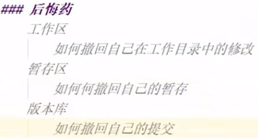

### ```git restore```

#### ```git restore [文件名]```，撤回工作区中的修改

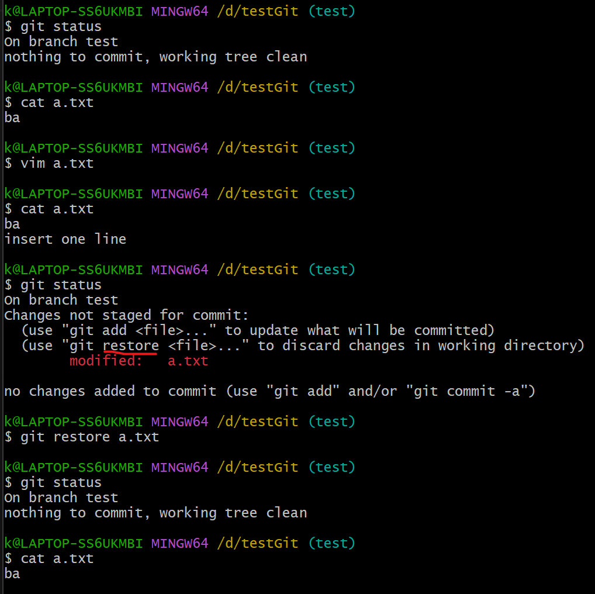

#### ```git restore --staged [文件名]```，撤回暂存区中的修改

对文件```a.txt```的修改已经放入**暂存区**
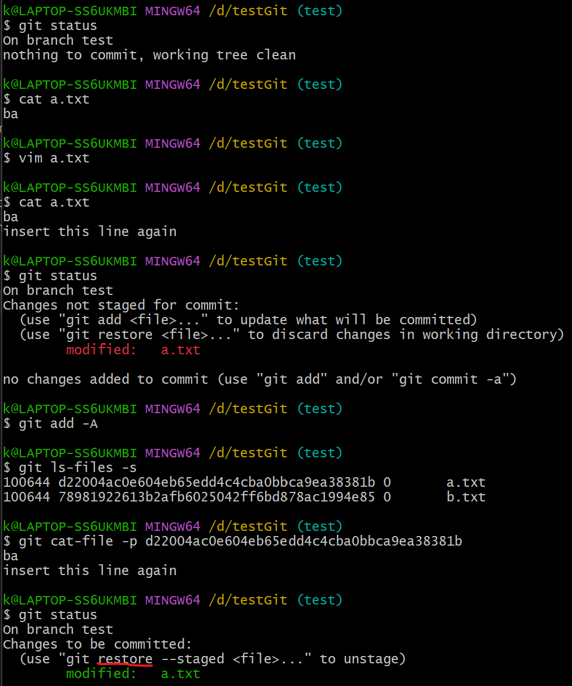

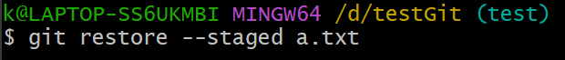

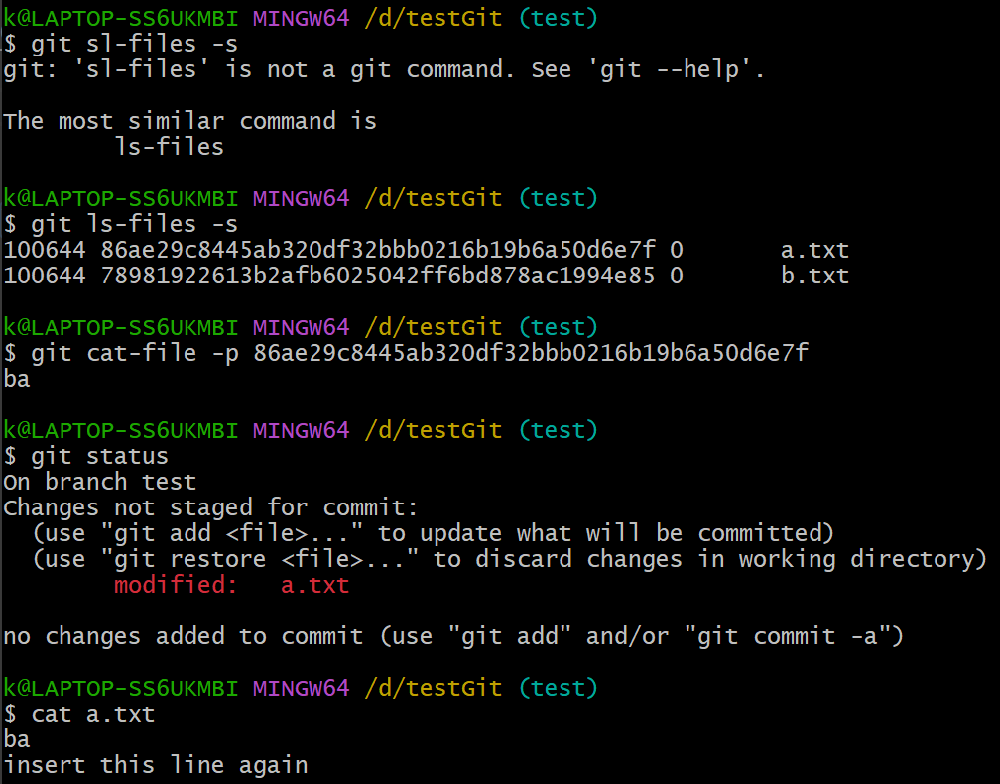

此时，**暂存区**的修改已经撤回，如果要撤回**工作区**的修改，再依次操作

#### ```git commit --amend```，撤回版本库中的修改

情况零：
提交的文件内容有误
那就修改完成后重新提交

情况一：
提交日志写错了，导致日志不干净
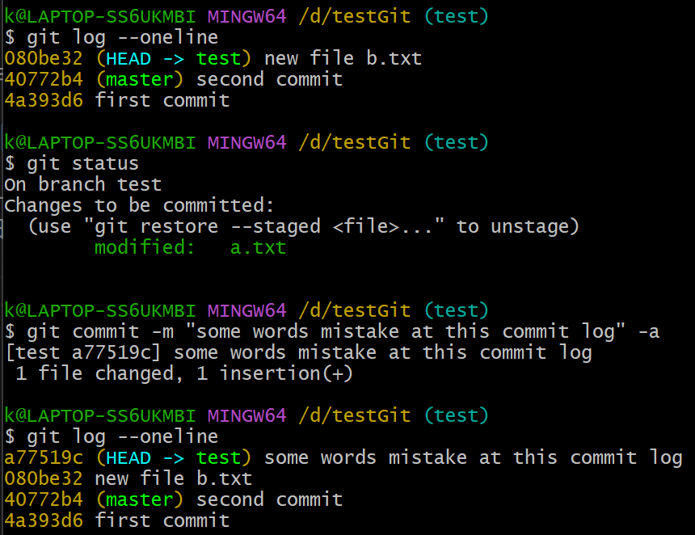

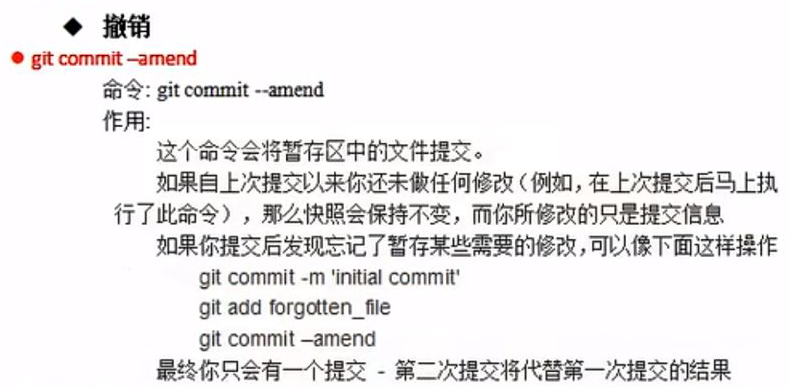

使用```git commit --amend```命令
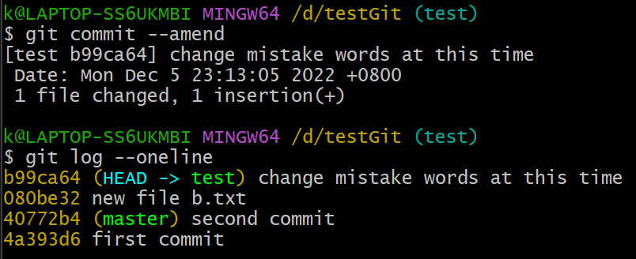

将写错的日志修改到正确
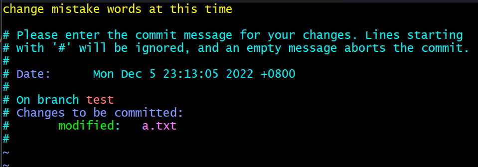


情况二：
文件被暂存后，又被修改了，但是忘了暂存，就提交了
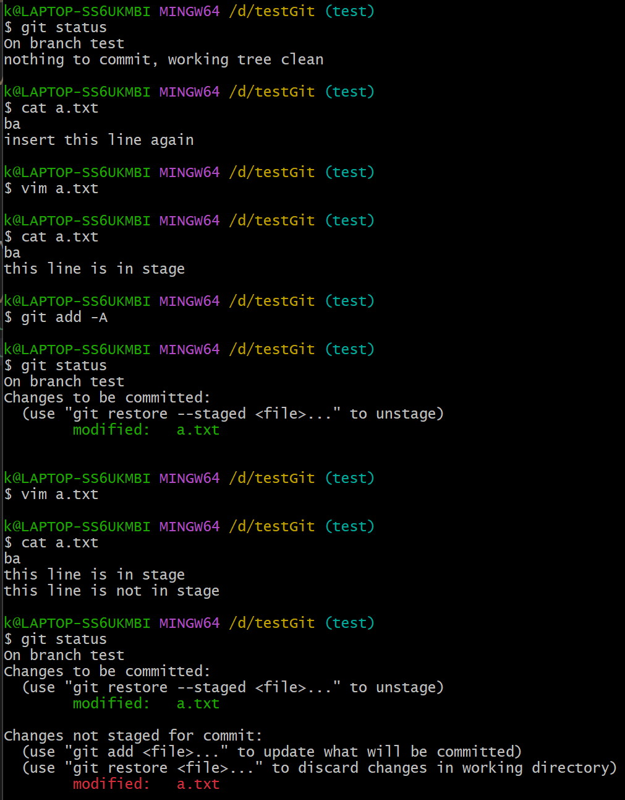

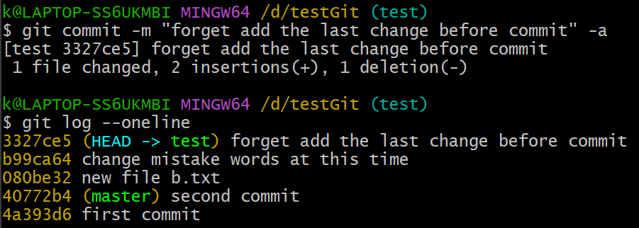

发现自动把**未暂存的修改**暂存了
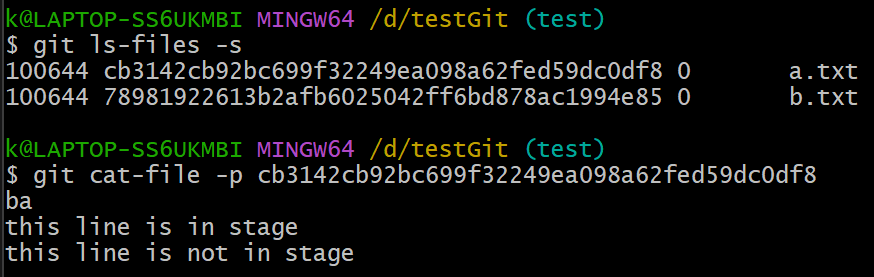

这里重新测试了一遍，发现确实是这样
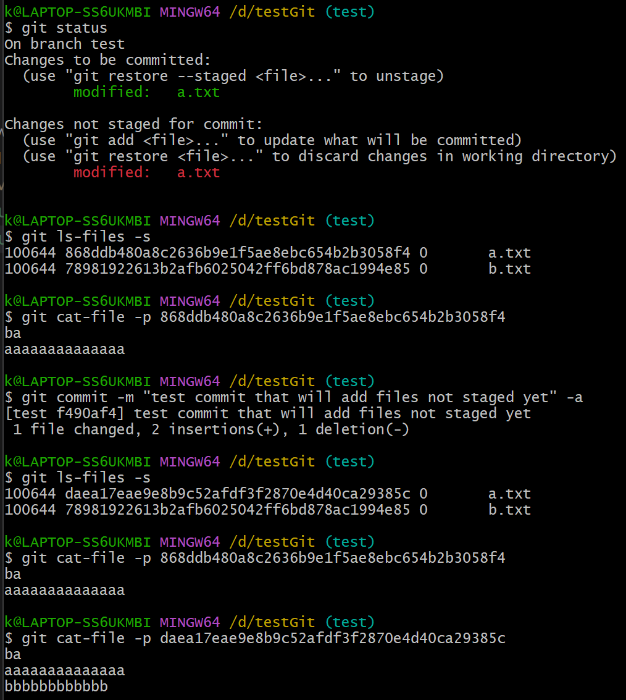

这里有些翻车 上网查查

到P17