# 数据恢复

### 硬重置

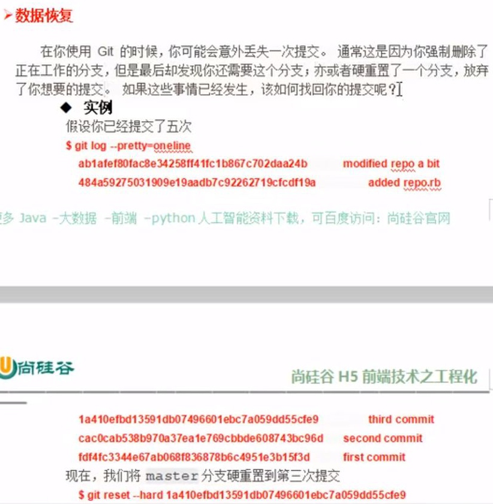

```git reflog```的用处：
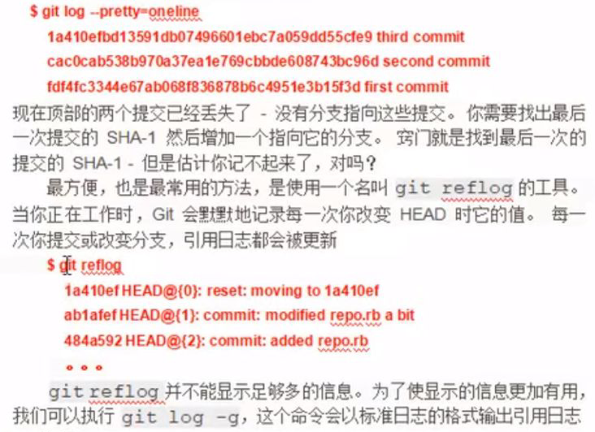

硬重置：
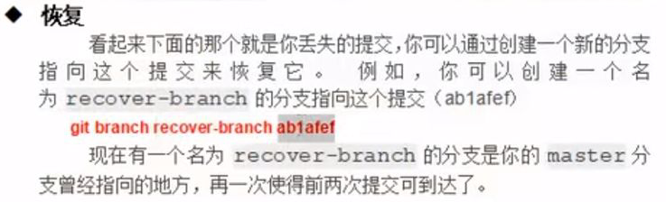

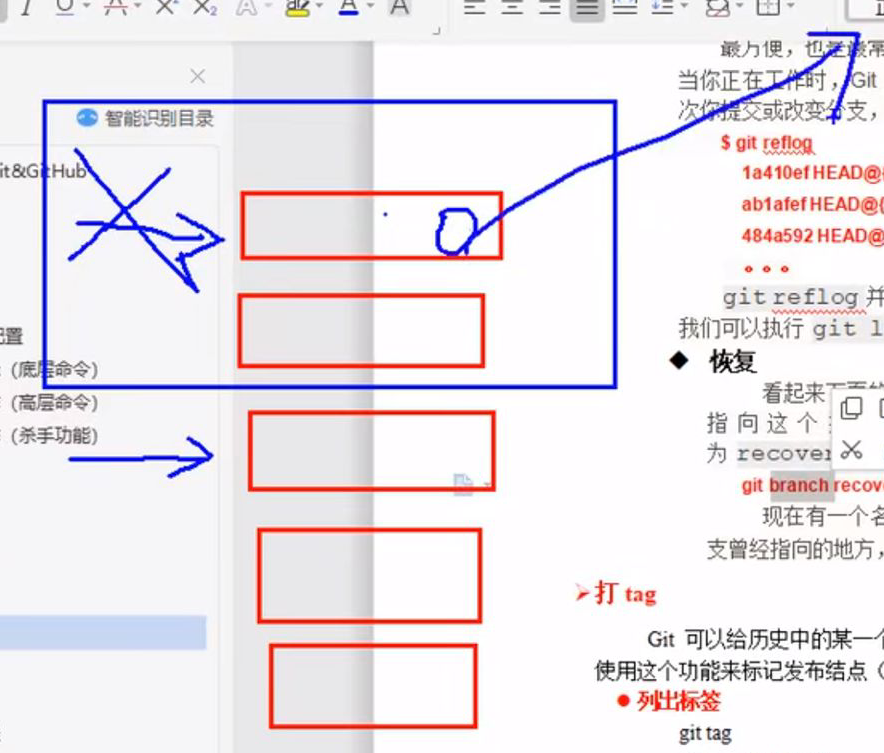

但是还是要**少用硬重置，多用分支**

### 打tag

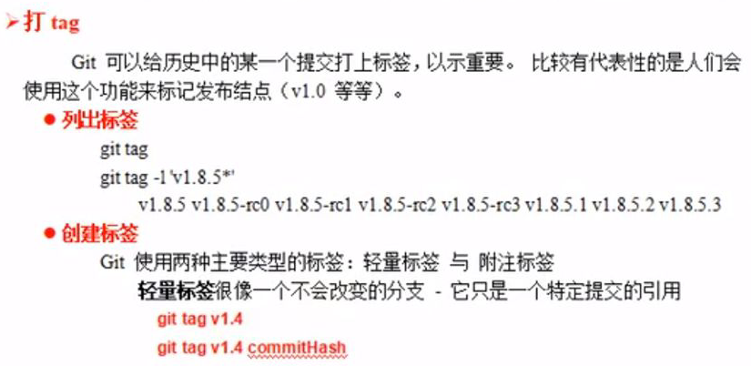

#### 轻量标签

标签像一个不会改变的分支

```git tag [标签名]```用来打标签
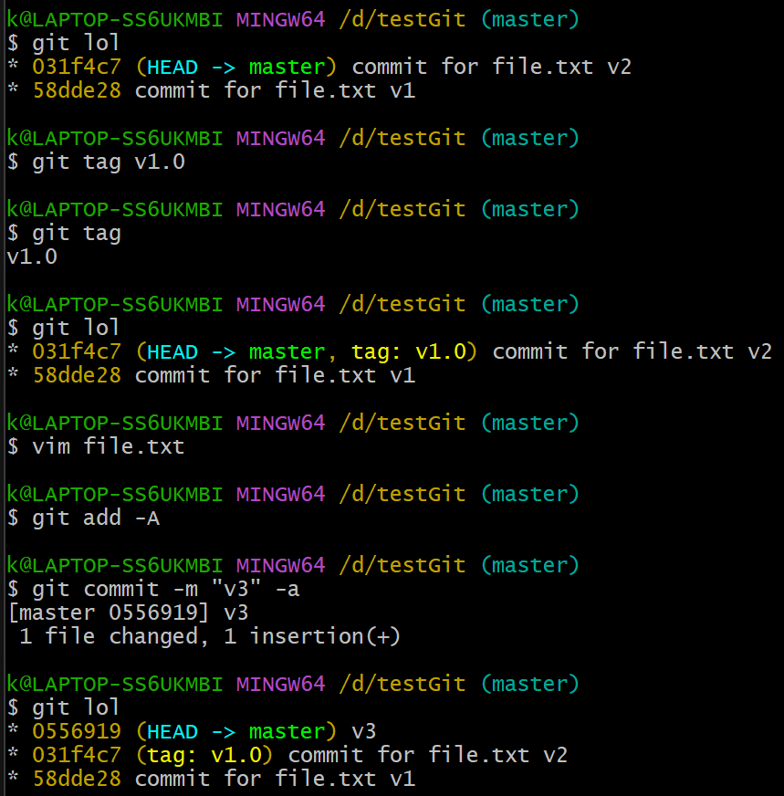

#### 附注标签

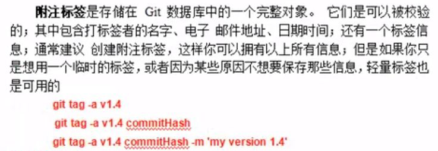

#### 查看特定标签


```git show [标签名]```用来查看某一标签
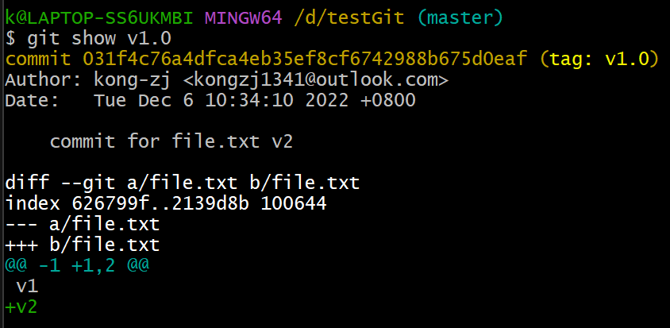

#### 远程标签

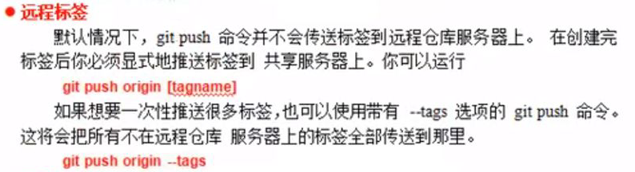

#### 删除标签

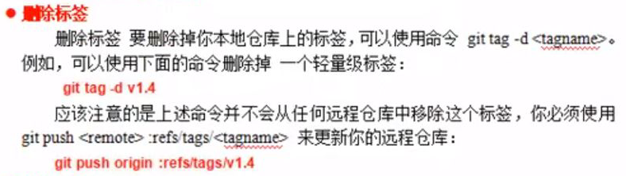

```git tag -d [标签名]```用来删除标签
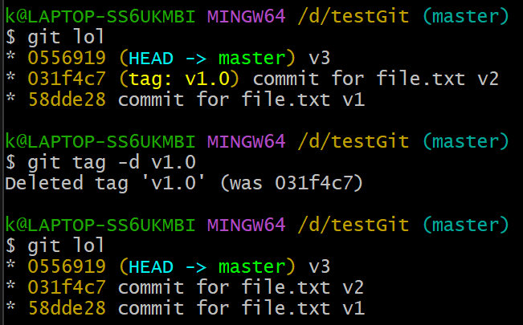

#### 检出标签

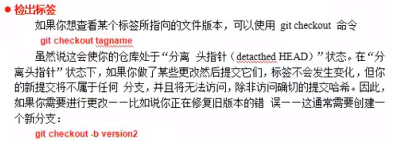
能用```git checkout```表示：标签像一个不会改变的分支（包含commit对象的Hash值）

##### ```git checkout [标签名]```用于让HEAD指向某一标签（可能HEAD分离）
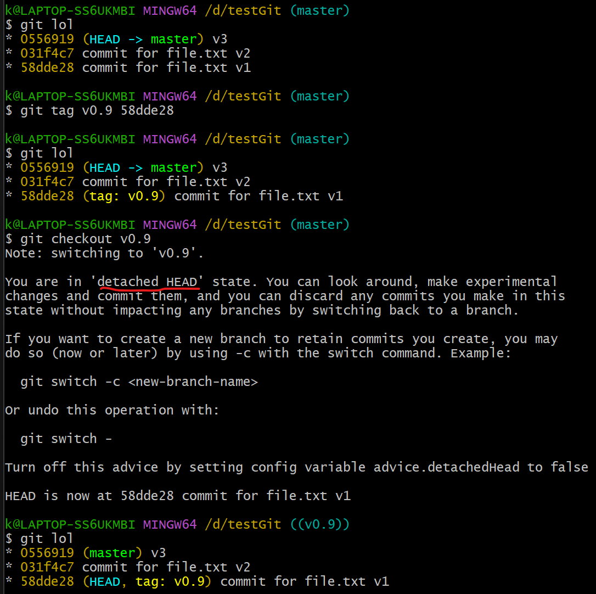
上图中的红线部分（detached HEAD）表示“HEAD分离模式”，因为HEAD没有指向任何分支

为了避免“HEAD分离”，要在HEAD指向某一标签的时候，在上面创建分支

##### ```git checkout -b [标签名]```用于让HEAD指向某一标签的同时创建分支（不会HEAD分离）
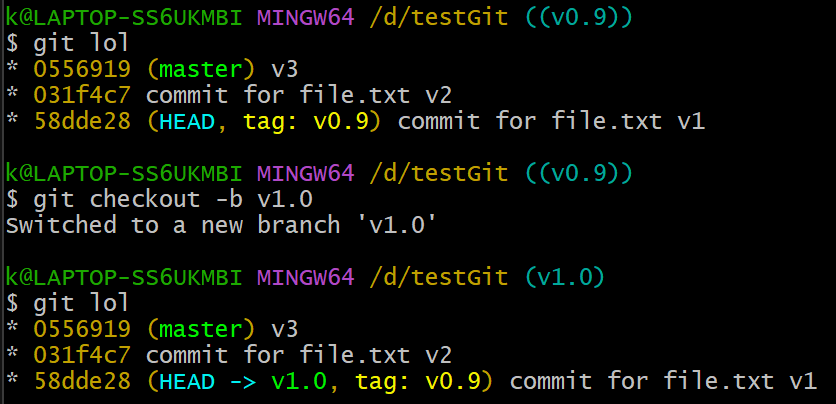

到P20
