# git

### 外部资源

[猴子都能懂的git入门](https://backlog.com/git-tutorial/cn/)
[GitHub漫游指南](https://github.phodal.com/#/chapter/Github%E6%BC%AB%E6%B8%B8%E6%8C%87%E5%8D%97)
[开源指北](https://oschina.gitee.io/opensource-guide/)
[Git官方文档](https://git-scm.com/book/zh/v2)
[GitHub官方文档](https://docs.github.com/cn)

---

## 开始使用
右键 Git Bash Here
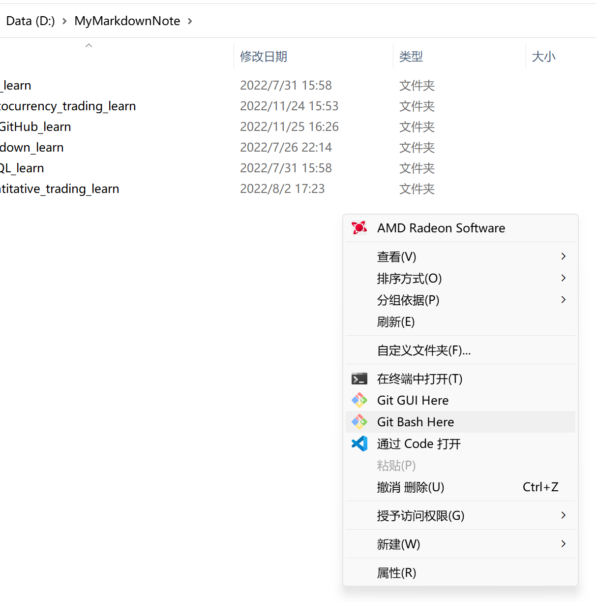
#### ```git init``` 命令，用来初始化
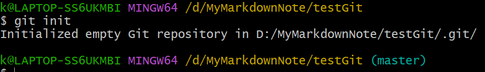
目录下的隐藏文件夹 .git
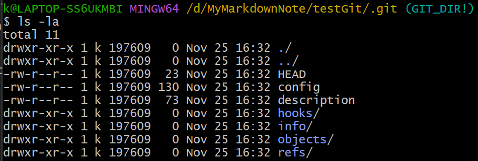

这里暂存区是空的，所以没有```index```文件


#### ```git config``` 命令，用来配置git签名
注意这里的签名和登录GitHub的账号、密码没有关系
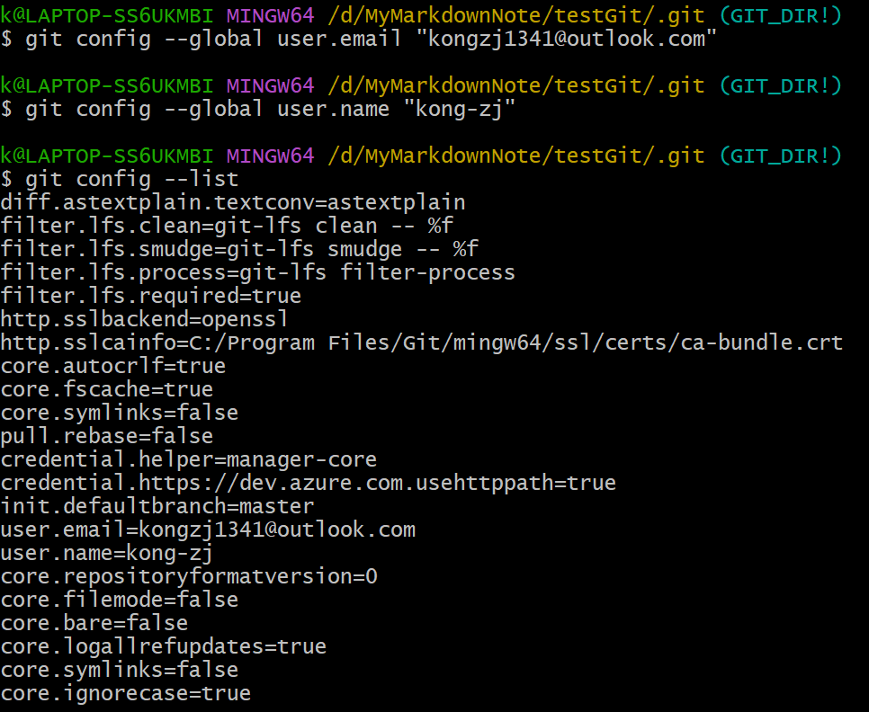
##### 不同层级

Git 自带一个 git config 的工具来帮助设置控制 Git 外观和行为的配置变量。 这些变量存储在三个不同的位置：

1. /etc/gitconfig 文件: 包含系统上每一个用户及他们仓库的通用配置。 如果在执行 git config 时带上 ```--system``` 选项，那么它就会读写该文件中的配置变量。 （由于它是系统配置文件，因此你需要管理员或超级用户权限来修改它。）

2. ~/.gitconfig 或 ~/.config/git/config 文件：只针对当前用户。 你可以传递 ```--global``` 选项让 Git 读写此文件，这会对你系统上 所有 的仓库生效。
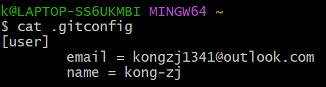

3. 当前使用仓库的 Git 目录中的 config 文件（即 .git/config）：针对该仓库。 你可以传递 ```--local``` 选项让 Git 强制读写此文件，虽然默认情况下用的就是它。 （当然，你需要进入某个 Git 仓库中才能让该选项生效。）
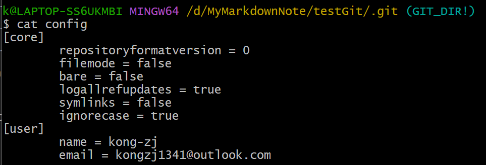

每一个级别会覆盖上一级别的配置（局部优先），所以 .git/config 的配置变量会覆盖 /etc/gitconfig 中的配置变量。

## Github被墙了（挂VPN）

### VPN打开网卡级别加速模式

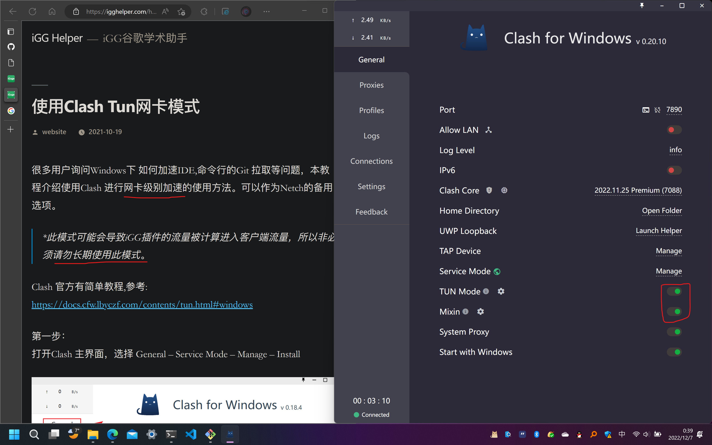
平常浏览网页时，不要开此模式，能省流量

ping谷歌测试一下
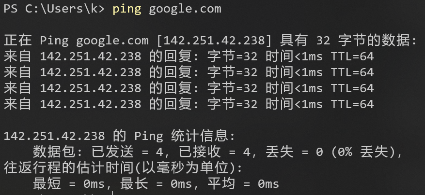

但是此时```git push```报错
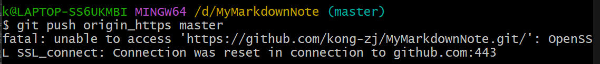

解决方案：
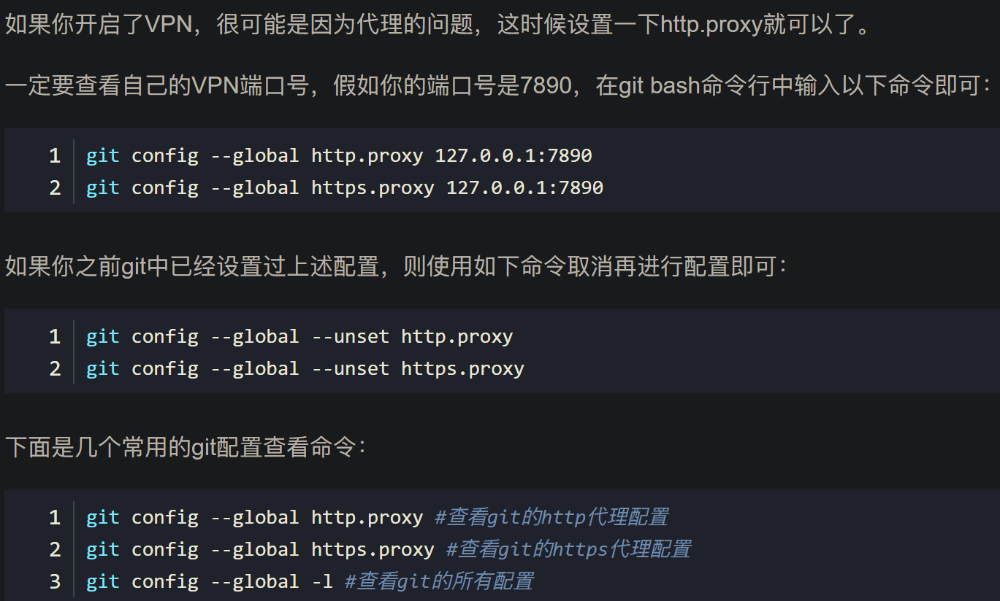

### 配置Git的代理

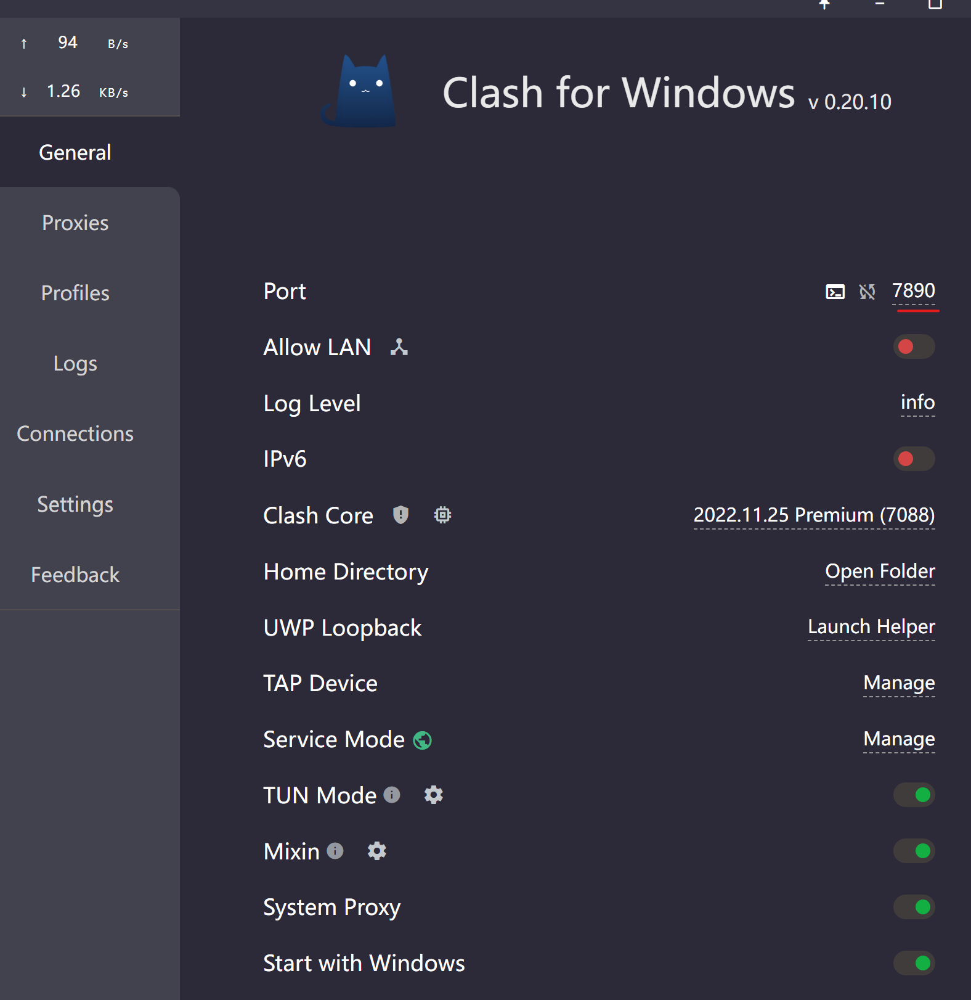

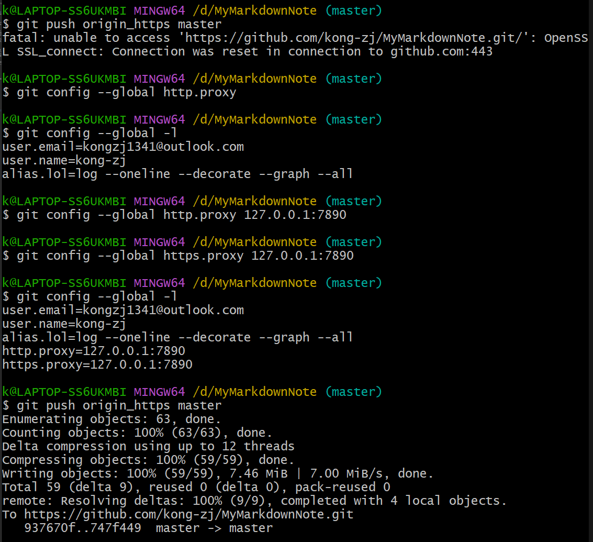
此时```git push```成功


