# 工作区、暂存区、本地库

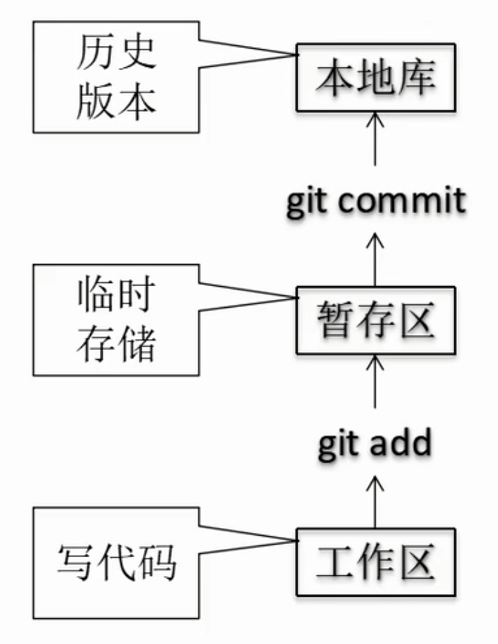

注意：
上图关于```git add```的数据流是“错误”的，见第10个md文档

# git 基础操作

## status 状态查看

### ```git status``` 命令，用来查看工作区和暂存区

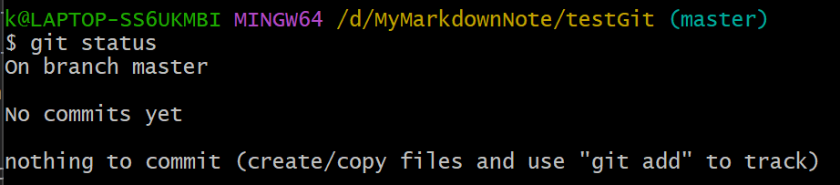
上图中的最后三行表示：
1. 在master分支
2. **本地库**里没有提交过的任何东西
3. 没有东西可提交（可提交的东西是放在**暂存区**的）

新建文件之后：
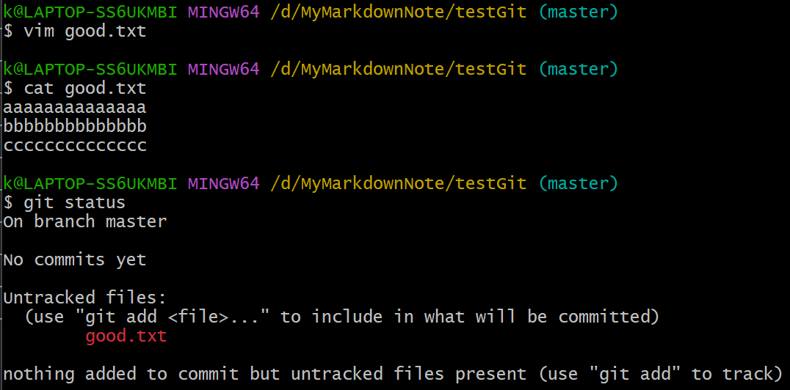
上图中的最后三行表示：
1. 在master分支（不变）
2. 本地库里没有提交过的任何东西（不变）
3. **发现未追踪的文件**（改变）

## add 添加

### ```git add``` 命令，用于将工作区的改动添加到暂存区

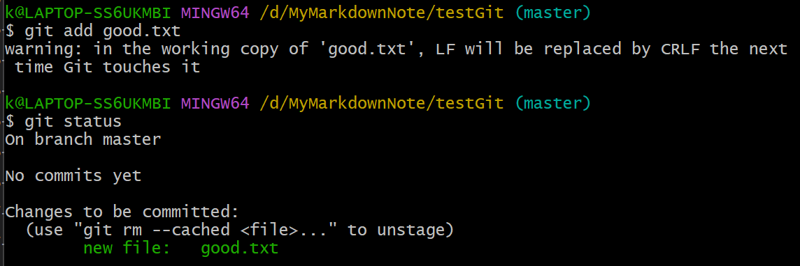
上图中的：
1. warning表示：行末的换行符被替换（为了兼容windows和linux）
2. 最后三行表示：文件已经放入暂存区

### ```git rm --cached``` 命令，用于撤销add命令
只是从**暂存区**删除

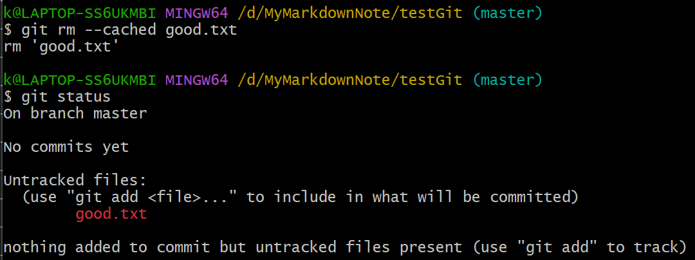

## commit 提交

### ```git commit``` 命令，用于将暂存区的内容提交到本地库

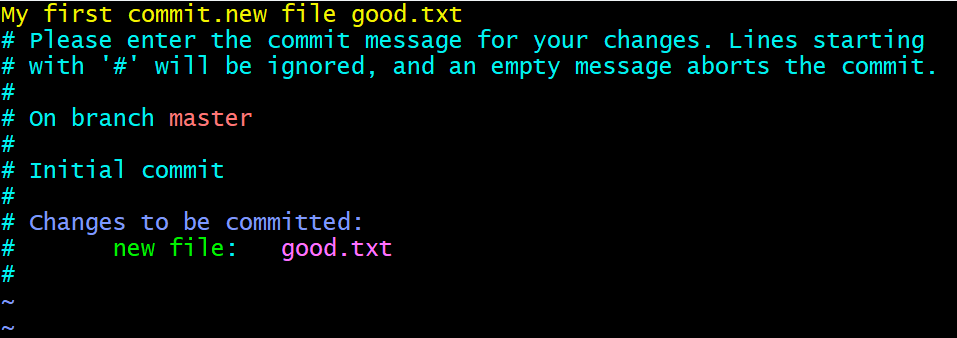
可在弹出的vim编辑器中输入本次提交的注释信息
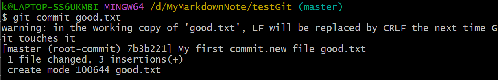
上图中的最后三行表示：
1. 本次提交的日志
2. 1个文件改变，添加3行
3. 创建了该文件

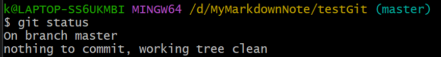

此时修改good.txt文件的内容
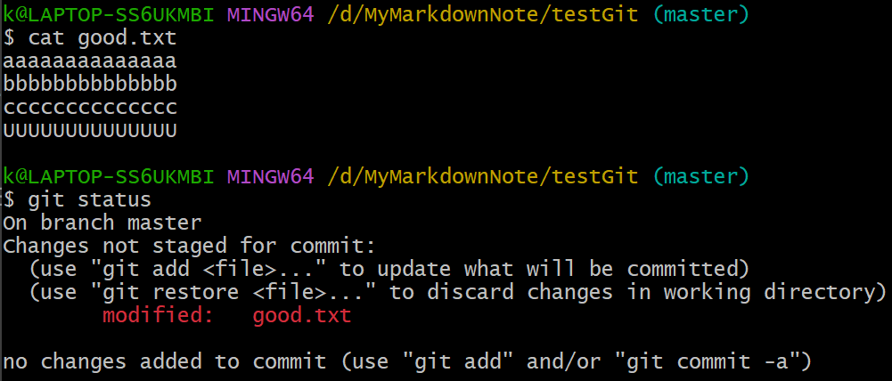
用```git add```命令可以把修改的文件update到**暂存区**
用```git restore```命令可以在**工作区**中取消修改
上图中的：
1. 最后一行表示：
   1. 可以先用```git add```把文件添加到**暂存区**，再用```git commit```将**暂存区**的内容提交到**本地库**（同将**新建**的文件同步到本地库的操作）
   2. 也可以直接用```git commit -a```命令，可以直接完成从**工作区**到**暂存区**到**本地库**的两部操作（只针对工作区中**修改**的文件，不能操作新建的文件）
   
下面使用方法2：

### ```git commit -a``` 命令，用于将工作区中修改的文件直接提交到本地库

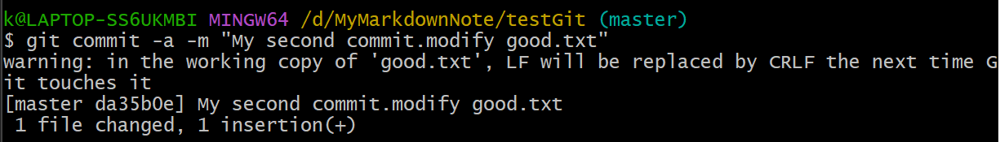

### ```git commit -m``` 命令，可以直接在命令中加入本次提交的注释信息
更方便，不用进入vim编辑器
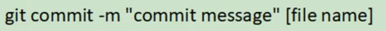
   


