# 版本控制

### log 查看日志

#### ```git log``` 命令，用来查看提交记录

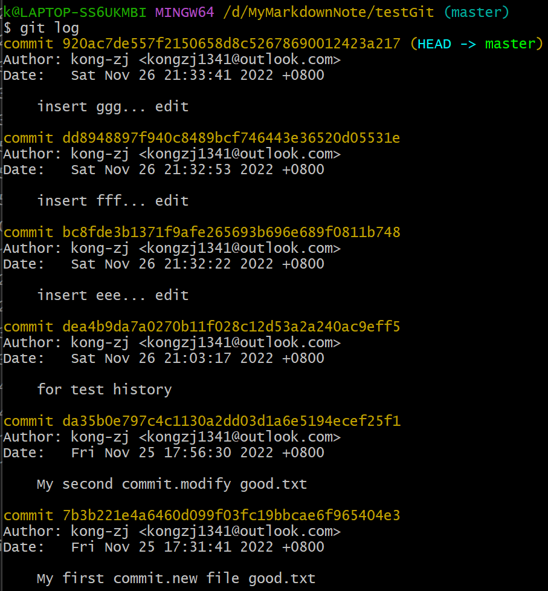

```git log --pretty=oneline```，以简洁的方式显示
等同于```git log --oneline```（漂亮操作）

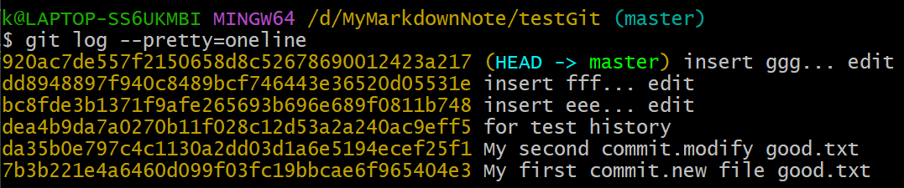

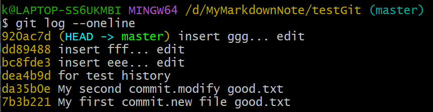

```git reflog```（完整操作），还显示到某个版本需要移动几步，方便前进和后退指针

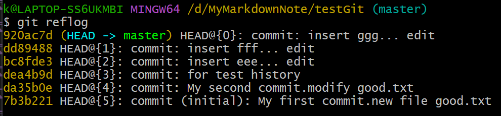

### reset 前进和后退版本

```HEAD```指针指向的是当前的版本

##### 1. ```git reset --hard```，基于索引值操作（推荐）

之上的三张图中，黄色的是索引值

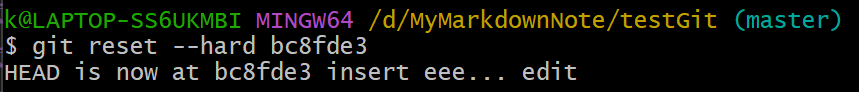

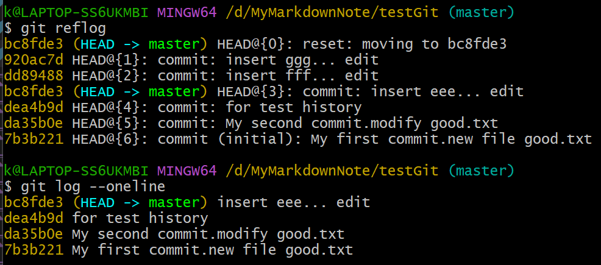

##### 2. ```git reset --hard HEAD^```，使用```^```符号，只能后退

```^```符号可以打多个（后退多步），比如```git reset --hard HEAD^^^```

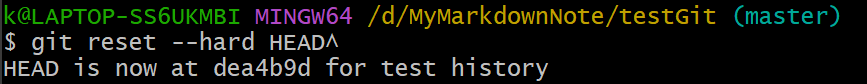


##### 3. ```git reset --hard HEAD~```，使用```~```符号，只能后退

与```^```同理

#### reset 命令的三个参数

```git help```，用来查看帮助文档

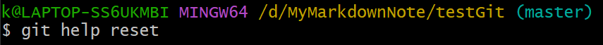

1. ```--soft```
2. ```--mixed```
3. ```--hard```（主要使用）
越“硬”，退回的区越多

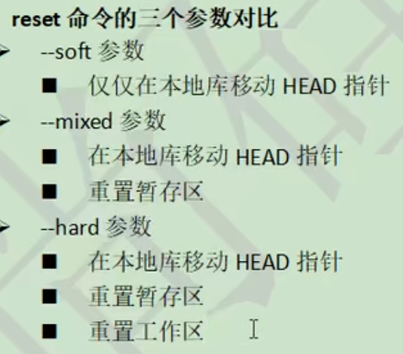

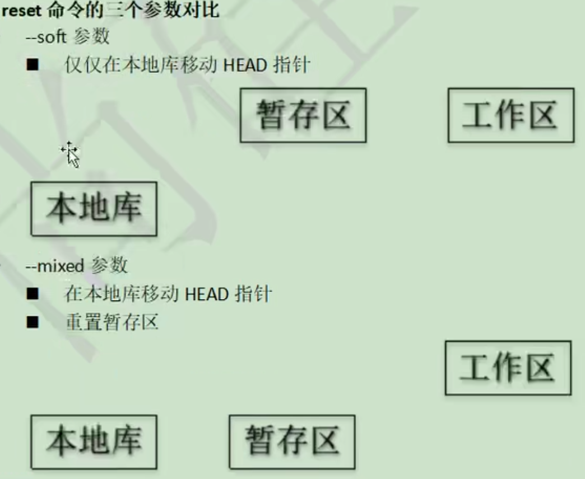

#### 从本地库恢复工作区中删除的文件

新建文件，保存到**本地库**后，在**工作区**删除该文件

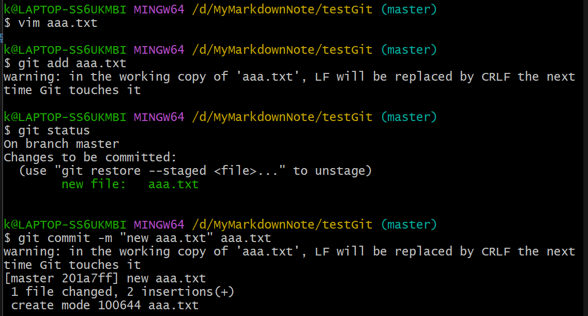

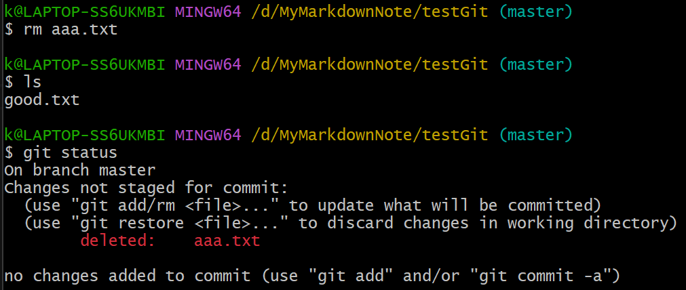

将删除操作同步到**暂存区**和**本地库**

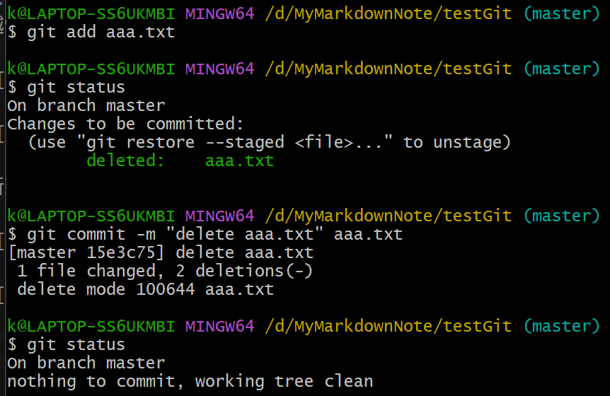

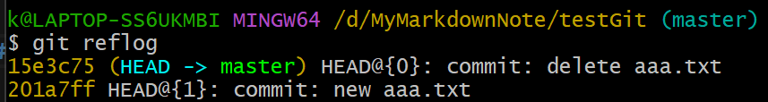

用```--hard```参数回到之前的版本

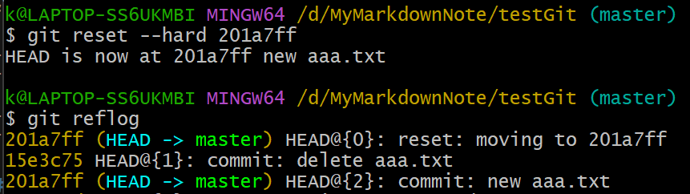

删除的文件被找回

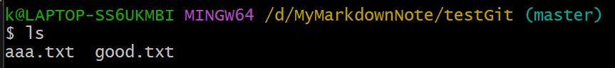

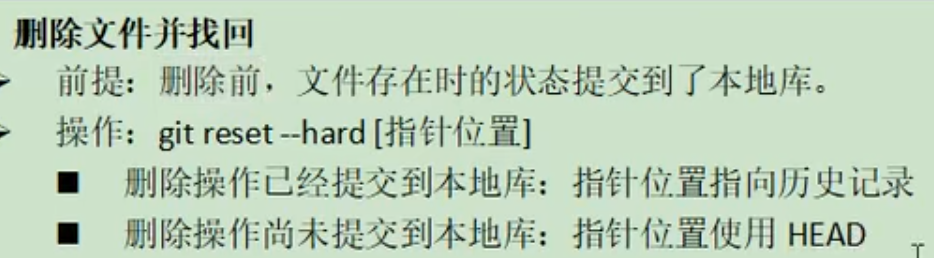

### diff 比较文件

当前**工作区**没有修改，**暂存区**也没有提交的
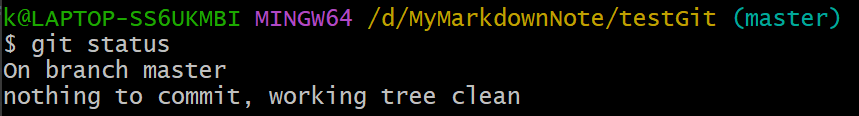

修改good.txt文件

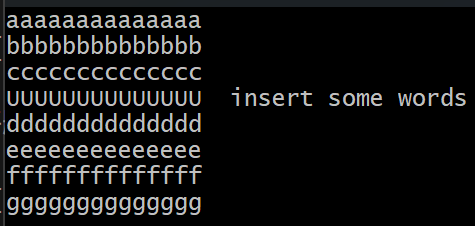

#### ```git diff```命令，比较文件修改前后的不同

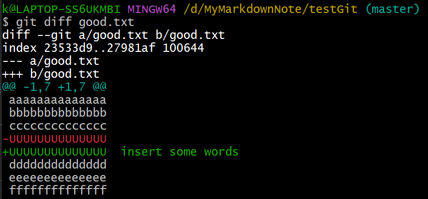

1. 如果该文件提交到**暂存区**，则没有区别，说明```git diff```是将**工作区**和**暂存区**进行比较

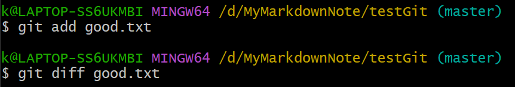

2. 这时使用命令```git diff HEAD```，把**工作区**和**本地库**中的文件比较，又能看到差异了

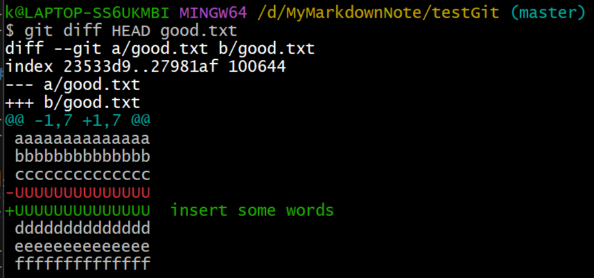

3. 如果命令中不指明文件，会比较所有文件

