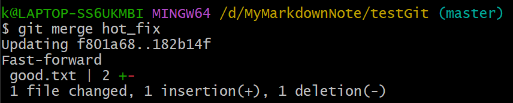
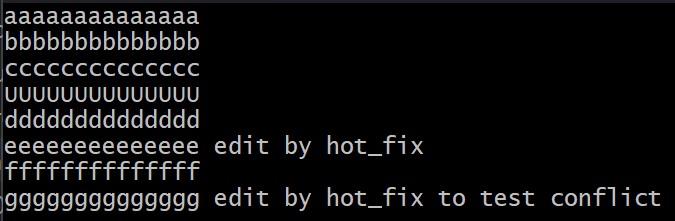

# 分支管理


git工作流


## branch 查看和创建分支

### ```git branch -v```命令，用于查看当前所有分支


### ```git branch```命令，用于创建新的分支


此时，两个分支提交的信息是一致的

### ```git branch -M [新的分支名]```，用于修改当前的分支名


为了和Github上的远程分支的名字对应，这里修改分支名

## checkout 切换分支

### ```git checkout```命令，用于切换分支


在```hot_fix```分支下修改good.txt文件


同步到**本地库**


此时，```hot_fix```的版本往前推进一步，两个分支提交的信息不一致

## merge 合并分支

1. 先切换到接收修改的分支（被合并，增加新内容）

### ```git checkout```命令，用于切换分支


2. 执行合并命令

### ```git merge```命令，表示把哪一个分支的修改，合并到当前的分支




## 在合并中产生冲突

在**不同分支**中修改**同一个文件的同一位置（以“行”为单位）**

在```master```分支中修改good.txt如下，并同步到**本地库**


在```hot_fix```分支中修改good.txt如下，并同步到**本地库**



将```master```合并到```hot_fix```


自动合并失败，转为手动合并

```(hot_fix|MERGING)```表示处于正在合并的状态

### 冲突的表现

good.txt的内容如下图所示


1. 8~9行是当前分支的内容
2. 11~12行是另一分支的内容

在vim中用```:set nu```显示行号

### 冲突的解决

删去第8、10、12行，并把冲突的内容编辑到满意为止


使用```git add```来标记冲突已解决


使用```git commit```来结束合并


注意这里```git commit```不能带文件名，不然会报错


