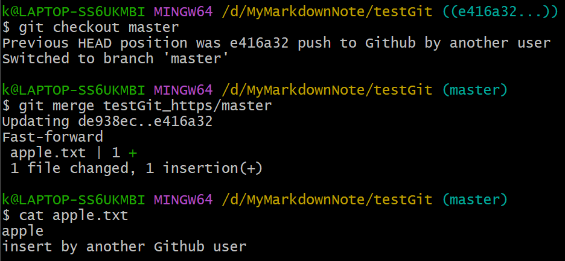

# 本地库和远程库的交互（团队内合作）


### 在Github创建远程库


上图中，远程库的地址为```https://github.com/kong-zj/testGit.git```
远程库的地址很长，这里可以在本地创建远程库地址的别名

### remote 给远程库起别名

#### ```git remote -v```命令，用于查看保存的地址的别名


#### ```git remote add```命令，用于给地址起别名


### push 推送操作

#### ```git push [远程库的别名] [要推送的分支名]```命令，用于将某一分支推送到远程库


跳出弹框如下图


授权之后，推送操作成功，如下图


Github上显示如下图


### clone 克隆操作

进入另一个目录


在Github中复制远程库的地址，这里为```git@github.com:kong-zj/testGit.git```


#### ```git clone```命令，用于从远程库克隆到本地

这里使用```ssh```协议提示被拒绝，因为没有在GitHub中授权，所以先用```https```协议


#### 克隆的三个效果

1. 完整地把远程库下载到本地
2. 初始化本地库
3. 创建```origin```远程地址别名


### 邀请团队成员加入

如果用另一个没有授权的GitHub账号做push操作，会提示没有权限而失败


要把这个账号授权，邀请他加入团队


变成团队成员后，就可以push操作了

### pull=fetch+merge 拉取操作

##### ```fetch```和```merge```操作分开来做，可以暂时不对本地的文件做合并，浏览从远程库下载下来的东西后再合并，也可以用```pull```操作来一步完成拉取和合并

经过他人的push，**Github**中文件```apple.txt```的内容如下


当前**工作区**中文件```apple.txt```的内容如下


#### 第一步：```git fetch [远程库的别名] [要抓取的分支名]```命令，用于从远程库拉取修改到本地


此时，**工作区**中文件```apple.txt```并没有改变，内容如下


#### ```git checkout```命令，切换到```testGit_https/master```，可以看到```fetch```下来的新的内容


再```git checkout```切换回去

#### 第二步：```git merge```命令，用于把远程库的master合并到本地库的master




#### 两步可以合为一步：```git pull [远程库的别名] [要抓取的分支名]```命令，用于将远程库拉取到本地并合并到本地库

经过他人的push，Github中文件apple.txt的内容如下


### 团队合作，push到远程库的冲突

1. 两个人修改同一文件的同一位置（行），先push的人可以成功，第二个push的人不是在远程库的最新版的基础上修改的，是在旧版本上所做的修改，Github不接受第二个人的push
2. 第二个人只能先pull最新版的代码，进入冲突状态，按照“在合并中产生冲突”来解决

第一个push的人，将apple.txt修改为如下图，并成功push到Github


第二个想要push的人，将apple.txt修改为如下图


第二个人不能成功push到Github，因为push的内容不是根据GitHub远程库的最新版修改的


第二个人要先pull下最新版


按照“在合并中产生冲突”来解决

修改冲突的文件内容


使用```git add```（要带文件名）标记冲突已解决
使用```git commit```（不能带文件名）来结束合并


这时，第二个人的本地库是按照Github远程库的最新版修改的，所以可以成功push


模型：[乐观锁，悲观锁](https://zhuanlan.zhihu.com/p/82745364)


总结：


如果没有跟踪，可以使用```git push [别名] [分支名]```来推送，就可以不用上图那么麻烦

跟踪的方法：


