# 本地库和远程库的交互（跨团队合作）

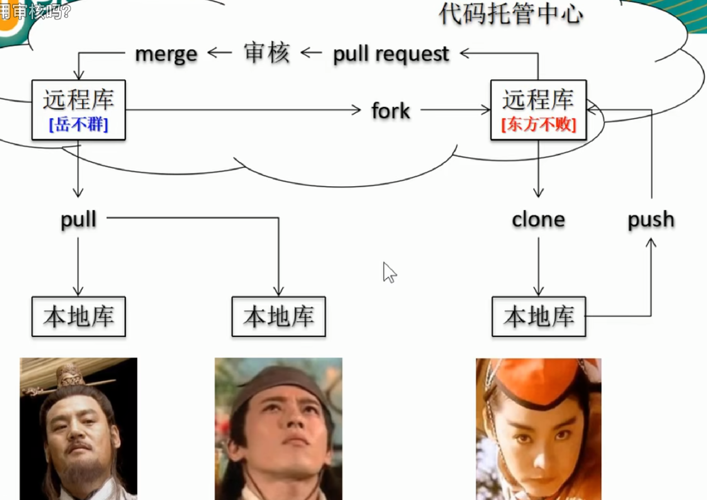

## fork 在服务器端克隆远程库


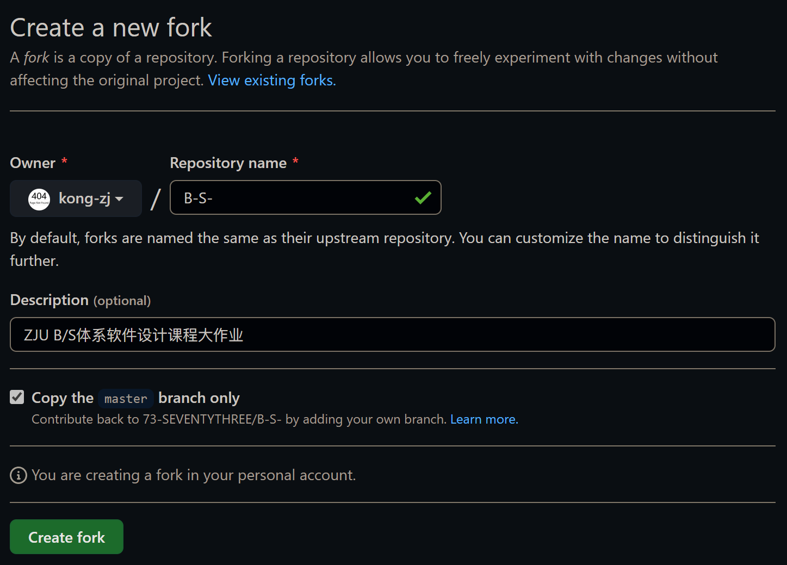

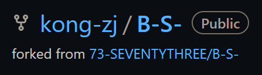

上图中：
1. 第一行表示仓库的所有人
2. 第二行表示fork的来源

这时可以```clone```到自己本地

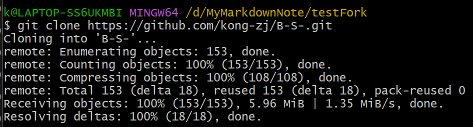

修改文件，增加第四点

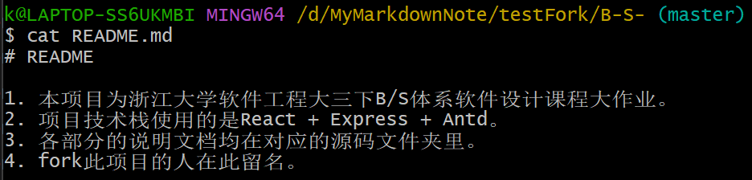

```commit```提交到本地库

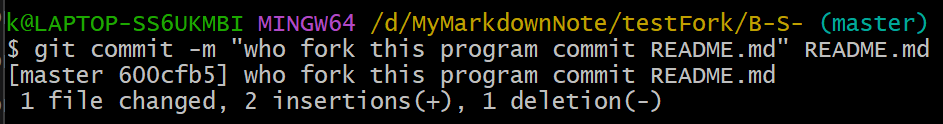

```push```推送到远程库

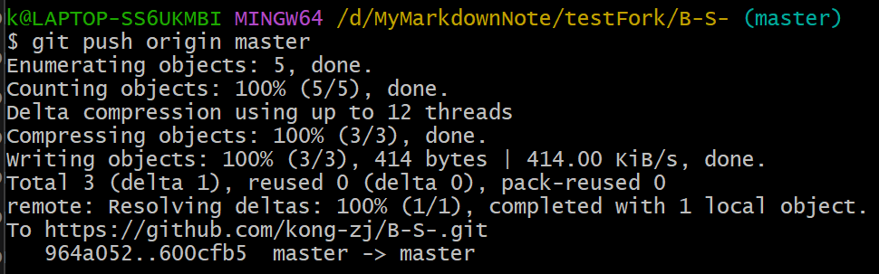

## pull request 在服务器端推送更改给原远程库

### fork者推送修改请求

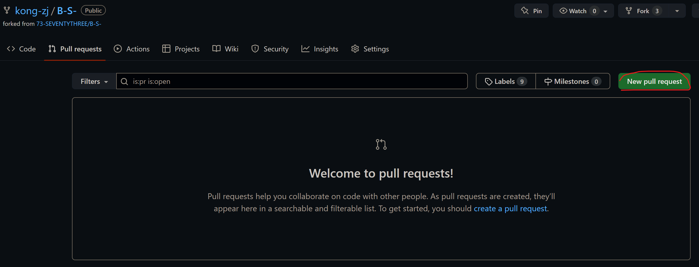

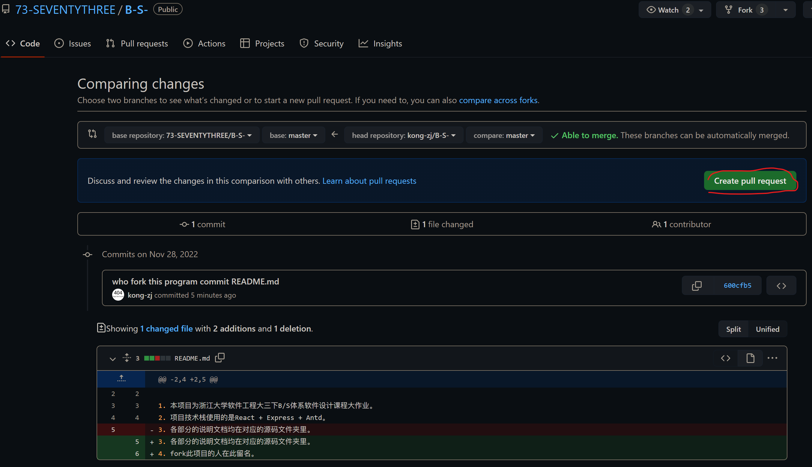

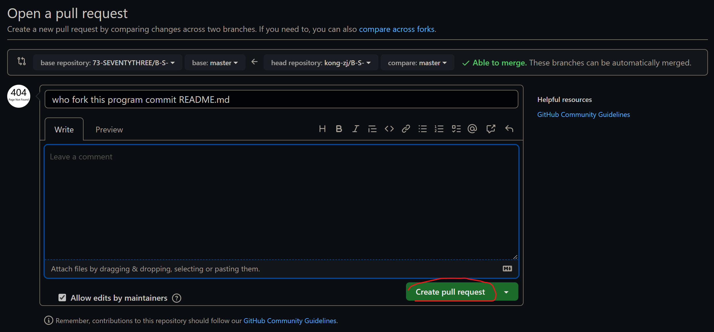

### 被fork者选择是否接受修改请求

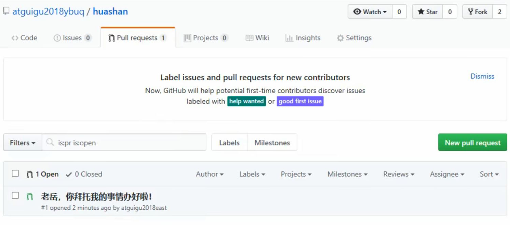

可以审核代码

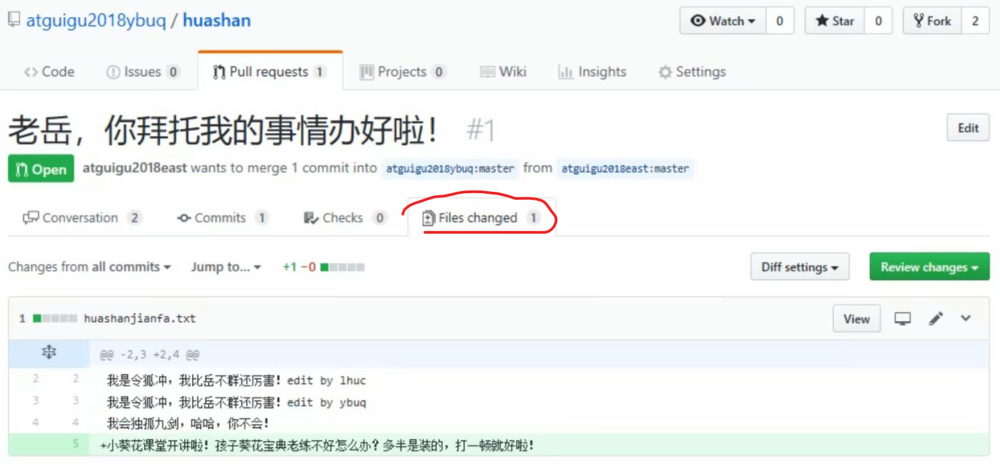

可以点击```Merge pull request```来合并代码

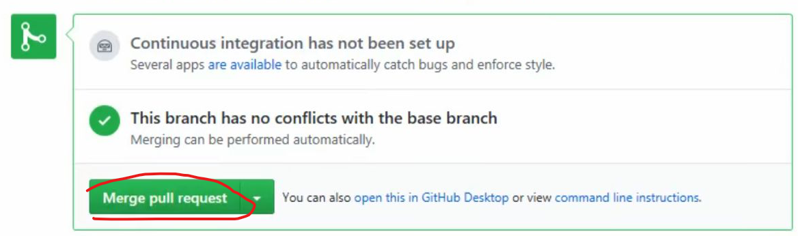

merge时需要写本次操作的日志信息

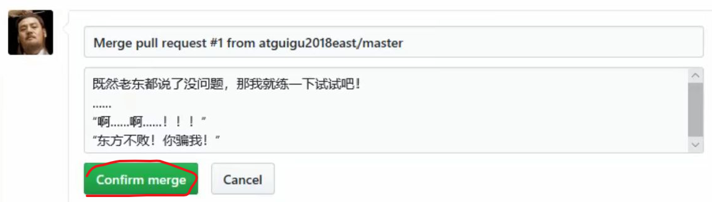

最后再把远程库的修改```pull```到本地，即可看到修改