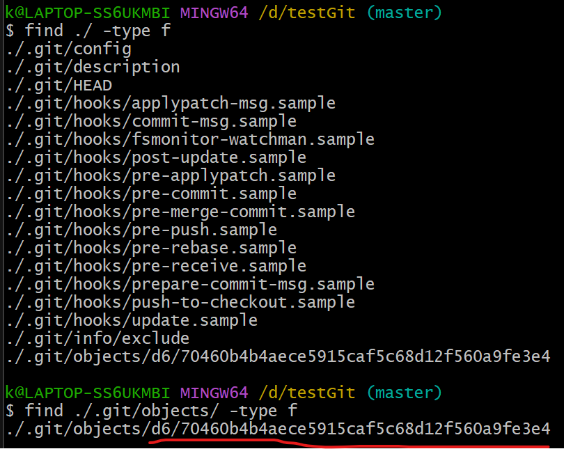
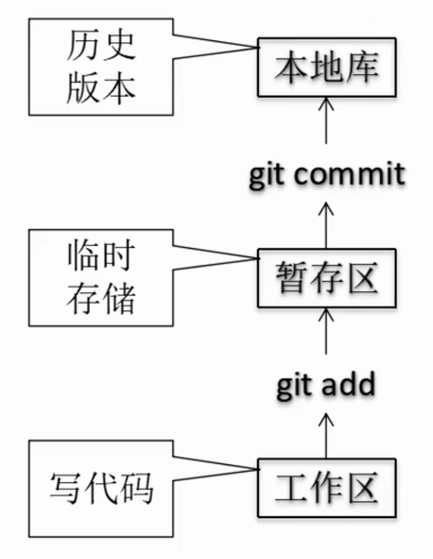
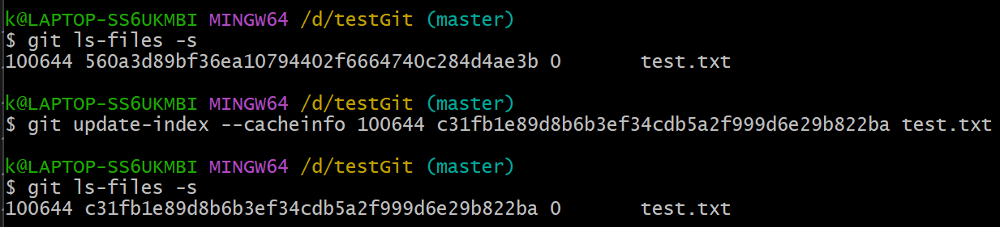
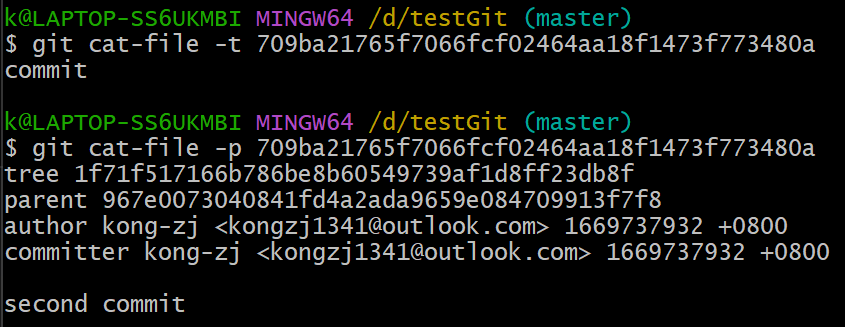

# git底层原理

## ```.git```隐藏文件夹


## blob对象、tree对象、commit对象

### blob对象（文件快照）

**key:val**组成的键值对：
1. **val**是**文件的内容**（不包括文件名）
2. **key**是val对应的**Hash值**

#### ```git hash-object -w```，保存blob对象


从窗口读入内容，并返回其Hash值
如果命令不加```-w```，不会往Git的本地数据库中保存


加上```-w```之后，会往Git的本地数据库中保存


Git的本地数据库中有了新东西


用```find [指定目录] [指定条件] [指定动作]```命令可以查询指定文件夹下的所有文件



发现新文件的命名来自前面的Hash值：
1. Hash值的前2位作为**目录名**
2. Hash值的其他位作为**文件名**

使用cat命令，看到的是压缩过的内容


想要看原内容

#### ```git cat-file -p```，读取blob对象


如果把```-p```换成```-t```，显示该Hash值对应一个blob对象


#### 对单一文件的版本控制


**创建**一个文件**test.txt**并用Git版本控制


**修改**上面的那个文件**test.txt**并用Git版本控制


再**创建**一个文件**new.txt**并用Git版本控制


问题：
1. 每个blob对象只能存储一个**文件快照**，不能代表**项目快照**
2. 只能由Hash值读取文件数据，**人为记住文件每个版本对应的Hash值很难**
3. blob对象只保存该文件的内容，而**没有保存文件名**

解决方法：
tree对象

注意：
当前操作都是对**本地数据库**进行操作（**工作区**和**本地库**的交互），不涉及**暂存区**



### tree对象（项目快照）

组成多叉树


前期准备工作：

清空文件目录，重新初始化Git

创建**文件**```test.txt```的第一个版本（blob对象）


#### ```git ls-files -s```，查看暂存区当前的样子


当前**暂存区**为空


#### ```git update-index --add --cacheinfo 100644 [文件内容对应的Hash值] [文件名]```，构建tree对象并加入暂存区


这时，**暂存区**生成了**文件内容对应的Hash值**和**对应文件名**的记录，但是tree对象还没有存入**本地库**


#### ```git write-tree```，给暂存区拍快照，生成一个tree对象并放入本地库


暂存区的内容写入本地库时，**不会清空暂存区**


注意：
1. **blob对象**代表**文件**的一次次版本
2. **tree对象**代表**项目**的一次次版本

上面的一个项目中只有一个文件，下面更复杂些，一个项目会有多个文件：


新增```new.txt```，修改```test.txt```，这里别忘了给```test.txt```重新生成blob对象


上图中倒数四行分别为：

1. ```.git/objects/06/e21bb0105e2de6c846725a9a7172f57dd1af96```
   项目的第一个版本（tree对象）
2. ```.git/objects/56/0a3d89bf36ea10794402f6664740c284d4ae3b```
   test.txt文件的第一个版本（blob对象）
3. ```.git/objects/b2/b44573b56f7ea44cbe6e34a69b4f1b19311c5c```
   new.txt文件的第一个版本（blob对象）
4. ```.git/objects/c3/1fb1e89d8b6b3ef34cdb5a2f999d6e29b822ba```
   test.txt文件的第二个版本（blob对象）

这里还要增加项目的第二个版本（tree对象）：



由上图可以看到，之前在**暂存区**生成的文件内容对应的Hash值和对应文件名的记录被**替换成了新的**（旧文件**更新**记录）


上图在**暂存区**生成了新文件的内容对应的Hash值和对应文件名的记录（新文件**添加**记录）

注意```git update-index```命令修改**暂存区**的操作中：
1. 旧文件更新记录，不要加```--add```
2. 新文件添加记录，要加```--add```

现在，**本地库**里依然只有项目第一个版本的tree对象，因为**暂存区**里更新和添加的记录还没有保存到**本地库**

当前**暂存区**状态和**工作区**状态一样，可以代表项目的第二个版本，则现在可以生成tree对象


tree对象成功生成

1. ```.git/objects/06/e21bb0105e2de6c846725a9a7172f57dd1af96```
2. ```.git/objects/1f/71f517166b786be8b60549739af1d8ff23db8f```
   项目的第二个版本（tree对象）
3. ```.git/objects/56/0a3d89bf36ea10794402f6664740c284d4ae3b```
4. ```.git/objects/b2/b44573b56f7ea44cbe6e34a69b4f1b19311c5c```
5. ```.git/objects/c3/1fb1e89d8b6b3ef34cdb5a2f999d6e29b822ba```

现在本地库中的5个对象（2个tree对象，3个blob对象）代表项目的2个版本


问：最少几个对象能代表项目的2个版本？
答：4个

#### ```git update-index --add [文件名]```，相当于```git hash-object -w```和```git update-index --add --cacheinfo 100644 [文件内容对应的Hash值] [文件名]```的两步合成一步

#### ```git read-tree --prefix=bak [tree对象对应的Hash值]```，把tree对象读入暂存区


上图中可见，**暂存区**又新加入一条记录

这时，再生成一个tree对象（项目的第三个版本）


看该tree对象长什么样子


这时，结构如下图


上面的```--prefix=bak```操作，让指针```bak```指向第一个版本的tree对象，如上图所示


这个操作没有什么意义，但是用底层命令就是可以这么做

问题：


### commit对象（对tree对象的封装）

#### ```git commit-tree [tree对象对应的Hash值]```，创建第一个commit对象


这里为项目的**第一个**版本的tree对象，创建commit对象


这里是**第一个**commit对象，**没有父commit对象**，所以不要加```-p```

#### ```git commit-tree [tree对象对应的Hash值] -p [父commit对象对应的Hash值]```，创建第二个及之后的commit对象


这里为项目的**第二个**版本的tree对象，创建commit对象


这里是**第二个**commit对象，**有父commit对象**，所以要加```-p```



上图可见，这个commit对象的信息中，多了```parent```一项

同理，可为项目的**第三个**版本的tree对象，创建commit对象

最后结构如下图：


注意：
1. 一个commit对象不光包括一个tree对象，还包括当前的提交信息（commit对象是对tree对象的**封装**）
2. commit对象是**链式**的，之后的commit对象知道前一个commit对象是谁
3. Git的每次版本存储的**不是增量**，是**快照**
4. ```.git/object/```目录中存储了项目的所有历史记录，**回滚**很简单，找到commit对象的Hash，直接跳过去就好


总结：


