# git底层原理

## ```.git```隐藏文件夹


## blob对象、tree对象、commit对象

### blob对象

**key:val**组成的键值对，**key**是**val**对应的Hash

#### ```git hash-object -w```，保存blob对象

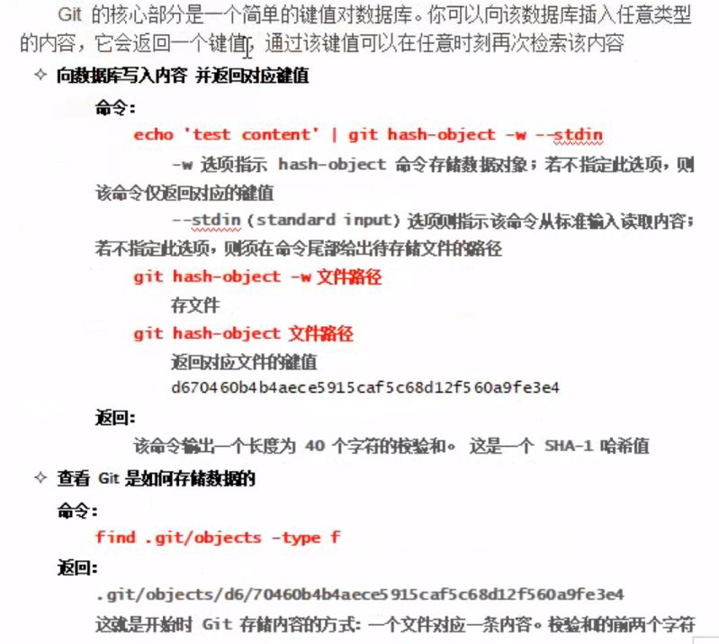

从窗口读入内容，并返回其Hash值
如果命令不加```-w```，不会往Git的数据库中保存

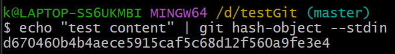

加上```-w```之后，会往Git的数据库中保存

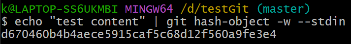

Git的数据库中有了新东西

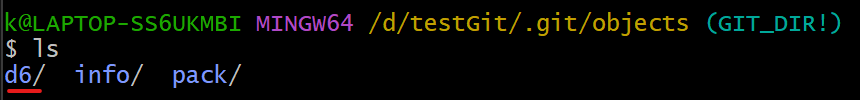

用下面命令可以查询指定文件夹下的所有文件

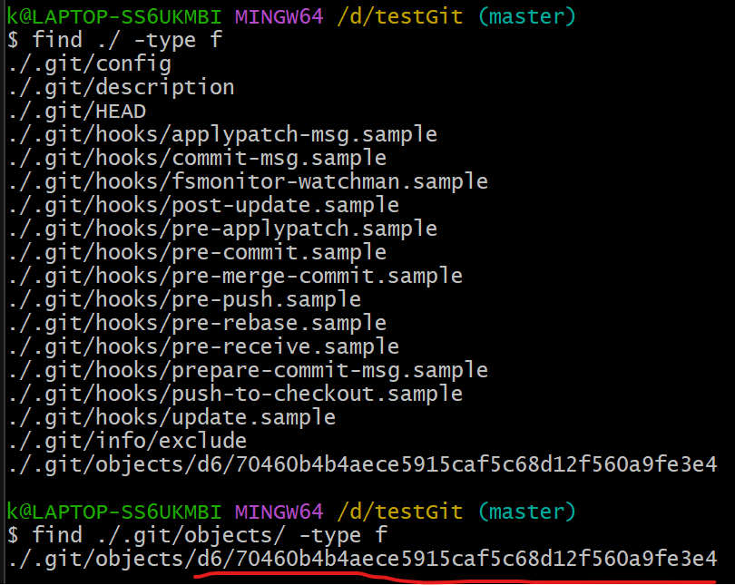

发现新文件的命名来自前面的Hash值：
1. Hash值的前2位作为**目录名**
2. Hash值的其他位作为**文件名**

使用cat命令，看到的是压缩过的内容

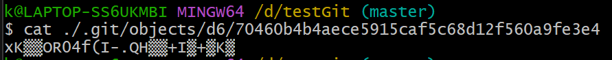

想要看原内容

#### ```git cat-file -p```，读取blob对象

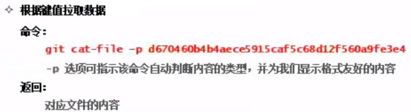

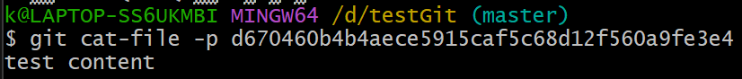

如果把```-p```换成```-t```，显示该Hash值对应一个blob对象

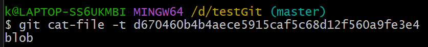

#### 对单一文件的版本控制

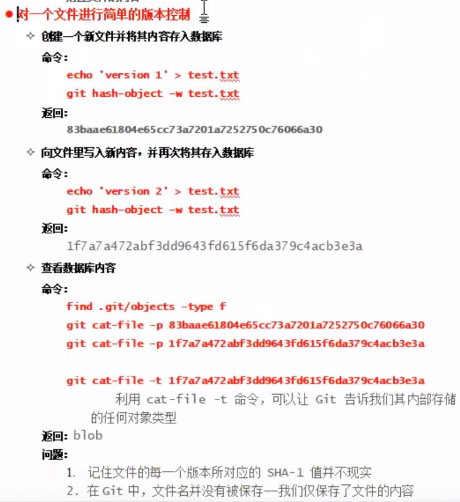

**创建**一个文件**test.txt**并用Git版本控制

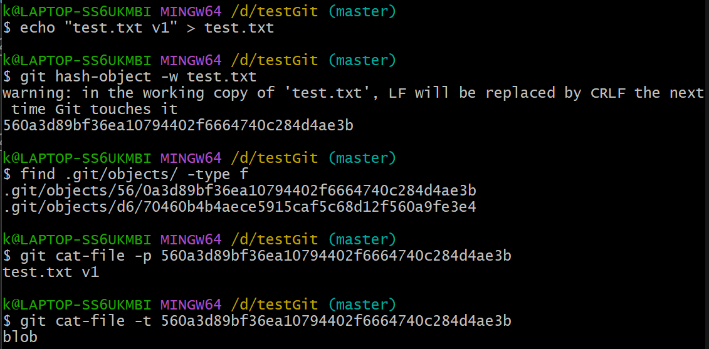

**修改**上面的那个文件**test.txt**并用Git版本控制

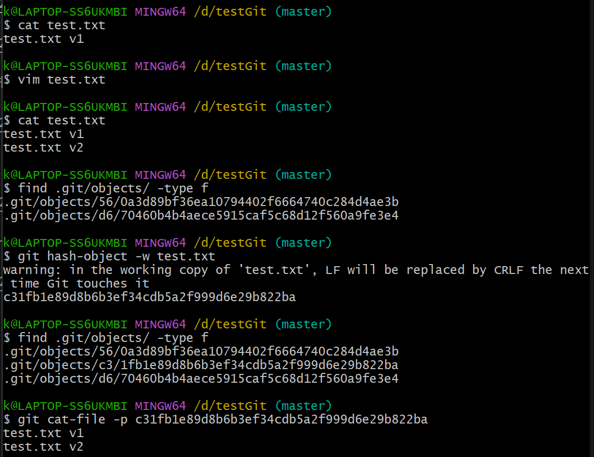

再**创建**一个文件**new.txt**并用Git版本控制

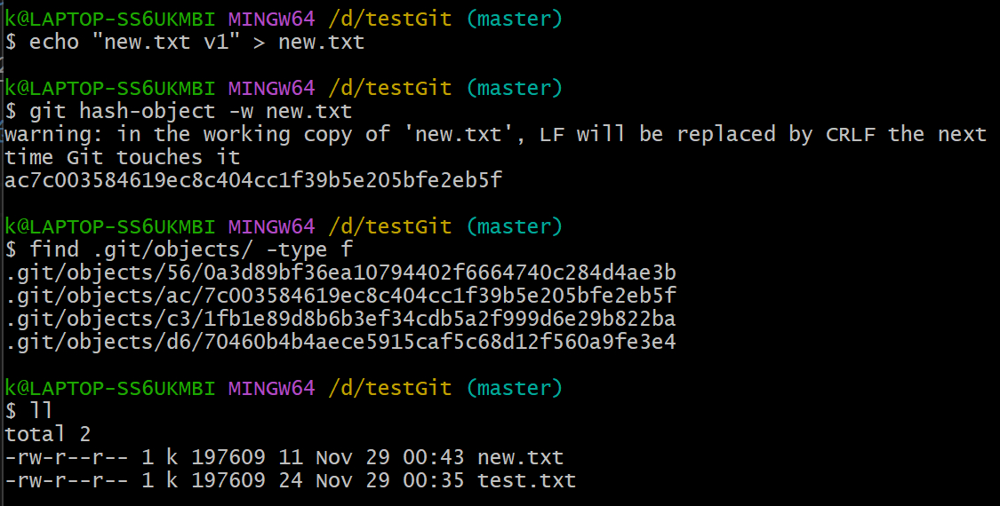

每个blob对象只能存储一个文件

p4
23min

