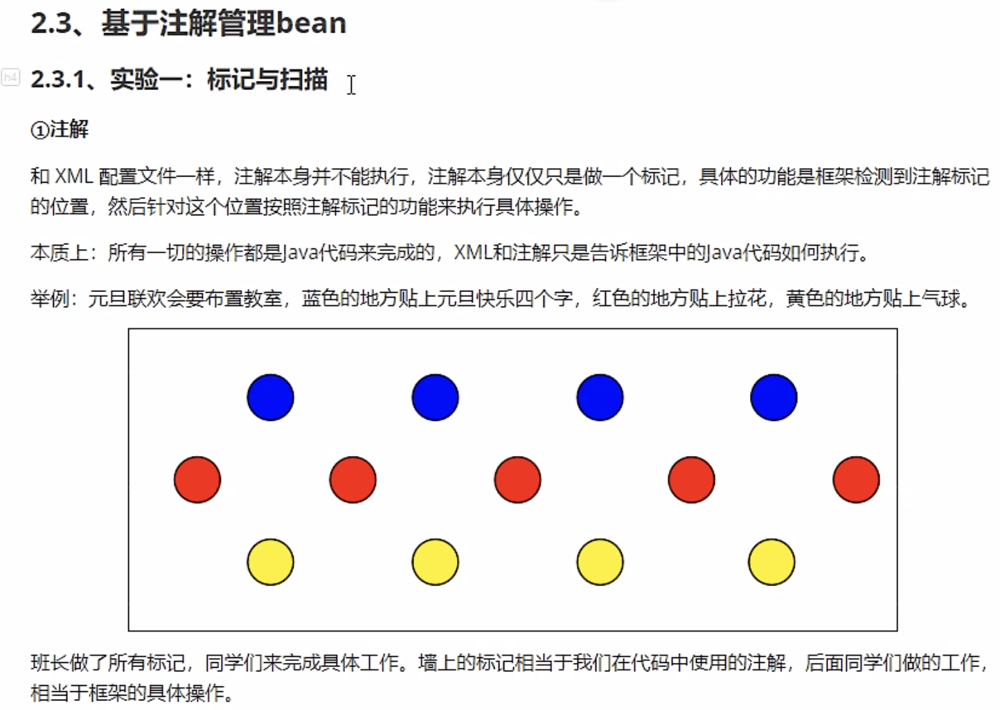
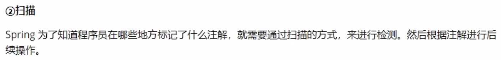
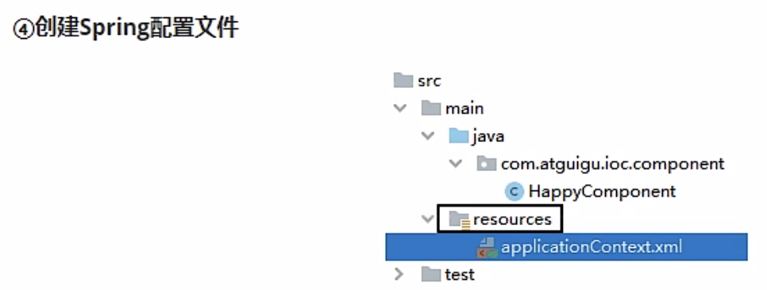
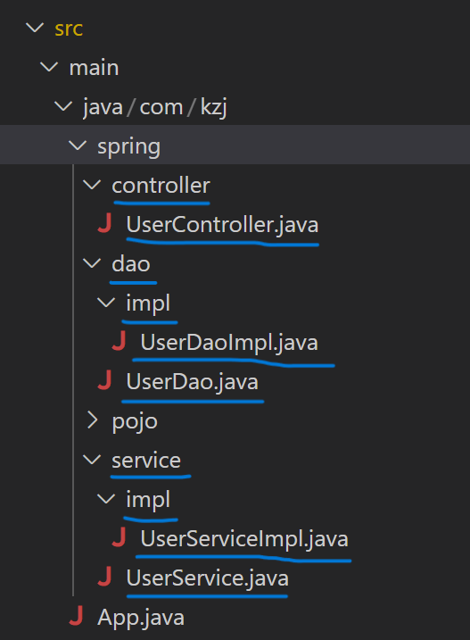
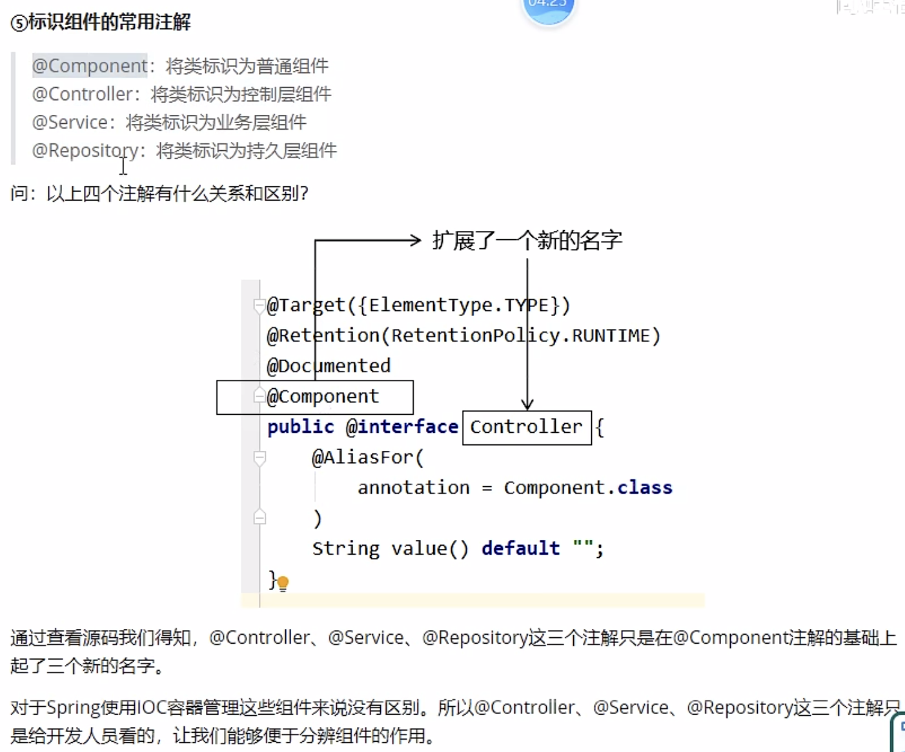
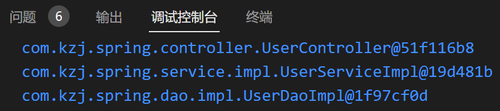
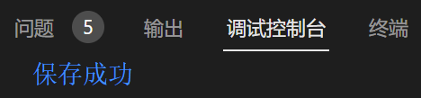

# Spring

## 基于注解管理bean

### 获取bean




用maven创建项目```spring_ioc_annotation```
和上一个项目引入一样的依赖到```pom.xml```文件中



和上个项目一样，先创建**三层架构**（**controller**调用**service**处理业务逻辑，service调用**dao**实现持久化操作）
- controller：接收并解析请求
- service：真正处理业务逻辑
- dao：操作数据库


#### 使用```@Component```，```@Controller```，```@Service```，```@Repository```注解注册bean组件

```@Component```：将类标识为普通组件

```@Controller```：将类标识为控制层组件

```@Service```：将类标识为业务层组件

```@Repository```：将类标识为持久层组件



注意：
1. 注解不是加在接口上，而是加在接口的**实现类**上
2. 加了注解的类在IOC容器中的默认id为类名的**小驼峰**

如下：
```java
@Service
public class UserServiceImpl implements UserService{
}
```

```java
@Repository
public class UserDaoImpl implements UserDao{
}
```

```java
@Controller
public class UserController {
}
```

#### 扫描组件

新建配置文件```resources/spring_ioc_annotation.xml```，内容如下
```xml
<?xml version="1.0" encoding="UTF-8"?>
<beans xmlns="http://www.springframework.org/schema/beans"
       xmlns:xsi="http://www.w3.org/2001/XMLSchema-instance"
       xmlns:aop="http://www.springframework.org/schema/aop"
       xmlns:tx="http://www.springframework.org/schema/tx"
       xmlns:context="http://www.springframework.org/schema/context"
       xmlns:util="http://www.springframework.org/schema/util"
       xmlns:p="http://www.springframework.org/schema/p"
       xsi:schemaLocation="
       http://www.springframework.org/schema/beans
       http://www.springframework.org/schema/beans/spring-beans-3.0.xsd
       http://www.springframework.org/schema/tx
       http://www.springframework.org/schema/tx/spring-tx-3.0.xsd
       http://www.springframework.org/schema/context
       http://www.springframework.org/schema/context/spring-context-3.0.xsd
       http://www.springframework.org/schema/aop
       http://www.springframework.org/schema/aop/spring-aop-3.0.xsd
       http://www.springframework.org/schema/util 
       https://www.springframework.org/schema/util/spring-util-3.1.xsd">

    <!-- 扫描组件 -->
    <context:component-scan base-package="com.kzj.spring"></context:component-scan>
</beans>
```

新建测试类```IOCByAnnotationTest.java```，内容如下
```java
package com.kzj.test;
import org.junit.Test;
import org.springframework.context.ApplicationContext;
import org.springframework.context.support.ClassPathXmlApplicationContext;
import com.kzj.spring.controller.UserController;
import com.kzj.spring.dao.UserDao;
import com.kzj.spring.service.UserService;

public class IOCByAnnotationTest {
    @Test
    public void test(){
        ApplicationContext ioc = new ClassPathXmlApplicationContext("spring_ioc_annotation.xml");
            UserController userController = ioc.getBean(UserController.class);
            System.out.println(userController);
            UserService userService = ioc.getBean(UserService.class);
            System.out.println(userService);
            UserDao userDao = ioc.getBean(UserDao.class);
            System.out.println(userDao);
    }
}
```
运行结果为


##### 扫描组件的配置文件详解

配置文件```resources/spring_ioc_annotation.xml```中在```<beans></beans>```标签内部内容修改如下
```xml
    <!--开启组件扫描-->
    <!--这个包下面下的所有类都会扫描-->
<context:component-scan base-package="com.kzj.spring">
    <!--context:exclude-filter 排除扫描，设置不扫描哪些
        type="annotation | assignable"
        annotation：根据注解类型进行排除，expression中设置排除的注解的全类名
        assignable：根据类名进行排除，expression中设置排除的类的全类名
    -->
    <!-- <context:exclude-filter type="annotation" expression="org.springframework.stereotype.Controller"/> -->
    <!-- <context:exclude-filter type="assignable" expression="com.kzj.spring.controller.UserController"/> -->

    <!--context:include-filter 包含扫描，设置只扫描谁
        注意：需要在context:component-scan标签中设置属性use-default-filters="false",
        为false时，设置的包下面所有的类都不需要扫描，此时可以使用包含扫描
        为true时（默认的），设置的包下面所有的类都进行扫描，此时可以使用排除扫描
    -->
    <!-- <context:include-filter type="assignable" expression="org.springframework.stereotype.Service"/> -->
</context:component-scan>
```

通过注解加扫描所配置的bean的id，默认值为类名的小驼峰，即类名的首字母为小写的结果，注意不是接口名而是其实现类的类名

测试类```IOCByAnnotationTest.java```的部分内容修改如下
```java
public class IOCByAnnotationTest {
    @Test
    public void test(){
        ApplicationContext ioc = new ClassPathXmlApplicationContext("spring_ioc_annotation.xml");
            UserController userController = ioc.getBean("userController", UserController.class);
            System.out.println(userController);
            UserService userService = ioc.getBean("userServiceImpl", UserService.class);
            System.out.println(userService);
            UserDao userDao = ioc.getBean("userDaoImpl", UserDao.class);
            System.out.println(userDao);
    }
}
```
运行结果和上面一样，说明我们写的bean的id没有问题
（如果bean的id有问题，就获取不到bean）

可以通过标识组件注解的value属性设置bean的自定义的id

例如
```java
@Controller("myUserController")
public class UserController {
}
```

这时，测试类```IOCByAnnotationTest.java```的相应位置应该修改为
```java
            UserController userController = ioc.getBean("myUserController", UserController.class);
```
才能运行成功

### 自动装配

#### 使用```@Autowired```注解代替getter和setter方法

场景模拟如下：
```java
@Controller
public class UserController {
    @Autowired
    private UserService userService;
    
    public void saveUser() {
        userService.saveUser();
    }
}
```

```java
public interface UserService {
    void saveUser();
}
```

```java
@Service
public class UserServiceImpl implements UserService{
    @Autowired
    private UserDao userDao;

    @Override
    public void saveUser() {
        userDao.saveUser(); 
    }
}
```

```java
public interface UserDao {
    void saveUser();
}
```

```java
@Repository
public class UserDaoImpl implements UserDao{

    @Override
    public void saveUser() {
        System.out.println("保存成功"); 
    }
}
```
注意这里与之前不同的是：使用```@Autowired```注解，而不是getter和setter方法

测试类```IOCByAnnotationTest.java```的部分内容修改如下
```java
public class IOCByAnnotationTest {
    @Test
    public void test(){
        ApplicationContext ioc = new ClassPathXmlApplicationContext("spring_ioc_annotation.xml");
            UserController userController = ioc.getBean("userController", UserController.class);
            userController.saveUser();
    }
}
```
运行结果为


#### ```@Autowired```能够标识的位置

1. 成员变量上，此时不需要设置成员变量的set方法
2. set方法上
3. 为当前成员变量赋值的有参构造器上

#### ```@Autowired```的注入方式

1. ```@Autowired```默认通过**byType**方式自动注入，在IOC容器中通过类型匹配某个bean为属性赋值
2. 若有多个类型匹配的bean，此时会自动转化为**byName**的方式来实现自动装配的效果，即将要赋值的属性的属性名作为bean的id匹配某个bean为属性赋值
3. 若byType和byName的方式都无法实现自动装配，即IOC容器中有多个类型匹配的bean，且这些bean的id和要赋值的属性的属性名都不一致，此时抛异常```NoSuchBeanDefinitionException```，此时可以在要赋值的属性上，添加一个注解```@Qualifier("value")```通过该注解的value属性值指定某个bean的id，然后用这个bean为属性赋值
4. 若IOC容器中没有任何一个类型匹配bean，此时抛出异常```NoSuchBeanDefinitionException```，在```@Autowired```注解中有个```required```属性，默认值为true，要求必须完成自动装配，可以将```required```设置为false，此时能装配则装配，无法装配则使用属性的默认值

