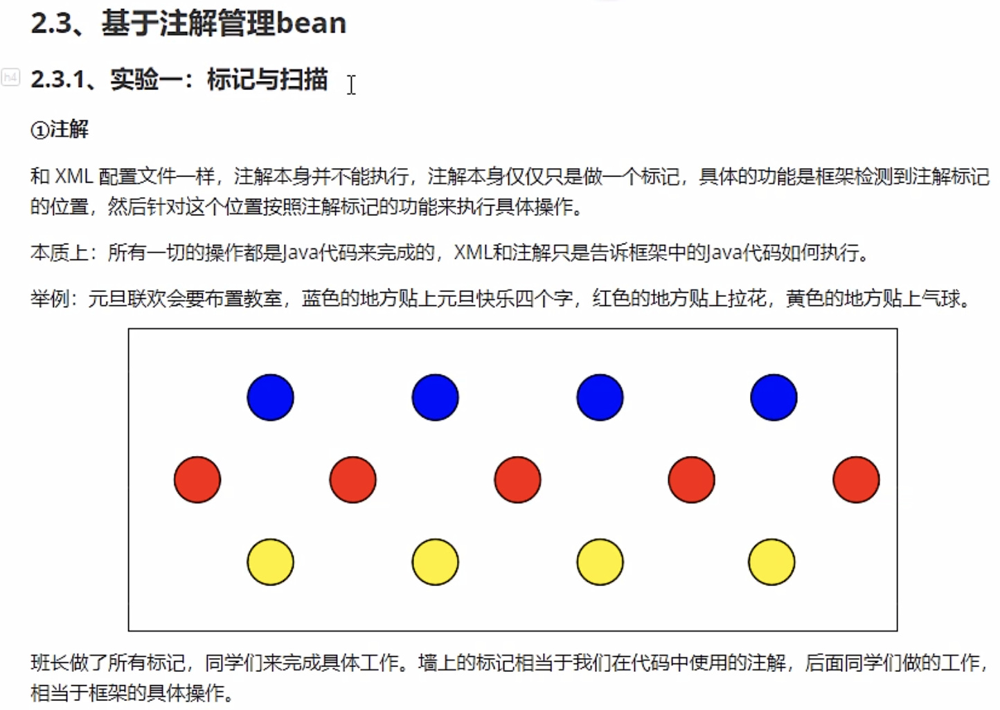
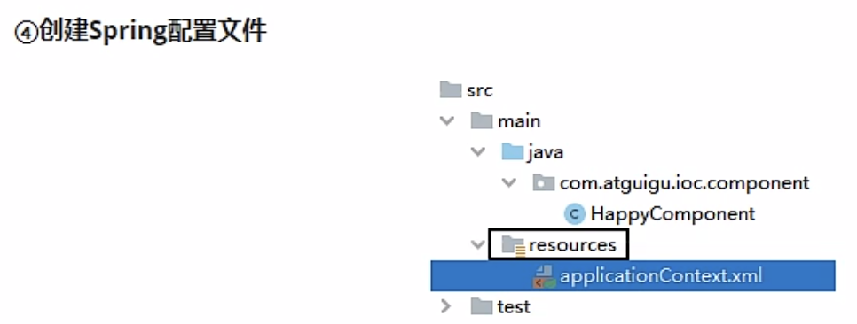
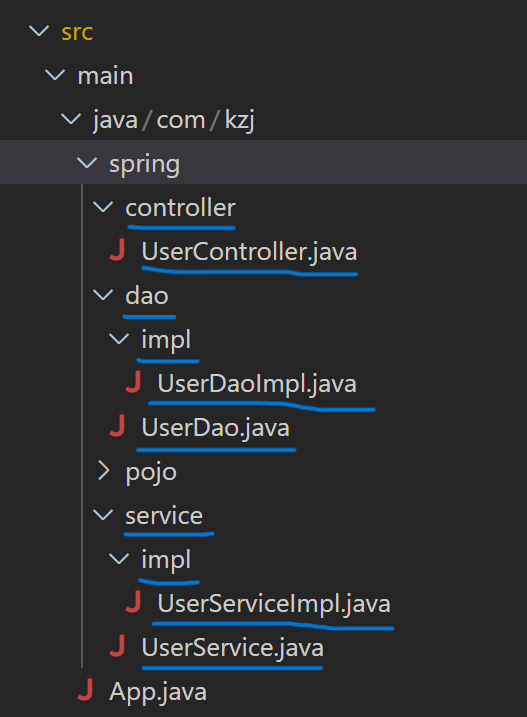
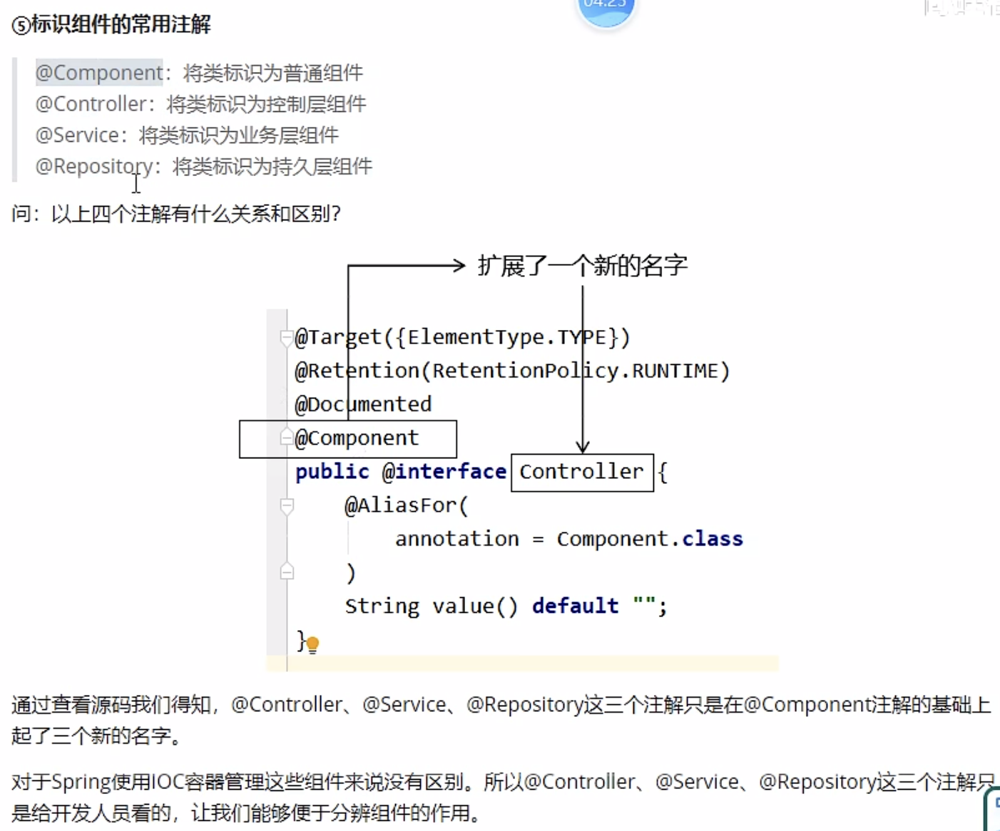

# Spring

## 基于注解管理bean

### 获取bean




用maven创建项目```spring_ioc_annotation```
和上一个项目引入一样的依赖到```pom.xml```文件中



和上个项目一样，先创建**三层架构**（**controller**调用**service**处理业务逻辑，service调用**dao**实现持久化操作）
- controller：接收并解析请求
- service：真正处理业务逻辑
- dao：操作数据库


#### 使用注解注册bean组件

@Component：将类标识为普通组件
@Controller：将类标识为控制层组件
@Service：将类标识为业务层组件
@Repository：将类标识为持久层组件



注意：
1. 注解不是加在接口上，而是加在接口的**实现类**上
2. 加了注解的类在IOC容器中的默认id为类名的**小驼峰**

如下：
```java
@Service
public class UserServiceImpl implements UserService{
}
```

```java
@Repository
public class UserDaoImpl implements UserDao{
}
```

```java
@Controller
public class UserController {
}
```

#### 扫描组件

新建配置文件```resources/spring_ioc_annotation.xml```，内容如下
```xml
<?xml version="1.0" encoding="UTF-8"?>
<beans xmlns="http://www.springframework.org/schema/beans"
       xmlns:xsi="http://www.w3.org/2001/XMLSchema-instance"
       xmlns:aop="http://www.springframework.org/schema/aop"
       xmlns:tx="http://www.springframework.org/schema/tx"
       xmlns:context="http://www.springframework.org/schema/context"
       xmlns:util="http://www.springframework.org/schema/util"
       xmlns:p="http://www.springframework.org/schema/p"
       xsi:schemaLocation="
       http://www.springframework.org/schema/beans
       http://www.springframework.org/schema/beans/spring-beans-3.0.xsd
       http://www.springframework.org/schema/tx
       http://www.springframework.org/schema/tx/spring-tx-3.0.xsd
       http://www.springframework.org/schema/context
       http://www.springframework.org/schema/context/spring-context-3.0.xsd
       http://www.springframework.org/schema/aop
       http://www.springframework.org/schema/aop/spring-aop-3.0.xsd
       http://www.springframework.org/schema/util 
       https://www.springframework.org/schema/util/spring-util-3.1.xsd">

    <!-- 扫描组件 -->
    <context:component-scan base-package="com.kzj.spring"></context:component-scan>
</beans>
```

新建测试类```IOCByAnnotationTest.java```，内容如下
```java
package com.kzj.test;
import org.junit.Test;
import org.springframework.context.ApplicationContext;
import org.springframework.context.support.ClassPathXmlApplicationContext;
import com.kzj.spring.controller.UserController;
import com.kzj.spring.dao.UserDao;
import com.kzj.spring.service.UserService;

public class IOCByAnnotationTest {
    @Test
    public void test(){
        ApplicationContext ioc = new ClassPathXmlApplicationContext("spring_ioc_annotation.xml");
            UserController userController = ioc.getBean(UserController.class);
            System.out.println(userController);
            UserService userService = ioc.getBean(UserService.class);
            System.out.println(userService);
            UserDao userDao = ioc.getBean(UserDao.class);
            System.out.println(userDao);
    }
}
```
运行结果为


##### 扫描组件的配置文件详解


配置文件```resources/spring_ioc_annotation.xml```中在```<beans></beans>```标签内部内容修改如下
```xml
    <!--开启组件扫描-->
    <!--这个包下面下的所有类都会扫描-->
<context:component-scan base-package="com.kzj.spring">
    <!--context:exclude-filter 排除扫描，设置不扫描哪些
        type="annotation | assignable"
        annotation：根据注解类型进行排除，expression中设置排除的注解的全类名
        assignable：根据类名进行排除，expression中设置排除的类的全类名
    -->
    <!-- <context:exclude-filter type="annotation" expression="org.springframework.stereotype.Controller"/> -->
    <!-- <context:exclude-filter type="assignable" expression="com.kzj.spring.controller.UserController"/> -->

    <!--context:include-filter 包含扫描，设置只扫描谁
        注意：需要在context:component-scan标签中设置属性use-default-filters="false",
        为false时，设置的包下面所有的类都不需要扫描，此时可以使用包含扫描
        为true时（默认的），设置的包下面所有的类都进行扫描，此时可以使用排除扫描
    -->
    <!-- <context:include-filter type="assignable" expression="org.springframework.stereotype.Service"/> -->
</context:component-scan>
```

通过注解加扫描所配置的bean的id，默认值为类名的小驼峰，即类名的首字母为小写的结果，注意不是接口名而是其实现类的类名

测试类```IOCByAnnotationTest.java```的部分内容修改如下
```java
public class IOCByAnnotationTest {
    @Test
    public void test(){
        ApplicationContext ioc = new ClassPathXmlApplicationContext("spring_ioc_annotation.xml");
            UserController userController = ioc.getBean("userController", UserController.class);
            System.out.println(userController);
            UserService userService = ioc.getBean("userServiceImpl", UserService.class);
            System.out.println(userService);
            UserDao userDao = ioc.getBean("userDaoImpl", UserDao.class);
            System.out.println(userDao);
    }
}
```
运行结果和上面一样，说明我们写的bean的id没有问题
（如果bean的id有问题，就获取不到bean）

可以通过标识组件注解的value属性设置bean的自定义的id

例如
```java
@Controller("myUserController")
public class UserController {
}
```

这时，测试类```IOCByAnnotationTest.java```的相应位置应该修改为
```java
            UserController userController = ioc.getBean("myUserController", UserController.class);
```
才能运行成功

### 自动装配


---

---
到P91

---

学神笔记
https://blog.csdn.net/gdxdekx/article/details/126173888
https://blog.csdn.net/gdxdekx/article/details/126173479

尚硅谷2022新版javaweb 手写 IOC（张益桃），去看看