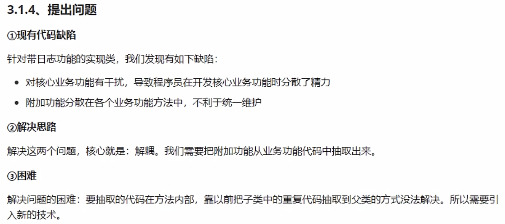
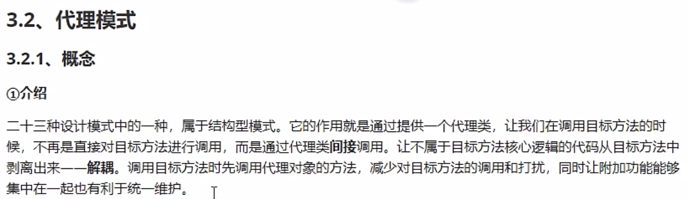
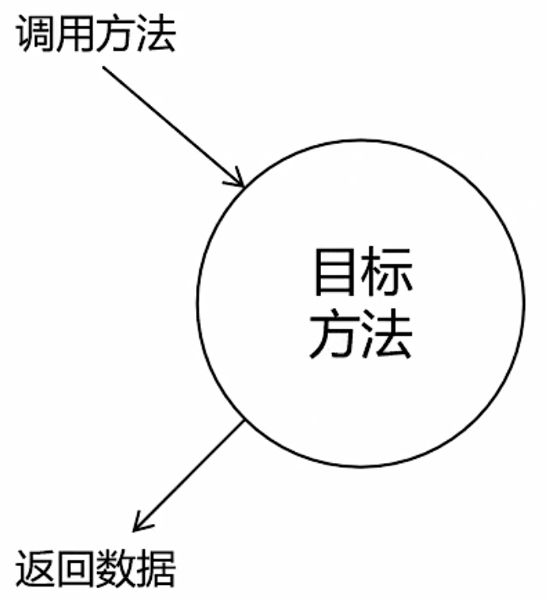
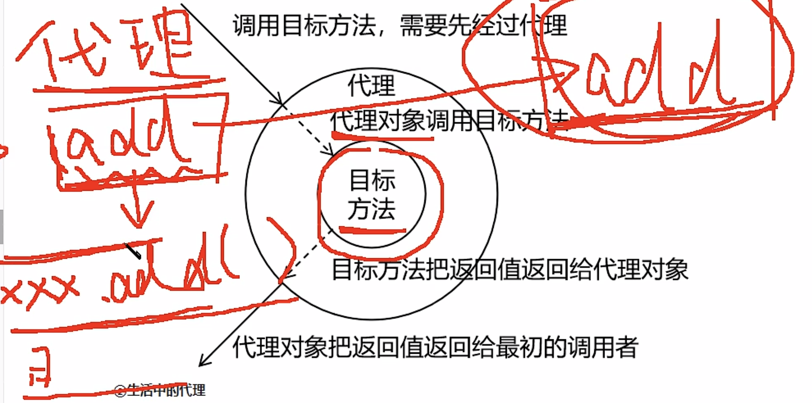
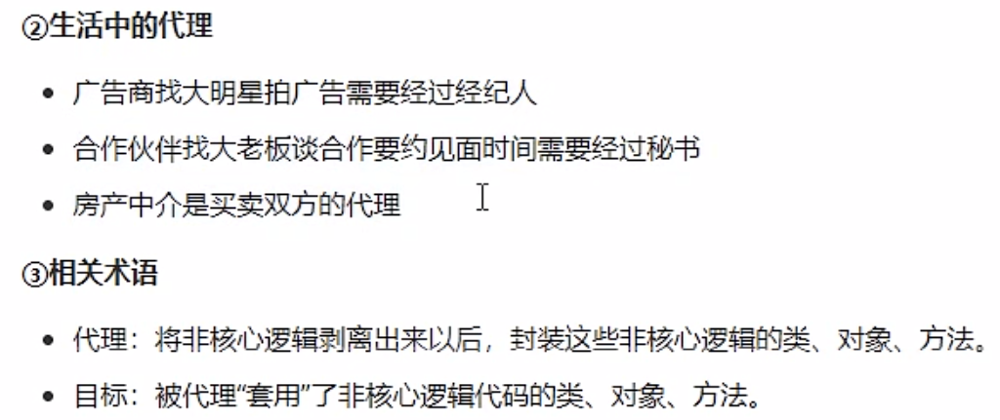

# AOP

## 代理模式的场景模拟

用maven创建项目```spring-proxy```

创建```src/main/java/com/kzj/spring/proxy/Calculator.java```接口
```java
package com.kzj.spring.proxy;

public interface Calculator {
    int add(int i, int j);
    int sub(int i, int j);
    int mul(int i, int j);
    int div(int i, int j);
}
 ```

创建```src/main/java/com/kzj/spring/proxy/CalculatorImpl.java```实现类
```java
package com.kzj.spring.proxy;

public class CalculatorImpl implements Calculator{

    @Override
    public int add(int i, int j) {
        int result = i + j;
        System.out.println("(+)方法内部，result：" + result);
        return result;
    }

    @Override
    public int div(int i, int j) {
        int result = i - j;
        System.out.println("(-)方法内部，result：" + result);
        return result;
    }

    @Override
    public int mul(int i, int j) {
        int result = i * j;
        System.out.println("(*)方法内部，result：" + result);
        return result;
    }

    @Override
    public int sub(int i, int j) {
        int result = i / j;
        System.out.println("(/)方法内部，result：" + result);
        return result;
    } 
}
 ```

现在要加入日志功能，如果不用AOP，需要在加减乘除的方法中，手动添加日志代码

## 提出问题



## 代理模式



### 直接调用目标方法（不使用代理）



### 使用代理


相当于service与dao的关系
为目标对象创建一个代理对象，每一次想要访问目标对象，都通过代理对象来访问
在目标方法执行的前后加入一些额外的操作（在不改变目标对象的基础上，实现功能增强）
核心业务代码在目标对象，非核心业务代码抽取到代理对象中



#### 静态代理

一个代理类对应一个目标类


---

---
到P96

---

学神笔记
https://blog.csdn.net/gdxdekx/article/details/126173888
https://blog.csdn.net/gdxdekx/article/details/126173479

尚硅谷2022新版javaweb 手写 IOC（张益桃），去看看