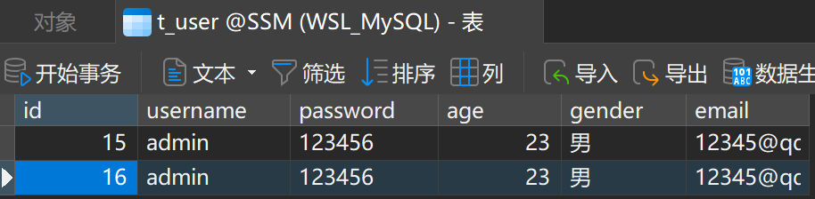
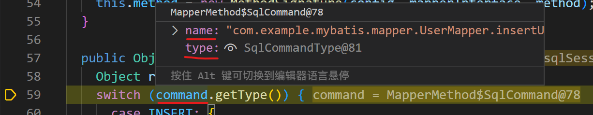

# MyBatis

## 简介

持久层框架
DAO：数据库访问对象
ORM：对象关系映射（对象指**Java中的对象**，关系指**关系型数据库**，创建Java对象和数据库记录的映射）


1. 纯手动：JDBC
2. 半自动：MyBatis
3. 全自动：Hibernate


## 安装

首先用Maven构建一个工程，并引入依赖
```xml
 <!--依赖列表-->
  <dependencies>
 
    <!--MyBatis依赖-->
    <dependency>
      <groupId>org.mybatis</groupId>
      <artifactId>mybatis</artifactId>
      <version>3.5.7</version>
    </dependency>
 
    <!--mysql驱动-->
    <dependency>
      <groupId>mysql</groupId>
      <artifactId>mysql-connector-java</artifactId>
      <version>8.0.16</version>
    </dependency>
 
    <!--单元测试-->
    <dependency>
      <groupId>junit</groupId>
      <artifactId>junit</artifactId>
      <version>4.12</version>
      <scope>test</scope>
    </dependency>
  </dependencies>
```


在Vscode中可以看到


## 简单使用（在MyBatis中面向接口，实现sql语句的执行）

### 在数据库中建表

新建名为SSM的数据库，在其中新建表t_user


### 创建对应的实体类

User.java文件

这里的属性名要对应数据库中的列名

用右键```源代码操作```


增加
1. get，set方法
2. 构造方法（无参构造方法必须要有）
3. toString方法


### 创建mybatis的核心配置文件（如何连接数据库）


mybatis-config.xml的文件内容形式如下
```xml
<?xml version="1.0" encoding="UTF-8" ?>
<!DOCTYPE configuration
        PUBLIC "-//mybatis.org//DTD Config 3.0//EN"
        "http://mybatis.org/dtd/mybatis-3-config.dtd">
<configuration>
    <environments default="development">
        <environment id="development">
            <transactionManager type="JDBC"/>
            <!--配置数据源：创建Connection对象-->
            <dataSource type="POOLED">
                <!--driver：驱动内容-->
                <property name="driver" value="${driver}"/>
                <!--连接数据库的url-->
                <property name="url" value="${url}"/>
                <!--用户名-->
                <property name="username" value="${username}"/>
                <!--密码-->
                <property name="password" value="${password}"/>
            </dataSource>
        </environment>
    </environments>
 
    <!--指定mybatis的mapper映射文件的位置
        目的是找到其他mapper文件的sql语句
    -->
    <mappers>
        <!--使用mapper的resource属性指定mapper文件的路径(使用 / 分割路径)
            这个路径是相对于src/main/java/的
            一个resource指定一个mapper文件
        -->
        <mapper resource="{mybatis的mapper映射文件}"/>
    </mappers>
</configuration>
```
注意这里的mapper映射文件此时还没有编写，之后创建mybatis的mapper映射文件（如何操作数据库）再回来填写

#### 我的mybatis-config.xml文件内容（UserMapper.xml文件创建后）

```xml
<?xml version="1.0" encoding="UTF-8" ?>
<!DOCTYPE configuration
        PUBLIC "-//mybatis.org//DTD Config 3.0//EN"
        "http://mybatis.org/dtd/mybatis-3-config.dtd">
<configuration>
    <environments default="development">
        <environment id="development">
            <transactionManager type="JDBC"/>
            <!--配置数据源：创建Connection对象-->
            <dataSource type="POOLED">
                <!--driver：驱动内容-->
                <property name="driver" value="com.mysql.cj.jdbc.Driver"/>
                <!--连接数据库的url-->
                <property name="url" value="jdbc:mysql://localhost:3306/SSM?serverTimezone=UTC"/>
                <!--用户名-->
                <property name="username" value="root"/>
                <!-- 密码 -->
                <property name="password" value="1"/>
            </dataSource>
        </environment>
    </environments>
 
    <!--指定mybatis的mapper映射文件的位置
        目的是找到其他mapper文件的sql语句
    -->
    <mappers>
        <!--使用mapper的resource属性指定mapper文件的路径(使用 / 分割路径)
            这个路径是相对于src/main/resources/的
            一个resource指定一个mapper文件
        -->
        <mapper resource="mappers/UserMapper.xml"/>
    </mappers>
</configuration>
```

#### 注意这里路径的配置（1）

```<mapper resource="{mybatis的mapper映射文件}"/>```
这个路径是从src/main/resources/路径开启的，即写的路径是**相对于resources文件夹的**

### 创建mapper接口

注意，mapper接口是```.java```文件


我的UserMapper.java文件内容如下


### 创建mybatis的mapper映射文件（如何操作数据库）

注意，mapper映射文件是```.xml```文件


注意：
1. mapper接口文件（UserMapper.java）和mapper映射文件（UserMapper.xml）要保证两个一致
2. 这里为了方便管理（容易看出他们的对应关系），接口文件和映射文件的文件名相同，只有后缀不同


UserMapper.xml的文件内容形式如下
```xml
<?xml version="1.0" encoding="UTF-8" ?>
<!DOCTYPE mapper
        PUBLIC "-//mybatis.org//DTD Mapper 3.0//EN"
        "http://mybatis.org/dtd/mybatis-3-mapper.dtd">
<mapper namespace="{第1个一致：这里要与Mapper接口的全类名保持一致}">
    <insert id="{第2个一致：这里要与Mapper接口中的方法名一致}">
        insert into t_user values(null, 'admin', '123456', 23, '男', '12345@qq.com')
    </insert>
</mapper>
 ```
在映射文件中，让mapper接口中的一个方法对应一个sql语句

#### 我的UserMapper.xml文件内容（UserMapper.java文件创建后）

```xml
<?xml version="1.0" encoding="UTF-8" ?>
<!DOCTYPE mapper
        PUBLIC "-//mybatis.org//DTD Mapper 3.0//EN"
        "http://mybatis.org/dtd/mybatis-3-mapper.dtd">
<mapper namespace="com.example.mybatis.mapper.UserMapper">
    <insert id="insertUser">
        insert into t_user values(null, 'admin', '123456', 23, '男', '12345@qq.com')
    </insert>
</mapper>
```
当调用UserMapper接口中的insertUser方法时：
1. 通过mapper接口的全类名，找到对应的mapper映射文件
2. 通过调用的方法名，找到映射文件中的sql语句

### 创建测试类（用得多）


- sql语句和mapper接口中的方法对应，现在要创建mapper接口的对象，调用其中的方法，但是接口不能直接创建实例化对象
- 这时用**sqlSession的getMapper方法**，传入某个类型的class对象，会返回这个类型的实例化对象（这个方法的底层使用的是**代理模式**）
- 用代理模式创建了当前接口的**代理实现类**，这个实现类肯定实现了UserMapper接口，那他就一定帮助我们重写接口的方法，怎们**重写方法**，就是之前提到的：
> 当调用UserMapper接口中的insertUser方法时：
>1. 通过mapper接口的全类名，找到对应的mapper映射文件
>2. 通过调用的方法名，找到映射文件中的sql语句

经测试，得到输出


但是数据库表中没有插入的信息


这是因为如果以这种方式创建sqlSession，通过sqlSession执行一个sql语句的话，我们**必须自己设置事务的提交和回滚**，他不会自动提交，默认是回滚的，所以数据库中看不到效果

如下图，加一行```sqlSession.commit();```即可


成功写入数据库


#### 注意这里路径的配置（2）

```InputStream is = Resources.getResourceAsStream("mybatis-config.xml");```
这个路径是从src/main/resources/路径开启的，即写的路径是**相对于resources文件夹的**

### 测试类中的另一种写法（通过sql的唯一标识）（用得不多）

通过提供sql语句的唯一标识，找到sql并执行
唯一标识```namespace.sqlId```是```com.example.mybatis.mapper.UserMapper.insertUser```
> ```namespace```在
> 
> ```sqlId```在
> 

测试类如下图


成功写入数据库


#### 让sqlSession自动提交

在openSession中传入true，获取到的sqlSession对象就可以自动提交事务


### 加入log4j日志功能

#### 在pom.xml文件中加入依赖


#### 加入log4j的配置文件log4j.xml

配置文件log4j.xml存放在src/main/resources目录下
log4j.xml文件内容如下
```xml
<?xml version="1.0" encoding="UTF-8"?>
<!DOCTYPE log4j:configuration SYSTEM "log4j.dtd">
 
<log4j:configuration xmlns:log4j="http://jakarta.apache.org/log4j/">
	<appender name="STDOUT" class="org.apache.log4j.ConsoleAppender">
		<param name="Encoding" value="UTF-8" />
		<layout class="org.apache.log4j.PatternLayout">
			<param name="ConversionPattern" value="%d{HH:mm:ss,SS} %-5p (%C{1}:%M) - %m%n"/>
		</layout>
	</appender>

	<logger name="java.sql">
		<level value="debug"/>
	</logger>
	
	<logger name="com.apache.ibatis">
		<level value="info"/>
	</logger>
	
	<root>
		<level value="debug"/>
		<appender-ref ref="STDOUT" />
	</root>
</log4j:configuration>
 ```

再次执行测试类，会输出日志信息


#### 日志级别
 


### 源码验证：代理实现类对象userMapper的insertUser方法的实现方式

- sql语句和mapper接口中的方法对应，现在要创建mapper接口的对象，调用其中的方法，但是接口不能直接创建实例化对象
- 这时用**sqlSession的getMapper方法**，传入某个类型的class对象，会返回这个类型的实例化对象（这个方法的底层使用的是**代理模式**）
- 用代理模式创建了当前接口的**代理实现类**，这个实现类肯定实现了UserMapper接口，那他就一定帮助我们重写接口的方法，怎们**重写方法**，就是之前提到的：
> 当调用UserMapper接口中的insertUser方法时：
>1. 通过mapper接口的全类名，找到对应的mapper映射文件
>2. 通过调用的方法名，找到映射文件中的sql语句

打断点


启动debug


点击**单步调试**


在invoke方法中


在execute方法中


可见，把要执行的sql语句封装到command中


sqlSession.insert方法，通过提供sql语句的唯一标识，找到sql并执行，和我们自己在测试类中写的比较像


### 加入修改、删除、查询功能

#### 创建工具类，封装获取sqlSession的过程

之前在测试类中实现插入功能比较麻烦，所以我们把获取sqlSession的过程封装到工具类

在目录main/java/com/example/mybatis下新建文件夹utils，utils里新建工具类SqlSessionUtil.java，内容如下
```java
package com.example.mybatis.utils;
import java.io.IOException;
import java.io.InputStream;
import org.apache.ibatis.io.Resources;
import org.apache.ibatis.session.SqlSession;
import org.apache.ibatis.session.SqlSessionFactory;
import org.apache.ibatis.session.SqlSessionFactoryBuilder;

public class SqlSessionUtil {

    public static SqlSession getSqlSession() {
        SqlSession sqlSession = null;
        try {
            // 获取核心配置文件mybatis-config.xml的输入流
            InputStream is = Resources.getResourceAsStream("mybatis-config.xml");
            // 获取SqlSessionFactoryBuilder对象
            SqlSessionFactoryBuilder sqlSessionFactoryBuilder = new SqlSessionFactoryBuilder();
            // 获取SqlSessionFactory对象(传入字节输入流)
            SqlSessionFactory sqlSessionFactory = sqlSessionFactoryBuilder.build(is);
            // 获取SqlSession对象(自动提交事务)
            sqlSession = sqlSessionFactory.openSession(true);
        } catch (IOException e) {
            e.printStackTrace();
        }
        return sqlSession;
    }

}
```

注意这里不要抛出异常，要捕获，在快速修复里能快捷创建代码


##### 以后用了Spring框架，获取SqlSession对象更简单

1. 这里写了一个静态方法，用来提供SqlSession对象
2. 以后用Spring整合MyBatis时，可以直接通过Spring获取SqlSession对象
3. 甚至连SqlSession也可以不获取，可以直接获取mapper接口的代理实现类对象，直接来操作这个对象也是可以的

#### 在mapper接口文件（UserMapper.java）中加入抽象方法

UserMapper.java文件内容如下
```java
package com.example.mybatis.mapper;
import java.util.List;
import com.example.mybatis.pojo.User;

public interface UserMapper {
    int insertUser();
    void updateUser();
    void deleteUser();
    User getUserById();
    List<User> getAllUser();
}
```

#### 在mapper映射文件（UserMapper.xml）中加入对应的sql语句

UserMapper.xml文件内容如下
```xml
<?xml version="1.0" encoding="UTF-8" ?>
<!DOCTYPE mapper
        PUBLIC "-//mybatis.org//DTD Mapper 3.0//EN"
        "http://mybatis.org/dtd/mybatis-3-mapper.dtd">
<mapper namespace="com.example.mybatis.mapper.UserMapper">
    <insert id="insertUser">
        insert into t_user values(null, 'admin', '123456', 23, '男', '12345@qq.com')
    </insert>

    <update id="updateUser">
        update t_user set username='root',password='123' where id = 34
    </update>

    <delete id="deleteUser">
        delete from t_user where id = 34
    </delete>

    <select id="getUserById" resultType="com.example.mybatis.pojo.User">
        select * from t_user where id = 35
    </select>

    <select id="getAllUser" resultType="com.example.mybatis.pojo.User">
        select * from t_user
    </select>
    <!--
        id：Mapper接口中的方法名称
        resultType：Java对象的全限定名称(告诉MyBatis，执行sql语句，把数据赋值给哪个类型的Java对象)(是从src/main/java/路径开启的)(注意是用.分隔而不是/)
        resultMap：自定义映射，处理多对一或一对多的映射关系
        注意：resultType属性和resultMap属性只能二选一设置一个
    -->
</mapper>
```

#### 在mybatis测试类（MyBatisTest.java）中加入测试方法

MyBatisTest.java文件内容如下
```java
package com.example.mybatis.test;
import java.io.IOException;
import java.util.List;
import org.apache.ibatis.session.SqlSession;
import org.junit.Test;
import com.example.mybatis.mapper.UserMapper;
import com.example.mybatis.pojo.User;
import com.example.mybatis.utils.SqlSessionUtil;

public class MyBatisTest {
    
    @Test
    public void testInsert() throws IOException{
        SqlSession sqlSession = SqlSessionUtil.getSqlSession();
        // 获取UserMapper的代理实现类对象
        UserMapper userMapper = sqlSession.getMapper(UserMapper.class);
        // 调用Mapper接口中的方法，实现添加用户信息的功能
        int result = userMapper.insertUser();
        System.out.println("结果：" + result);
        sqlSession.close();
    }

    @Test
    public void testUpdate() {
        SqlSession sqlSession = SqlSessionUtil.getSqlSession();
        UserMapper mapper = sqlSession.getMapper(UserMapper.class);
        mapper.updateUser();
        sqlSession.close();
    }

    @Test
    public void testDelete() {
        SqlSession sqlSession = SqlSessionUtil.getSqlSession();
        UserMapper mapper = sqlSession.getMapper(UserMapper.class);
        mapper.deleteUser();
        sqlSession.close();
    }

    @Test
    public void TestSelect() {
        SqlSession sqlSession = SqlSessionUtil.getSqlSession();
        UserMapper mapper = sqlSession.getMapper(UserMapper.class);
        User user = mapper.getUserById();
        System.out.println(user);
    }

    @Test
    public void TestGetAllUser() {
        SqlSession sqlSession = SqlSessionUtil.getSqlSession();
        UserMapper mapper = sqlSession.getMapper(UserMapper.class);
        List<User> list = mapper.getAllUser();
        // 需要在pom.xml文件中指定<maven.compiler.source>和<maven.compiler.target>为1.8版本
        list.forEach(System.out::println);
    }
}
```

当前数据库中内容为


分别测试insert、update、delete、select方法后，数据库中内容为


