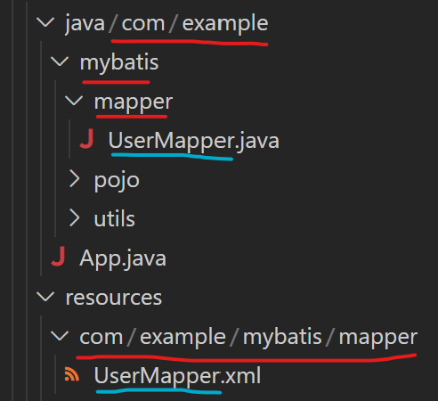
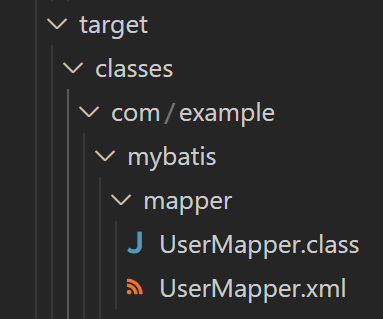
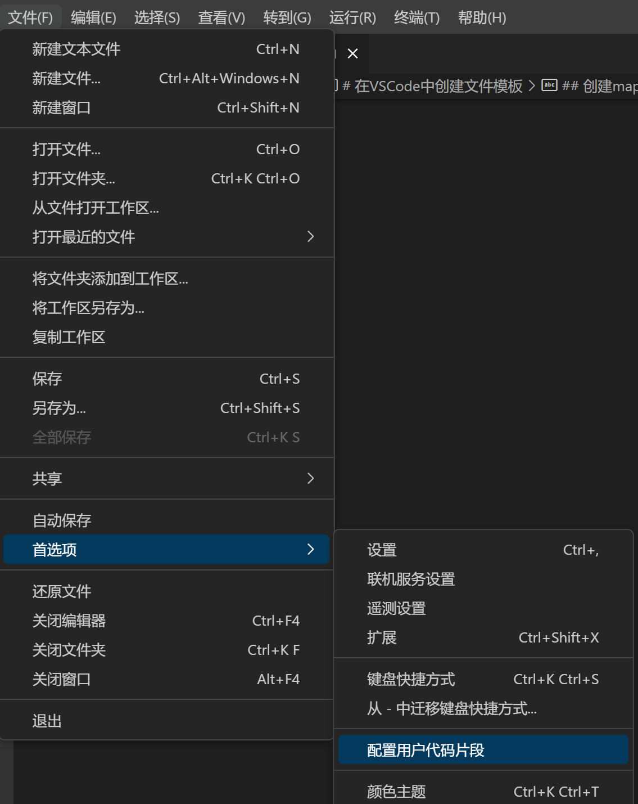

# MyBatis核心配置文件

MyBatis核心配置文件中的标签必须按照指定的顺序：
> properties?,settings?,typeAliases?,typeHandlers?,
> objectFactory?,objectWrapperFactory?,reflectorFactory?,
> plugins?,environments?,databaseIdProvider?,mappers?

## ```<environments>```标签

在**mybatis-config.xml文件**中
使用```<environments>```标签，**配置连接数据库的环境**
这里有两个环境，一个开发，一个测试
```xml
    <environments default="development">
        <environment id="development">
            <!-- 
                transactionManager：设置事务管理器
                属性type="JDBC / MANAGED"：设置事务管理的方式，
                    其中JDBC：使用JDBC中原生的事务管理方式，
                    MANAGED：被管理，例如Spring
             -->
            <transactionManager type="JDBC"/>
            <!--
                dataSource：配置数据源
                属性type="POOLED / UNPOOLED / JNDI"：设置数据源的类型，
                    其中POOLED：使用数据库连接池
                    UNPOOLED：不使用数据库连接池
                    JNDI：使用上下文中的数据源
            -->
            <dataSource type="POOLED">
                <!--driver：驱动内容-->
                <property name="driver" value="com.mysql.cj.jdbc.Driver"/>
                <!--连接数据库的url-->
                <property name="url" value="jdbc:mysql://localhost:3306/SSM?serverTimezone=UTC"/>
                <!--用户名-->
                <property name="username" value="root"/>
                <!-- 密码 -->
                <property name="password" value="1"/>
            </dataSource>
        </environment>

        <environment id="test">
            <transactionManager type="JDBC"/>
            <dataSource type="POOLED">
                <property name="driver" value="com.mysql.cj.jdbc.Driver"/>
                <property name="url" value="jdbc:mysql://localhost:3306/SSM?serverTimezone=UTC"/>
                <property name="username" value="root"/>
                <property name="password" value="1"/>
            </dataSource>
        </environment>
    </environments>
```

## ```<properties>```标签

首先在mybatis-config.xml文件的同目录下创建jdbc.properties文件，在里面写键值对
**jdbc.properties文件**的内容为
```properties
jdbc.driver=com.mysql.cj.jdbc.Driver
jdbc.url=jdbc:mysql://localhost:3306/SSM?serverTimezone=UTC
jdbc.username=root
jdbc.password=1
```

现在还不能在核心配置文件mybatis-config.xml中访问
需要把properties引入配置文件
在**mybatis-config.xml文件**中
使用```<properties>```标签，**引入jdbc.properties文件**
然后就可以用**使用${key}的方式访问value**（这里的key和value都是jdbc.properties文件中的）
```xml
    <!-- 引入properties文件，此后就可以在当前文件中使用${key}的方式访问value -->
    <properties resource="jdbc.properties" />

    <environments default="development">
        <environment id="development">
            <transactionManager type="JDBC"/>
            <dataSource type="POOLED">
                <property name="driver" value="${jdbc.driver}"/>
                <property name="url" value="${jdbc.url}"/>
                <property name="username" value="${jdbc.username}"/>
                <property name="password" value="${jdbc.password}"/>
            </dataSource>
        </environment>

        <environment id="test">
            <transactionManager type="JDBC"/>
            <dataSource type="POOLED">
                <property name="driver" value="${jdbc.driver}"/>
                <property name="url" value="${jdbc.url}"/>
                <property name="username" value="${jdbc.username}"/>
                <property name="password" value="${jdbc.password}"/>
            </dataSource>
        </environment>
    </environments>
```

## ```<typeAliases>```标签

在**mybatis-config.xml文件**中
使用```<typeAliases>```标签，**设置类型别名**
```xml
    <typeAliases>
        <!--
            typeAlias：设置类型别名
            属性type：设置需要起别名的类型
            属性alias：别名
        -->
        <typeAlias type="com.example.mybatis.pojo.User" alias="abc"></typeAlias>
    </typeAliases>
```

然后就可以在MyBatis的范围中，使用别名表示具体的类型
在**UserMapper.xml文件**（mapper映射文件）中
可以**用别名abc代替原名com.example.mybatis.pojo.User**
```xml
    <select id="getUserById" resultType="abc">
        select * from t_user where id = 35
    </select>

    <select id="getAllUser" resultType="abc">
        select * from t_user
    </select>
```
### 如果不设置属性alias

在**mybatis-config.xml文件**改成
```xml
    <typeAliases>
        <!--
            如果不设置alias属性，这个类型会拥有默认的别名
            默认的别名就是类名，且不区分大小写
        -->
        <typeAlias type="com.example.mybatis.pojo.User"></typeAlias>
    </typeAliases>
```

则**用默认的别名User（不区分大小写）代替原名com.example.mybatis.pojo.User**

在**UserMapper.xml文件**（mapper映射文件）改成
```xml
    <select id="getUserById" resultType="User">
        select * from t_user where id = 35
    </select>

    <select id="getAllUser" resultType="User">
        select * from t_user
    </select>
```
### 使用```<package>```标签

如果有很多实体类，使用上面的```<typeAlias>```标签，一次只能给一个**实体类**设置别名，那```<typeAlias>```需要写很多才行

改进：
使用```<package>```标签，以**包**（所有的实体类统一放在一个包下）的方式设置别名
在**mybatis-config.xml文件**改成
```xml
    <typeAliases>
        <!-- 
            此时这个包下面的所有实体类将全部拥有默认的别名（即类名且不区分大小写）
        -->
        <package name="com.example.mybatis.pojo" />
    </typeAliases>
```

## ```<mappers>```标签

在**mybatis-config.xml文件**中
使用```<mappers>```标签，**引入mybatis的映射文件**
```xml
    <!--指定mybatis的mapper映射文件的位置
        目的是找到其他mapper文件的sql语句
    -->
    <mappers>
        <!--使用mapper的resource属性指定mapper文件的路径(使用 / 分割路径)
            这个路径是相对于src/main/resources/的
            一个resource指定一个mapper文件
        -->
        <mapper resource="mappers/UserMapper.xml"/>
    </mappers>
```
这样可以用```<mapper>```子标签，一个一个地引入映射文件，比较麻烦

### 使用```<package>```标签

前提要求：
1. mapper映射文件所在的包（相对于```resources/```文件夹），要和mapper接口所在的包（相对于```java/```文件夹）一致
2. mapper映射文件的名字，要和mapper接口的名字保持一致



为什么mapper映射文件和mapper接口所在的包（不是同一个目录）要保持一致：
在项目编译后产生的```target/```文件夹中，发现mapper映射文件和mapper接口在同一个目录下面


使用```<package>```标签，以**包**（所有的映射文件统一放在一个包下）的方式引入映射文件
在**mybatis-config.xml文件**改成
```xml
    <mappers>
        <package name="com.example.mybatis.mapper" />
    </mappers>
```

# 在VSCode中创建文件模板


VSCode中的模板设置是JSON格式的，不如IDEA好用，这里暂时不在VSCode中设置模板

## 创建MyBatis核心配置文件的模板

mybatis-config.xml
```xml
<?xml version="1.0" encoding="UTF-8" ?>
<!DOCTYPE configuration
        PUBLIC "-//mybatis.org//DTD Config 3.0//EN"
        "http://mybatis.org/dtd/mybatis-3-config.dtd">
<configuration>

    <!--
        MyBatis核心配置文件中的标签必须按照指定的顺序：
        properties?,settings?,typeAliases?,typeHandlers?,
        objectFactory?,objectWrapperFactory?,reflectorFactory?,
        plugins?,environments?,databaseIdProvider?,mappers?
    -->

    <!-- 引入properties文件，此后就可以在当前文件中使用${key}的方式访问value -->
    <properties resource="jdbc.properties" />

    <typeAliases>
        <!-- 
            此时这个包下面的所有实体类将全部拥有默认的别名（即类名且不区分大小写）
        -->
        <package name="替换成实体类所在的包" />
    </typeAliases>

    <environments default="development">
        <environment id="development">
            <transactionManager type="JDBC"/>
            <dataSource type="POOLED">
                <property name="driver" value="${jdbc.driver}"/>
                <property name="url" value="${jdbc.url}"/>
                <property name="username" value="${jdbc.username}"/>
                <property name="password" value="${jdbc.password}"/>
            </dataSource>
        </environment>
    </environments>
 
    <mappers>
        <package name="替换成映射文件所在的包" />
    </mappers>
</configuration>
```

## 创建mapper映射文件的模板

mybatis-mapper.xml
```xml
<?xml version="1.0" encoding="UTF-8" ?>
<!DOCTYPE mapper
        PUBLIC "-//mybatis.org//DTD Mapper 3.0//EN"
        "http://mybatis.org/dtd/mybatis-3-mapper.dtd">
<mapper namespace="替换成接口的全类名">
    <!--
        id：Mapper接口中的方法名称
        resultType：Java对象的全限定名称(告诉MyBatis，执行sql语句，把数据赋值给哪个类型的Java对象)(是从src/main/java/路径开启的)(注意是用.分隔而不是/)
        resultMap：自定义映射，处理多对一或一对多的映射关系
        注意：resultType属性和resultMap属性只能二选一设置一个
        #{studentId}：占位符，表示从Java程序中传入过来的数据
    -->
    <!-- <select id="selectStudentById" resultType="com.bjpowernode.entity.Student">
        select id,name,email,age from student where id=#{studentId}
    </select>
     -->
</mapper>
```

