# Mybatis获取参数值

前提准备：
- 新建名为mybatis_parameter的工程
- 把上一个名为mybatis_helloworld的工程中的pom.xml，log4j.xml，jdbc.properties，SqlSessionUtil.java文件复制到新项目的对应文件夹中（注意```resources/```文件夹在```src/main/```目录下）
- 然后创建mybatis核心配置文件mybatis-config.xml（使用模板）（```resources/```目录下）（其中有两处需要替换）
- 创建mapper接口文件（```java/com/kzj/mybatis/mapper/```目录下）
- 创建mapper映射文件（名字要和mapper接口文件的名字一致）（使用模板）（```resources/com/kzj/mybatis/mapper/```目录下）（其中有一处需要替换）
- 创建实体类（```java/com/kzj/mybatis/pojo/```目录下）

## Mybatis获取参数值的两种方式

由于mapper接口没有实现类，mapper接口中的方法直接对应mapper映射文件中的sql语句
我们要做的就是在映射文件中，通过指定的方式，获得所作应方法的参数，然后把它放到sql语句中

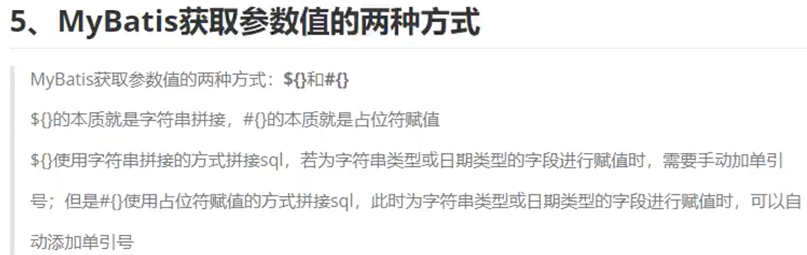
推荐用```#{}```，可以防止sql注入

### 1. 单个字面量类型的参数

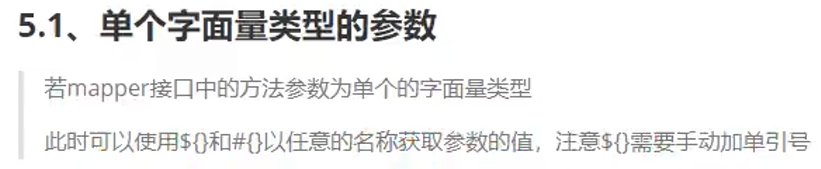

修改mapper接口文件UserMapper.java如下
```java
package com.kzj.mybatis.mapper;
import com.kzj.mybatis.pojo.User;

public interface UserMapper {
    User getUserByUsername(String username);
}
```

修改mapper映射文件UserMapper.xml如下
```xml
<?xml version="1.0" encoding="UTF-8" ?>
<!DOCTYPE mapper
        PUBLIC "-//mybatis.org//DTD Mapper 3.0//EN"
        "http://mybatis.org/dtd/mybatis-3-mapper.dtd">
<mapper namespace="com.kzj.mybatis.mapper.UserMapper">
    <!-- User getUserByUsername(String username); -->
    <select id="getUserByUsername" resultType="User">
        select * from t_user where username = #{username}
    </select>
</mapper>
```

新建测试类ParameterTest.java（```test/java/com/kzj/mybatis/test/```目录下）如下
```java
package com.kzj.mybatis.test;
import org.apache.ibatis.session.SqlSession;
import org.junit.Test;
import com.kzj.mybatis.mapper.UserMapper;
import com.kzj.mybatis.pojo.User;
import com.kzj.mybatis.utils.SqlSessionUtil;

public class ParameterTest {
    @Test
    public void testGetUserByUsername(){
        SqlSession sqlSession = SqlSessionUtil.getSqlSession();
        UserMapper mapper = sqlSession.getMapper(UserMapper.class);
        User user = mapper.getUserByUsername("kzj");
        System.out.println(user);
    }
}
```

运行测试类的这个方法，成功
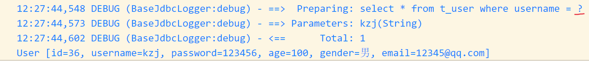
注意：上图的```#{}```变成了```?```，说明是当作占位符来解析，会自动加单引号

但是如果把mapper映射文件UserMapper.xml中的
```sql
select * from t_user where username = #{username}
```
的```#{}```的大括号内部随便去写，都没有影响，但是建议写得和传入的参数名一致

如果把```#{}```换成```${}```，直接拼接到sql语句中，字符串kzj没有加单引号，会被当作字段，所以报错
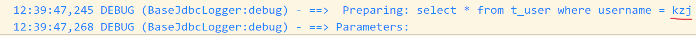

那就自己手动加上单引号
修改mapper映射文件UserMapper.xml如下
```xml
<?xml version="1.0" encoding="UTF-8" ?>
<!DOCTYPE mapper
        PUBLIC "-//mybatis.org//DTD Mapper 3.0//EN"
        "http://mybatis.org/dtd/mybatis-3-mapper.dtd">
<mapper namespace="com.kzj.mybatis.mapper.UserMapper">
    <!-- User getUserByUsername(String username); -->
    <select id="getUserByUsername" resultType="User">
        select * from t_user where username = '${username}'
    </select>
</mapper>
```

运行成功
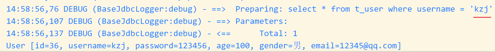

### 2. 多个字面量类型的参数（推荐使用@Param标识参数）

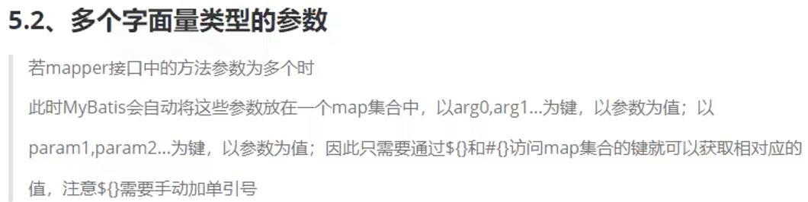
与使用@Param标识参数相比，缺点是**不能自定义键名**

在mapper接口文件UserMapper.java中新增如下
```java
User checkLogin(String username, String password);
```

在mapper映射文件UserMapper.xml中新增如下（此时有误，之后将修改）
```xml
    <!-- User checkLogin(String username, String password); -->
    <select id="checkLogin" resultType="User">
        select * from t_user where username = #{username} and password = #{password}
    </select>
```

在测试类ParameterTest.java中新增如下
```java
    @Test
    public void testCheckLogin(){
        SqlSession sqlSession = SqlSessionUtil.getSqlSession();
        UserMapper mapper = sqlSession.getMapper(UserMapper.class);
        User user = mapper.checkLogin("kzj", "123456");
        System.out.println(user);
    }
```

运行测试类的这个方法，报错
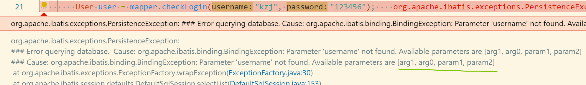
提示```Available parameters are [arg1, arg0, param1, param2]```

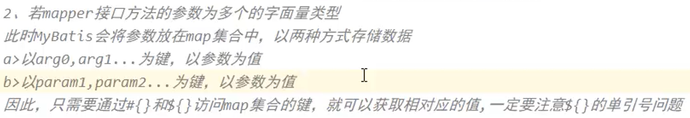

在mapper映射文件UserMapper.xml中修改如下
```sql
select * from t_user where username = #{arg0} and password = #{arg1}
```
或者
```sql
select * from t_user where username = #{param1} and password = #{param2}
```
都可以，即要以mybatis设置的键进行访问

运行测试类的这个方法，成功
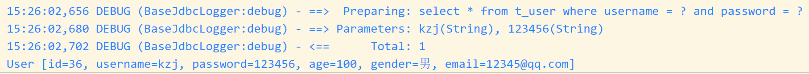

### 3. map集合类型的参数（推荐使用@Param标识参数）

多个字面量类型的参数中使用的是mybatis自动把多个参数放置在一起的map集合，要以mybatis设置的键进行访问，现在自己手动把这些参数数据放到一个map里面，就可以按自己设置的键进行访问

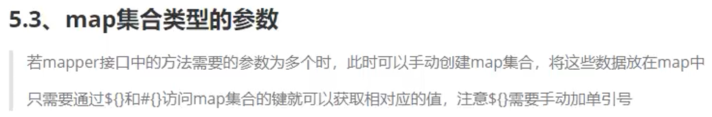
与使用@Param标识参数相比，缺点是**自己手动创建map集合**

在mapper接口文件UserMapper.java中新增如下
```java
User checkLoginByMap(Map<String, Object> map);
```

在测试类ParameterTest.java中新增如下
```java
    @Test
    public void testCheckLoginByMap(){
        SqlSession sqlSession = SqlSessionUtil.getSqlSession();
        UserMapper mapper = sqlSession.getMapper(UserMapper.class);
        Map<String, Object> map = new HashMap<>();
        map.put("username", "kzj");
        map.put("password", "123456");
        User user = mapper.checkLoginByMap(map);
        System.out.println(user);
    }
```
在这里自己创建map集合，并指定键名

在mapper映射文件UserMapper.xml中新增如下
```xml
    <!-- User checkLoginByMap(Map<String, Object> map); -->
    <select id="checkLoginByMap" resultType="User">
        select * from t_user where username = #{username} and password = #{password}
    </select>
```
在这里可以使用前面自己指定的键名

运行测试类的这个方法，成功
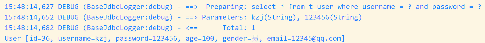

### 4. 实体类类型的参数

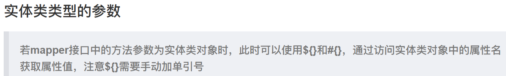
注意这里的**属性名**，和成员变量没有关系，**只和当前的get和set方法有关系**，把方法名中的get和set去掉，剩余部分的首字母变成小写，结果就是当前的属性名

添加用户信息的功能

在mapper接口文件UserMapper.java中新增如下
```java
void insertUser(User user);
```

在mapper映射文件UserMapper.xml中新增如下
```xml
    <!-- void insertUser(User user); -->
    <insert id="insertUser">
        insert into t_user values(null,#{username},#{password},#{age},#{gender},#{email})
    </insert>
```
通过实体类的属性名获取属性值

在测试类ParameterTest.java中新增如下
```java
    @Test
    public void testInsertUser(){
        SqlSession sqlSession = SqlSessionUtil.getSqlSession();
        UserMapper mapper = sqlSession.getMapper(UserMapper.class);
        User user = new User(null, "root", "123456", 33, "女", "ll@qq.com");
        mapper.insertUser(user);
    }
```
在这里自己创建User对象

运行测试类的这个方法，成功
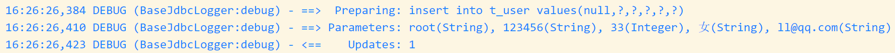

### 5. 使用@Param标识参数（更方便）

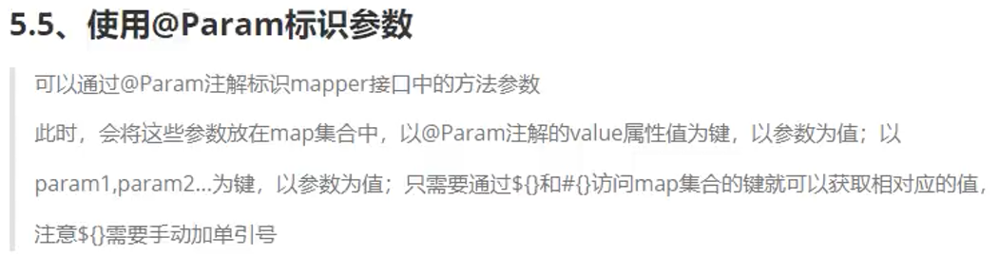

在mapper接口文件UserMapper.java中新增如下
```java
User checkLoginByParam(@Param("username") String username, @Param("password") String password);
```
是多个字面量类型的参数处理方法的升级版
mybatis仍然会自动把参数放到map集合里面，但此时按```@Param注解的value属性值```设置为键

在mapper映射文件UserMapper.xml中新增如下
```xml
    <!-- User checkLoginByParam(@Param("username") String username, @Param("password") String password); -->
    <select id="checkLoginByParam" resultType="User">
        select * from t_user where username = #{username} and password = #{password}
    </select>
```

在测试类ParameterTest.java中新增如下
```java
    @Test
    public void testCheckLoginByParam(){
        SqlSession sqlSession = SqlSessionUtil.getSqlSession();
        UserMapper mapper = sqlSession.getMapper(UserMapper.class);
        User user = mapper.checkLoginByParam("kzj", "123456");
        System.out.println(user);
    }
```

运行测试类的这个方法，成功
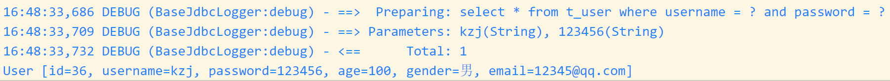

总结，以上五种情况，实际上只要记两种：
1. 实体类类型的参数（直接通过实体类属性获取值就可）
2. 使用@Param标识参数（包括了情况1,2,3,5这些情况下建议都用注解）

# Mybatis的各种查询结果

## 查询一个实体类对象

如果返回值只能存放一条信息，底层调用的是selectOne方法。如果返回多条，就会报错

```java
    /**
     * 若sql语句查询的结果为多条时，一定不能以实体类类型作为方法的返回值
     * 否则会抛出异常TooManyResultsException，因为底层调用sqlSession.selectOne方法
     *
     */
    //根据id查询用户信息
    User getUserById(@Param("id") Integer id);
```

```xml
    <!--    User getUserById(@Param("id") Integer id);-->
    <select id="getUserById" resultType="User">
        select * from t_user where id = #{id}
    </select>
```

## 查询一个集合

```java
    //查询所有的用户信息
    List<User> getAllUser();
```

在xml文件中返回值类型选择List对应的泛型即可
```xml
    <!--    List<User> getAllUser();-->
    <select id="getAllUser" resultType="User">
        select * from t_user
    </select>
```

## 查询为单个数据

```java
    //查询用户的总数量
    Integer getCount();
```

```xml
    <!--    Integer getCount();-->
    <!--    这里可以直接使用Integer或int，且不区分大小写，不用写全类名
        MyBatis中为java中常用的类型设置了类型别名
        Integer：integer,int
        int: _int
        Map: map
        String: string
    -->
    <select id="getCount" resultType="Integer">
        select count(*) from t_user
    </select>
```

##  查询一条数据为map集合

如果查询出来的结果不能对应一个实体类，就用map集合

```java
    //根据id查询用户信息为map集合
    Map<String,Object> getUserByIdToMap(@Param("id") Integer id);
```

```xml
    <!--    Map<String,Object> getUserByIdToMap(@Param("id") Integer id);-->
    <select id="getUserByIdToMap" resultType="map">
        select * from t_user where id = #{id}
    </select>
```

查询得到的map集合为
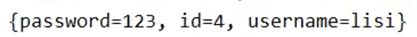
与查询得到一个实体类的区别：
实体类中的属性是固定的，但map集合中没有固定的键

## 查询多条数据为map集合

### List封装多条map

将mapper接口方法的返回值设置为泛型是map的list集合
```java
    //查询所有的用户信息为map集合，这里需要使用list集合去存储map
    List<Map<String,Object>> getAllUserToMapList();
```

在xml文件中返回值类型选择List对应的泛型即可
```xml
    <!--    List<Map<String,Object>> getAllUserToMapList();-->
    <select id="getAllUserToMapList" resultType="map">
        select * from t_user
    </select>
```

查询的结果为
```java
[
{password=123456, gender=男, id=1, age=23, email=123@qq.com, username=admin1},
{password=123456, gender=男, id=2, age=23, email=123@qq.com, username=admin},
{password=123456, gender=男, id=4, age=23, email=123@qq.com, username=admin},
{password=123, gender=女, id=5, age=33, email=3232@163.com, username=xiaoming},
{password=123, gender=女, id=7, age=33, email=3232@163.com, username=xiaoming},
{password=123, id=8, username=jack},
{id=9}
]
```

### 大的map封装多条map

将每条数据转换的map集合放在一个大的map集合中，但是必须通过@MapKey注解，将查询的某个字段的值作为大的map的键
```java
    //将查询出来的值放到map中，再把这些map放到一个大的map中，这个大的map的键通过注解指定为id
    @MapKey("id")
    Map<String,Object> getAllUserToMap();
```

在xml文件中返回值类型为map
```xml
    <!--@MapKey("id")-->
    <!--Map<String,Object> getAllUserToMap();-->
    <select id="getAllUserToMap" resultType="map">
        select * from t_user
    </select>
```

查询的结果为
```java
{
1={password=123456, gender=男, id=1, age=23, email=123@qq.com, username=admin1},
2={password=123456, gender=男, id=2, age=23, email=123@qq.com, username=admin},
4={password=123456, gender=男, id=4, age=23, email=123@qq.com, username=admin},
5={password=123, gender=女, id=5, age=33, email=3232@163.com, username=xiaoming},
7={password=123, gender=女, id=7, age=33, email=3232@163.com, username=xiaoming},
8={password=123, id=8, username=jack},
9={id=9}
}
```

# 特殊sql的执行

## Mybatis处理模糊查询

```java
    //模糊查询用户名
    List<User> getUserByLike(@Param("keyword") String keyword);
```

```xml
    <!--List<User> getUserByLike(@Param("keyword") String keyword);-->

    <!--在单引号中占位符会被解析为字符串-->
    <!--select * from t_user where username like '%${keyword}%'-->
    <!--select * from t_user where username like concat('%',#{keyword},'%')-->
    <select id="getUserByLike" resultType="User">
        select * from t_user where username like "%"#{keyword}"%"
    </select>
```

## Mybatis处理批量删除

```java
    //批量删除
    void deleteMoreUser(@Param("ids") String ids);
```

```xml
    <!--void deleteMoreUser(@Param("ids") String ids);-->
    <!--这里只能使用${}，因为使用#{}会自动加上一个单引号出现错误。
        所以使用${}不会自动加上单引号，不使用占位符赋值-->
    <delete id="deleteMoreUser">
        delete from t_user where id in(${ids})
    </delete>
```

## Mybatis动态设置表名

```java
    //动态设置表名，查询用户信息
    List<User> getUserList(@Param("tableName") String tableName);
```

```xml
    <!--List<User> getUserList(@Param("tableName") String tableName);-->
    <!--同上，这里也不能用#{}，因为表名不能使用单引号-->
    <select id="getUserList" resultType="User">
        select * from ${tableName}
    </select>
```

## 添加功能获取自增的主键

```java
    //添加用户信息并获取主键
    void insertUser(User user);
```

```xml
    <!--void insertUser(User user);-->
    <!--不能把主键值作为返回值是因为增删改的返回值固定为影响行数
        所以把获取的主键放到传入对象User的指定属性keyProperty中

        useGeneratedKeys: 表示添加功能使用了自增的主键
        keyProperty：将添加的数据的自增主键为实体类类型的参数的属性赋值
        -->
    <insert id="insertUser" useGeneratedKeys="true" keyProperty="id">
        insert into t_user values(null,#{username},#{password},#{age},#{gender},#{email})
    </insert>
```


---
到p35
大佬笔记
https://blog.csdn.net/gdxdekx/article/details/125950227


