# Spring

## Spring概述

> Spring 是最受欢迎的企业级 Java 应用程序开发框架，数以百万的来自世界各地的开发人员使用 Spring 框架来创建性能好、易于测试、可重用的代码。
> Spring 框架是一个开源的 Java 平台，它最初是由 Rod Johnson 编写的，并且于 2003 年 6 月首次在 Apache 2.0 许可下发布。
> Spring 是轻量级的框架，其基础版本只有 2 MB 左右的大小。
> Spring 框架的核心特性是可以用于开发任何 Java 应用程序，但是在 Java EE 平台上构建 web 应用程序是需要扩展的。 Spring 框架的目标是使 J2EE 开发变得更容易使用，通过启用基于 POJO 编程模型来促进良好的编程实践。

## Spring Framework

Spring 基础框架，可以视为 Spring 基础设施，基本上任何其他 Spring 项目都是以 Spring Framework为基础的。

### 五大功能模块

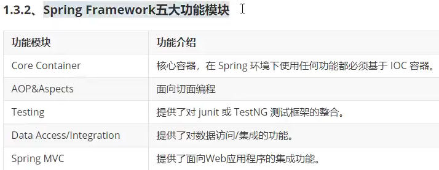

### 特性

- **非侵入式**：使用 Spring Framework 开发应用程序时，Spring 对应用程序本身的结构影响非常小。对领域模型可以做到零污染；对功能性组件也只需要使用几个简单的注解进行标记，完全不会破坏原有结构，反而能将组件结构进一步简化。这就使得基于 Spring Framework 开发应用程序时结构清晰、简洁优雅。
- **控制反转**：IOC——Inversion of Control，翻转资源获取方向。把自己创建资源、向环境索取资源变成环境将资源准备好，我们享受资源注入。
- **面向切面编程**：AOP——Aspect Oriented Programming，在不修改源代码的基础上增强代码功
能。
- **容器**：Spring IOC 是一个容器，因为它包含并且管理组件对象的生命周期。组件享受到了容器化的管理，替程序员屏蔽了组件创建过程中的大量细节，极大的降低了使用门槛，大幅度提高了开发效率。
- **组件化**：Spring 实现了使用简单的组件配置组合成一个复杂的应用。在 Spring 中可以使用 XML 和 Java 注解组合这些对象。这使得我们可以基于一个个功能明确、边界清晰的组件有条不紊的搭建超大型复杂应用系统。
- **声明式**：很多以前需要编写代码才能实现的功能，现在只需要声明需求即可由框架代为实现。
- **一站式**：在 IOC 和 AOP 的基础上可以整合各种企业应用的开源框架和优秀的第三方类库。而且 Spring 旗下的项目已经覆盖了广泛领域，很多方面的功能性需求可以在 Spring Framework 的基础上全部使用 Spring 来实现。

# IOC

IOC：Inversion of Control，**控制反转**。

## IOC容器

IOC容器就是放置已经创建好的实例的一个地方。这样实例不需要程序员来手动创建，而是交给容器管理，更加高效。

### IOC容器思想

#### 获取资源的传统方式

自己做饭：买菜、洗菜、择菜、改刀、炒菜，全过程参与，费时费力，必须清楚了解资源创建整个过程中的全部细节且熟练掌握。
在应用程序中的组件需要获取资源时，传统的方式是组件主动的从容器中获取所需要的资源，在这样的模式下开发人员往往需要知道在具体容器中特定资源的获取方式，增加了学习成本，同时降低了开发效率。

#### 反转控制方式获取资源

点外卖：下单、等、吃，省时省力，不必关心资源创建过程的所有细节。
反转控制的思想完全颠覆了应用程序组件获取资源的传统方式：反转了资源的获取方向——改由容器主动的将资源推送给需要的组件，开发人员不需要知道容器是如何创建资源对象的，只需要提供接收资源的方式即可，极大的降低了学习成本，提高了开发的效率。这种行为也称为查找的被动形式。

#### DI

DI：Dependency Injection，**依赖注入**。
DI 是 IOC 的另一种表述方式：即组件以一些预先定义好的方式（例如：setter 方法）接受来自于容器的资源注入。相对于IOC而言，这种表述更直接。
所以结论是：IOC 就是一种反转控制的思想， 而 DI 是对 IOC 的一种具体实现。

### IOC容器在Spring中的实现

Spring 的 IOC 容器就是 IOC 思想的一个落地的产品实现。IOC 容器中管理的组件也叫做 bean。在创建bean 之前，首先需要创建 IOC 容器。Spring 提供了 IOC 容器的两种实现方式：

#### BeanFactory

使用的是设计模式中的工厂模式，隐藏创建对象的过程，直接提供所需要的对象。
这是 IOC 容器的基本实现，是 Spring 内部使用的接口。面向 Spring 本身，不提供给开发人员使用。

#### ApplicationContext

BeanFactory 的子接口，提供了更多高级特性。面向 Spring 的使用者，几乎所有场合都使用
ApplicationContext 而不是底层的 BeanFactory。

##### ApplicationContext的主要实现类

前期准备：
用maven创建一个java项目
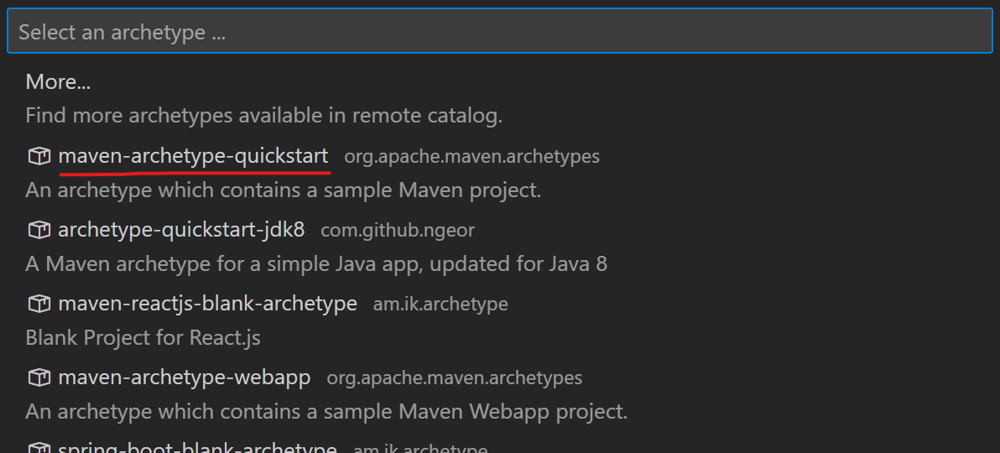
引入以下maven依赖
```xml
<dependencies>
    <!-- 基于Maven依赖传递性，导入spring-context依赖即可导入当前所需所有jar包 -->
    <dependency>
        <groupId>org.springframework</groupId>
        <artifactId>spring-context</artifactId>
        <version>5.3.1</version>
    </dependency>
    <!-- junit测试 -->
    <dependency>
        <groupId>junit</groupId>
        <artifactId>junit</artifactId>
        <version>4.12</version>
        <scope>test</scope>
    </dependency>
</dependencies>
```

以下功能好像VSCode中没有：
> 在IDEA中，按两下```Shift```键，使用全局搜索功能
> 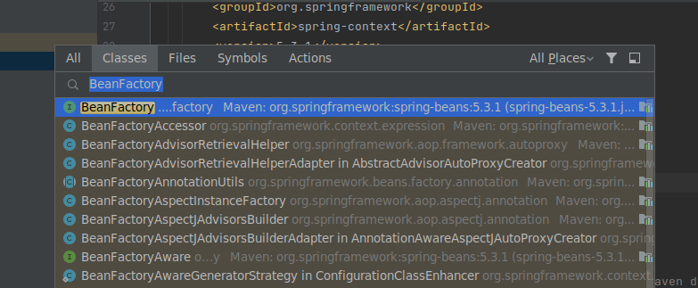
> 进入BeanFactory类所在的文件
> 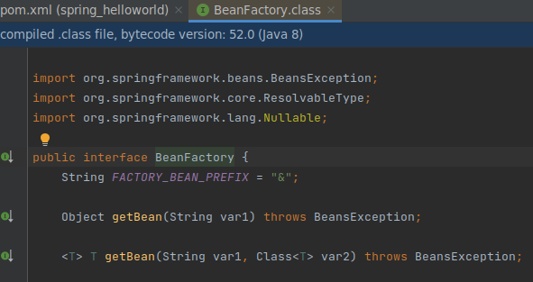
> 光标停止在类上，按```Ctrl```+```H```，打开查看类层级hierarchy界面
> 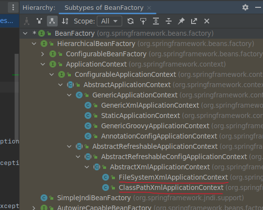

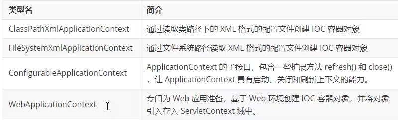

## 基于XML管理bean

简单的例子：
创建HelloWorld.java（在```java/com/kzj/spring/pojo/```目录下）如下
```java
package com.kzj.spring.pojo;

public class HelloWorld {
    public void sayHello(){
        System.out.println("Hello, Spring!");
    }
}
```

创建spring的配置文件applicationContext.xml的模板为
```xml
<?xml version="1.0" encoding="UTF-8"?>
<beans xmlns="http://www.springframework.org/schema/beans"
xmlns:xsi="http://www.w3.org/2001/XMLSchema-instance"
xmlns:aop="http://www.springframework.org/schema/aop"
xmlns:tx="http://www.springframework.org/schema/tx"
xmlns:context="http://www.springframework.org/schema/context"
xsi:schemaLocation="
       http://www.springframework.org/schema/beans
       http://www.springframework.org/schema/beans/spring-beans-3.0.xsd
       http://www.springframework.org/schema/tx
       http://www.springframework.org/schema/tx/spring-tx-3.0.xsd
       http://www.springframework.org/schema/context
       http://www.springframework.org/schema/context/spring-context-3.0.xsd
       http://www.springframework.org/schema/aop
       http://www.springframework.org/schema/aop/spring-aop-3.0.xsd">
</beans>
```

配置文件applicationContext.xml中在```<beans></beans>```标签内部新增的内容如下
```xml
    <!-- 
        bean: 配置一个bean对象，将对象交给IOC容器管理
        属性：
            id: bean的唯一标识，不能重复
            class: 设置bean对象所对应的类型
    -->
    <bean id="helloworld" class="com.kzj.spring.pojo.HelloWorld"></bean>
```

已经把HelloWorld对象交给IOC容器管理，现在验证以下获取HelloWorld对象的过程

创建测试类HelloWorldTest.java（在```test/java/com/kzj/spring/test/```目录下）如下
```java
package com.kzj.spring.test;
import org.junit.Test;
import org.springframework.context.ApplicationContext;
import org.springframework.context.support.ClassPathXmlApplicationContext;
import com.kzj.spring.pojo.HelloWorld;

public class HelloWorldTest {
    @Test
    public void test(){
        // 获取IOC容器
        ApplicationContext ioc = new ClassPathXmlApplicationContext("applicationContext.xml");
        // 获取IOC容器中的bean
        HelloWorld helloworld = (HelloWorld)ioc.getBean("helloworld");
        helloworld.sayHello();
    }
}
```

运行测试类的这个方法，成功
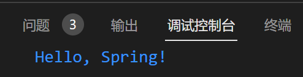

### 获取bean的三种方式

前期准备：
创建Student.java（在```java/com/kzj/spring/pojo/```目录下）如下
```java
package com.kzj.spring.pojo;

public class Student {
    private Integer sid;
    private String sname;
    private Integer age;
    private String gender;
    
    public Student(Integer sid, String sname, Integer age, String gender) {
        this.sid = sid;
        this.sname = sname;
        this.age = age;
        this.gender = gender;
    }

    public Student() {
    }

    @Override
    public String toString() {
        return "Student [sid=" + sid + ", sname=" + sname + ", age=" + age + ", gender=" + gender + "]";
    }

    public Integer getSid() {
        return sid;
    }

    public void setSid(Integer sid) {
        this.sid = sid;
    }

    public String getSname() {
        return sname;
    }

    public void setSname(String sname) {
        this.sname = sname;
    }

    public Integer getAge() {
        return age;
    }

    public void setAge(Integer age) {
        this.age = age;
    }

    public String getGender() {
        return gender;
    }

    public void setGender(String gender) {
        this.gender = gender;
    }
}
```
这里的方法都是用VSCode中的**源代码操作**功能自动生成的
注意：在IOC容器中通过**工厂模式**和**反射技术**创建对象，所以需要**对象的无参构造器**

配置文件applicationContext.xml中在```<beans></beans>```标签内部新增的内容如下
```xml
    <bean id="studentOne" class="com.kzj.spring.pojo.Student"></bean>
    <bean id="studentTwo" class="com.kzj.spring.pojo.Student"></bean>
```

创建测试类StudentTest.java（在```test/java/com/kzj/spring/test/```目录下）如下
```java
package com.kzj.spring.test;
import org.junit.Test;
import org.springframework.context.ApplicationContext;
import org.springframework.context.support.ClassPathXmlApplicationContext;

public class StudentTest {
    @Test
    public void test(){
        // 获取IOC容器
        ApplicationContext ioc = new ClassPathXmlApplicationContext("applicationContext.xml");
        // 获取IOC容器中的bean
        // 待完成
    }
}
```

#### 1. 通过 bean的id 获取bean

在测试类StudentTest.java的```// 待完成```处添加如下
```java
    Student studentOne = (Student)ioc.getBean("studentOne");
    System.out.println(studentOne);
```

运行后，控制台输出结果为
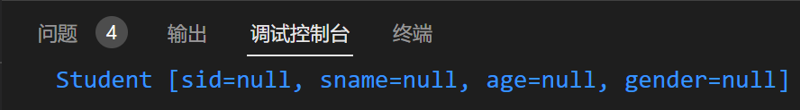

#### 2. 通过 bean的类型（类的Class对象） 获取bean

注意：要求ioc容器中有且仅有一个与之匹配的bean
- 若没有任何一个类型匹配的bean，抛出NoSuchBeanDefinitionException
- 若有多个类型匹配的bean，抛出NoUniqueBeanDefinitionException

在测试类StudentTest.java的```// 待完成```处添加如下
```java
    Student student = ioc.getBean(Student.class);
    System.out.println(student);
```

运行会报错，符合预期


#### 3. 通过 bean的类型 和 bean的id 获取bean

在测试类StudentTest.java的```// 待完成```处添加如下
```java
    Student studentOne = ioc.getBean("studentOne",Student.class);
    System.out.println(studentOne);
```

运行后，控制台输出结果为


#### 获取bean的三种方式总结

以后```2. 通过 bean的类型（类的Class对象） 获取bean```使用的最多

因为配置文件applicationContext.xml中在```<beans></beans>```标签中的**同一个类型的bean没有必要设置两个**，上面只是为了演示获取bean的三种方式

想要从一个类型获取多个实例对象，这样是不必要的：
```xml
    <bean id="studentOne" class="com.kzj.spring.pojo.Student"></bean>
    <bean id="studentTwo" class="com.kzj.spring.pojo.Student"></bean>
```

配置文件applicationContext.xml中在```<beans></beans>```标签中的**同一个类型的bean只要配置一个**

这里的bean默认是**单例模式**（```singleton```），我们通过设置bean的```scope```属性，可以改成**多例模式**（```prototype```）

如果想要从一个类型获取多个实例对象，只要改成：
```xml
    <bean id="student" class="com.kzj.spring.pojo.Student" scope="prototype"></bean>
```

在测试类StudentTest.java的```// 待完成```处添加如下
```java
    Student studentOne = ioc.getBean(Student.class);
    studentOne.setSid(1);
    Student studentTwo = ioc.getBean(Student.class);
    studentTwo.setSid(2);
    System.out.println(studentOne);
    System.out.println(studentTwo);
```

运行后，控制台输出结果为
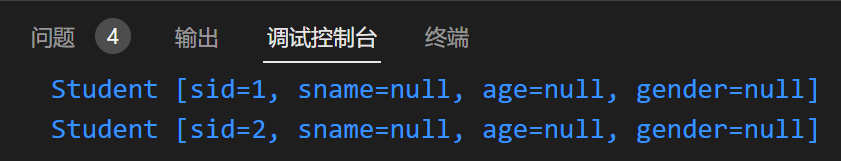

#### 通过 接口类型 获取bean（```2. 通过 bean的类型 获取bean```的扩展）

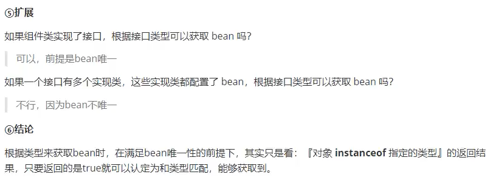

配置文件applicationContext.xml中在```<beans></beans>```标签内部的配置不变，如下
```xml
    <bean id="student" class="com.kzj.spring.pojo.Student" scope="prototype"></bean>
```

创建接口类Person.java（在```java/com/kzj/spring/pojo/```目录下）

让Student类实现Person接口
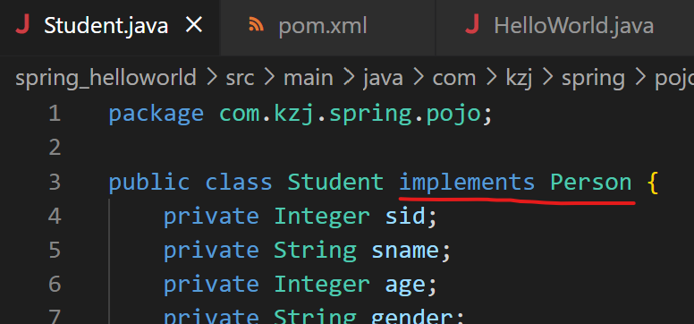

在测试类StudentTest.java的```// 待完成```处添加如下
```java
    Person person = ioc.getBean(Person.class);
    System.out.println(person);
```

运行不会报错，控制台输出结果为
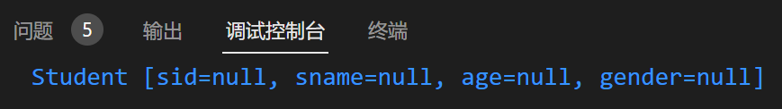

> 总结：在IOC容器中配置bean后，可以通过：
> 1. **bean的类型**
> 2. **bean所继承的父类的类型**
> 3. **bean所实现的接口的类型**
> 
> 来获取它

### 依赖注入（DI）（IOC的具体实现）

依赖注入就是**为当前类中的属性进行赋值的过程**
被动接受IOC容器资源的注入

#### setter注入

一个个地调用set方法为属性赋值

在```<bean></bean>```标签内部使用```<property>```标签，通过成员变量的set方法进行赋值

配置文件applicationContext.xml中在```<beans></beans>```标签内部的内容如下
```xml
    <bean id="student" class="com.kzj.spring.pojo.Student" scope="prototype">
        <!--
            property：通过成员变量的set方法进行赋值
            name：设置需要赋值的属性名（和set方法有关，set方法名，去掉set之后首字母小写）
            value：设置属性的值
        -->
        <property name="sid" value="1001"/>
        <property name="sname" value="张三"/>
        <property name="age" value="23"/>
        <property name="gender" value="男"/>
    </bean>
```

在测试类StudentTest.java的```// 待完成```处添加如下
```java
    Student student = ioc.getBean(Student.class);
    System.out.println(student);
```

运行后，控制台输出结果为
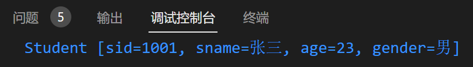

#### 构造器注入

必须能找到匹配的构造器

在```<bean></bean>```标签内部使用```<constructor-arg>```标签，通过成员变量的set方法进行赋值

配置文件applicationContext.xml中在```<beans></beans>```标签内部的内容如下
```xml
    <bean id="student" class="com.kzj.spring.pojo.Student" scope="prototype">
        <constructor-arg value="1002"/>
        <constructor-arg value="李四"/>
        <constructor-arg value="女"/>
        <constructor-arg value="24" name="age"/>
    </bean>
```

在测试类StudentTest.java的```// 待完成```处添加如下
```java
    Student student = ioc.getBean(Student.class);
    System.out.println(student);
```

运行后，控制台输出结果为
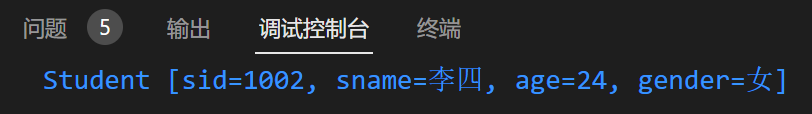

#### 特殊值处理

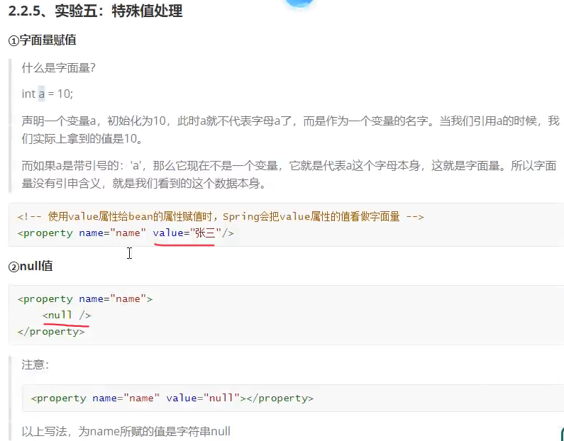

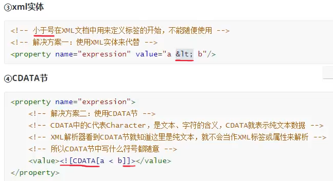

#### 类类型的属性赋值

前期准备：
创建Clazz.java（在```java/com/kzj/spring/pojo/```目录下）如下
```java
package com.kzj.spring.pojo;

public class Clazz {
    private Integer cid;
    private String cname;
    public Integer getCid() {
        return cid;
    }
    public void setCid(Integer cid) {
        this.cid = cid;
    }
    public String getCname() {
        return cname;
    }
    public void setCname(String cname) {
        this.cname = cname;
    }
    public Clazz(Integer cid, String cname) {
        this.cid = cid;
        this.cname = cname;
    }
    public Clazz() {
    }
    @Override
    public String toString() {
        return "Clazz [cid=" + cid + ", cname=" + cname + "]";
    }
}
```

在Student.java（在```java/com/kzj/spring/pojo/```目录下）新增clazz属性如下
```java
    private Clazz clazz;
```
同时增加这个属性的set和get方法，并加入到toString方法中

Clazz类型的属性应该如何赋值，不能用value属性（专门给字面量属性赋值），Clazz类型的属性应该赋值一个对象

有三种方式：

##### 1. ref

ref引用IOC容器中的某个bean的id

配置文件applicationContext.xml中在```<beans></beans>```标签内部的内容如下
```xml
    <bean id="clazz" class="com.kzj.spring.pojo.Clazz">
        <property name="cid" value="1111"></property>
        <property name="cname" value="最强王者班"></property>
    </bean>

    <bean id="student" class="com.kzj.spring.pojo.Student" scope="prototype">
        <property name="sid" value="1004"/>
        <property name="sname" value="赵六"/>
        <property name="age" value="26"/>
        <property name="gender" value="男"/>
        <!--ref引用IOC容器中的某个bean的id-->
        <property name="clazz" ref="clazz"></property>
    </bean>
```

在测试类StudentTest.java的```// 待完成```处添加如下
```java
    Student student = ioc.getBean(Student.class);
    System.out.println(student);
```

运行后，控制台输出结果为


##### 2. 级联

级联的方式，要保证提前为clazz属性赋值或者实例化。所以一般不用

配置文件applicationContext.xml中在```<beans></beans>```标签内部的内容如下
```xml
    <bean id="clazz" class="com.kzj.spring.pojo.Clazz"></bean>

    <bean id="student" class="com.kzj.spring.pojo.Student" scope="prototype">
        <property name="sid" value="1004"/>
        <property name="sname" value="赵六"/>
        <property name="age" value="26"/>
        <property name="gender" value="男"/>
        <!-- 级联的方式，要保证提前为clazz属性赋值或者实例化。所以一般不用 -->
        <property name="clazz" ref="clazz"></property>
        <property name="clazz.cid" value="2222"></property>
        <property name="clazz.cname" value="远大前程班"></property>
    </bean>
```

在测试类StudentTest.java的```// 待完成```处添加如下
```java
    Student student = ioc.getBean(Student.class);
    System.out.println(student);
```

运行后，控制台输出结果为


##### 3. 内部bean

在属性中设置一个bean。内部bean不能通过ioc容器获取，相当于内部类，只能在当前id为student的bean内使用

配置文件applicationContext.xml中在```<beans></beans>```标签内部的内容如下
```xml
    <bean id="student" class="com.kzj.spring.pojo.Student" scope="prototype">
        <property name="sid" value="1004"/>
        <property name="sname" value="赵六"/>
        <property name="age" value="26"/>
        <property name="gender" value="男"/>
        <property name="clazz">
            <!-- 内部bean，不能通过ioc容器获取，相当于内部类，只能在当前id为student的bean内使用 -->
            <bean id="clazzInner" class="com.kzj.spring.pojo.Clazz">
                <property name="cid" value="3333"></property>
                <property name="cname" value="内部密训班"></property>
            </bean>
        </property>
    </bean>
```

在测试类StudentTest.java的```// 待完成```处添加如下
```java
    Student student = ioc.getBean(Student.class);
    System.out.println(student);
```

运行后，控制台输出结果为


#### 数组类型的属性赋值

##### 1. 字符串类型的数组

在属性中使用```<array>```标签，标签中数组元素的值写在```<value>```中

前期准备：
在Student.java（在```java/com/kzj/spring/pojo/```目录下）新增hobbies属性如下
```java
    private String[] hobbies;
```
同时增加这个属性的set和get方法，并加入到toString方法中

配置文件applicationContext.xml中在```<beans></beans>```标签内部的内容如下
```xml
    <bean id="student" class="com.kzj.spring.pojo.Student" scope="prototype">
        <property name="sid" value="1005"/>
        <!-- 数组属性 -->
        <property name="hobbies">
            <array>
                <value>唱</value>
                <value>跳</value>
                <value>rap</value>
                <value>篮球</value>
            </array>
        </property>
    </bean>
```

在测试类StudentTest.java的```// 待完成```处添加如下
```java
    Student student = ioc.getBean(Student.class);
    System.out.println(student);
```

运行后，控制台输出结果为


##### 2. 类类型的数组

在属性中使用```<array>```标签，标签中数组元素的引用写在```<ref>```中

前期准备：
在Student.java（在```java/com/kzj/spring/pojo/```目录下）新增clazzes属性如下
```java
    private Clazz[] clazzes;
```
同时增加这个属性的set和get方法，并加入到toString方法中

配置文件applicationContext.xml中在```<beans></beans>```标签内部的内容如下
```xml
    <bean id="clazzMaths" class="com.kzj.spring.pojo.Clazz">
        <property name="cid" value="001"></property>
        <property name="cname" value="数学班"></property>
    </bean>

    <bean id="clazzEnglish" class="com.kzj.spring.pojo.Clazz">
        <property name="cid" value="002"></property>
        <property name="cname" value="英语班"></property>
    </bean>

    <bean id="student" class="com.kzj.spring.pojo.Student" scope="prototype">
        <property name="sid" value="1006"/>
        <!-- 数组属性 -->
        <property name="clazzes">
            <array>
                <ref bean="clazzMaths"/>
                <ref bean="clazzEnglish"/>
            </array>
        </property>
    </bean>
```

在测试类StudentTest.java的```// 待完成```处添加如下
```java
    Student student = ioc.getBean(Student.class);
    System.out.println(student);
```

运行后，控制台输出结果为


#### list集合类型的属性赋值

[Java中Array、List、ArrayList的区别](https://blog.csdn.net/wiidi/article/details/82662965)

前期准备：
在Clazz.java（在```java/com/kzj/spring/pojo/```目录下）新增students属性如下
```java
    private List<Student> students;
```
同时增加这个属性的set和get方法，并加入到toString方法中

##### 1. 在属性中使用```<list>```标签

在属性中使用```<list>```标签，标签中list元素的引用写在```<ref>```中

配置文件applicationContext.xml中在```<beans></beans>```标签内部的内容如下
```xml
    <bean id="studentOne" class="com.kzj.spring.pojo.Student">
        <property name="sid" value="1006"/>
    </bean>

    <bean id="studentTwo" class="com.kzj.spring.pojo.Student">
        <property name="sid" value="1007"/>
    </bean>

    <bean id="studentThree" class="com.kzj.spring.pojo.Student">
        <property name="sid" value="1008"/>
    </bean>

    <bean id="clazz" class="com.kzj.spring.pojo.Clazz">
        <property name="cid" value="4444"></property>
        <property name="cname" value="包含若干学生的班"></property>
        <property name="students">
            <list>
                <ref bean="studentOne"></ref>
                <ref bean="studentTwo"></ref>
                <ref bean="studentThree"></ref>
            </list>
        </property>
    </bean>
```

在测试类StudentTest.java的```// 待完成```处添加如下
```java
    Clazz clazz = ioc.getBean(Clazz.class);
    System.out.println(clazz);
```

运行后，控制台输出结果为
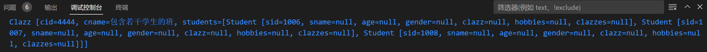

##### 2. 再写一个集合类型的bean```<util:list>```

配置一个集合类型的bean，需要使用util的约束
在属性中使用```ref```属性引用外部的集合类型的bean

配置文件applicationContext.xml中在```<beans>```标签中增加属性如下
```xml
       xmlns:util="http://www.springframework.org/schema/util"
       xsi:schemaLocation="
       <!-- 省略之前就有的 -->
       <!-- 在最后添加这两行 -->
       http://www.springframework.org/schema/util 
       https://www.springframework.org/schema/util/spring-util-3.1.xsd"
```
用来引入util的约束（注意命名空间需要写**三处**）
注意，这里用IDEA的```Alt```+```Enter```导入的是不对的，暂时手动导入util的约束

配置文件applicationContext.xml中新增如下图所示
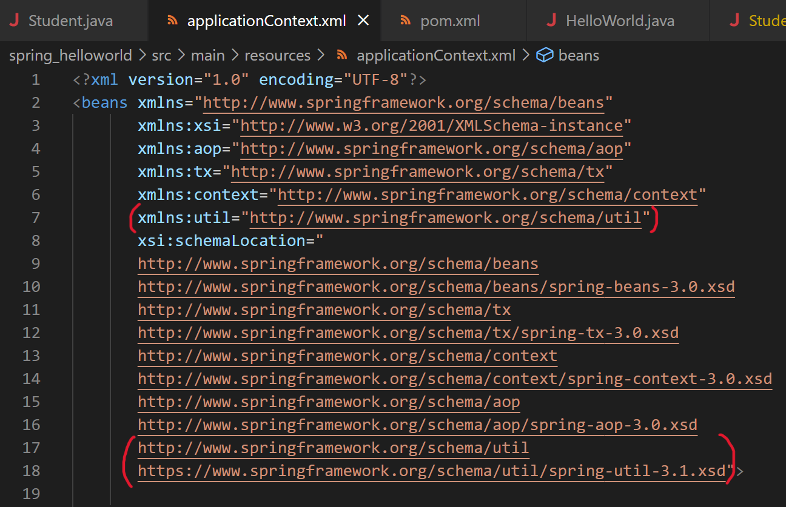

如果出现下图的报错
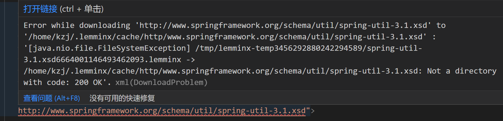
将```http```改为```https```报错提示消失


配置文件applicationContext.xml中在```<beans></beans>```标签内部的内容如下
```xml
    <bean id="studentOne" class="com.kzj.spring.pojo.Student">
        <property name="sid" value="1006"/>
    </bean>

    <bean id="studentTwo" class="com.kzj.spring.pojo.Student">
        <property name="sid" value="1007"/>
    </bean>

    <bean id="studentThree" class="com.kzj.spring.pojo.Student">
        <property name="sid" value="1008"/>
    </bean>

    <!--配置一个集合类型的bean，需要使用util的约束-->
    <util:list id="studentList">
        <ref bean="studentOne"></ref>
        <ref bean="studentTwo"></ref>
        <ref bean="studentThree"></ref>
    </util:list>

    <bean id="clazz" class="com.kzj.spring.pojo.Clazz">
        <property name="cid" value="4444"></property>
        <property name="cname" value="包含若干学生的班"></property>
        <property name="students" ref="studentList"></property>
    </bean>
```

如下这样是不行的，现在最主要的是要往list集合中存储数据，而如下这样写，能做的只是给类中的属性赋值
```xml
    <bean id="studentList" class="Arraylist"></bean>
```

在测试类StudentTest.java的```// 待完成```处添加如下
```java
    Clazz clazz = ioc.getBean(Clazz.class);
    System.out.println(clazz);
```

运行后，控制台输出结果为
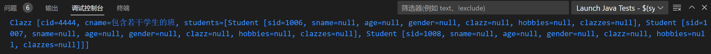

#### map集合类型的属性赋值

方式和```list集合类型的属性赋值```差不多

前期准备：
创建Teacher.java（在```java/com/kzj/spring/pojo/```目录下）如下
```java
package com.kzj.spring.pojo;

public class Teacher {
    private Integer tid;
    private String tname;
    public Teacher() {
    }
    public Teacher(Integer tid, String tname) {
        this.tid = tid;
        this.tname = tname;
    }
    public Integer getTid() {
        return tid;
    }
    public void setTid(Integer tid) {
        this.tid = tid;
    }
    public String getTname() {
        return tname;
    }
    public void setTname(String tname) {
        this.tname = tname;
    }
    @Override
    public String toString() {
        return "Teacher [tid=" + tid + ", tname=" + tname + "]";
    }
}
```

在Student.java（在```java/com/kzj/spring/pojo/```目录下）新增teacherMap属性如下
```java
    private Map<String, Teacher> teacherMap;
```
同时增加这个属性的set和get方法，并加入到toString方法中

##### 1. 在属性中使用```<map>```标签

在属性中使用```<map>```标签，标签中map的键值对中的值的引用写在```<entry>```中

配置文件applicationContext.xml中在```<beans></beans>```标签内部的内容如下
```xml
    <bean id="teacherOne" class="com.kzj.spring.pojo.Teacher">
        <property name="tid" value="11"></property>
        <property name="tname" value="蔡徐坤"></property>
    </bean>

    <bean id="teacherTwo" class="com.kzj.spring.pojo.Teacher">
        <property name="tid" value="22"></property>
        <property name="tname" value="篮球"></property>
    </bean>

    <bean id="student" class="com.kzj.spring.pojo.Student">
        <property name="sid" value="1009"/>
        <property name="teacherMap">
            <map>
                <entry key="数学老师" value-ref="teacherOne"/>
                <entry key="英语老师" value-ref="teacherTwo"/>
            </map>
        </property>
    </bean>
```

在测试类StudentTest.java的```// 待完成```处添加如下
```java
    Student student = ioc.getBean(Student.class);
    System.out.println(student);
```

运行后，控制台输出结果为
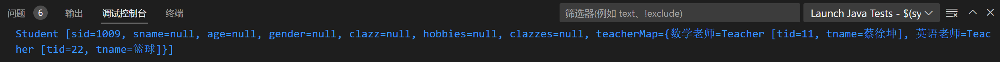

##### 2. 再写一个集合类型的bean```<util:map>```

配置一个集合类型的bean，需要使用util的约束
在属性中使用```ref```属性引用外部的集合类型的bean

配置文件applicationContext.xml中在```<beans></beans>```标签内部的内容如下
```xml
    <bean id="teacherOne" class="com.kzj.spring.pojo.Teacher">
        <property name="tid" value="11"></property>
        <property name="tname" value="蔡徐坤"></property>
    </bean>

    <bean id="teacherTwo" class="com.kzj.spring.pojo.Teacher">
        <property name="tid" value="22"></property>
        <property name="tname" value="篮球"></property>
    </bean>

    <util:map id="teacherMap">
        <entry key="数学老师" value-ref="teacherOne"/>
        <entry key="英语老师" value-ref="teacherTwo"/>
    </util:map>

    <bean id="student" class="com.kzj.spring.pojo.Student">
        <property name="sid" value="1009"/>
        <property name="teacherMap" ref="teacherMap"></property>
    </bean>
```

在测试类StudentTest.java的```// 待完成```处添加如下
```java
    Student student = ioc.getBean(Student.class);
    System.out.println(student);
```

运行后，控制台输出结果为
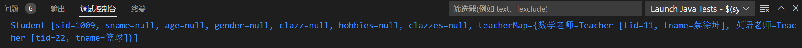

#### p命名空间

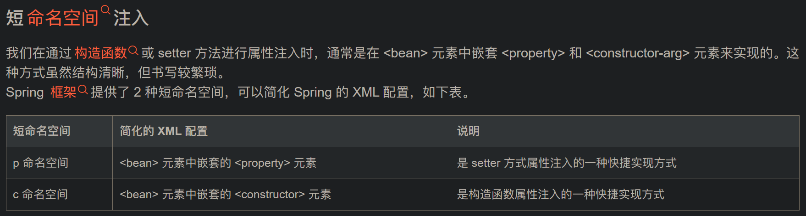
不是用标签来为属性赋值，而是用```<bean>```标签中的属性来为属性赋值

需要引入新的约束，才能使用这种方式
我们需要在配置文件的```<beans>```元素中导入以下 XML 约束
```xml
xmlns:p="http://www.springframework.org/schema/p"
```

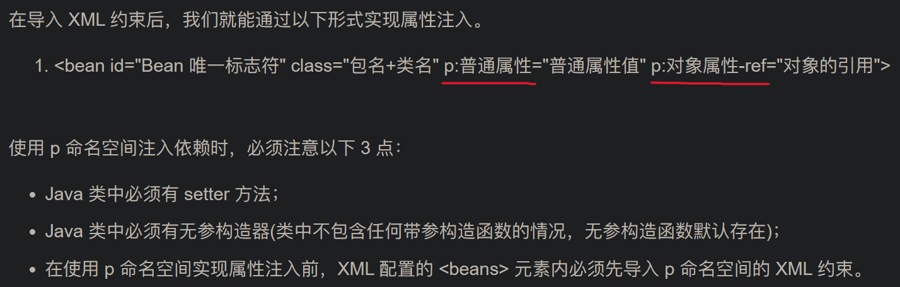

配置文件applicationContext.xml中在```<beans></beans>```标签内部的内容如下
```xml
    <bean id="teacherOne" class="com.kzj.spring.pojo.Teacher"
        p:tid="11" p:tname="蔡徐坤">
    </bean>

    <bean id="teacherTwo" class="com.kzj.spring.pojo.Teacher"
        p:tid="22" p:tname="篮球">
    </bean>

    <util:map id="teacherMap">
        <entry key="数学老师" value-ref="teacherOne"/>
        <entry key="英语老师" value-ref="teacherTwo"/>
    </util:map>

    <bean id="student" class="com.kzj.spring.pojo.Student" 
        p:sid="1010" p:sname="被p命名空间注入的学生" p:teacherMap-ref="teacherMap">
    </bean>
```

在测试类StudentTest.java的```// 待完成```处添加如下
```java
    Student student = ioc.getBean(Student.class);
    System.out.println(student);
```

运行后，控制台输出结果为
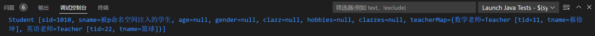

### Spring管理数据源和引入外部属性文件

#### 加入依赖

```xml
<!-- MySQL驱动 -->
<dependency>
    <groupId>mysql</groupId>
    <artifactId>mysql-connector-java</artifactId>
    <version>8.0.16</version>
</dependency>
<!-- 数据源 -->
<dependency>
    <groupId>com.alibaba</groupId>
    <artifactId>druid</artifactId>
    <version>1.0.31</version>
</dependency>
```
放入pom.xml文件中

#### 创建jdbc配置文件

创建jdbc.properties文件（在```resources/```目录下）如下
```properties
jdbc.driver=com.mysql.cj.jdbc.Driver
jdbc.url=jdbc:mysql://localhost:3306/SSM?serverTimezone=UTC
jdbc.username=root
jdbc.password=1
initialSize=5
maxActive=9
```

#### 创建dataSource配置文件

创建spring-datasource.xml文件（在```resources/```目录下）如下
```xml
<?xml version="1.0" encoding="UTF-8"?>
<beans xmlns="http://www.springframework.org/schema/beans"
       xmlns:xsi="http://www.w3.org/2001/XMLSchema-instance"
       xmlns:aop="http://www.springframework.org/schema/aop"
       xmlns:tx="http://www.springframework.org/schema/tx"
       xmlns:context="http://www.springframework.org/schema/context"
       xmlns:util="http://www.springframework.org/schema/util"
       xmlns:p="http://www.springframework.org/schema/p"
       xsi:schemaLocation="
       http://www.springframework.org/schema/beans
       http://www.springframework.org/schema/beans/spring-beans-3.0.xsd
       http://www.springframework.org/schema/tx
       http://www.springframework.org/schema/tx/spring-tx-3.0.xsd
       http://www.springframework.org/schema/context
       http://www.springframework.org/schema/context/spring-context-3.0.xsd
       http://www.springframework.org/schema/aop
       http://www.springframework.org/schema/aop/spring-aop-3.0.xsd
       http://www.springframework.org/schema/util 
       https://www.springframework.org/schema/util/spring-util-3.1.xsd">

    <!--引入jdbc.properties，之后可以通过${key}的方式访问value-->
    <!--这里的context标签，注意上面引入的-->
    <context:property-placeholder location="jdbc.properties"></context:property-placeholder>

    <bean id="datasource" class="com.alibaba.druid.pool.DruidDataSource">
        <property name="driverClassName" value="${jdbc.driver}"/>
        <property name="url" value="${jdbc.url}"/>
        <property name="username" value="${jdbc.username}"/>
        <property name="password" value="${jdbc.password}"/>
        <!--<property name="initialSize" value="${initialSize}"/>-->
        <!--<property name="maxActive" value="${maxActive}"/>-->
    </bean>
</beans>
```

#### 获取数据源

创建测试类DataSourceTest.java（在```test/java/com/kzj/spring/test/```目录下）如下
```java
package com.kzj.spring.test;
import java.sql.SQLException;
import org.junit.Test;
import org.springframework.context.ApplicationContext;
import org.springframework.context.support.ClassPathXmlApplicationContext;
import com.alibaba.druid.pool.DruidDataSource;

public class DataSourceTest {
    @Test
    public void testDataSource() throws SQLException{
        // 获取IOC容器
        ApplicationContext ioc = new ClassPathXmlApplicationContext("applicationContext.xml");
        // 获取IOC容器中的bean
        DruidDataSource dataSource = ioc.getBean(DruidDataSource.class);
        System.out.println(dataSource.getConnection());
    }
}
```

运行测试类的这个方法，报错
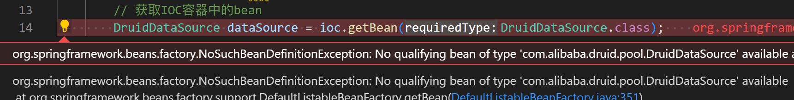

如果把刚才新创建```spring-datasource.xml```文件改名为```applicationContext.xml```，再次运行测试类的这个方法，成功
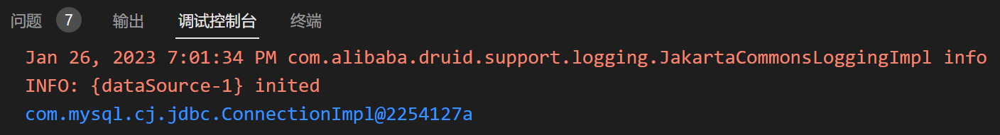

看来它只认```applicationContext.xml```文件中配置的bean

经检查发现，是获取IOC容器时，加载配置文件弄错了，改成
```java
        ApplicationContext ioc = new ClassPathXmlApplicationContext("spring-datasource.xml");
```
运行成功

### bean的作用域

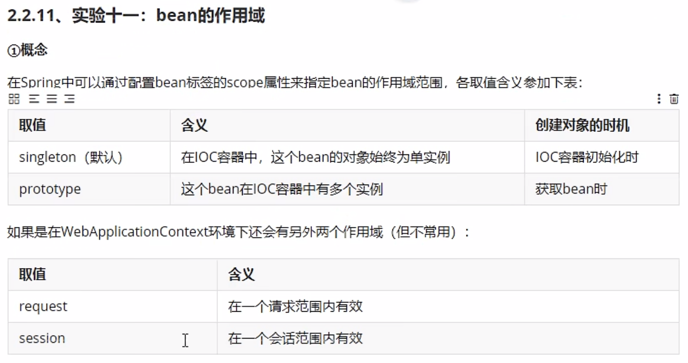

```xml
<!--
    scope默认是单例，可以选择prototype多例
    scope="singleton|prototype"
    singleton:单例，表示获取该bean所对应的对象都是同一个
    prototype:多例，表示获取该bean所对应的对象都不是同一个
-->
<bean id="student" class="com.kzj.spring.pojo.Student" scope="prototype">
    <property name="sid" value="1001"/>
    <property name="sname" value="张三"/>
</bean>
```

### bean的生命周期

> 1. bean对象创建，调用无参构造器
> 2. 实例注入，调用set方法
> 3. bean对象初始化之前的操作（由bean的后置处理器负责）
> 4. bean对象初始化，需要通过bean的```init-method```属性指定初始化方法
> 5. bean对象初始化之后的操作（由bean的后置处理器负责）
> 6. bean对象就绪，可以使用
> 7. bean对象销毁，需要通过bean的```destroy-method```属性指定销毁方法
> 8. IOC容器关闭

简单的例子：
创建User.java（在```java/com/kzj/spring/pojo/```目录下）如下
```java
package com.kzj.spring.pojo;

public class User {
    private Integer id;
    private String username;
    private String password;
    private Integer age;

    public User() {
        System.out.println("生命周期：1、创建对象");
    }

    public User(Integer id, String username, String password, Integer age) {
        this.id = id;
        this.username = username;
        this.password = password;
        this.age = age;
    }

    public Integer getId() {
        return id;
    }

    public void setId(Integer id) {
        System.out.println("生命周期：2、依赖注入");
        this.id = id;
    }

    public String getUsername() {
        return username;
    }

    public void setUsername(String username) {
        this.username = username;
    }

    public String getPassword() {
        return password;
    }

    public void setPassword(String password) {
        this.password = password;
    }

    public Integer getAge() {
        return age;
    }

    public void setAge(Integer age) {
        this.age = age;
    }

    public void initMethod() {
        System.out.println("生命周期：3、初始化");
    }

    public void destroyMethod() {
        System.out.println("生命周期：4、销毁");
    }

    @Override
    public String toString() {
        return "User{" +
                "id=" + id +
                ", username='" + username + '\'' +
                ", password='" + password + '\'' +
                ", age=" + age +
                '}';
    }
}
```

创建配置文件spring-lifecycle.xml（在```resources/```目录下）如下
```xml
<?xml version="1.0" encoding="UTF-8"?>
<beans xmlns="http://www.springframework.org/schema/beans"
       xmlns:xsi="http://www.w3.org/2001/XMLSchema-instance"
       xmlns:aop="http://www.springframework.org/schema/aop"
       xmlns:tx="http://www.springframework.org/schema/tx"
       xmlns:context="http://www.springframework.org/schema/context"
       xmlns:util="http://www.springframework.org/schema/util"
       xmlns:p="http://www.springframework.org/schema/p"
       xsi:schemaLocation="
       http://www.springframework.org/schema/beans
       http://www.springframework.org/schema/beans/spring-beans-3.0.xsd
       http://www.springframework.org/schema/tx
       http://www.springframework.org/schema/tx/spring-tx-3.0.xsd
       http://www.springframework.org/schema/context
       http://www.springframework.org/schema/context/spring-context-3.0.xsd
       http://www.springframework.org/schema/aop
       http://www.springframework.org/schema/aop/spring-aop-3.0.xsd
       http://www.springframework.org/schema/util 
       https://www.springframework.org/schema/util/spring-util-3.1.xsd">

    <bean id="user" class="com.kzj.spring.pojo.User" init-method="initMethod" destroy-method="destroyMethod">
        <property name="id" value="1"></property>
        <property name="username" value="admin"></property>
        <property name="password" value="123"></property>
        <property name="age" value="25"></property>
    </bean>
</beans>
```

创建测试类LifeCycleTest.java（在```test/java/com/kzj/spring/test/```目录下）如下
```java
package com.kzj.spring.test;
import org.junit.Test;
import org.springframework.context.ApplicationContext;
import org.springframework.context.ConfigurableApplicationContext;
import org.springframework.context.support.ClassPathXmlApplicationContext;
import com.kzj.spring.pojo.User;

public class LifeCycleTest {
    @Test
    public void test(){
        // ConfigurableApplicationContext 是 ApplicationContext 的子接口，其中扩展了刷新和关闭容器的方法
        ConfigurableApplicationContext ioc = new ClassPathXmlApplicationContext("spring-lifecycle.xml");
        User user = ioc.getBean(User.class);
        System.out.println(user);
        ioc.close();
    }
}
```

运行后，控制台输出结果为
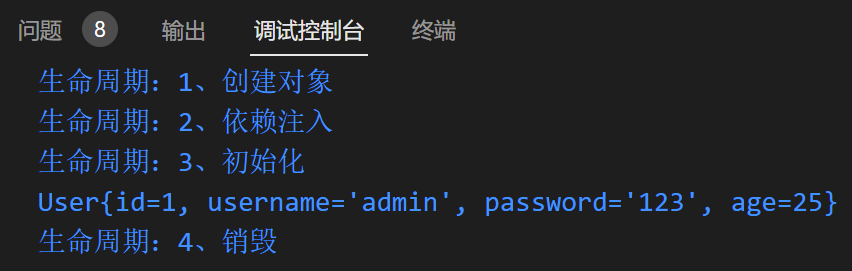

#### 饿汉式

经测试，上述代码运行到
```java
        ConfigurableApplicationContext ioc = new ClassPathXmlApplicationContext("spring-lifecycle.xml");
```
就会输出
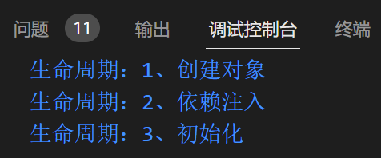

前三个步骤是在**获取IOC容器的时候**就执行了，不是在**获取bean的时候**执行的
因为IOC容器中配置的bean是**单例模式**的，获取的bean永远是唯一的对象，直接在获取IOC容器的时候，把bean对象创建好，以后直接用，这是**饿汉式**

#### 懒汉式

配置文件spring-lifecycle.xml中在```<beans></beans>```标签内部的内容修改如下
```xml
    <bean id="user" scope="prototype" class="com.kzj.spring.pojo.User" init-method="initMethod" destroy-method="destroyMethod">
        <property name="id" value="1"></property>
        <property name="username" value="admin"></property>
        <property name="password" value="123"></property>
        <property name="age" value="25"></property>
    </bean>
```

测试代码执行到
```java
        User user = ioc.getBean(User.class);
```
才会输出
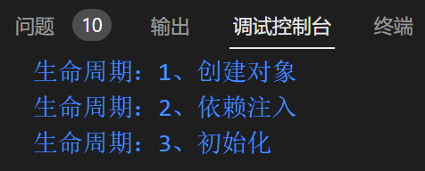

前三个步骤是在**获取bean的时候**执行的
因为IOC容器中配置的bean是**多例模式**的，每一次通过bean获取的对象都是新的对象，所以没必要提前创建，这是**懒汉式**

另外，测试代码执行到容器关闭时
```java
        ioc.close();
```
销毁的方法没有执行
当我们把bean的作用域设置为多例模式时，销毁方法不由IOC容器来管理

#### bean的后置处理器


创建MyBeanPostProcessor.java实现BeanPostProcessor接口（在```java/com/kzj/spring/process/```目录下）如下
```java
package com.kzj.spring.process;
import org.springframework.beans.BeansException;
import org.springframework.beans.factory.config.BeanPostProcessor;

public class MyBeanPostProcessor implements BeanPostProcessor{
    @Override
    public Object postProcessBeforeInitialization(Object bean, String beanName) throws BeansException {
        // 此方法在bean的生命周期：初始化之前执行
        System.out.println("MyBeanPostProcessor-->后置处理器postProcessBeforeInitialization");
		return bean;
	}
    @Override
    public Object postProcessAfterInitialization(Object bean, String beanName) throws BeansException {
        // 此方法在bean的生命周期：初始化之后执行
        System.out.println("MyBeanPostProcessor-->后置处理器postProcessAfterInitialization");
		return bean;
	}
}
```

还要把类MyBeanPostProcessor配置到IOC容器中
配置文件spring-lifecycle.xml中在```<beans></beans>```标签内部添加内容如下
```xml
    <bean id="myBeanPostProcessor" class="com.kzj.spring.process.MyBeanPostProcessor"></bean>
```

同时，把id为user的bean改成单例模式

运行测试方法，控制台输出结果为
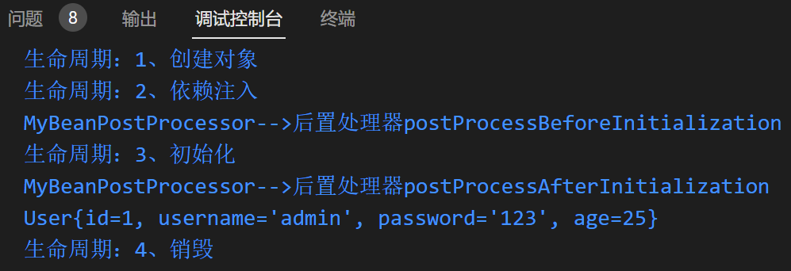

### FactoryBean

[BeanFactory和FactoryBean的区别](https://www.cnblogs.com/aspirant/p/9082858.html)

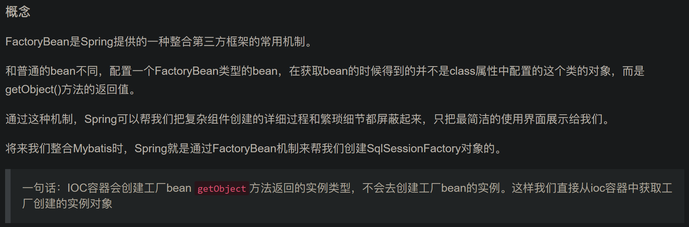


到P83


### 自动装配


## 基于注解管理bean


---

---
到P70

---

学神笔记
https://blog.csdn.net/gdxdekx/article/details/126173888
https://blog.csdn.net/gdxdekx/article/details/126173479

尚硅谷2022新版javaweb 手写 IOC（张益桃），去看看