# Spring

## Spring概述

> Spring 是最受欢迎的企业级 Java 应用程序开发框架，数以百万的来自世界各地的开发人员使用 Spring 框架来创建性能好、易于测试、可重用的代码。
> Spring 框架是一个开源的 Java 平台，它最初是由 Rod Johnson 编写的，并且于 2003 年 6 月首次在 Apache 2.0 许可下发布。
> Spring 是轻量级的框架，其基础版本只有 2 MB 左右的大小。
> Spring 框架的核心特性是可以用于开发任何 Java 应用程序，但是在 Java EE 平台上构建 web 应用程序是需要扩展的。 Spring 框架的目标是使 J2EE 开发变得更容易使用，通过启用基于 POJO 编程模型来促进良好的编程实践。

## Spring Framework

Spring 基础框架，可以视为 Spring 基础设施，基本上任何其他 Spring 项目都是以 Spring Framework为基础的。

### 五大功能模块

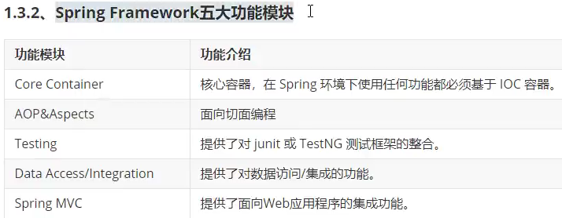

### 特性

- **非侵入式**：使用 Spring Framework 开发应用程序时，Spring 对应用程序本身的结构影响非常小。对领域模型可以做到零污染；对功能性组件也只需要使用几个简单的注解进行标记，完全不会破坏原有结构，反而能将组件结构进一步简化。这就使得基于 Spring Framework 开发应用程序时结构清晰、简洁优雅。
- **控制反转**：IOC——Inversion of Control，翻转资源获取方向。把自己创建资源、向环境索取资源变成环境将资源准备好，我们享受资源注入。
- **面向切面编程**：AOP——Aspect Oriented Programming，在不修改源代码的基础上增强代码功
能。
- **容器**：Spring IOC 是一个容器，因为它包含并且管理组件对象的生命周期。组件享受到了容器化的管理，替程序员屏蔽了组件创建过程中的大量细节，极大的降低了使用门槛，大幅度提高了开发效率。
- **组件化**：Spring 实现了使用简单的组件配置组合成一个复杂的应用。在 Spring 中可以使用 XML 和 Java 注解组合这些对象。这使得我们可以基于一个个功能明确、边界清晰的组件有条不紊的搭建超大型复杂应用系统。
- **声明式**：很多以前需要编写代码才能实现的功能，现在只需要声明需求即可由框架代为实现。
- **一站式**：在 IOC 和 AOP 的基础上可以整合各种企业应用的开源框架和优秀的第三方类库。而且 Spring 旗下的项目已经覆盖了广泛领域，很多方面的功能性需求可以在 Spring Framework 的基础上全部使用 Spring 来实现。

# IOC

IOC：Inversion of Control，**控制反转**。

## IOC容器

IOC容器就是放置已经创建好的实例的一个地方。这样实例不需要程序员来手动创建，而是交给容器管理，更加高效。

### IOC容器思想

#### 获取资源的传统方式

自己做饭：买菜、洗菜、择菜、改刀、炒菜，全过程参与，费时费力，必须清楚了解资源创建整个过程中的全部细节且熟练掌握。
在应用程序中的组件需要获取资源时，传统的方式是组件主动的从容器中获取所需要的资源，在这样的模式下开发人员往往需要知道在具体容器中特定资源的获取方式，增加了学习成本，同时降低了开发效率。

#### 反转控制方式获取资源

点外卖：下单、等、吃，省时省力，不必关心资源创建过程的所有细节。
反转控制的思想完全颠覆了应用程序组件获取资源的传统方式：反转了资源的获取方向——改由容器主动的将资源推送给需要的组件，开发人员不需要知道容器是如何创建资源对象的，只需要提供接收资源的方式即可，极大的降低了学习成本，提高了开发的效率。这种行为也称为查找的被动形式。

#### DI

DI：Dependency Injection，**依赖注入**。
DI 是 IOC 的另一种表述方式：即组件以一些预先定义好的方式（例如：setter 方法）接受来自于容器的资源注入。相对于IOC而言，这种表述更直接。
所以结论是：IOC 就是一种反转控制的思想， 而 DI 是对 IOC 的一种具体实现。

### IOC容器在Spring中的实现

Spring 的 IOC 容器就是 IOC 思想的一个落地的产品实现。IOC 容器中管理的组件也叫做 bean。在创建bean 之前，首先需要创建 IOC 容器。Spring 提供了 IOC 容器的两种实现方式：

#### BeanFactory

使用的是设计模式中的工厂模式，隐藏创建对象的过程，直接提供所需要的对象。
这是 IOC 容器的基本实现，是 Spring 内部使用的接口。面向 Spring 本身，不提供给开发人员使用。

#### ApplicationContext

BeanFactory 的子接口，提供了更多高级特性。面向 Spring 的使用者，几乎所有场合都使用
ApplicationContext 而不是底层的 BeanFactory。

##### ApplicationContext的主要实现类

前期准备：
用maven创建一个java项目
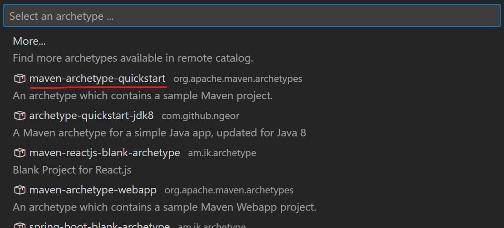
引入以下maven依赖
```xml
<dependencies>
    <!-- 基于Maven依赖传递性，导入spring-context依赖即可导入当前所需所有jar包 -->
    <dependency>
        <groupId>org.springframework</groupId>
        <artifactId>spring-context</artifactId>
        <version>5.3.1</version>
    </dependency>
    <!-- junit测试 -->
    <dependency>
        <groupId>junit</groupId>
        <artifactId>junit</artifactId>
        <version>4.12</version>
        <scope>test</scope>
    </dependency>
</dependencies>
```

以下功能好像VSCode中没有：
> 在IDEA中，按两下```Shift```键，使用全局搜索功能
> 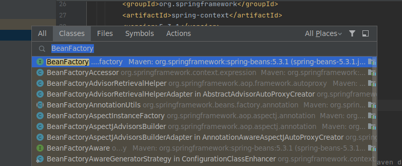
> 进入BeanFactory类所在的文件
> 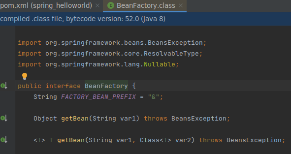
> 光标停止在类上，按```Ctrl```+```H```，打开查看类层级hierarchy界面
> 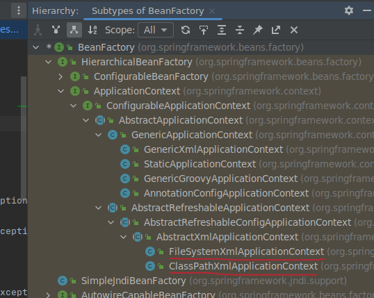

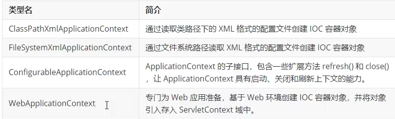

## 基于XML管理bean

简单的例子：
创建HelloWorld.java（在```java/com/kzj/spring/pojo/```目录下）如下
```java
package com.kzj.spring.pojo;

public class HelloWorld {
    public void sayHello(){
        System.out.println("Hello, Spring!");
    }
}
```

创建spring的配置文件applicationContext.xml的模板为
```xml
<?xml version="1.0" encoding="UTF-8"?>
<beans xmlns="http://www.springframework.org/schema/beans"
xmlns:xsi="http://www.w3.org/2001/XMLSchema-instance"
xmlns:aop="http://www.springframework.org/schema/aop"
xmlns:tx="http://www.springframework.org/schema/tx"
xmlns:context="http://www.springframework.org/schema/context"
xsi:schemaLocation="
       http://www.springframework.org/schema/beans
       http://www.springframework.org/schema/beans/spring-beans-3.0.xsd
       http://www.springframework.org/schema/tx
       http://www.springframework.org/schema/tx/spring-tx-3.0.xsd
       http://www.springframework.org/schema/context
       http://www.springframework.org/schema/context/spring-context-3.0.xsd
       http://www.springframework.org/schema/aop
       http://www.springframework.org/schema/aop/spring-aop-3.0.xsd">
</beans>
```

配置文件applicationContext.xml中在```<beans></beans>```标签内部新增的内容如下
```xml
    <!-- 
        bean: 配置一个bean对象，将对象交给IOC容器管理
        属性：
            id: bean的唯一标识，不能重复
            class: 设置bean对象所对应的类型
    -->
    <bean id="helloworld" class="com.kzj.spring.pojo.HelloWorld"></bean>
```

已经把HelloWorld对象交给IOC容器管理，现在验证以下获取HelloWorld对象的过程

创建测试类HelloWorldTest.java（在```test/java/com/kzj/spring/test/```目录下）如下
```java
package com.kzj.spring.test;
import org.junit.Test;
import org.springframework.context.ApplicationContext;
import org.springframework.context.support.ClassPathXmlApplicationContext;
import com.kzj.spring.pojo.HelloWorld;

public class HelloWorldTest {
    @Test
    public void test(){
        // 获取IOC容器
        ApplicationContext ioc = new ClassPathXmlApplicationContext("applicationContext.xml");
        // 获取IOC容器中的bean
        HelloWorld helloworld = (HelloWorld)ioc.getBean("helloworld");
        helloworld.sayHello();
    }
}
```

运行测试类的这个方法，成功
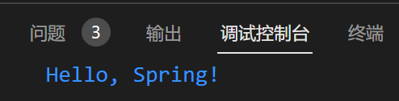

### 获取bean的三种方式

前期准备：
创建Student.java（在```java/com/kzj/spring/pojo/```目录下）如下
```java
package com.kzj.spring.pojo;

public class Student {
    private Integer sid;
    private String sname;
    private Integer age;
    private String gender;
    
    public Student(Integer sid, String sname, Integer age, String gender) {
        this.sid = sid;
        this.sname = sname;
        this.age = age;
        this.gender = gender;
    }

    public Student() {
    }

    @Override
    public String toString() {
        return "Student [sid=" + sid + ", sname=" + sname + ", age=" + age + ", gender=" + gender + "]";
    }

    public Integer getSid() {
        return sid;
    }

    public void setSid(Integer sid) {
        this.sid = sid;
    }

    public String getSname() {
        return sname;
    }

    public void setSname(String sname) {
        this.sname = sname;
    }

    public Integer getAge() {
        return age;
    }

    public void setAge(Integer age) {
        this.age = age;
    }

    public String getGender() {
        return gender;
    }

    public void setGender(String gender) {
        this.gender = gender;
    }
}
```
这里的方法都是用VSCode中的**源代码操作**功能自动生成的
注意：在IOC容器中通过**工厂模式**和**反射技术**创建对象，所以需要**对象的无参构造器**

配置文件applicationContext.xml中在```<beans></beans>```标签内部新增的内容如下
```xml
    <bean id="studentOne" class="com.kzj.spring.pojo.Student"></bean>
    <bean id="studentTwo" class="com.kzj.spring.pojo.Student"></bean>
```

创建测试类StudentTest.java（在```test/java/com/kzj/spring/test/```目录下）如下
```java
package com.kzj.spring.test;
import org.junit.Test;
import org.springframework.context.ApplicationContext;
import org.springframework.context.support.ClassPathXmlApplicationContext;

public class StudentTest {
    @Test
    public void test(){
        // 获取IOC容器
        ApplicationContext ioc = new ClassPathXmlApplicationContext("applicationContext.xml");
        // 获取IOC容器中的bean
        // 待完成
    }
}
```

#### 1. 通过 bean的id 获取bean

在测试类StudentTest.java的```// 待完成```处添加如下
```java
    Student studentOne = (Student)ioc.getBean("studentOne");
    System.out.println(studentOne);
```

运行后，控制台输出结果为
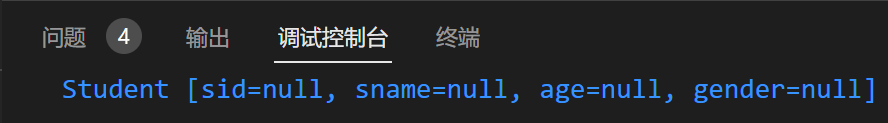

#### 2. 通过 bean的类型（类的Class对象） 获取bean

注意：要求ioc容器中有且仅有一个与之匹配的bean
- 若没有任何一个类型匹配的bean，抛出NoSuchBeanDefinitionException
- 若有多个类型匹配的bean，抛出NoUniqueBeanDefinitionException

在测试类StudentTest.java的```// 待完成```处添加如下
```java
    Student student = ioc.getBean(Student.class);
    System.out.println(student);
```

运行会报错，符合预期


#### 3. 通过 bean的类型 和 bean的id 获取bean

在测试类StudentTest.java的```// 待完成```处添加如下
```java
    Student studentOne = ioc.getBean("studentOne",Student.class);
    System.out.println(studentOne);
```

运行后，控制台输出结果为


#### 获取bean的三种方式总结

以后```2. 通过 bean的类型（类的Class对象） 获取bean```使用的最多

因为配置文件applicationContext.xml中在```<beans></beans>```标签中的**同一个类型的bean没有必要设置两个**，上面只是为了演示获取bean的三种方式

想要从一个类型获取多个实例对象，这样是不必要的：
```xml
    <bean id="studentOne" class="com.kzj.spring.pojo.Student"></bean>
    <bean id="studentTwo" class="com.kzj.spring.pojo.Student"></bean>
```

配置文件applicationContext.xml中在```<beans></beans>```标签中的**同一个类型的bean只要配置一个**

这里的bean默认是**单例模式**（```singleton```），我们通过设置bean的```scope```属性，可以改成**多例模式**（```prototype```）

如果想要从一个类型获取多个实例对象，只要改成：
```xml
    <bean id="student" class="com.kzj.spring.pojo.Student" scope="prototype"></bean>
```

在测试类StudentTest.java的```// 待完成```处添加如下
```java
    Student studentOne = ioc.getBean(Student.class);
    studentOne.setSid(1);
    Student studentTwo = ioc.getBean(Student.class);
    studentTwo.setSid(2);
    System.out.println(studentOne);
    System.out.println(studentTwo);
```

运行后，控制台输出结果为
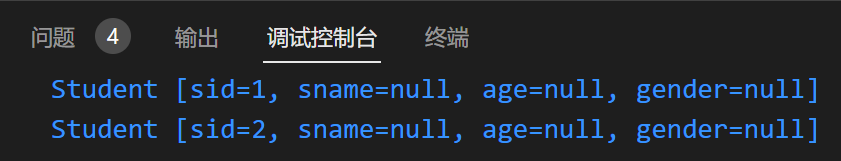

#### 通过 接口类型 获取bean（```2. 通过 bean的类型 获取bean```的扩展）

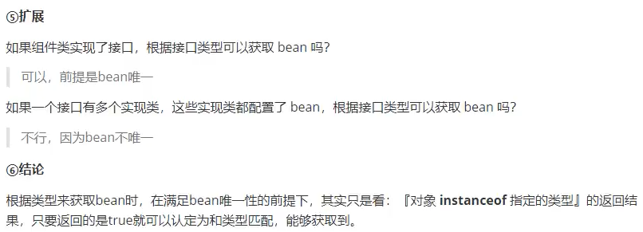

配置文件applicationContext.xml中在```<beans></beans>```标签内部的配置不变，如下
```xml
    <bean id="student" class="com.kzj.spring.pojo.Student" scope="prototype"></bean>
```

创建接口类Person.java（在```java/com/kzj/spring/pojo/```目录下）

让Student类实现Person接口
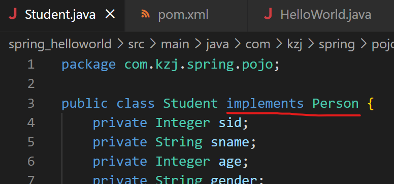

在测试类StudentTest.java的```// 待完成```处添加如下
```java
    Person person = ioc.getBean(Person.class);
    System.out.println(person);
```

运行不会报错，控制台输出结果为
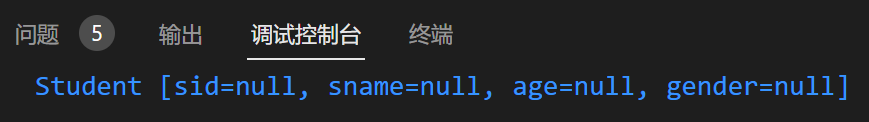

> 总结：在IOC容器中配置bean后，可以通过：
> 1. **bean的类型**
> 2. **bean所继承的父类的类型**
> 3. **bean所实现的接口的类型**
> 
> 来获取它

### 依赖注入（DI）（IOC的具体实现）

依赖注入就是**为当前类中的属性进行赋值的过程**
被动接受IOC容器资源的注入

#### setter注入

在```<bean></bean>```标签内部使用```<property>```标签，通过成员变量的set方法进行赋值

配置文件applicationContext.xml中在```<beans></beans>```标签内部的内容如下
```xml
    <bean id="student" class="com.kzj.spring.pojo.Student" scope="prototype">
        <!--
            property：通过成员变量的set方法进行赋值
            name：设置需要赋值的属性名（和set方法有关，set方法名，去掉set之后首字母小写）
            value：设置属性的值
        -->
        <property name="sid" value="1001"/>
        <property name="sname" value="张三"/>
        <property name="age" value="23"/>
        <property name="gender" value="男"/>
    </bean>
```

在测试类StudentTest.java的```// 待完成```处添加如下
```java
    Student student = ioc.getBean(Student.class);
    System.out.println(student);
```

运行后，控制台输出结果为
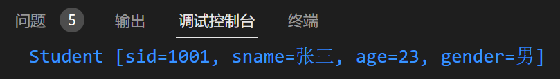

#### 构造器注入


## 基于注解管理bean


---

---
到P70

---

学神笔记
https://blog.csdn.net/gdxdekx/article/details/126173888
https://blog.csdn.net/gdxdekx/article/details/126173479

尚硅谷2022新版javaweb 手写 IOC（张益桃），去看看