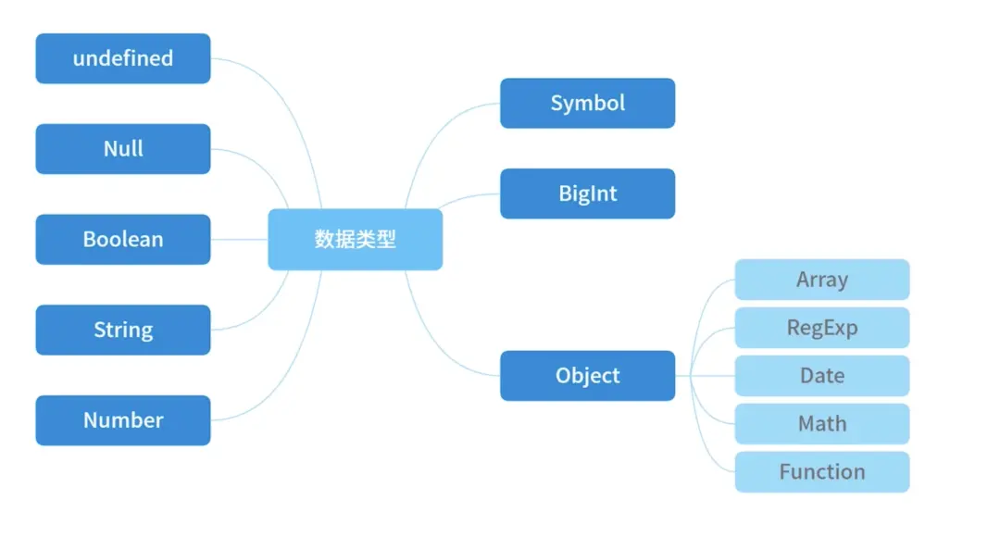
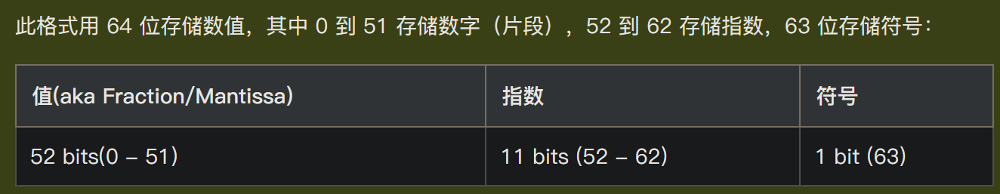

# JavaScript 快速入门

> JavaScript 是 web 开发者必学的三种语言之一：
> 1. HTML 定义网页的内容
> 2. CSS 规定网页的布局
> 3. JavaScript 对网页行为进行编程

[w3school的JavaScript教程](https://www.w3school.com.cn/js/index.asp)

## js的作用

### 改变 HTML 内容

```html
<!DOCTYPE html>
<html>
<body>

<h2>JavaScript 能做什么</h2>

<p id="demo">JavaScript 能够改变 HTML 内容。</p>

<button type="button" onclick='document.getElementById("demo").innerHTML = "Hello JavaScript!"'>点击我！</button>

</body>
</html>
```

### 改变 HTML 属性

```html
<!DOCTYPE html>
<html>
<body>

<h2>JavaScript 能做什么？</h2>

<p>JavaScript 能够改变 HTML 属性值。</p>

<p>在本例中，JavaScript 改变了图像的 src 属性值。</p>

<button onclick="document.getElementById('myImage').src='/i/eg_bulbon.gif'">开灯</button>


<button onclick="document.getElementById('myImage').src='/i/eg_bulboff.gif'">关灯</button>

</body>
</html>
```

### 改变 HTML 样式（CSS）

```html
<!DOCTYPE html>
<html>
<body>

<h2>JavaScript 能够做什么</h2>

<p id="demo">JavaScript 能够改变 HTML 元素的样式。</p>

<button type="button" onclick="document.getElementById('demo').style.fontSize='35px'">
点击我！
</button>


</body>
</html> 
```

## js的使用

### 直接嵌在网页中

在 HTML 中，JavaScript 代码必须位于 `<script>` 与 `</script>` 标签之间：
```html
<html>
<head>
  <script>
    alert('Hello, world');
  </script>
</head>
<body>
  ...
</body>
</html>
```

### 放到一个单独的 .js 文件

把JavaScript代码放到一个单独的 .js 文件，然后在HTML中通过 `<script src="..."></script>`引入这个文件：
```html
<html>
<head>
  <script src="static/js/abc.js"></script>
</head>
<body>
  ...
</body>
</html>
```

在外部文件中放置js代码有如下优势：
1. 分离了 HTML 和代码
2. 使 HTML 和 JavaScript 更易于阅读和维护
3. 已缓存的 JavaScript 文件可加速页面加载

#### `<script>`标签的type属性

有些时候你会看到`<script>`标签还设置了一个type属性：
```html
<script type="text/javascript">
  ...
</script>
```
但这是没有必要的，因为默认的type就是JavaScript，所以不必显式地把type指定为JavaScript

## js的显示方案

JavaScript 能够以不同方式显示数据：
1. 使用 `window.alert()` 写入警告框
2. 使用 `document.write()` 写入 HTML 输出
3. 使用 `innerHTML` 写入 HTML 元素
4. 使用 `console.log()` 写入浏览器控制台

## js的基本语法

[链接](https://www.w3school.com.cn/js/js_syntax.asp)

## js的变量

可以通过 `var` 关键词来声明 JavaScript 变量
```js
var carName = "porsche";
```

`=` : **赋值运算符**
`==` : **等于运算符**
`===` : **严格等于运算符**

### var、let、const的区别

ES2015 引入了两个重要的 JavaScript 新关键词 `let` 和 `const`：
- 当在最外层函数的外部声明 `var` 变量时，作用域是**全局**的；当在函数中声明 `var` 时，作用域是**局部**的
- `let` 声明一个**块级作用域**的局部变量
- `const` 声明一个**块级作用域**的常量

块是由 `{}` 界定的代码块

## js的运算符


## js的数据类型



### 值类型（基本类型）

有：
- 数字（Number）
- 大整数（BigInt）
- 字符串（String）
- 布尔(Boolean)
- 未定义（Undefined）
- 空（Null）
- 符号（Symbol）

```js
var length = 7;                                // 数字
var bi1 = 9223372036854775807n;                // 大整数(整数后加一个 n)(精确表示比 2^53 还大的整数)
var bi2 = BigInt(12345);                       // 大整数(使用 BigInt() 把Number或字符串转换成BigInt)
var lastName = "Gates";                        // 字符串
var y = false;                                 // 布尔值
var person = undefined;                        // 未定义(当一个变量声明但未赋值时)
var car = null;                                // 空值(用于表示变量被故意赋值为空)
var s3 = Symbol('hello');                      // 符号
```

#### 数字（Number）

> JavaScript 数值始终是 64 位的浮点数
> 与许多其他编程语言不同，JavaScript 不会定义不同类型的数，比如整数、短的、长的、浮点的等等
> JavaScript 数值始终以**双精度浮点数**来存储，根据国际 IEEE 754 标准
> 


```js
var x1 = 34.1;                           
var x2 = 34;                               
var y = 123e5;                               // 12300000
var z = 123e-5;                              // 0.00123
var n1 = 0xFF;                               // 255
var n2 = 0o11;                               // 9
var n3 = 0b11;                               // 3
var x2_2 = x2.toString(2)                    // 使用 toString() 方法把数输出为十六进制、八进制或二进制

// 精度问题
var big = 9999999999999999;                   // big 将是 10000000000000000，JavaScript 整数最多只能精确到 15 位
var float = 0.2 + 0.1;                        // float 将是 0.30000000000000004，小数的最大数是 17 位，但是浮点的算数并不总是 100% 精准

// JavaScript 的加法和级联（concatenation）都使用 + 运算符
// 数字和字符串相加，JavaScript 会把数字转换为字符串，然后再连接
var res1 = 10 + 20 + '30';                    // 返回 3030

var res2 = '100' / '10';                      // 返回 10

var res3 = 100 / "Apple";                     // res3 将是 NaN（Not a Number）
isNaN(res3);                                  // 返回 true，因为 res3 不是数
var res4 = res3 + 100;                        // 要小心 NaN，假如在数学运算中使用了 NaN，则结果也将是 NaN
var res5 = res3 + '100';                      // 返回 NaN100
typeof NaN;                                   // 返回 number

// Infinity（或 -Infinity）是 JavaScript 在计算数时超出最大可能数范围时返回的值
var res6 =  2 / 0;                            // x 将是 Infinity
var res7 = -2 / 0;                            // y 将是 -Infinity
typeof Infinity;                              // 返回 number
```

##### == 和 ===

JavaScript在设计时，有两种比较运算符：
1. == ，它会自动转换数据类型再比较，很多时候，会得到非常诡异的结果
2. === ，它不会自动转换数据类型，如果数据类型不一致，返回false，如果一致，再比较

由于JavaScript这个设计缺陷，不要使用 == 比较，始终坚持使用 === 比较

一个例外是 NaN 这个特殊的Number与所有其他值都不相等，包括它自己：
```js
NaN === NaN; // false
```

唯一能判断 NaN 的方法是通过 isNaN() 函数：
```js
isNaN(NaN); // true
```

还要注意浮点数的相等比较：
```js
1 / 3 === (1 - 2 / 3); // false
```

这不是JavaScript的设计缺陷。浮点数在运算过程中会产生误差，因为计算机无法精确表示无限循环小数。要比较两个浮点数是否相等，只能计算它们之差的绝对值，看是否小于某个阈值：
```js
Math.abs(1 / 3 - (1 - 2 / 3)) < 0.0000001; // true
```

#### 大整数（BigInt）


学到
https://www.w3school.com.cn/js/js_bigint.asp


#### 字符串（String）

```js
var lastName = "Gates";                          // 字符串
var sln = lastName.length;                       // length 属性返回字符串的长度
var pos1 = lastName.indexOf("es", 1);            // indexOf() 方法返回字符串中指定文本首次出现的索引，第二个参数为开始查找的位置
var pos2 = lastName.lastIndexOf("es", 4);        // lastIndexOf() 方法返回指定文本在字符串中最后一次出现的索引，第二个参数为开始查找的位置
var pos3 = lastName.search("es");                // search() 方法搜索字符串中的指定文本，可以使用正则表达式
var res1 = lastName.slice(1, 3);                 // slice() 方法提取字符串的一部分，并返回一个新的字符串，两个参数为开始和结束位置
var res2 = lastName.substring(1, 3);             // substring() 方法返回字符串中介于两个指定下标之间的字符，两个参数会比较大小来判断哪一个是起始位参数哪一个是结束位置参数
var res3 = lastName.substr(1, 3);                // substr() 方法返回从指定位置开始的指定数量的字符
var res4 = lastName.replace("e", "a");           // replace() 方法用一些字符替换字符串中的某些字符
var res5 = lastName.toUpperCase();               // toUpperCase() 方法用于把字符串转换为大写
var res6 = lastName.toLowerCase();               // toLowerCase() 方法用于把字符串转换为小写
var res7 = lastName.concat(" and Bill Gates");   // concat() 方法用于连接两个或多个字符串
var res8 = lastName.trim();                      // trim() 方法删除字符串两端的空白符
var res9 = lastName.charAt(2);                   // charAt() 方法返回在指定位置的字符
var res10 = lastName.charCodeAt(2);              // charCodeAt() 方法返回字符串中指定索引的字符 unicode 编码

var txt = "a,b,c,d,e";                           // 字符串
var res11 = txt.split(",");                      // split() 方法用于把字符串分割为字符串数组

var text = "The rain in SPAIN stays mainly in the plain";
var res12 = text.match(/ain/g)                   // 返回数组 [ain,ain,ain]，match() 方法根据正则表达式在字符串中搜索匹配项，并将匹配项作为 Array 对象返回

var text = "Hello World!";                       // 字符串
var res13 = text.includes("Hello");              // 返回 true，includes() 方法用于判断字符串是否包含指定的子字符串
var res14 = text.startsWith("Hello");            // 返回 true，startsWith() 方法用于判断字符串是否以指定的子字符串开头
var res15 = text.endsWith("World!");             // 返回 true，endsWith() 方法用于判断字符串是否以指定的子字符串结尾
```

##### 模板字符串

使用反引号 (``) 而不是引号 ("") 来定义字符串

> 可以跨行
> 可以使用 `${...}` 语法进行**字符串插值**

```js
var firstName = "Bill";
var lastName = "Gates";
var text = `Welcome 
            ${firstName},
            ${lastName}!`;  // 模板字符串
```

#### Undefined 与 Null 的区别

undefined 与 null 的值相等，但类型不等：
```js
typeof undefined             // undefined
typeof null                  // object
null === undefined           // false
null == undefined            // true
```

#### 注意

`typoef null` 为 `object` 是早期 JS 实现中的一个错误

typoef运算符对于确定变量的类型（number、string、boolean、undefined）很有用。 但是，如果为 null，则typeof会产生误导：`typoef null` 为 `object`

null 和 undefined 在某种程度上是等价的，但 `null` 表示**缺少对象**，而 `undefined` 表示**未初始化状态**

### 引用类型（复杂类型）

有：
- 对象（Object）
- 数组（Array）
- 函数（Function）
- 正则（RegExp）
- 日期（Date）

```js
var cars = ["Porsche", "Volvo", "BMW"];        // 数组
var x = {firstName:"Bill", lastName:"Gates"};  // 对象
function myFunction(p1, p2) {
    return p1 * p2;                            // 函数
}
```

#### 对象（Object）

##### 定义对象

对象有**属性**和**方法**

```js
var person = {
  firstName: "Bill",
  lastName : "Gates",
  id       : 678,
  fullName : function() {
    return this.firstName + " " + this.lastName;
  }
};
```

###### this关键字

[链接](https://www.w3school.com.cn/js/js_this.asp)

JavaScript 的 `this` 关键词指的是它所属的对象

它拥有不同的值，具体取决于它的使用位置：
- 在方法中，this 指的是所有者对象
- 单独的情况下，this 指的是全局对象
- 在函数中，this 指的是全局对象
- 在函数中，严格模式下，this 是 undefined
- 在事件中，this 指的是接收事件的元素
像 `call()` 和 `apply()` 这样的方法可以将 this 引用到任何对象

##### 访问对象

```js
// 访问对象属性
// objectName.propertyName
// objectName["propertyName"]
person.lastName;
person["lastName"];
// 访问对象方法
// objectName.methodName()
name = person.fullName();
```

#### 日期（Date）

[链接](https://www.w3school.com.cn/js/js_dates.asp)

#### 正则表达式（RegExp）

[链接](https://www.w3school.com.cn/js/js_regexp.asp)

#### 注意

对于引用类型，typeof 运算符可返回 function 或 object：
- typeof 运算符把对象、数组或 null 返回 `object`
- typeof 运算符不会把函数返回 object，而是返回 `function`


---


---


null与false、0、''、undefined、NaN都是虚值。如果在条件语句中遇到虚值，那么 JS 将把虚值强制为false