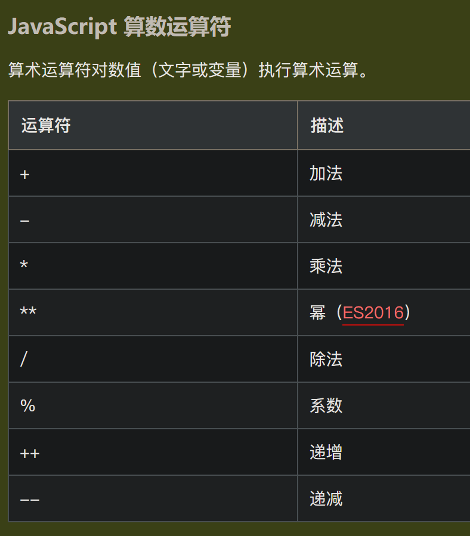

# JavaScript 快速入门

> JavaScript 是 web 开发者必学的三种语言之一：
> 1. HTML 定义网页的内容
> 2. CSS 规定网页的布局
> 3. JavaScript 对网页行为进行编程

[w3school的JavaScript教程](https://www.w3school.com.cn/js/index.asp)

## js的作用

### 改变 HTML 内容

```html
<!DOCTYPE html>
<html>
<body>

<h2>JavaScript 能做什么</h2>

<p id="demo">JavaScript 能够改变 HTML 内容。</p>

<button type="button" onclick='document.getElementById("demo").innerHTML = "Hello JavaScript!"'>点击我！</button>

</body>
</html>
```

### 改变 HTML 属性

```html
<!DOCTYPE html>
<html>
<body>

<h2>JavaScript 能做什么？</h2>

<p>JavaScript 能够改变 HTML 属性值。</p>

<p>在本例中，JavaScript 改变了图像的 src 属性值。</p>

<button onclick="document.getElementById('myImage').src='/i/eg_bulbon.gif'">开灯</button>


<button onclick="document.getElementById('myImage').src='/i/eg_bulboff.gif'">关灯</button>

</body>
</html>
```

### 改变 HTML 样式（CSS）

```html
<!DOCTYPE html>
<html>
<body>

<h2>JavaScript 能够做什么</h2>

<p id="demo">JavaScript 能够改变 HTML 元素的样式。</p>

<button type="button" onclick="document.getElementById('demo').style.fontSize='35px'">
点击我！
</button>


</body>
</html> 
```

## js的使用

### 直接嵌在网页中

在 HTML 中，JavaScript 代码必须位于 `<script>` 与 `</script>` 标签之间：
```html
<html>
<head>
  <script>
    alert('Hello, world');
  </script>
</head>
<body>
  ...
</body>
</html>
```

### 放到一个单独的 .js 文件

把JavaScript代码放到一个单独的 .js 文件，然后在HTML中通过 `<script src="..."></script>`引入这个文件：
```html
<html>
<head>
  <script src="static/js/abc.js"></script>
</head>
<body>
  ...
</body>
</html>
```

在外部文件中放置js代码有如下优势：
1. 分离了 HTML 和代码
2. 使 HTML 和 JavaScript 更易于阅读和维护
3. 已缓存的 JavaScript 文件可加速页面加载

#### `<script>`标签的type属性

有些时候你会看到`<script>`标签还设置了一个type属性：
```html
<script type="text/javascript">
  ...
</script>
```
但这是没有必要的，因为默认的type就是JavaScript，所以不必显式地把type指定为JavaScript

## js的显示方案

JavaScript 能够以不同方式显示数据：
1. 使用 `window.alert()` 写入警告框
2. 使用 `document.write()` 写入 HTML 输出
3. 使用 `innerHTML` 写入 HTML 元素
4. 使用 `console.log()` 写入浏览器控制台

## js的基本语法

[链接](https://www.w3school.com.cn/js/js_syntax.asp)

## js的变量

可以通过 `var` 关键词来声明 JavaScript 变量
```js
var carName = "porsche";
```

`=` : **赋值运算符**
`==` : **等于运算符**
`===` : **严格等于运算符**

### var、let、const的区别

ES2015 引入了两个重要的 JavaScript 新关键词 `let` 和 `const`：
- 当在最外层函数的外部声明 `var` 变量时，作用域是**全局**的；当在函数中声明 `var` 时，作用域是**局部**的
- `let` 声明一个**块级作用域**的局部变量
- `const` 声明一个**块级作用域**的常量

块是由 `{}` 界定的代码块

## js的运算符

### 算术运算符




### 赋值运算符


### 比较运算符


### 逻辑运算符


### 条件运算符


### 类型运算符


### 位运算符


