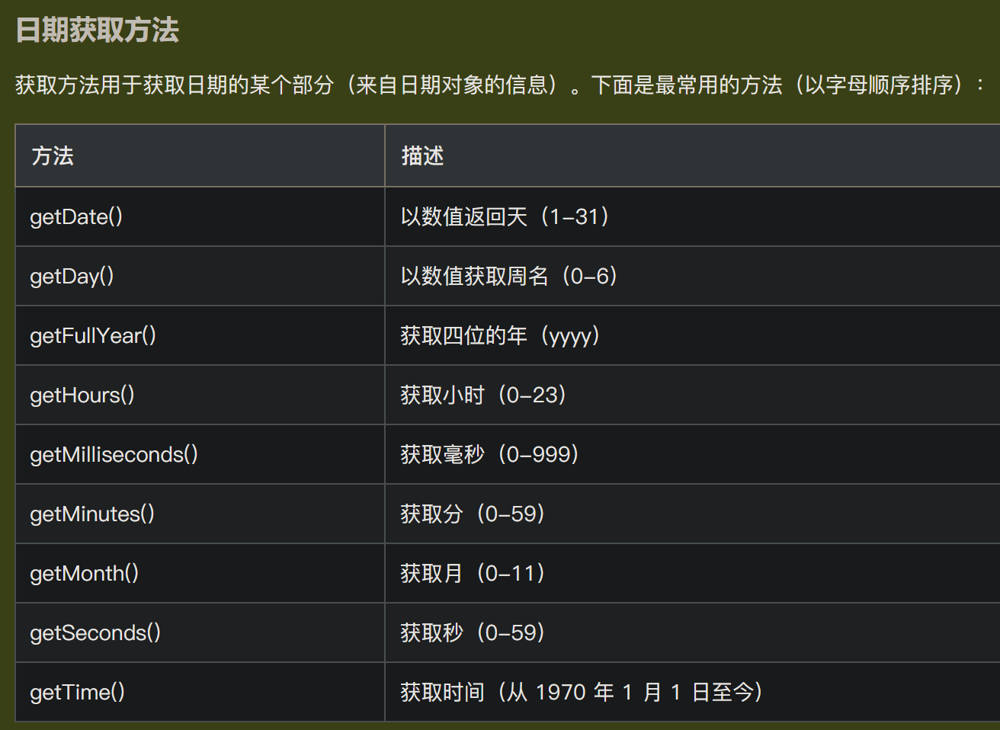

# js的数据类型


## 值类型（基本类型）

有：
- 数字（Number）
- 大整数（BigInt）
- 字符串（String）
- 布尔(Boolean)
- 未定义（Undefined）
- 空（Null）
- 符号（Symbol）

```js
var length = 7;                                // 数字
var bi1 = 9223372036854775807n;                // 大整数(整数后加一个 n)(精确表示比 2^53 还大的整数)
var bi2 = BigInt(12345);                       // 大整数(使用 BigInt() 把Number或字符串转换成BigInt)
var lastName = "Gates";                        // 字符串
var y = false;                                 // 布尔值
var person = undefined;                        // 未定义(当一个变量声明但未赋值时)
var car = null;                                // 空值(用于表示变量被故意赋值为空)
var s3 = Symbol('hello');                      // 符号
```

### 数字（Number）

> JavaScript 数值始终是 64 位的浮点数
> 与许多其他编程语言不同，JavaScript 不会定义不同类型的数，比如整数、短的、长的、浮点的等等
> JavaScript 数值始终以**双精度浮点数**来存储，根据国际 IEEE 754 标准
> 


```js
var x1 = 34.1;                           
var x2 = 34;                               
var y = 123e5;                               // 12300000
var z = 123e-5;                              // 0.00123
var n1 = 0xFF;                               // 255
var n2 = 0o11;                               // 9
var n3 = 0b11;                               // 3
var x2_2 = x2.toString(2)                    // 使用 toString() 方法把数输出为十六进制、八进制或二进制

// 精度问题
var big = 9999999999999999;                   // big 将是 10000000000000000，JavaScript 整数最多只能精确到 15 位
// 舍入可能会危及程序安全
9007199254740992 === 9007199254740993;        // 为 true !!!
var float = 0.2 + 0.1;                        // float 将是 0.30000000000000004，小数的最大数是 17 位，但是浮点的算数并不总是 100% 精准

// JavaScript 的加法和级联（concatenation）都使用 + 运算符
// 数字和字符串相加，JavaScript 会把数字转换为字符串，然后再连接
var res1 = 10 + 20 + '30';                    // 返回 3030

var res2 = '100' / '10';                      // 返回 10

var res3 = 100 / "Apple";                     // res3 将是 NaN (Not a Number)
isNaN(res3);                                  // 返回 true，因为 res3 不是数
var res4 = res3 + 100;                        // 要小心 NaN，假如在数学运算中使用了 NaN，则结果也将是 NaN
var res5 = res3 + '100';                      // 返回 NaN100
typeof NaN;                                   // 返回 number

// Infinity（或 -Infinity）是 JavaScript 在计算数时超出最大可能数范围时返回的值
var res6 =  2 / 0;                            // x 将是 Infinity
var res7 = -2 / 0;                            // y 将是 -Infinity
typeof Infinity;                              // 返回 number
// ES6 向 Number 对象添加了 max 和 min 属性
let maxNum = Number.MAX_SAFE_INTEGER;
let minNum = Number.MIN_SAFE_INTEGER;
// ES6 还为 Number 对象添加了 isInteger() 和 isSafeInteger() 方法
Number.isInteger(10);                         // 返回 true  
Number.isSafeInteger(12345678901234567890);   // 返回 false，安全整数是可以精确表示为双精度数的整数
```

#### 数字方法


#### 数字属性


#### == 和 ===

JavaScript在设计时，有两种比较运算符：
1. == ，它会自动转换数据类型再比较，很多时候，会得到非常诡异的结果
2. === ，它不会自动转换数据类型，如果数据类型不一致，返回false，如果一致，再比较

由于JavaScript这个设计缺陷，不要使用 == 比较，始终坚持使用 === 比较

一个例外是 NaN 这个特殊的Number与所有其他值都不相等，包括它自己：
```js
NaN === NaN; // false
```

唯一能判断 NaN 的方法是通过 isNaN() 函数：
```js
isNaN(NaN); // true
```

还要注意浮点数的相等比较：
```js
1 / 3 === (1 - 2 / 3); // false
```

这不是JavaScript的设计缺陷。浮点数在运算过程中会产生误差，因为计算机无法精确表示无限循环小数。要比较两个浮点数是否相等，只能计算它们之差的绝对值，看是否小于某个阈值：
```js
Math.abs(1 / 3 - (1 - 2 / 3)) < 0.0000001; // true
```

### 大整数（BigInt）

```js
var x = 123456789012345678901234567890n;
var y = BigInt("123456789012345678901234567890");
var type = typeof x;                          // 返回 bigint
var z = x * y;                                // 可用于 JavaScript Number 的运算符也可用于 BigInt，不允许在 BigInt 和 Number 之间进行算术运算
var res = 5n / 2n;                            // 返回 2n，BigInt 除法会舍去小数部分，保留整数部分
// BigInt 十六进制、八进制和二进制
var hex = 0x20000000000003n;
var oct = 0o400000000000000003n;
var bin = 0b100000000000000000000000000000000000000000000000000011n;
```

### 字符串（String）

```js
var lastName = "Gates";                          // 字符串
var sln = lastName.length;                       // length 属性返回字符串的长度
var pos1 = lastName.indexOf("es", 1);            // indexOf() 方法返回字符串中指定文本首次出现的索引，第二个参数为开始查找的位置
var pos2 = lastName.lastIndexOf("es", 4);        // lastIndexOf() 方法返回指定文本在字符串中最后一次出现的索引，第二个参数为开始查找的位置
var pos3 = lastName.search("es");                // search() 方法搜索字符串中的指定文本，可以使用正则表达式
var res1 = lastName.slice(1, 3);                 // slice() 方法提取字符串的一部分，并返回一个新的字符串，两个参数为开始和结束位置
var res2 = lastName.substring(1, 3);             // substring() 方法返回字符串中介于两个指定下标之间的字符，两个参数会比较大小来判断哪一个是起始位参数哪一个是结束位置参数
var res3 = lastName.substr(1, 3);                // substr() 方法返回从指定位置开始的指定数量的字符
var res4 = lastName.replace("e", "a");           // replace() 方法用一些字符替换字符串中的某些字符
var res5 = lastName.toUpperCase();               // toUpperCase() 方法用于把字符串转换为大写
var res6 = lastName.toLowerCase();               // toLowerCase() 方法用于把字符串转换为小写
var res7 = lastName.concat(" and Bill Gates");   // concat() 方法用于连接两个或多个字符串
var res8 = lastName.trim();                      // trim() 方法删除字符串两端的空白符
var res9 = lastName.charAt(2);                   // charAt() 方法返回在指定位置的字符
var res10 = lastName.charCodeAt(2);              // charCodeAt() 方法返回字符串中指定索引的字符 unicode 编码

var txt = "a,b,c,d,e";                           // 字符串
var res11 = txt.split(",");                      // split() 方法用于把字符串分割为字符串数组

var text = "The rain in SPAIN stays mainly in the plain";
var res12 = text.match(/ain/g)                   // 返回数组 [ain,ain,ain]，match() 方法根据正则表达式在字符串中搜索匹配项，并将匹配项作为 Array 对象返回

var text = "Hello World!";                       // 字符串
var res13 = text.includes("Hello");              // 返回 true，includes() 方法用于判断字符串是否包含指定的子字符串
var res14 = text.startsWith("Hello");            // 返回 true，startsWith() 方法用于判断字符串是否以指定的子字符串开头
var res15 = text.endsWith("World!");             // 返回 true，endsWith() 方法用于判断字符串是否以指定的子字符串结尾
```

#### 模板字符串

使用反引号 (``) 而不是引号 ("") 来定义字符串

> 可以跨行
> 可以使用 `${...}` 语法进行**字符串插值**

```js
var firstName = "Bill";
var lastName = "Gates";
var text = `Welcome 
            ${firstName},
            ${lastName}!`;  // 模板字符串
```

### Undefined 与 Null 的区别

undefined 与 null 的值相等，但类型不等：
```js
typeof undefined             // undefined
typeof null                  // object
null === undefined           // false
null == undefined            // true
```

### 注意

`typoef null` 为 `object` 是早期 JS 实现中的一个错误

typoef运算符对于确定变量的类型（number、bigint、string、boolean、undefined）很有用。 但是，如果为 null，则typeof会产生误导：`typoef null` 为 `object`

null 和 undefined 在某种程度上是等价的，但 `null` 表示**缺少对象**，而 `undefined` 表示**未初始化状态**

## 引用类型（复杂类型）

有：
- 对象（Object）
- 数组（Array）
- 日期（Date）
- 数学（Math）
- 正则（RegExp）
- 函数（Function）
- 错误（Error）

```js
var cars = ["Porsche", "Volvo", "BMW"];        // 数组
var x = {firstName:"Bill", lastName:"Gates"};  // 对象
function myFunction(p1, p2) {
    return p1 * p2;                            // 函数
}
```

### 对象（Object）

[链接](https://www.w3school.com.cn/js/js_object_definition.asp)

#### 定义对象

对象有**属性**和**方法**

```js
var person = {
  firstName: "Bill",
  lastName : "Gates",
  id       : 678,
  fullName : function() {
    return this.firstName + " " + this.lastName;
  }
};
```

##### this关键字

[链接](https://www.w3school.com.cn/js/js_this.asp)

JavaScript 的 `this` 关键词指的是它所属的对象

它拥有不同的值，具体取决于它的使用位置：
- 在**方法**中，`this` 指的是所有者对象
- **单独的情况下**，`this` 指的是全局对象
- 在**函数**中，`this` 指的是全局对象
- 在**函数**中，**严格模式**下，`this` 是 `undefined`
- 在**事件**中，`this` 指的是接收事件的元素
像 `call()` 和 `apply()` 这样的方法可以将 `this` 引用到任何对象

#### 访问对象、操作对象

```js
// 访问对象属性
// objectName.propertyName
// objectName["propertyName"]
person.lastName;
person["lastName"];
// 访问对象方法
// objectName.methodName()
name = person.fullName();
// 添加新属性
person.nationality = "English";
// 删除属性
delete person.nationality;
```

#### 对象构造器函数

> 在典型的面向对象的语言中，如java，都存在类（class）的概念，类就是对象的模板，对象就是类的实例
> 但是在Javascript语言体系中，是**不存在类**（class）的概念的，javascript中不是基于"类"的（**ES6之前**），而是通过**构造函数**（constructor）和**原型链**（prototype chains）实现的

上面的对象实例有限制的，只创建 **单一对象**
有时我们需要创建相同"类型"的许多对象的"蓝图"
创建一种"对象类型"的方法，是使用 **对象构造器函数**

通过 new 关键词调用构造器函数可以创建 **相同类型的对象**

```js
// 对象构造器函数
function Person(first, last, age, eye) {
    this.firstName = first;
    this.lastName = last;
    this.age = age;
    this.eyeColor = eye;
    this.changeName = function (name) {
        this.lastName = name;
    };
}
// 通过 new 关键词调用构造器函数，创建相同类型的对象
var myFather = new Person("Bill", "Gates", 62, "blue");
var myMother = new Person("Steve", "Jobs", 56, "green");
// 为了解决构造函数的对象实例之间无法共享属性的缺点，js提供了prototype属性
Person.prototype.nationality = "English";
Person.prototype.name = function() {
    return this.firstName + " " + this.lastName;
};
```

[详解Javascript中prototype属性](https://www.cnblogs.com/douyage/p/8630529.html)

> 对于**构造函数**来说，prototype是作为构造函数的属性
> 对于**对象实例**来说，prototype是对象实例的原型对象
> 所以prototype即是**属性**，又是**对象**

#### 可迭代对象（Iterables）

可迭代对象（Iterables）是可以使用 `for..of` 进行迭代的对象

从技术上讲，可迭代对象必须实现 `Symbol.iterator` 方法

##### JavaScript 迭代器

当一个对象实现了 `next()` 方法时，它就成为了一个迭代器
`next()` 方法必须**返回**一个带有**两个属性**的对象：
- **value**（迭代器返回的值）
- **done**（true 或 false）

##### 自制可迭代对象

[迭代器和生成器的官方文档](https://developer.mozilla.org/zh-CN/docs/Web/JavaScript/Guide/Iterators_and_generators)

[Iterable object（可迭代对象）链接](https://zh.javascript.info/iterable)

实现 `next()` 方法，并调用它：
```js
// 自制的可迭代对象
function myNumbers() {
  let n = 0;
  return {
    next: function() {
      n += 10;
      return {value:n, done:false};
    }
  };
}
// 创建可迭代对象
const n = myNumbers();
console.log(n.next().value);        // 输出 10
console.log(n.next().value);        // 输出 20
console.log(n.next().value);        // 输出 30
```

注意：


上面的未完待续
---


### 数组（Array）

```js
var cars1 = ["Porsche", "Volvo", "BMW"];          // 创建数组
var cars2 = new Array("Porsche", "Volvo", "BMW"); // 创建数组 (不好，避免使用)
var name = cars1[0];                              // 访问数组元素
cars1[0] = "Opel";                                // 修改数组元素
typeof cars1;                                     // 返回 object
// 为了解决这个问题，ECMAScript 5 定义了新方法 Array.isArray()
Array.isArray(cars1);                             // 返回 true
// 数组属性和方法
var len = cars1.length;                           // length 属性返回元素的数量
var cars1_sorted = cars1.sort();                  // sort() 方法对数组进行排序
// 遍历数组元素
// 1. 使用for循环
for (let i = 0; i < cars1.length; i++) {
  console.log(cars1_sorted[i]);
}
// 2. 使用 Array.foreach() 函数
cars1.forEach(function(element) {
  console.log(element);
});
// 添加数组元素
// 1. 使用 push() 方法
cars1.push("Audi");
// 2. 使用 length 属性向数组添加新元素
cars1[cars1.length] = "Audi";
```

#### 数组和对象的区别

在 JavaScript 中，**数组**使用**数字索引**，**对象**使用**命名索引**
数组是特殊类型的对象，具有数字索引

#### 数组方法

[链接](https://www.w3school.com.cn/js/js_array_methods.asp)

[参考手册](https://www.w3school.com.cn/jsref/jsref_obj_array.asp)

#### 数组排序

```js
var fruits = ["Banana", "Orange", "Apple", "Mango"];
fruits.sort();                                    // 排序
fruits.reverse();                                 // 反转元素顺序
// sort() 函数默认按照字符串顺序对值进行排序
// 不过，如果数字按照字符串来排序，则 "25" 大于 "100"，因为 "2" 大于 "1"
// 我们通过一个比值函数来修正此问题
var points = [40, 100, 1, 5, 25, 10];
points.sort(function(a, b){return a - b});        // 数字排序
// 最值
var max = Math.max.apply(null, points);           // 最大值
var min = Math.min.apply(null, points);           // 最小值
// 排序对象数组
var cars = [
{type:"Volvo", year:2016},
{type:"Saab", year:2001},
{type:"BMW", year:2010}];
cars.sort(function(a, b){return a.year - b.year});
```

#### 数组迭代

##### Array.forEach()

forEach() 方法为每个数组元素调用一次函数 (**回调函数**)
该函数接受 3 个参数：
- 项目值 (value)
- 项目索引 (index)
- 数组本身 (array)

```js
var numbers = [45, 4, 9, 16, 25];
numbers.forEach(myFunction);
function myFunction(value, index, array) {
  console.log(value, index, array)
}
```

##### Array.map()

map() 方法为每个数组元素调用一次函数 (**回调函数**)，**返回值**作为新数组的元素
该函数接受 3 个参数：
- 项目值 (value)
- 项目索引 (index)
- 数组本身 (array)

map() 方法通过对每个数组元素执行函数来创建新数组
map() 方法不会对没有值的数组元素执行函数
map() 方法不会更改原始数组

```js
var numbers1 = [45, 4, 9, 16, 25];
var numbers2 = numbers1.map(myFunction);
function myFunction(value, index, array) {
  return value * 2;
}
```

##### Array.filter()

filter() 方法创建一个包含**通过测试的数组元素**的新数组

```js
var numbers1 = [45, 4, 9, 16, 25];
var over18 = numbers1.filter(myFunction);
function myFunction(value, index, array) {
  return value > 18;
}
```

##### Array.reduce()

reduce() 方法接收一个**函数**作为**累加器**，数组中的每个值（从左到右）开始缩减，最终计算为一个值
该函数接受 4 个参数：
- 初始值/先前返回的值 (total)
- 项目值 (value)
- 项目索引 (index)
- 数组本身 (array)

reduce() 方法在每个数组元素上运行函数，以生成单个值
reduce() 方法在数组中**从左到右**工作。另请参阅 reduceRight()
reduce() 方法不会减少原始数组

```js
var numbers1 = [45, 4, 9, 16, 25];
// array.reduce(function(total, currentValue, currentIndex, arr), initialValue)
var sum = numbers1.reduce(myFunction, 0);
function myFunction(total, value, index, array) {
  return total + value;
}
```

##### Array.reduceRight()

reduceRight() 方法在每个数组元素上运行函数，以生成单个值
reduceRight() 方法在数组中**从右到左**工作。另请参阅 reduce()，区别就是**运行方向不同**
reduceRight() 方法不会减少原始数组

例子略

##### Array.every()

every() 方法接收一个函数作为检测方法，检查**所有数组值**是否**通过测试**，返回布尔值
该函数接受 3 个参数：
- 项目值 (value)
- 项目索引 (index)
- 数组本身 (array)

```js
var numbers1 = [45, 4, 9, 16, 25];
var allOver18 = numbers1.every(myFunction);
function myFunction(value, index, array) {
  return value > 18;
}
```

##### Array.some()

some() 方法接收一个函数作为检测方法，检查**某些数组值**是否**通过测试**，返回布尔值
与every() 方法相反，只要有一个数组元素通过测试，some() 就返回 true

```js
var numbers1 = [45, 4, 9, 16, 25];
var someOver18 = numbers1.some(myFunction);
function myFunction(value, index, array) {
  return value > 18;
}
```

##### Array.indexOf()

indexOf() 方法**从数组开头开始**搜索数组中的元素，并返回其位置
如果找不到元素，则返回 -1

```js
var fruits = ["Apple", "Banana", "Mango", "Orange", "Banana"];
// array.indexOf(item, start)
var a = fruits.indexOf("Banana");                     // 返回 1
```

##### Array.lastIndexOf()

lastIndexOf() 方法搜索数组中的元素，并返回其位置
如果找不到元素，则返回 -1
与indexOf() 方法相反，lastIndexOf() 方法**从数组末尾开始**搜索

```js
var fruits = ["Apple", "Banana", "Mango", "Orange", "Banana"];
// array.lastIndexOf(item, start)
var a = fruits.lastIndexOf("Banana");                 // 返回 4
```

##### Array.find()

find() 方法接收一个函数作为测试方法，返回**通过测试**的**第一个数组元素的值**
当数组中的元素在测试函数中返回 true 时，find() 返回该元素的值，否则返回 **undefined**
该函数接受 3 个参数：
- 项目值 (value)
- 项目索引 (index)
- 数组本身 (array)

```js
var numbers1 = [45, 4, 9, 16, 25];
var first = numbers1.find(myFunction);
function myFunction(value, index, array) {
  return value > 18;
}
```

##### Array.findIndex()

findIndex() 方法接收一个函数作为测试方法，返回**通过测试**的**第一个数组元素的索引**
当数组中的元素在测试函数中返回 true 时，findIndex() 返回该元素的索引，否则返回 **-1**
与find() 方法不同，findIndex() 方法返回第一个通过测试的元素的**索引**，而不是**其值**

```js
var numbers1 = [45, 4, 9, 16, 25];
var first = numbers1.findIndex(myFunction);
function myFunction(value, index, array) {
  return value > 18;
}
```

#### const数组

```js
const cars = ["Saab", "Volvo", "BMW"];
cars = ["Toyota", "Volvo", "Audi"];                   // 报错，用 const 声明的数组不能重新赋值
// 数组不是常量
// 关键字 const 有一定误导性，它不定义常量数组，它定义的是对数组的常量引用
// 元素可以重新赋值
cars[0] = "Toyota";                                   // 更改元素
cars.push("Audi");                                    // 添加元素                
```

### 日期（Date）

[链接](https://www.w3school.com.cn/js/js_dates.asp)
[日期格式](https://www.w3school.com.cn/js/js_date_formats.asp)
[日期获取方法](https://www.w3school.com.cn/js/js_date_methods.asp)




[日期设置方法](https://www.w3school.com.cn/js/js_date_methods_set.asp)


[参考手册](https://www.w3school.com.cn/jsref/jsref_obj_date.asp)

### 数学（Math）

[链接](https://www.w3school.com.cn/js/js_math.asp)


#### Math.random()

Math.random() 方法返回一个属于 `[0, 1)`（左闭右开区间） 的随机数

```js
var x = Math.random();
// 这个函数始终返回介于 min 和 max（都包括）之间的随机整数
function getRndInteger(min, max) {
    return Math.floor(Math.random() * (max - min + 1) ) + min;
}
```

### 正则表达式（RegExp）

[链接](https://www.w3school.com.cn/js/js_regexp.asp)

[参考手册](https://www.w3school.com.cn/jsref/jsref_obj_regexp.asp)

正则表达式是构成搜索模式（search pattern）的字符序列，正则表达式可用于执行所有类型的文本搜索和文本替换操作

```js
// 语法
/pattern/modifiers;
// 实例
var patt = /w3school/i;
// 其中 w3school 是模式，i 是修饰符
```

#### 配合`search()`和`replace()`

在 JavaScript 中，正则表达式常用于两个字符串方法：`search()` 和 `replace()`
- `search()` 方法使用表达式来搜索匹配，然后返回匹配的位置
- `replace()` 方法返回模式被替换处修改后的字符串

```js
var str = "Visit W3School";
var n = str.search(/w3school/i); 
```

```js
var str = "Visit Microsoft!";
var res = str.replace(/microsoft/i, "W3School"); 
```

#### 正则表达式修饰符


#### 正则表达式模式


#### 使用 RegExp 对象

在 JavaScript 中，RegExp 对象是**带有预定义属性和方法的正则表达式对象**

##### 使用 test()

`test()` 是一个正则表达式方法，用于检测一个字符串是否匹配某个模式，然后返回 true 或 false

```js
var patt = /e/;
patt.test("The best things in life are free!");
```

##### 使用 exec()

`exec()` 方法是一个正则表达式方法，它通过指定的模式（pattern）搜索字符串，并返回已找到的文本，如果未找到匹配，则返回 null

```js
var patt = /e/;
patt.exec("The best things in life are free!");
```

### 函数（Function）

```js
// 普通函数
let func1 = function myFunction(p1, p2) {
    return p1 * p2;
}
// 箭头函数
let func2 = (p1, p2) => p1 * p2;
```

#### 箭头函数中的this

[链接](https://www.w3school.com.cn/js/js_arrow_function.asp)

与常规函数相比，箭头函数对 `this` 的处理也有所不同
简而言之，使用箭头函数没有对 `this` 的绑定
在**常规函数**中，关键字 `this` 表示**调用该函数的对象**，可以是窗口、文档、按钮或其他任何东西
对于**箭头函数**，`this` 关键字始终表示**定义箭头函数的对象**

让我们看两个例子来理解其中的差异
这两个例子都调用了两次方法，第一次是在页面加载时，第二次是在用户单击按钮时
第一个例子使用**常规函数**，第二个例子使用**箭头函数**
结果显示第一个例子返回两个不同的对象（window 和 button），第二个例子返回两次 window 对象，因为 window 对象是函数的**所有者**

案例1：对于**常规函数**，`this` 表示**调用该函数的对象**
```html
<!DOCTYPE html>
<html>
<body>

<h2>JavaScript "this"</h2>

<p>此例演示在常规函数中，“this”关键字代表不同的对象，具体取决于函数的调用方式。</p>

<p>点击按钮再次执行“hello”函数，你会看到这次“this”代表的是 button 对象。</p>

<button id="btn">点击我！</button>

<p id="demo"></p>

<script>
var hello;

hello = function() {
  document.getElementById("demo").innerHTML += this;
}

//window 对象调用函数：
window.addEventListener("load", hello);

//button 对象调用函数：
document.getElementById("btn").addEventListener("click", hello);
</script>

</body>
</html>
```

案例2：用了**箭头函数**，则 `this` 表示**函数的拥有者**
```html
<!DOCTYPE html>
<html>
<body>

<h2>JavaScript "this"</h2>

<p>此例演示在箭头函数中，“this”关键字表示拥有该函数的对象，无论是谁调用该函数。</p>

<p>点击按钮再次执行“hello”函数，你会看到“this”仍然代表 window 对象。</p>

<button id="btn">点击我！</button>

<p id="demo"></p>

<script>
var hello;

hello = () => {
  document.getElementById("demo").innerHTML += this;
}

//window 对象调用函数：
window.addEventListener("load", hello);

//button 对象调用函数：
document.getElementById("btn").addEventListener("click", hello);
</script>

</body>
</html>
```

### 注意

对于引用类型，typeof 运算符可返回 function 或 object：
- typeof 运算符把对象、数组或 null 返回 `object`
- typeof 运算符不会把函数返回 object，而是返回 `function`

## typeof 总结

[链接](https://www.w3school.com.cn/js/js_typeof.asp)


### constructor 属性


# js的类型转换

`Number()` 转换数值，`String()` 转换字符串，`Boolean()` 转换布尔值

## 自动类型转换


## 举例


