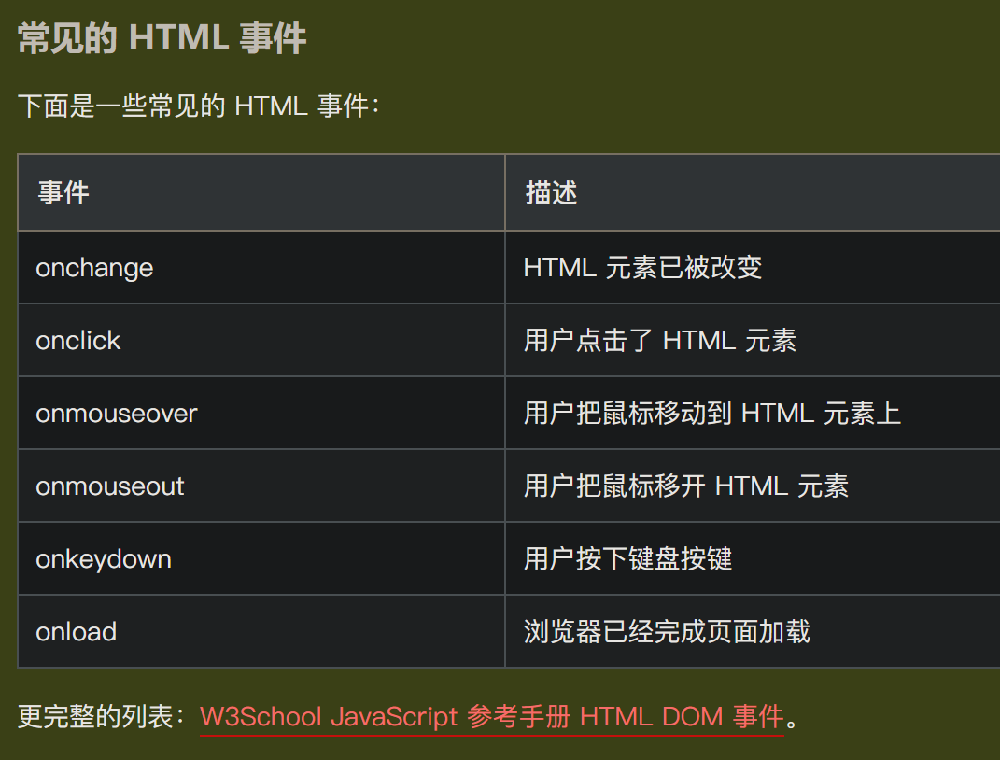

# js的事件处理

事件处理的过程分为三步：
1. 发生事件
2. 启动事件处理程序
3. 事件处理程序做出反应

## HTML 事件

> HTML 事件是发生在 HTML 元素上的事情
> JavaScript 允许您在事件被侦测到时执行代码

### 常见的 HTML 事件



[详细文档](https://www.w3school.com.cn/jsref/dom_obj_event.asp)

## 事件的调用

### 在 HTML 中调用

在HTML中分配事件处理程序，只需要在HTML标记中添加相应的事件，并在其中指定要执行的代码或时函数名即可。例如：
```html
<input name="save" type="button" value="保存" onclick="alert('单击了保存按钮');">
```

### 在 JavaScript 中调用

在JavaScript中调用事件处理程序，首先需要获取要处理对象的引用，然后将要执行的处理函数赋值给对应的事件。例如：
```html
<input id="save" name="save" type="button" value="保存">
<script type="text/javascript">
    var b_save=document.getElementById("save"); //获取id属性值为save的元素
    b_save.onclick=function () {
        alert("单击了保存按钮！");
    }
</script>
```

## 事件对象


