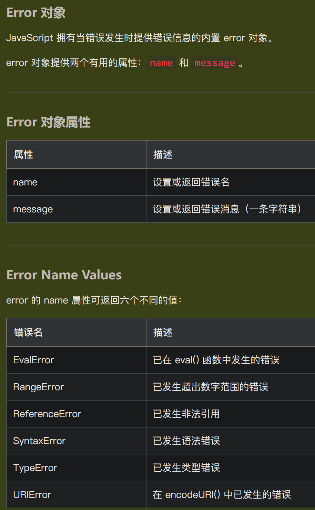

# js的条件语句

[if-else语句](https://www.w3school.com.cn/js/js_if_else.asp)

[switch-case-break-default语句](https://www.w3school.com.cn/js/js_switch.asp)

# js的循环语句

JavaScript 支持不同类型的循环：
- for - 多次遍历代码块
- for/in - 遍历对象属性
- for/of - 循环遍历可迭代对象的值
- while - 当指定条件为 true 时循环一段代码块
- do/while - 当指定条件为 true 时循环一段代码块

## for循环

```js
var text = "";
for (let i = 0; i < 5; i++) {
    text += "数字是 " + i + "<br>";
}
```

## for/in循环

for/in 语句遍历**对象的属性**：
```js
var person = {fname:"Bill", lname:"Gates", age:62}; 
var text = "";
for (let x in person) {
    text += person[x];
}
```

for/in 语句遍历**数组的属性**：
```js
const numbers = [45, 4, 9, 16, 25];
var text = "";
for (let x in numbers) {
    text += numbers[x];
}
```

### 注意

如果索引顺序很重要，不要在数组上使用 for/in
索引顺序依赖于实现，可能不会按照您期望的顺序访问数组值
当顺序很重要时，最好使用 **for循环**、**for/of循环**、**Array.forEach()**

## for/of循环

for/of 语句遍历**可迭代对象的值**
允许您循环遍历可迭代的数据结构，例如数组、字符串、映射、节点列表等：
```js
// 语法
for (variable of iterable) {
    // code block to be executed
}

const cars = ["BMW", "Volvo", "Mini"];
var text = "";
for (let x of cars) {
    text += x;
}
```

## while循环

while 循环会一直循环代码块，只要指定的条件为 true：
```js
// 语法
while (条件) {
    // 要执行的代码块
}

var text = "";
var i = 0;
while (i < 10) {
    text += i;
    i++;
}
```

## do/while循环

do/while 循环是 while 循环的变体。在检查条件之前**先执行一次代码块**，然后如果指定条件为 true，则重复循环：
```js
// 语法
do {
    // 代码块
} while (条件);

var text = "";
var i = 0;
do {
    text += i;
    i++;
} while (i < 10);
```

## Break 和 Continue

break 语句用于 **跳出** 循环或判断
continue 语句用于 **跳过** 循环中的一个迭代，然后继续循环中的下一个迭代

# js的假值（虚值）（falsy）

[官方文档](https://developer.mozilla.org/zh-CN/docs/Glossary/Falsy)

[Truthy（真值）和Falsy（虚值）](https://blog.csdn.net/weixin_44231544/article/details/124816536)

JavaScript 在需要用到布尔类型值的上下文中使用类型转换将值转换为布尔值，例如条件语句和循环语句

`null`、`undefined`、`false`、`0`、`''`、`NaN` 都是虚值（falsy）

# js的异常处理

[链接](https://www.w3school.com.cn/js/js_errors.asp)

`try` 语句使您能够测试代码块中的错误
`catch` 语句允许您处理错误
`throw` 语句允许您创建自定义错误
`finally` 使您能够在 try 和 catch 之后执行代码，无论结果如何

```js
try {
    // 供测试的代码块
    throw "Too big";            // 抛出文本
    throw 500;                  //抛出数字
}
catch(err) {
    // 处理错误的代码块
} 
finally {
    // 无论结果如何都执行的代码块
}
```

## Error 对象



# js的类

[链接](https://www.w3school.com.cn/js/js_classes.asp)

JavaScript 类是 JavaScript 对象的模板

```js
class Car {
  constructor(name, year) {
    this.name = name;
    this.year = year;
  }
  age(x) {
    return x - this.year;
  }
}

let date = new Date();
let year = date.getFullYear();

let myCar = new Car("Ford", 2014);
let myCarStr = "My car is " + myCar.age(year) + " years old.";
```

# js的模块

[链接](https://www.w3school.com.cn/js/js_modules.asp)

模块是使用 `import` 语句从外部文件导入的
模块是使用 `export` 语句导出的


