# 学习路线

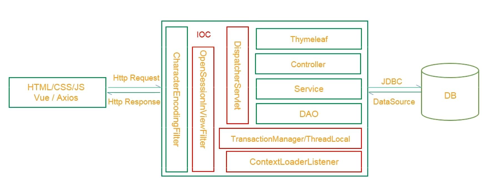

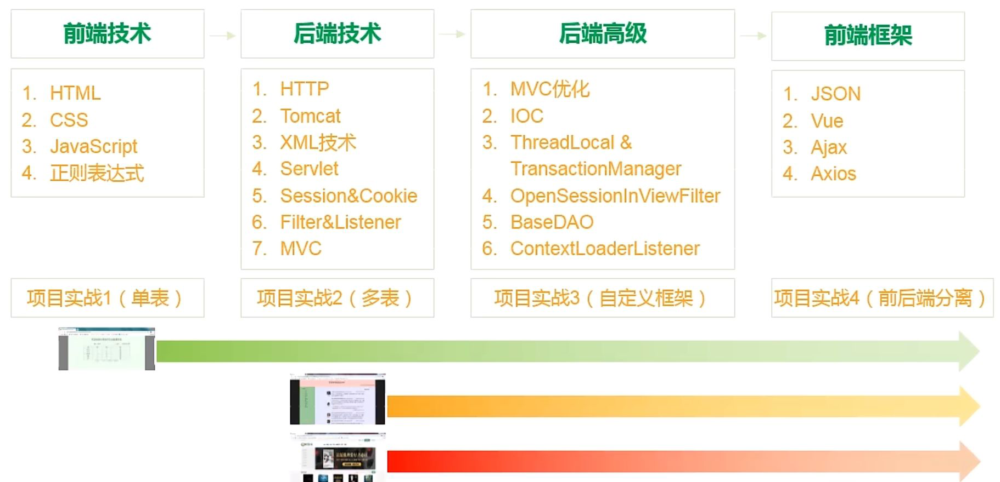

# CSS

CSS最基本的分类：
1. 标签样式表
2. 类样式表
3. ID样式表
4. 组合样式表

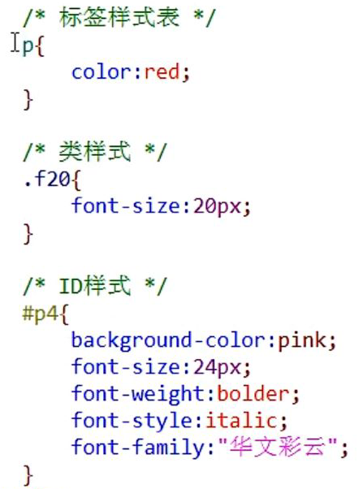
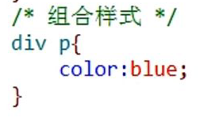

CSS从位置上分类：
1. 嵌入式样式表
2. 内部样式表
3. 外部样式表（推荐）

# CS 和 BS

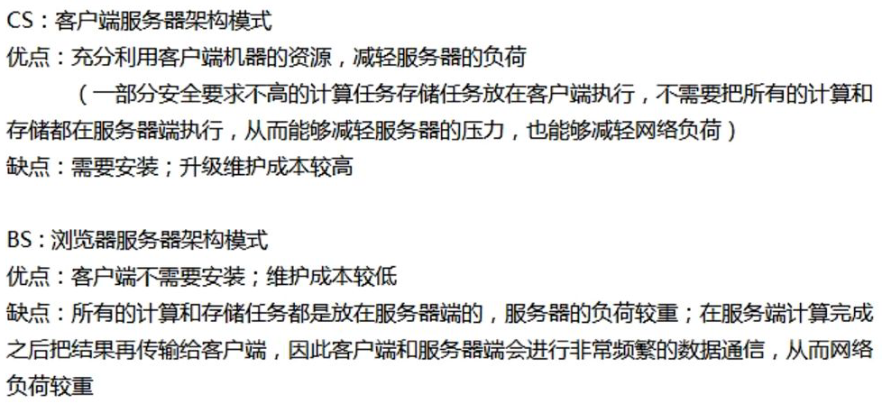

# Tomcat

详见Tomcat_learn文件夹

## 使用Vscode集成Tomcat

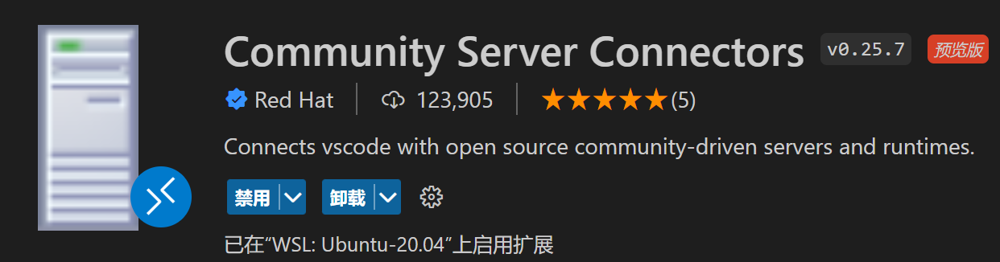

点击创建新的Server
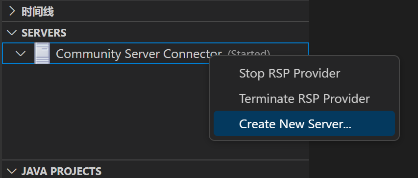

选择本机没有Tomcat服务器，Vscode会自动下载
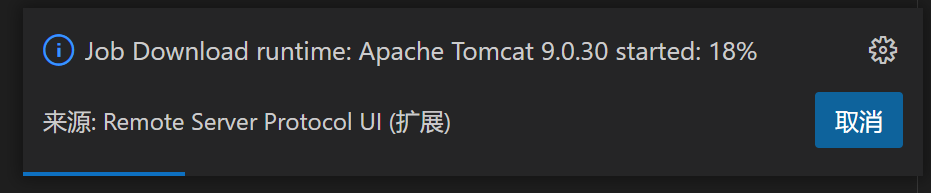
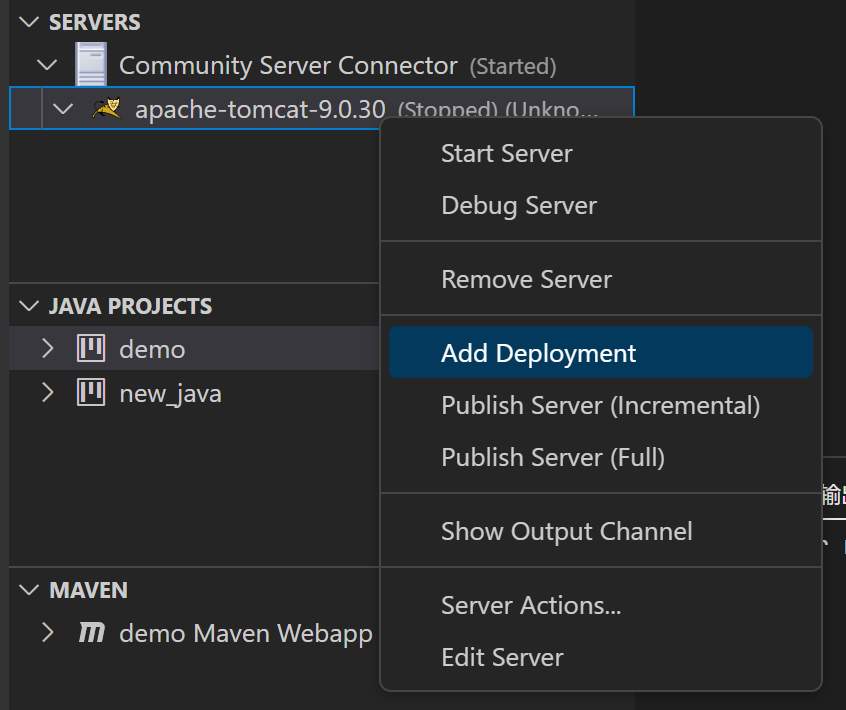
然后选择要部署的工程

这时会显示要部署的项目的路径，此时点击```Start Server```
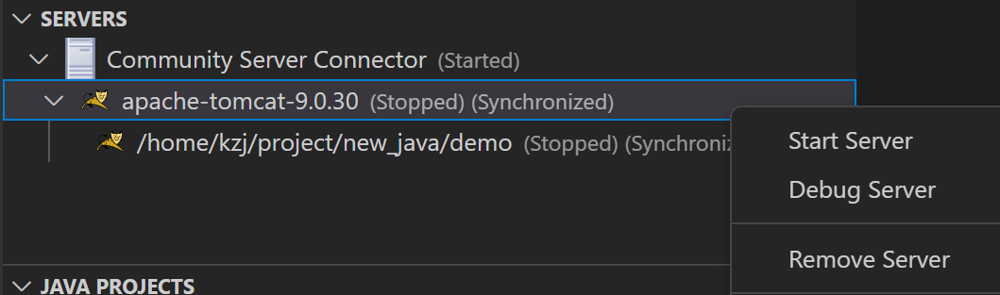

再点击```Publish Server```
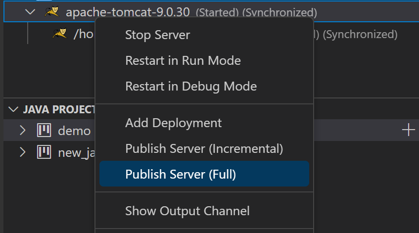
访问```http://localhost:8080/```即可

# 创建JavaWeb工程

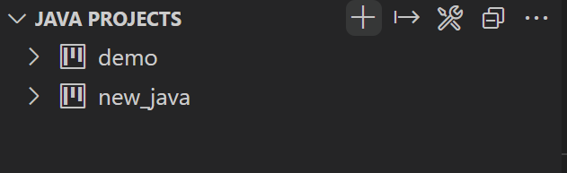
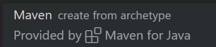
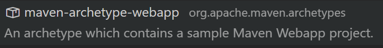
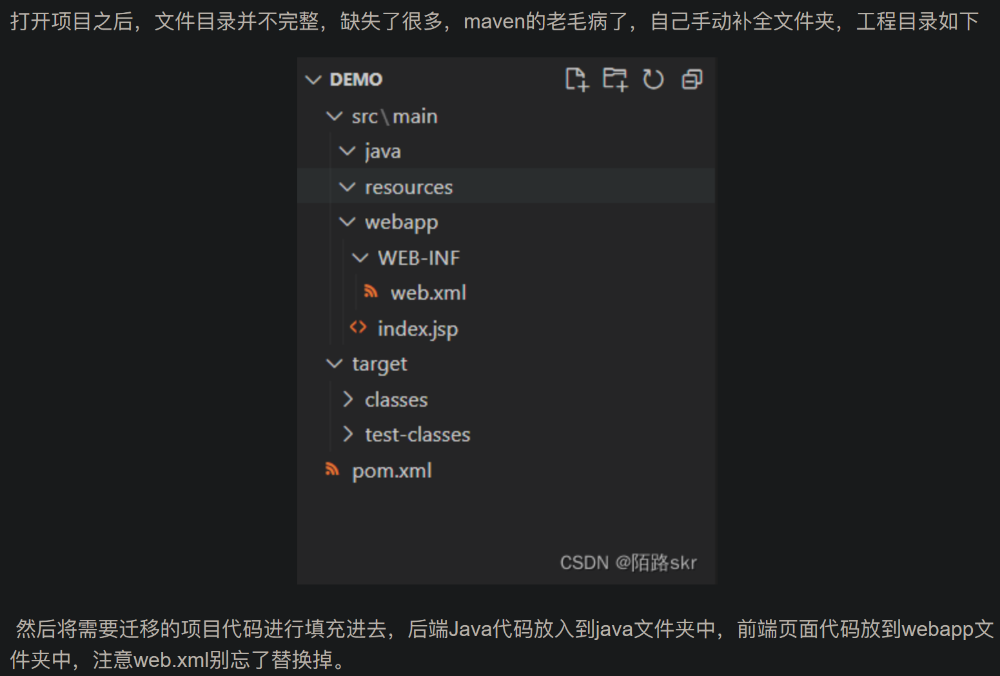

到P21


