# JDBC

## 简介

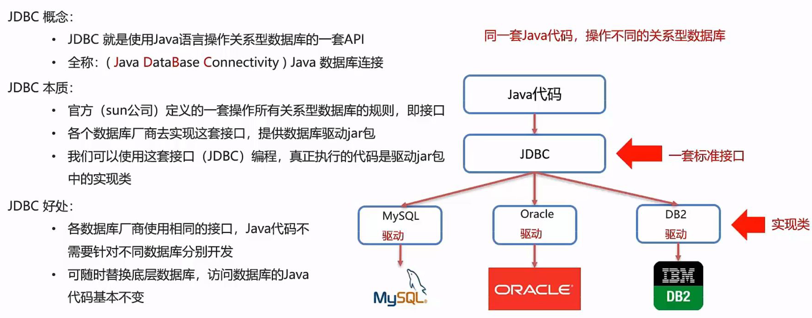

## 安装（通过Maven）

详细流程见Maven_learn文件夹下的1_start.md

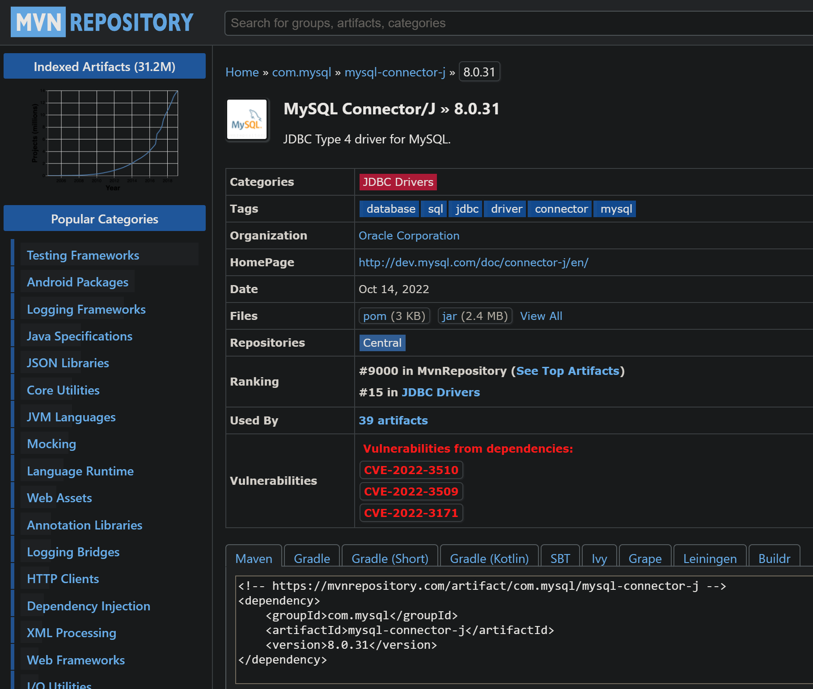

复制
```xml
<!-- https://mvnrepository.com/artifact/com.mysql/mysql-connector-j -->
<dependency>
    <groupId>com.mysql</groupId>
    <artifactId>mysql-connector-j</artifactId>
    <version>8.0.31</version>
</dependency>
```
到pom.xml文件中
注意是**作为依赖(dependency)**，而**不是作为插件(plugin)**

直到会在Vscode中看到这个**依赖**，说明已经**正确**安装
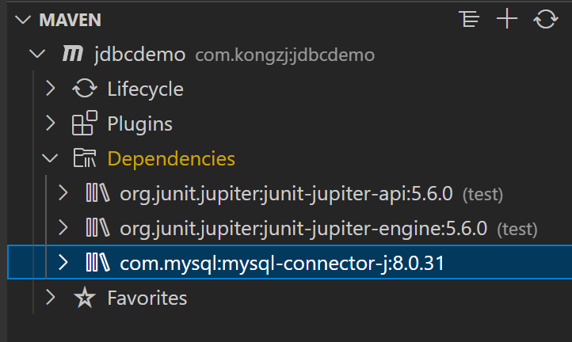

注意，安装成**插件**是**错误**的
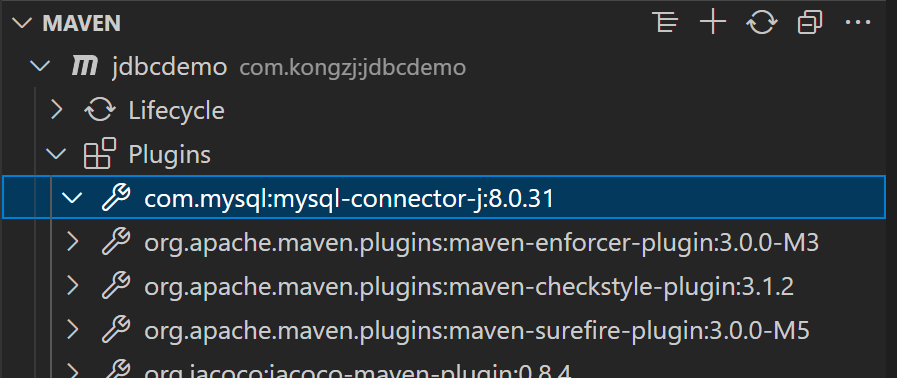

如果当作插件导入，运行时会出现如下错误
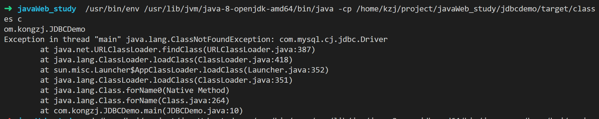

### Maven中依赖（dependency）和插件（plugin）的区别

> 依赖：运行时开发时都需要用到的jar包，比如项目中需要一个Json的jar包，就要添加一个依赖，这个依赖在项目运行时也需要，因此在项目打包时需要把这些依赖也打包进项目里；
> 插件：在项目开的发时需要，但是在项目运行时不需要，因此在项目开发完成后不需要把插件打包进项目中，比如有个可以自动生成getter和setter的插件，因为这玩意在编译时生成getter和setter，编译结束后就没用了，所以项目打包时并不需要把插件放进去

## 使用

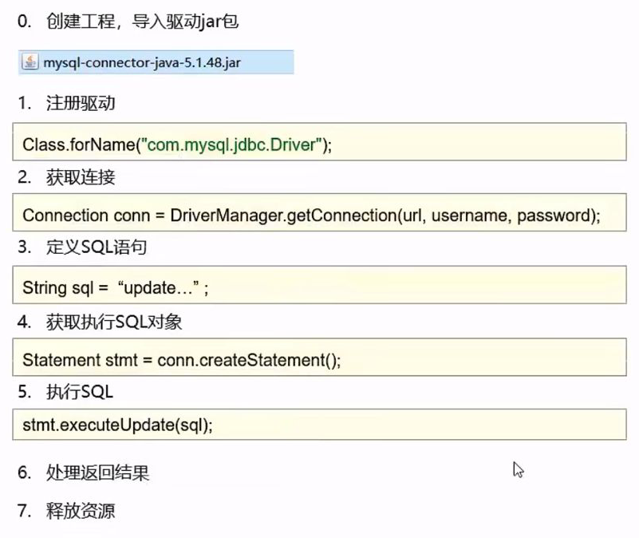
注意：
1. 我是用Maven导入**依赖**（注意**不是插件**），就不用手动导入jar包
2. 自Mysql 8.0后，驱动名字从```com.mysql.jdbc.Driver```更改为```com.mysql.cj.jdbc.Driver```

用于测试的java文件如下
```java
package com.kongzj;
import java.sql.Statement;
import java.sql.Connection;
import java.sql.DriverManager;

public class JDBCDemo {
    public static void main(String[] args) throws Exception {
        // 1. 注册驱动
        Class.forName("com.mysql.cj.jdbc.Driver");
        // 2. 获取连接对象
        String url = "jdbc:mysql://localhost:3306/SSM?serverTimezone=UTC";
        String username = "root";
        String password = "1";
        Connection conn = DriverManager.getConnection(url, username, password);
        // 3. 定义sql
        String sql = "update t_user set age=100 where id=35";
        // 4. 获取执行sql的对象
        Statement stmt = conn.createStatement();
        // 5. 执行sql
        int count = stmt.executeUpdate(sql);
        // 6. 处理结果
        System.out.println("受影响的行数 ： " + count);
        // 7. 释放资源
        stmt.close();
        conn.close();
    }
}
```

运行成功
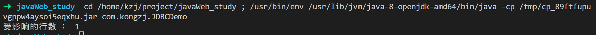

## API详解

### DriverManager

驱动管理类，作用：
1. 注册驱动
2. 获取数据库连接

### Connection

数据库连接对象，作用：
1. 获取执行sql的对象
2. 管理事务
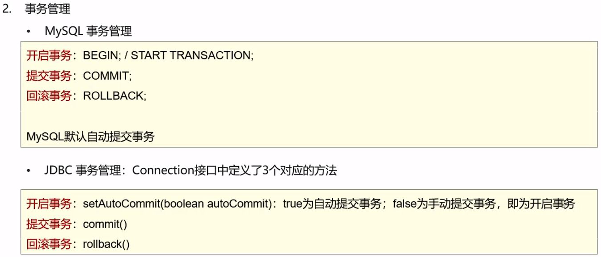

#### 事务管理

希望两条sql语句要么同时成功，要么同时失败
java文件如下
```java
package com.kongzj;
import java.sql.Statement;
import java.sql.Connection;
import java.sql.DriverManager;

public class JDBCDemo {
    public static void main(String[] args) throws Exception {
        // 1. 注册驱动
        Class.forName("com.mysql.cj.jdbc.Driver");
        // 2. 获取连接对象
        String url = "jdbc:mysql://localhost:3306/SSM?serverTimezone=UTC";
        String username = "root";
        String password = "1";
        Connection conn = DriverManager.getConnection(url, username, password);
        // 3. 定义sql
        String sql1 = "update t_user set age=100 where id=37";
        String sql2 = "update t_user set age=100 where id=38";
        // 4. 获取执行sql的对象
        Statement stmt = conn.createStatement();

        try {
            // new: 开启事务
            conn.setAutoCommit(false);
            // 5. 执行sql
            int count1 = stmt.executeUpdate(sql1);
            // new: 异常
            int i=3/0;
            int count2 = stmt.executeUpdate(sql2);
            // 6. 处理结果
            System.out.println("受影响的行数 ： " + count1);
            System.out.println("受影响的行数 ： " + count2);
            // new: 提交事务
            conn.commit();
        } catch (Exception throwavblesException) {
            // new: 回滚事务
            conn.rollback();
            throwavblesException.printStackTrace();
        }
        
        // 7. 释放资源
        stmt.close();
        conn.close();
    }
}
```

### Statement

作用：
1. 执行sql语句
   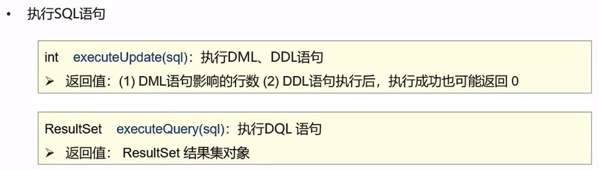

### ResultSet

结果集对象，作用：
1. 封装了DQL查询语句的结果
   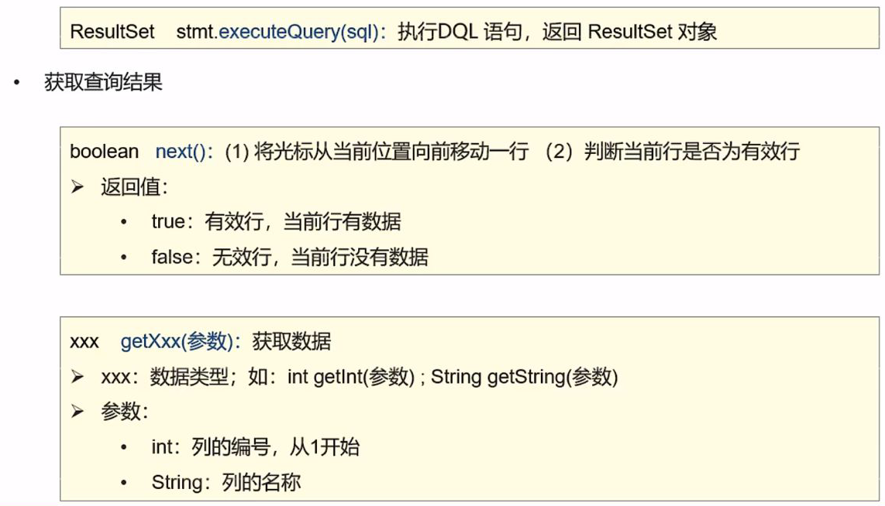

#### 获取数据

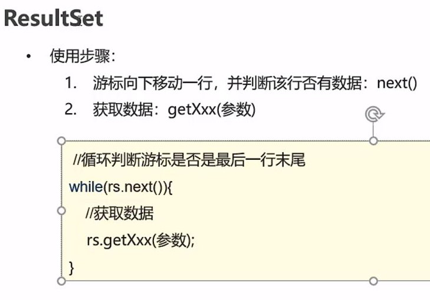

java文件如下
```java
package com.kongzj;
import java.sql.Statement;
import java.sql.Connection;
import java.sql.DriverManager;
import java.sql.ResultSet;

public class JDBCDemo {
    public static void main(String[] args) throws Exception {
        // 1. 注册驱动
        Class.forName("com.mysql.cj.jdbc.Driver");
        // 2. 获取连接对象
        String url = "jdbc:mysql://localhost:3306/SSM?serverTimezone=UTC";
        String username = "root";
        String password = "1";
        Connection conn = DriverManager.getConnection(url, username, password);
        // 3. 定义sql
        String sql = "select * from t_user";
        // 4. 获取执行sql的对象
        Statement stmt = conn.createStatement();
        // 5. 执行sql
        ResultSet rs = stmt.executeQuery(sql);
        // 6. 处理结果，遍历rs中的所有数据
        while (rs.next()) {
            int id = rs.getInt(1);
            String usrname = rs.getString(2);
            String passwd = rs.getString(3);
            int age = rs.getInt(4);
            String gender = rs.getString(5);
            String email = rs.getString(6);
            System.out.println(id+usrname+passwd+age+gender+email);
        }
        // 7. 释放资源
        rs.close();
        stmt.close();
        conn.close();
    }
}
```

### PreparedStatement

预编译sql语句的对象（继承自Statement），作用：
1. 预编译sql语句并执行，预防sql注入

#### sql注入


用于判断用户账户和密码的sql语句为
```sql
select * from t_user where username = '传入的name' and password = '传入的密码';
```

被注入后的sql语句为
```sql
select * from t_user where username = '随便输入的name' and password = '' or '1' = '1';
```

java文件如下
```java
package com.kongzj;
import java.sql.Statement;
import java.sql.Connection;
import java.sql.DriverManager;
import java.sql.ResultSet;

public class JDBCDemo {
    public static void main(String[] args) throws Exception {
        // 1. 注册驱动
        Class.forName("com.mysql.cj.jdbc.Driver");
        // 2. 获取连接对象
        String url = "jdbc:mysql://localhost:3306/SSM?serverTimezone=UTC";
        String username = "root";
        String password = "1";
        Connection conn = DriverManager.getConnection(url, username, password);
        // new: 接收用户输入的用户名和密码
        String usrname = "testSqlInject";
        String passwd = "' or '1' = '1";
        // 3. 定义sql
        String sql = "select * from t_user where username = '" + usrname + "' and password = '" + passwd + "'";
        // 4. 获取执行sql的对象
        Statement stmt = conn.createStatement();
        // 5. 执行sql
        ResultSet rs = stmt.executeQuery(sql);
        // 6. 处理结果
        // new: 判断是否登录成功
        if(rs.next()){
            System.out.println("登录成功");
        }else{
            System.out.println("登录失败");
        }
        // 7. 释放资源
        rs.close();
        stmt.close();
        conn.close();
    }
}
```

#### 预防sql注入（对敏感字符转义）

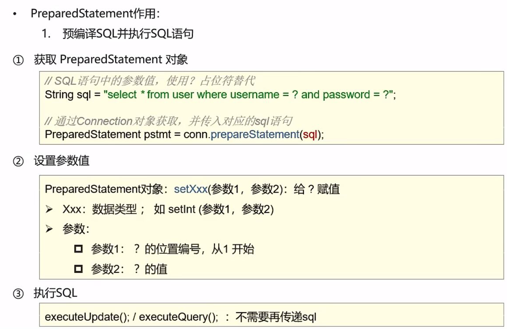

预防sql注入的原理：
在把```' or '1' = '1```进行字符串拼接的时候，会进行转义，变成```\' or \'1\' = \'1```

java文件如下
```java
package com.kongzj;
import java.sql.Connection;
import java.sql.DriverManager;
import java.sql.PreparedStatement;
import java.sql.ResultSet;

public class JDBCDemo {
    public static void main(String[] args) throws Exception {
        // 1. 注册驱动
        Class.forName("com.mysql.cj.jdbc.Driver");
        // 2. 获取连接对象
        String url = "jdbc:mysql://localhost:3306/SSM?serverTimezone=UTC";
        String username = "root";
        String password = "1";
        Connection conn = DriverManager.getConnection(url, username, password);
        // 接收用户输入的用户名和密码
        String usrname = "testSqlInject";
        String passwd = "' or '1' = '1";
        // new: 3. 定义sql
        String sql = "select * from t_user where username = ? and password = ?";
        // new: 4. 获取执行sql的对象
        PreparedStatement pstmt = conn.prepareStatement(sql);
        // new: 设置?的值
        pstmt.setString(1, usrname);
        pstmt.setString(2, passwd);
        // new: 5. 执行sql
        ResultSet rs = pstmt.executeQuery();
        // 6. 处理结果
        // 判断是否登录成功
        if(rs.next()){
            System.out.println("登录成功");
        }else{
            System.out.println("登录失败");
        }
        // 7. 释放资源
        rs.close();
        pstmt.close();
        conn.close();
    }
}
```

## 数据库连接池

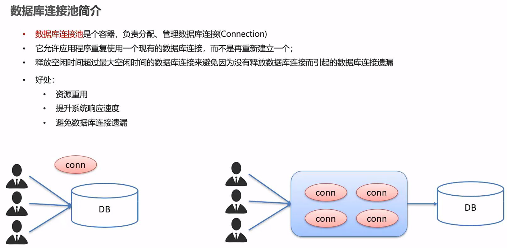

### Druid（德鲁伊）

通过Maven安装Druid
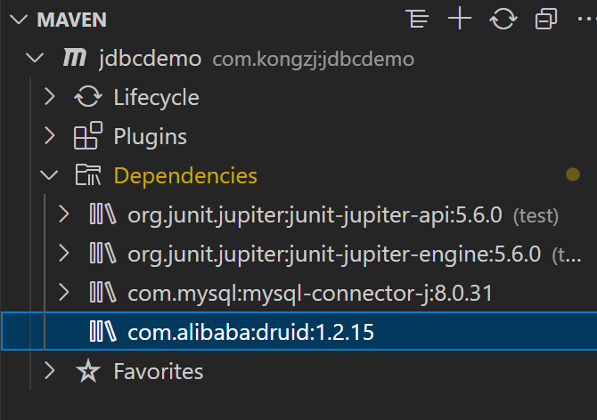

#### 创建配置文件

在src目录下创建配置文件druid.properties，内容为
```properties
driverClassName = com.mysql.cj.jdbc.Driver
url = jdbc:mysql://localhost:3306/SSM?serverTimezone=UTC
username = root
password = 1
# 初始化连接数量
initialSize = 5
# 最大连接数
maxActive = 10
# 最大等待时间
maxWait = 3000
```

#### 使用Druid

java文件如下
```java
package com.kongzj;
import java.io.FileInputStream;
import java.sql.Connection;
import java.util.Properties;
import javax.sql.DataSource;
import com.alibaba.druid.pool.DruidDataSourceFactory;

public class DruidDemo {
    public static void main(String[] args) throws Exception {
        // 加载配置文件
        Properties prop = new Properties();
        prop.load(new FileInputStream("jdbcdemo/src/druid.properties"));
        // 获取连接池对象
        DataSource dataSource = DruidDataSourceFactory.createDataSource(prop);
        // 获取数据库连接 Connection
        Connection connection = dataSource.getConnection();
        System.out.println(connection);
    }
}
```


