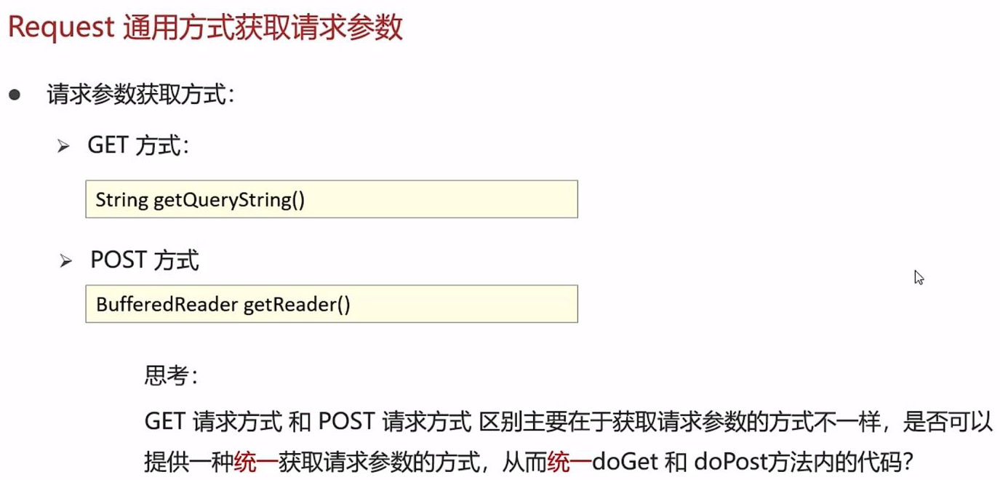

# Servlet


## HTTP


### 请求数据格式


### 响应数据格式


## Tomcat

详见Tomcat_learn文件夹


## Servlet简介


## Servlet入门


### 导入Tomcat插件


### 导入Servlet依赖


### 实现Servlet接口，重写接口的方法，配置访问路径

文件ServletDemo.java的内容为
```java
package com.kongzj.web;
import java.io.IOException;
import javax.servlet.Servlet;
import javax.servlet.ServletConfig;
import javax.servlet.ServletException;
import javax.servlet.ServletRequest;
import javax.servlet.ServletResponse;
import javax.servlet.annotation.WebServlet;

@WebServlet("/demo")
public class ServletDemo implements Servlet{

    @Override
    public void destroy() {
        // TODO Auto-generated method stub
    }

    @Override
    public ServletConfig getServletConfig() {
        // TODO Auto-generated method stub
        return null;
    }

    @Override
    public String getServletInfo() {
        // TODO Auto-generated method stub
        return null;
    }

    @Override
    public void init(ServletConfig arg0) throws ServletException {
        // TODO Auto-generated method stub     
    }

    @Override
    public void service(ServletRequest arg0, ServletResponse arg1) throws ServletException, IOException {
        System.out.println("Servlet hello world");
    }
}
```

### 启动Tomcat，在浏览器中访问

出现以下情况，说明默认端口被占用


那就修改端口，pom.xml文件的对应位置修改如下


即可在自定义的端口上运行


此时用浏览器进入```http://localhost:8081/servletdemo/demo```，控制台就会有反应


## Servlet执行流程和生命周期


### init 方法

调用时机：
1. 默认情况下，Servlet被第一个访问时，调用方法
2. 可用```loadOnStartup```属性，修改调用时机

调用次数：
一次

### service 方法

调用时机：
每次Servlet被访问时，调用方法

调用次数：
多次

### destroy 方法

调用时机：
内存释放或服务器关闭的时候，Servlet对象会被销毁，调用方法

调用次数：
一次

## Servlet中的方法


### getServletConfig 方法

用来获取Servlet的配置对象
这个方法要返回ServletConfig对象，在init方法中，有个参数为ServletConfig对象，我们只需要在getServletConfig方法中，将init方法中的ServletConfig对象返回（将局部变量的作用域提升，通过保存到成员变量的位置）

文件ServletDemo.java的内容为
```java
package com.kongzj.web;
import java.io.IOException;
import javax.servlet.Servlet;
import javax.servlet.ServletConfig;
import javax.servlet.ServletException;
import javax.servlet.ServletRequest;
import javax.servlet.ServletResponse;
import javax.servlet.annotation.WebServlet;

@WebServlet(urlPatterns = "/demo", loadOnStartup = 1)
public class ServletDemo implements Servlet{
    private ServletConfig config;

    @Override
    public void destroy() {
        System.out.println("destroy...");
    }

    @Override
    public ServletConfig getServletConfig() {
        return this.config;
    }

    @Override
    public String getServletInfo() {
        // TODO Auto-generated method stub
        return null;
    }

    @Override
    public void init(ServletConfig arg0) throws ServletException {
        this.config = arg0;
        System.out.println("init...");    
    }

    @Override
    public void service(ServletRequest arg0, ServletResponse arg1) throws ServletException, IOException {
        System.out.println("Servlet hello world");
    }
}
```

## Servlet体系结构


### 继承HttpServlet类

文件HttpServletDemo.java的内容为
```java
package com.kongzj.web;
import java.io.IOException;
import javax.servlet.ServletException;
import javax.servlet.annotation.WebServlet;
import javax.servlet.http.HttpServlet;
import javax.servlet.http.HttpServletRequest;
import javax.servlet.http.HttpServletResponse;

@WebServlet("/httpservletdemo")
public class HttpServletDemo extends HttpServlet{

    @Override
    protected void doGet(HttpServletRequest req, HttpServletResponse resp) throws ServletException, IOException {
        System.out.println("get...");
    }

    @Override
    protected void doPost(HttpServletRequest req, HttpServletResponse resp) throws ServletException, IOException {
        System.out.println("post...");
    }
}
```

#### GET请求方式

启动Tomcat服务器，访问```http://localhost:8081/servletdemo/httpservletdemo```（GET请求方式）


#### POST请求方式

在webapp目录下新建文件a.html，内容为
```html
<!DOCTYPE html>
<html lang="en">
<head>
    <meta charset="UTF-8">
    <title>Title</title>
</head>
<body>

<form action="/servletdemo/httpservletdemo" method="post">
    <input name="username">
    <input type="submit">
</form>

</body>
</html>
```

然后启动Tomcat服务器，访问```http://localhost:8081/servletdemo/a.html```


随便输入后，提交，会跳转到```http://localhost:8081/servletdemo/httpservletdemo```（POST请求方式）


#### 继承HttpServlet类比实现Servlet接口的优势

如果只是实现Servlet接口，要多写很多代码


如果是继承HttpServlet类，HttpServlet类已经帮助我们做了**方法分发**


## Servlet urlPattern配置

### 用注解的方式配置Servlet（新版本的配置方式）


### XML方式配置Servlet（旧版本的配置方式）


## Request（请求）、Response（响应）

在实现Servlet接口，重写接口的service方法中，有两个参数：request和response


### Request

#### Request 继承体系


#### Request 获取请求数据


GET方式传送请求


POST方式传送请求


注意：
1. GET方式获取请求参数，通过getQueryString方法
2. POST方式获取请求参数，通过getReader方法，获取字符输入流

##### 通用方式获取请求参数




把webapp目录下的文件a.html内容改为
```html
<!DOCTYPE html>
<html lang="en">
<head>
    <meta charset="UTF-8">
    <title>Title</title>
</head>
<body>

<form action="/servletdemo/httpservletdemo" method="get">
    <input type="text" name="username"><br>
    <input type="password" name="password"><br>
    <input type="checkbox" name="hobby" value="1"> 游泳
    <input type="checkbox" name="hobby" value="2"> 爬山 <br>
    <input type="submit">
</form>

</body>
</html>
```
注意这里是GET提交方式

文件HttpServletDemo.java的内容改为
```java
package com.kongzj.web;
import java.io.IOException;
import java.util.Map;
import javax.servlet.ServletException;
import javax.servlet.annotation.WebServlet;
import javax.servlet.http.HttpServlet;
import javax.servlet.http.HttpServletRequest;
import javax.servlet.http.HttpServletResponse;

@WebServlet("/httpservletdemo")
public class HttpServletDemo extends HttpServlet{

    @Override
    protected void doGet(HttpServletRequest req, HttpServletResponse resp) throws ServletException, IOException {
        System.out.println("get...");

        // 1. 获取所有参数的Map集合
        Map<String, String[]> map = req.getParameterMap();
        for (String key : map.keySet()) {
            System.out.print(key + " : ");
            String[] values = map.get(key);
            for(String value : values) {
                System.out.print(value + ", ");
            }
            System.out.println();
        }

        System.out.println("------------------");

        // 2. 根据key获取参数值数组
        String[] hobbies = req.getParameterValues("hobby");
        for (String hobby : hobbies) {
            System.out.print(hobby + ", ");
        }

        // 3. 根据key获取单个参数值
        String username = req.getParameter("username");
        String password = req.getParameter("password");
        System.out.println(username);
        System.out.println(password);
    }

    @Override
    protected void doPost(HttpServletRequest req, HttpServletResponse resp) throws ServletException, IOException {
        System.out.println("post...");
    }
}
```


控制台输出如下


在HttpServletDemo.java中把获取请求参数的代码，原封不动得放到doPost方法中，并把a.html中的提交方式改为POST，经测试，控制台可以正常输出请求参数

这样的话，获取请求参数的代码就不用写两份，可以让doPost方法跳转到doGet方法


##### 解决请求参数中文乱码问题

###### POST请求


注意获取请求参数的底层原理不同：
1. GET方式获取请求参数，通过getQueryString方法
2. POST方式获取请求参数，通过getReader方法，获取字符输入流

所以```req.setCharacterEncoding("UTF-8");```方法不适用于GET请求

###### GET请求

UTF-8中，一个汉字占3个字节，浏览器自动帮我们编码成二进制


模拟**浏览器的URL编码**和**Tomcat的URL解码**，只不过Tomcat用的是ISO-8859-1字符集，不是对应的UTF-8，所以出现了乱码


总结：


#### Request 请求转发


例子：


注意**请求转发**和**重定向**的区别

### Response

#### Response 继承体系


#### Response 设置响应数据


#### Response 完成重定向


文件ResponseDemo1.java的内容如下
```java
package com.kongzj.web;
import java.io.IOException;
import javax.servlet.ServletException;
import javax.servlet.annotation.WebServlet;
import javax.servlet.http.HttpServlet;
import javax.servlet.http.HttpServletRequest;
import javax.servlet.http.HttpServletResponse;

@WebServlet("/resp1")
public class ResponseDemo1 extends HttpServlet{
    @Override
    protected void doGet(HttpServletRequest req, HttpServletResponse resp) throws ServletException, IOException {
        System.out.println("resp1...");

        // // 重定向
        // // 设置响应状态码为302
        // resp.setStatus(302);
        // // 设置响应头Location
        // resp.setHeader("Location", "/servletdemo/resp2");

        // 简化方式完成重定向
        resp.sendRedirect("/servletdemo/resp2");
    }
    @Override
    protected void doPost(HttpServletRequest req, HttpServletResponse resp) throws ServletException, IOException {
    }
}
```

文件ResponseDemo2.java的内容如下
```java
package com.kongzj.web;
import java.io.IOException;
import javax.servlet.ServletException;
import javax.servlet.annotation.WebServlet;
import javax.servlet.http.HttpServlet;
import javax.servlet.http.HttpServletRequest;
import javax.servlet.http.HttpServletResponse;

@WebServlet("/resp2")
public class ResponseDemo2 extends HttpServlet{
    @Override
    protected void doGet(HttpServletRequest req, HttpServletResponse resp) throws ServletException, IOException {
        System.out.println("resp2...");
    }
    @Override
    protected void doPost(HttpServletRequest req, HttpServletResponse resp) throws ServletException, IOException {
    }
}
```

输入

会跳转到

控制台输出


可见**重定向**和**请求转发**的三个特点相反

重定向到外部资源：


表单提交可以使用重定向，防止重复提交

##### 路径问题（要不要加虚拟目录）

###### 请求转发时，没加虚拟目录


###### 重定向时，加了虚拟目录


###### 判定标准


###### 动态获取虚拟目录

可以降低代码耦合性


#### Response 响应字符数据

到P108

#### Response 响应字节数据


