# Servlet

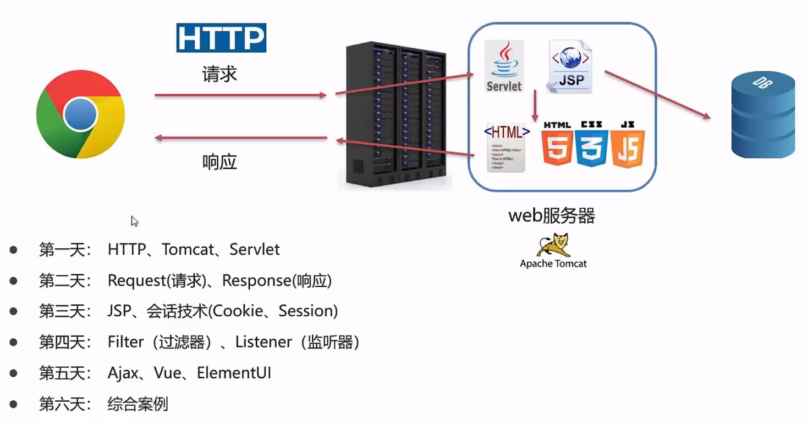

## HTTP

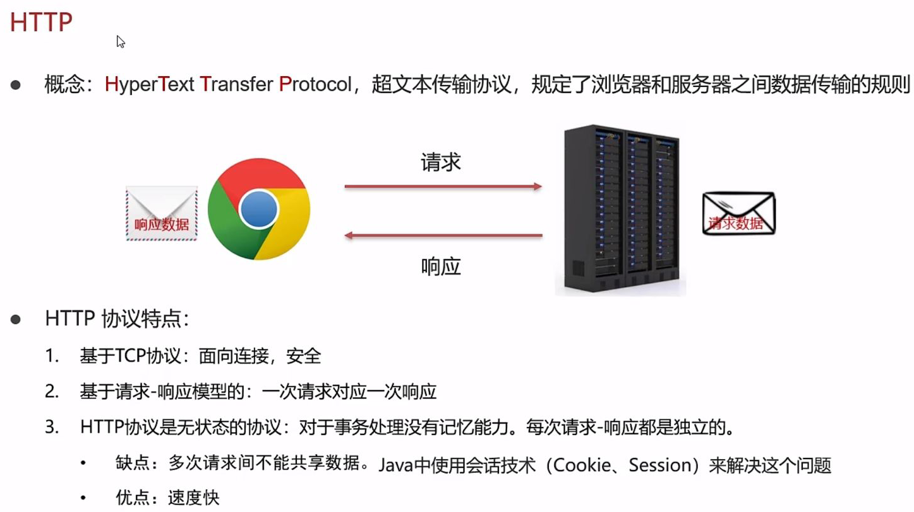

### 请求数据格式

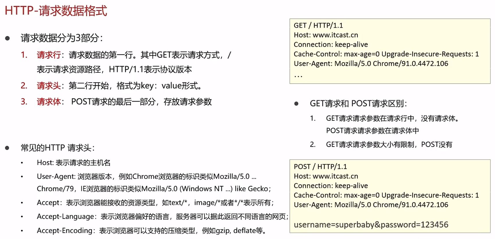

### 响应数据格式


## Tomcat

详见Tomcat_learn文件夹

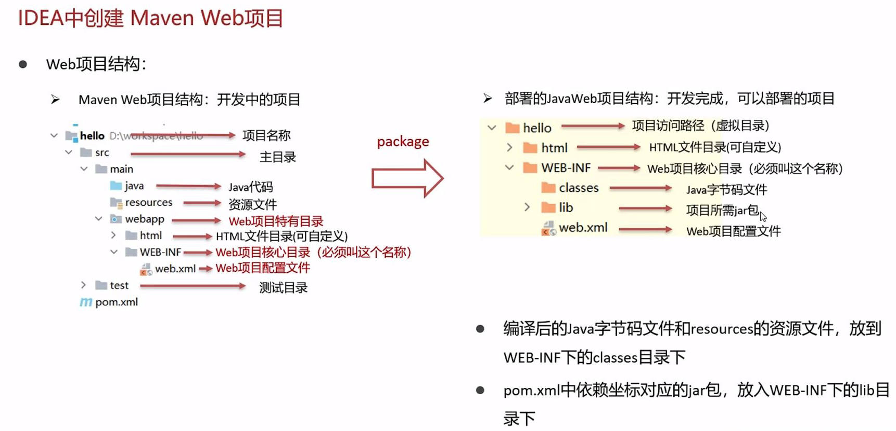

## Servlet简介

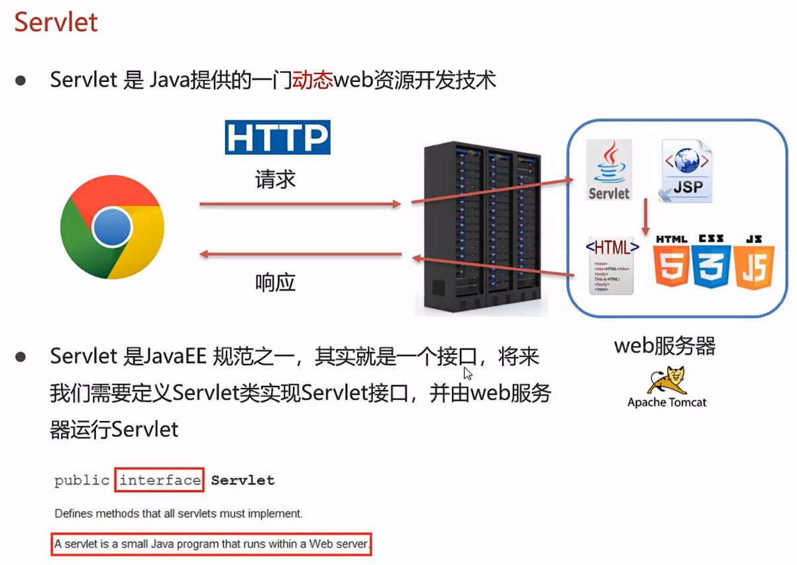

## Servlet入门


### 导入Tomcat插件


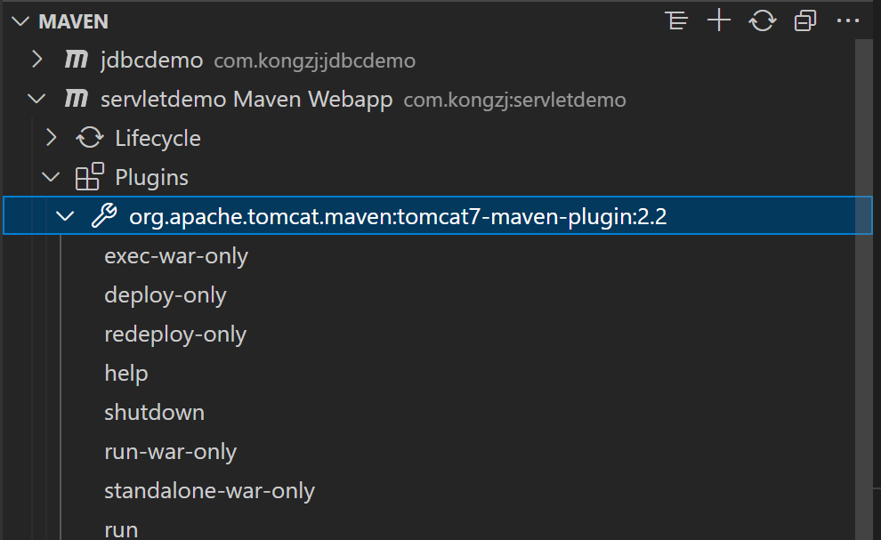

### 导入Servlet依赖


### 实现Servlet接口，重写接口的方法，配置访问路径

文件ServletDemo.java的内容为
```java
package com.kongzj.web;
import java.io.IOException;
import javax.servlet.Servlet;
import javax.servlet.ServletConfig;
import javax.servlet.ServletException;
import javax.servlet.ServletRequest;
import javax.servlet.ServletResponse;
import javax.servlet.annotation.WebServlet;

@WebServlet("/demo")
public class ServletDemo implements Servlet{

    @Override
    public void destroy() {
        // TODO Auto-generated method stub
    }

    @Override
    public ServletConfig getServletConfig() {
        // TODO Auto-generated method stub
        return null;
    }

    @Override
    public String getServletInfo() {
        // TODO Auto-generated method stub
        return null;
    }

    @Override
    public void init(ServletConfig arg0) throws ServletException {
        // TODO Auto-generated method stub     
    }

    @Override
    public void service(ServletRequest arg0, ServletResponse arg1) throws ServletException, IOException {
        System.out.println("Servlet hello world");
    }
}
```

### 启动Tomcat，在浏览器中访问

出现以下情况，说明默认端口被占用
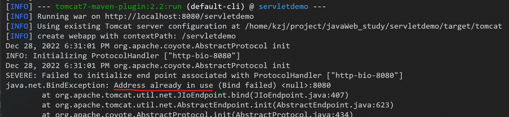

那就修改端口，pom.xml文件的对应位置修改如下


即可在自定义的端口上运行


此时用浏览器进入```http://localhost:8081/servletdemo/demo```，控制台就会有反应


## Servlet执行流程和生命周期

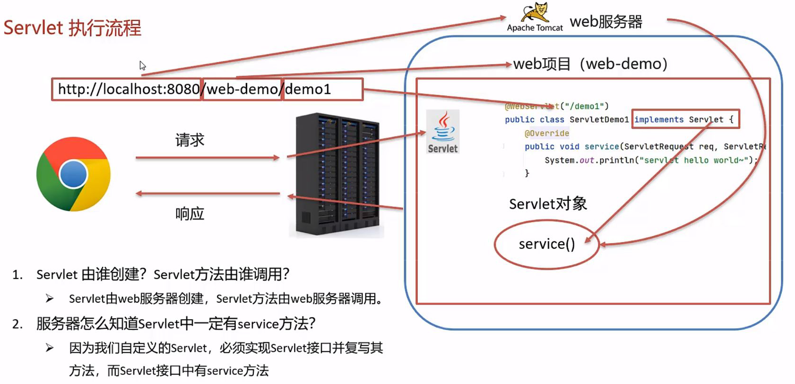

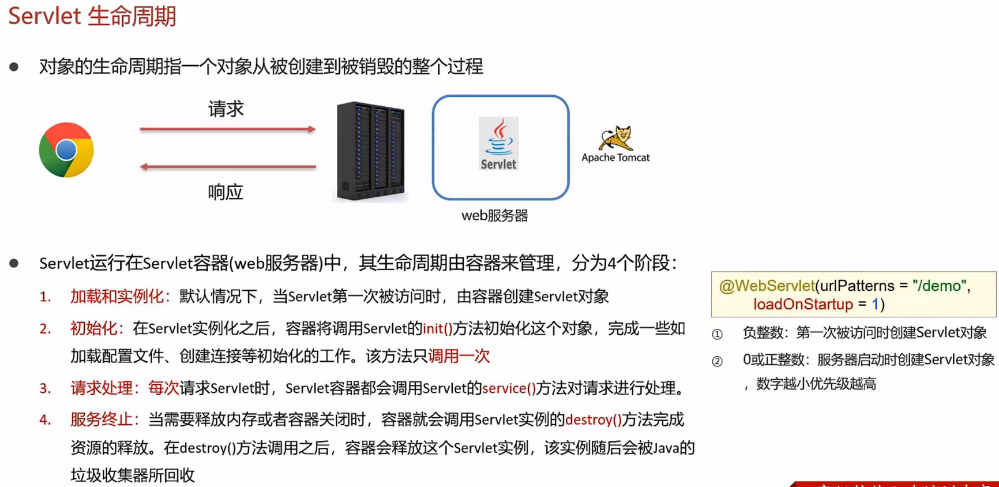

### init 方法

调用时机：
1. 默认情况下，Servlet被第一个访问时，调用方法
2. 可用```loadOnStartup```属性，修改调用时机

调用次数：
一次

### service 方法

调用时机：
每次Servlet被访问时，调用方法

调用次数：
多次

### destroy 方法

调用时机：
内存释放或服务器关闭的时候，Servlet对象会被销毁，调用方法

调用次数：
一次

## Servlet中的方法


### getServletConfig 方法

用来获取Servlet的配置对象
这个方法要返回ServletConfig对象，在init方法中，有个参数为ServletConfig对象，我们只需要在getServletConfig方法中，将init方法中的ServletConfig对象返回（将局部变量的作用域提升，通过保存到成员变量的位置）

文件ServletDemo.java的内容为
```java
package com.kongzj.web;
import java.io.IOException;
import javax.servlet.Servlet;
import javax.servlet.ServletConfig;
import javax.servlet.ServletException;
import javax.servlet.ServletRequest;
import javax.servlet.ServletResponse;
import javax.servlet.annotation.WebServlet;

@WebServlet(urlPatterns = "/demo", loadOnStartup = 1)
public class ServletDemo implements Servlet{
    private ServletConfig config;

    @Override
    public void destroy() {
        System.out.println("destroy...");
    }

    @Override
    public ServletConfig getServletConfig() {
        return this.config;
    }

    @Override
    public String getServletInfo() {
        // TODO Auto-generated method stub
        return null;
    }

    @Override
    public void init(ServletConfig arg0) throws ServletException {
        this.config = arg0;
        System.out.println("init...");    
    }

    @Override
    public void service(ServletRequest arg0, ServletResponse arg1) throws ServletException, IOException {
        System.out.println("Servlet hello world");
    }
}
```

## Servlet体系结构

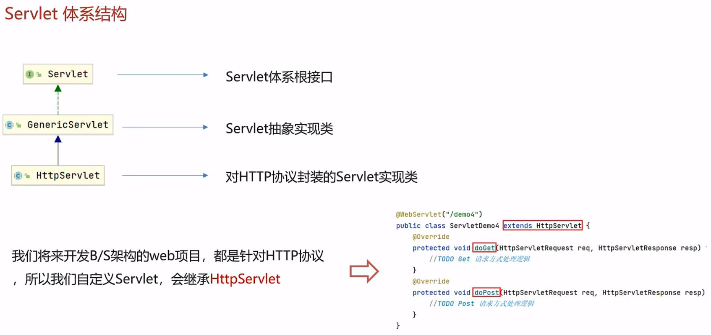

### 继承HttpServlet类

文件HttpServletDemo.java的内容为
```java
package com.kongzj.web;
import java.io.IOException;
import javax.servlet.ServletException;
import javax.servlet.annotation.WebServlet;
import javax.servlet.http.HttpServlet;
import javax.servlet.http.HttpServletRequest;
import javax.servlet.http.HttpServletResponse;

@WebServlet("/httpservletdemo")
public class HttpServletDemo extends HttpServlet{

    @Override
    protected void doGet(HttpServletRequest req, HttpServletResponse resp) throws ServletException, IOException {
        System.out.println("get...");
    }

    @Override
    protected void doPost(HttpServletRequest req, HttpServletResponse resp) throws ServletException, IOException {
        System.out.println("post...");
    }
}
```

#### GET请求方式

启动Tomcat服务器，访问```http://localhost:8081/servletdemo/httpservletdemo```（GET请求方式）
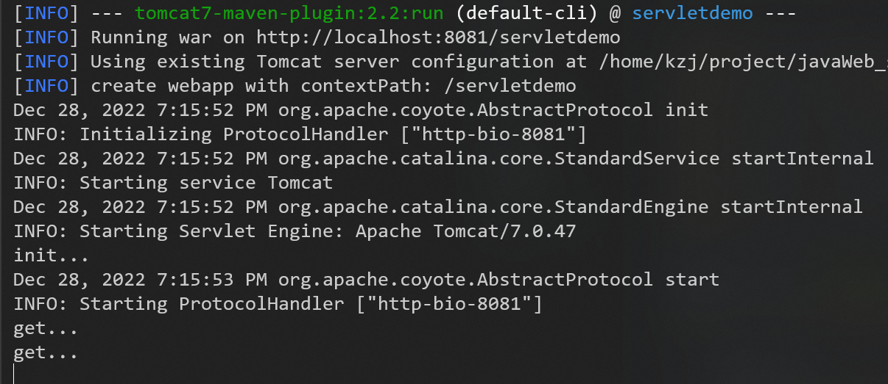

#### POST请求方式

在webapp目录下新建文件a.html，内容为
```html
<!DOCTYPE html>
<html lang="en">
<head>
    <meta charset="UTF-8">
    <title>Title</title>
</head>
<body>

<form action="/servletdemo/httpservletdemo" method="post">
    <input name="username">
    <input type="submit">
</form>

</body>
</html>
```

然后启动Tomcat服务器，访问```http://localhost:8081/servletdemo/a.html```
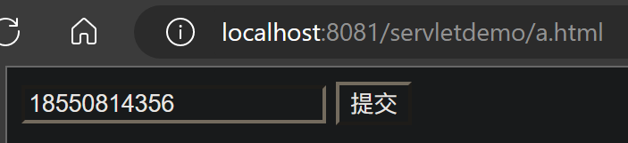

随便输入后，提交，会跳转到```http://localhost:8081/servletdemo/httpservletdemo```（POST请求方式）

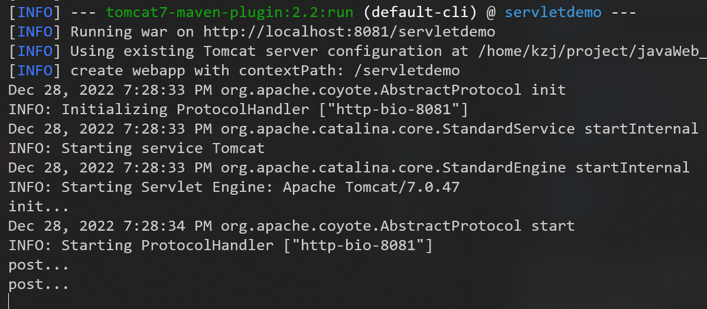

#### 继承HttpServlet类比实现Servlet接口的优势

如果只是实现Servlet接口，要多写很多代码
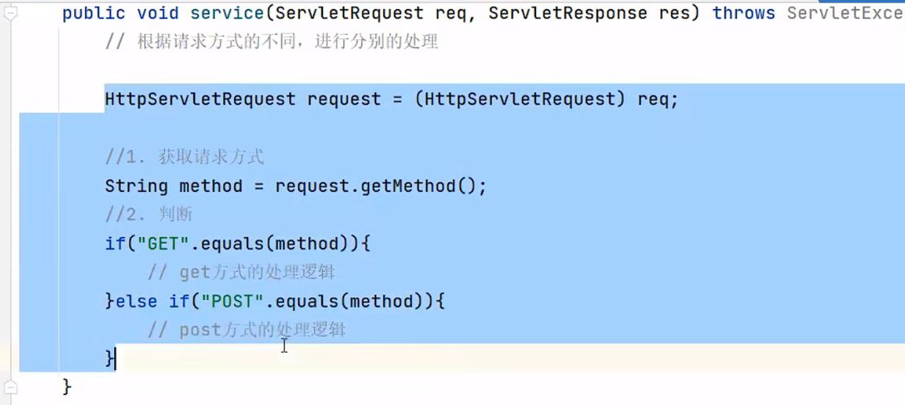

如果是继承HttpServlet类，HttpServlet类已经帮助我们做了**方法分发**
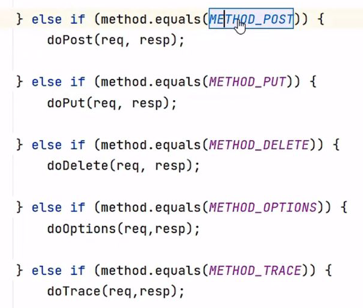


到P97


