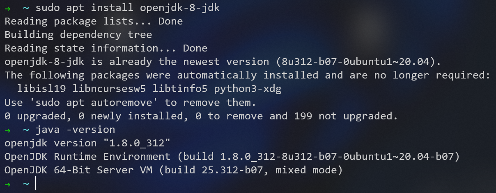
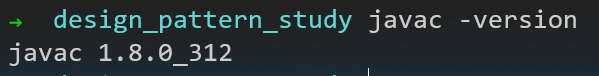
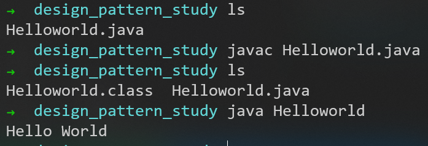
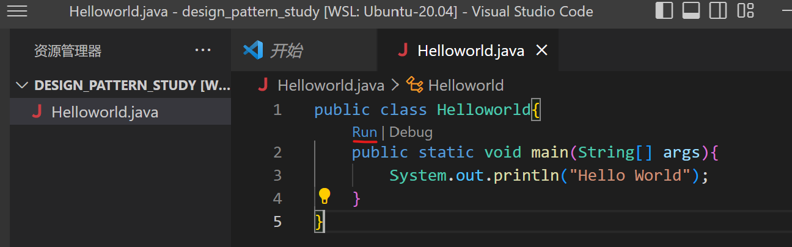
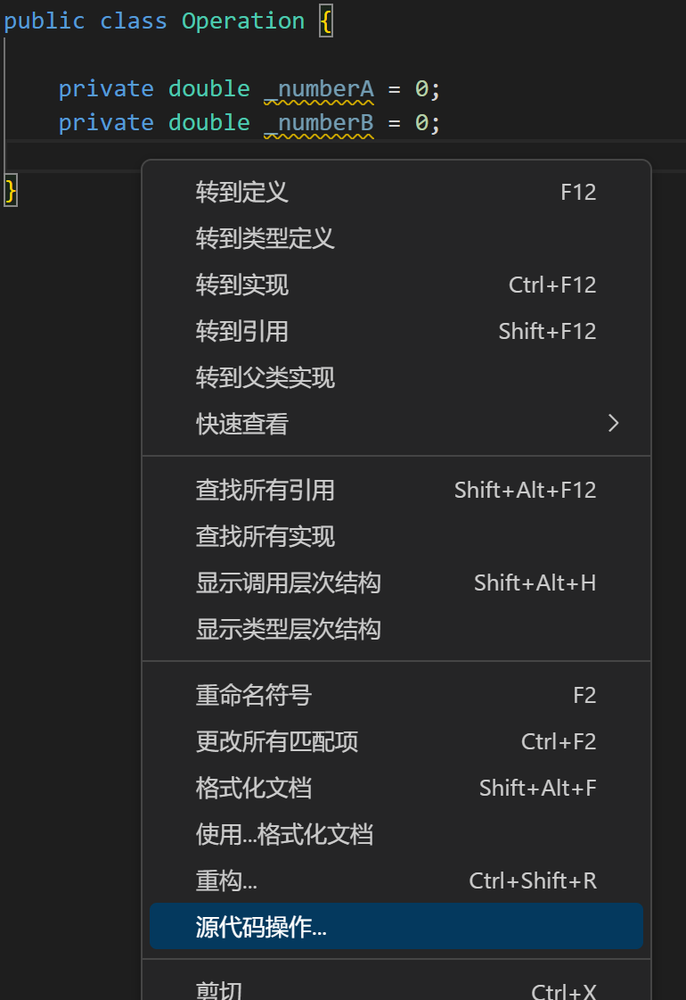
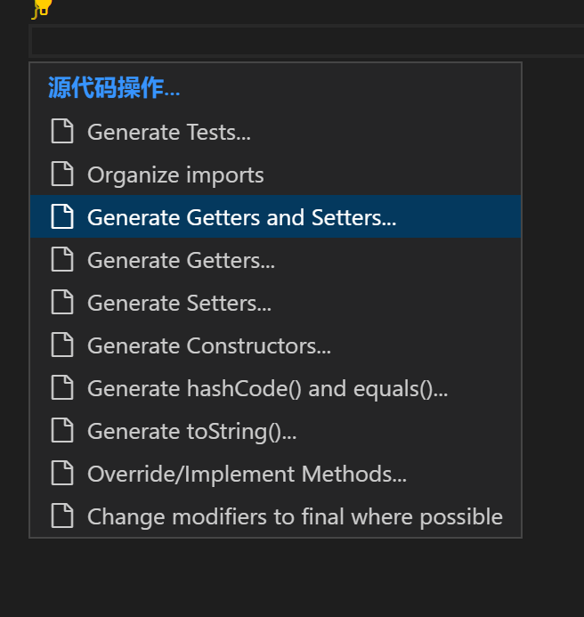
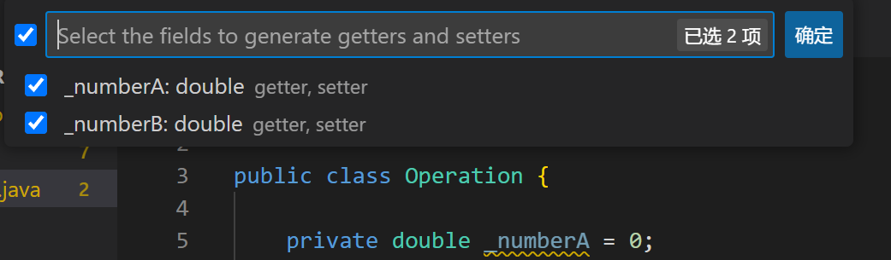
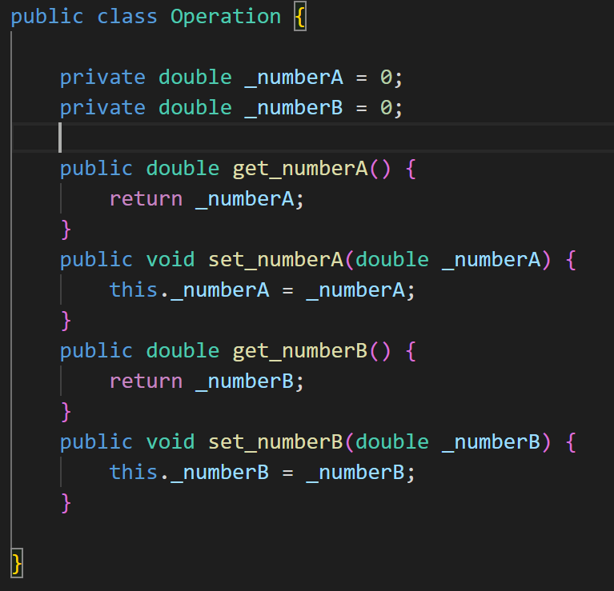

# 开始

## 在ubuntu安装OpenJDK



验证是否安装好


## 编译Java程序

1. ```javac [文件名]```命令，得到class文件
2. ```java [类名]```命令，执行class文件


也可用集成工具


## 自动生成setter和getter

在文档空白处右键，点击**源代码操作**


点击**Generate Getters and Setters**


选择要生成get/set方法的属性，点击确认


即完成


# 简写

1. ```System.out.println();```的简写为```syso```然后回车
2. ```public static void main(String[] args) {}```的简写为```psvm```然后回车

