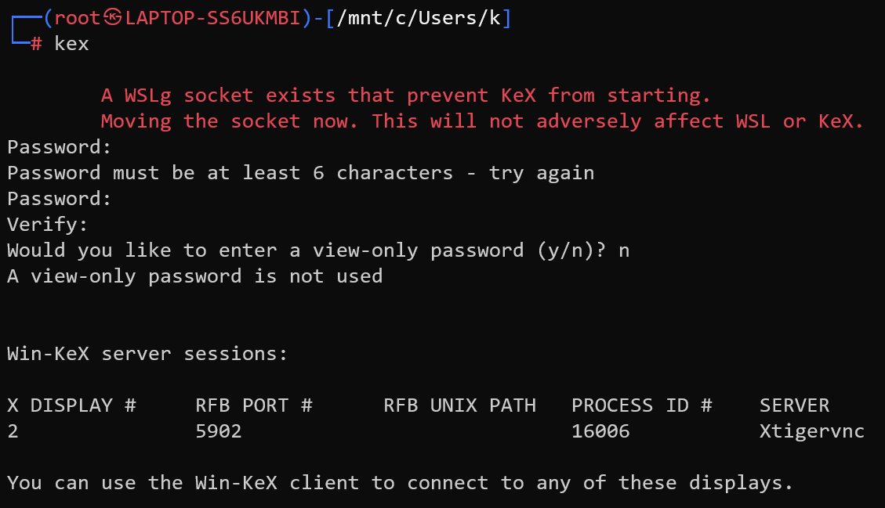
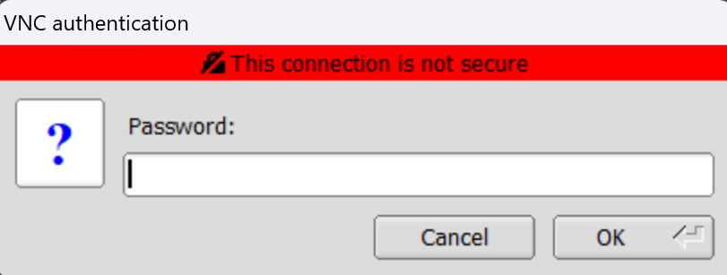

# 安装与配置Kali

通过WSL2安装Kali子系统

## 配置GUI界面

### 安装Win-Kex

```sudo apt update```
```sudo apt install -y kali-win-kex```

用```kex```命令打开Win-Kex

第一次要设置密码，为```123456```

之后在windows中弹出窗口


输入密码后进入GUI界面，使用```F8```可取消全屏显示

## 下载工具包

```sudo apt install kali-linux-large```

## 安装 Oh My Zsh

```sh -c "$(curl -fsSL https://raw.githubusercontent.com/ohmyzsh/ohmyzsh/master/tools/install.sh)"```


