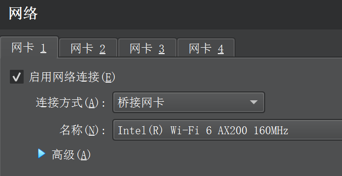

# 前置条件

## CPU开启虚拟化

LeoMoon CPU-V 软件用于检测是否开启虚拟化
[LeoMoon CPU-V 下载网站](http://www.downza.cn/soft/343208.html)

# 安装与配置 kali

## 下载 kali 镜像

[kali官网](https://www.kali.org/get-kali/#kali-platforms)

[清华大学开源软件镜像站](https://mirrors.tuna.tsinghua.edu.cn/kali-images/)

下载的版本为 kali-linux-2023.2a-installer-amd64.iso

## 使用 VMware（废弃）

### 下载安装 VMware 虚拟机软件

[VMware官网](https://www.vmware.com/cn/products/workstation-player.html)

下载的版本为 VMware-workstation-full-17.0.0-20800274.exe

VMware17Pro密钥：MC60H-DWHD5-H80U9-6V85M-8280D

### 安装 kali

[VMware 安装 kali_Linux 详细教程](https://blog.csdn.net/m0_54659508/article/details/123655419)

因为这里启动 VMware 里的kali虚拟机不成功，换用 VirtualBox

## 使用 VirtualBox（推荐）

### 下载安装 VirtualBox 虚拟机软件

[VirtualBox官网](https://www.virtualbox.org/wiki/Downloads)

下载的版本为 VirtualBox-7.0.8-156879-Win.exe

### 安装 kali

kali安装的目录为
```
C:\Users\k\VirtualBox VMs\kali
```

用户名：kaliuser
密码：1

第一次设置root密码
```shell
sudo passwd root
```

root用户密码：1

### 设置


#### 网络设置为桥接模式

[NAT模式与桥接（bridge）模式比较](https://blog.csdn.net/qq_36357820/article/details/74909009)


[VirtualBox设置桥接网络教程](https://blog.csdn.net/k2325/article/details/118711232)



使用以下命令查看ip信息
```shell
ip addr
```

可以看到kali虚拟机的ip地址为


windows宿主机的ip地址为


ping: windows宿主机 -> kali虚拟机，成功


ping: kali虚拟机 -> windows宿主机，不通


是windows宿主机的防火墙设置的原因

打开Windows安全中心，点击 防火墙和网络保护 下的 高级设置


点击左侧 入站规则，启用 虚拟机监控(回显请求-ICMPv4-In) 规则


再次测试ping: kali虚拟机 -> windows宿主机，成功


#### 把默认生成的中文目录名切换为英文

[教程链接](https://blog.csdn.net/weixin_59679023/article/details/120468652)

使用命令
```shell
sudo vim ~/.config/user-dirs.dirs
```
修改配置文件user-dirs.dirs，内容如下：
```xml
XDG_DESKTOP_DIR="$HOME/desktop"
XDG_DOWNLOAD_DIR="$HOME/downloads"
XDG_TEMPLATES_DIR="$HOME/templates"
XDG_PUBLICSHARE_DIR="$HOME/public"
XDG_DOCUMENTS_DIR="$HOME/documents"
XDG_MUSIC_DIR="$HOME/music"
XDG_PICTURES_DIR="$HOME/pictures"
XDG_VIDEOS_DIR="$HOME/videos"
```

在用户文件夹的位置，删掉原来的中文文件夹，新增英文文件夹，即可
```shell
mkdir desktop documents downloads music pictures public templates videos
```

#### 虚拟机和宿主机的共享文件夹


在kali中的目录为
```
/media/sf_kali_virtualbox_share_documents
```

在windows中的目录为
```
C:\Users\k\Documents\kali_virtualbox_share_documents
```

## kali 工具包

这里我的在安装系统时已安装

使用下面命令查看工具包是否安装
```shell
apt list | grep kali-linux-large
```

使用下面命令安装工具包
```shell
sudo apt install kali-linux-large
```
