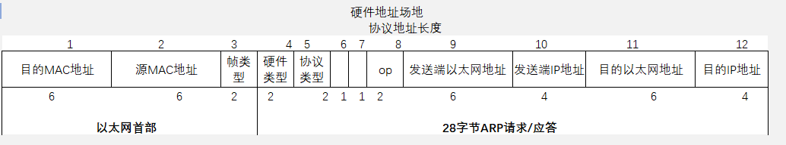

# arp

[教程链接](https://zhuanlan.zhihu.com/p/370507243)

## 简介

地址解析协议，即ARP（Address Resolution Protocol），是**根据IP地址获取物理地址的一个TCP/IP协议**。主机发送信息时将包含目标IP地址的ARP请求广播到局域网络上的所有主机，并接收返回消息，以此确定目标的物理地址；收到返回消息后**将该IP地址和物理地址存入本机ARP缓存中并保留一定时间**，下次请求时直接查询ARP缓存以节约资源。地址解析协议是建立在网络中各个主机互相信任的基础上的，局域网络上的主机可以自主发送ARP应答消息，其他主机收到应答报文时不会检测该报文的真实性就会将其记入本机ARP缓存。

最直白的说法是：在IP以太网中，当一个上层协议要发包时，**有了该节点的IP地址，ARP就能提供该节点的MAC地址**。

ARP**介于二三层之间**。

大家都知道，OSI模式把网络工作分为七层，彼此不直接打交道，只通过接口(layer interface)。 IP地址在第三层（网络层），MAC地址在第二层（数据链路层）。协议在发送数据包时，首先要封装第三层（IP地址）和第二层（MAC地址）的报头, 但协议只知道目的节点的IP地址，不知道其物理地址，又不能跨第二、三层，所以得用ARP的服务拿到MAC地址。

### ARP工作过程

假设主机A和B**在同一个网段**，主机A要向主机B发送信息，具体的地址解析过程如下：

1. 主机A首先查看自己的ARP缓存表，确定其中是否包含有主机B对应的ARP表项。如果找到了对应的MAC地址，则主机A直接利用ARP表中的MAC地址，对IP数据包进行帧封装，并将数据包发送给主机B。
2. 如果主机A在ARP表中找不到对应的MAC地址，则将缓存该数据报文，然后以广播方式发送一个ARP请求报文。ARP请求报文中的发送端IP地址和发送端MAC地址为主机A的IP地址和MAC地址，目标IP地址和目标MAC地址为主机B的IP地址和全0的MAC地址。由于ARP请求报文以广播方式发送，该网段上的所有主机都可以接收到该请求，但只有被请求的主机（即主机B）会对该请求进行处理。
3. 主机B比较自己的IP地址和ARP请求报文中的目标IP地址，当两者相同时进行如下处理：将ARP请求报文中的发送端（即主机A）的IP地址和MAC地址存入自己的ARP表中。之后以单播方式发送ARP响应报文给主机A，其中包含了自己的MAC地址。
4. 主机A收到ARP响应报文后，将主机B的MAC地址加入到自己的ARP表中以用于后续报文的转发，同时将IP数据包进行封装后发送出去。

当主机A和主机B**不在同一网段**时，主机A就会先向网关发出ARP请求，ARP请求报文中的目标IP地址为网关的IP地址。当主机A从收到的响应报文中获得网关的MAC地址后，将报文封装并发给网关。如果网关没有主机B的ARP表项，网关会广播ARP请求，目标IP地址为主机B的IP地址，当网关从收到的响应报文中获得主机B的MAC地址后，就可以将报文发给主机B；如果网关已经有主机B的ARP表项，网关直接把报文发给主机B。

### ARP Cache（缓存）和 TTL（生存时间）

网络设备一般都有一个ARP缓存（ARP Cache），ARP缓存用来存放IP地址和MAC地址的关联信息。在发送数据前，设备会先查找ARP缓存表。如果缓存表中存在对方设备的MAC地址，则直接采用该MAC地址来封装帧，然后将帧发送出去。如果缓存表中不存在相应的信息，则通过发送ARP request报文来获得它。学习到的IP地址和MAC地址的映射关系会被放入ARP缓存表中存放一段时间。在有效期内，设备可以直接从这个表中查找目的MAC地址来进行数据封装，而无需进行ARP查询。过了这段有效期，ARP表现会被自动删除。如果目标设备位于其他网络则源设备会在ARP缓存表中查找网关的MAC地址，然后将数据发送给网关，网关再把数据转发给目的设备。

ARP表项又分为动态ARP表项和静态ARP表项。

#### 动态ARP表项

动态ARP表项由ARP协议通过ARP报文自动生成和维护，可以被老化，可以被新的ARP报文更新，可以被静态ARP表项覆盖。每个动态ARP缓存项的潜在生命周期是10分钟。新加到缓存中的项目带有时间戳，如果某个项目添加后2分钟内没有再使用，则此项目过期并从ARP缓存中删除；如果某个项目已在使用，则又收到2分钟的生命周期；如果某个项目始终在使用，则会另外收到2分钟的生命周期，一直到10分钟的最长生命周期。

#### 静态ARP表项

静态ARP表项通过手工配置和维护，不会被老化，不会被动态ARP表项覆盖。直到重新启动计算机为止。

配置静态ARP表项可以增加通信的安全性。静态ARP表项可以限制和指定IP地址的设备通信时只使用指定的MAC地址，此时攻击报文无法修改此表项的IP地址和MAC地址的映射关系，从而保护了本设备和指定设备间的正常通信。

### ARP报文格式

字段1：ARP请求的目的以太网地址，全1时，代表广播地址。

字段2：发送ARP请求的以太网地址。

字段3：以太网帧类型表示后面的数据类型，ARP请求和ARP应答此字段为：0x0806。

字段4：硬件地址类型，硬件地址不止以太网一种，是以太网类型时，值为1。

字段5：表示要映射的协议地址的类型，要对IPv4地址进行映射，此值为0x0800。

字段6和7：表示硬件地址长度和协议地址长度，MAC地址占6字节，IP地址占4字节。

字段8：是操作类型字段，值为1，表示进行ARP请求；值为2，表示进行ARP应答；值为3，表示进行RARP请求；值为4，表示进行RARP应答。

字段9：是发送端ARP请求或应答的硬件地址，这里是以太网地址，和字段2相同。

字段10：是发送ARP请求或应答的IP地址。

字段11和12：是目的端的硬件地址和IP地址。

### ARP请求

### ARP响应

### RARP请求

### RARP应答

### GRAP请求

---
https://zhuanlan.zhihu.com/p/107445582
https://zhuanlan.zhihu.com/p/370507243
https://zhuanlan.zhihu.com/p/145438292
---

## 命令

### arp -a

# arping

## 简介

arp (Address Resolution Protocol) 地址解析协议, 是通过解析网路层地址来找寻数据链路层地址的一个在网络协议包中极其重要的网络传输协议。

ARP是一个重要的TCP/IP协议，并且用于确定对应IP地址的网卡物理地址。

使用arp命令，我们能够查看本地计算机或另一台计算机的ARP高速缓存中的当前内容。

arping命令作用是使用arp数据包，通过ping命令检查来测试网络。

arping命令能够测试一个ip地址是否是在网络上已经被使用，并能够获取更多设备信息，功能类似于ping。

由于arping命令基于ARP广播机制，所以arping命令只能测试同一网段或子网的网络主机的连通性，ping命令则是基于ICMP协议，是可以路由的，所以使用ping命令可以测试任意网段的主机网络连通性。

## 命令

[教程链接](https://www.linuxcool.com/arping)

### arp -a

---

Wireshark软件

抓包

https://blog.csdn.net/HarveyH/article/details/113731485