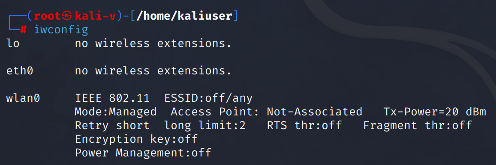
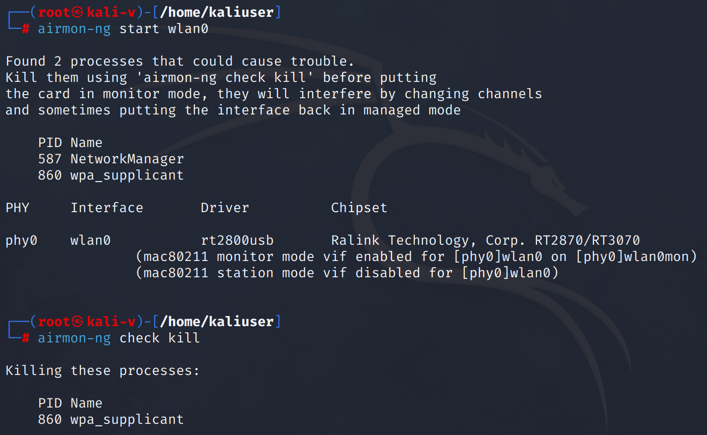
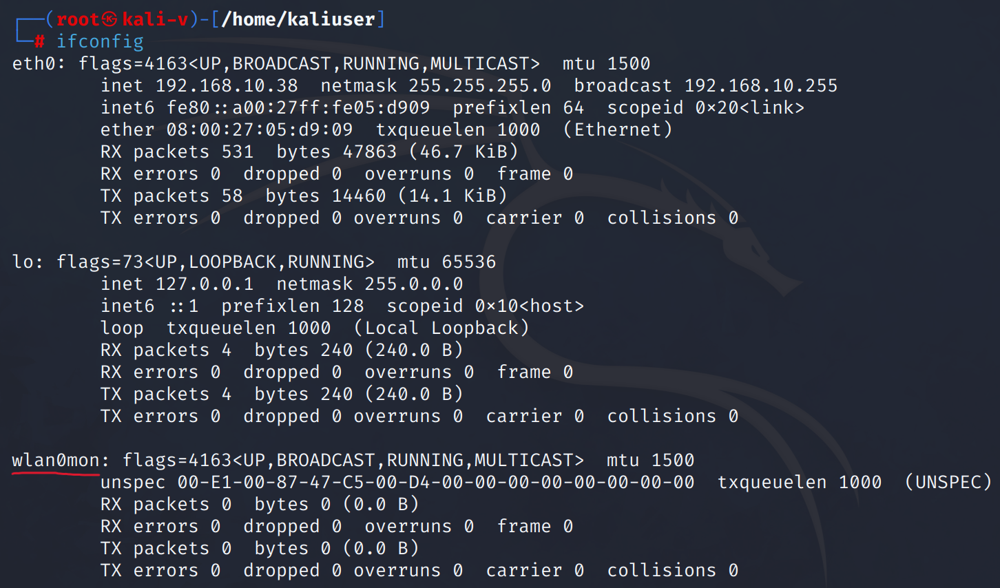
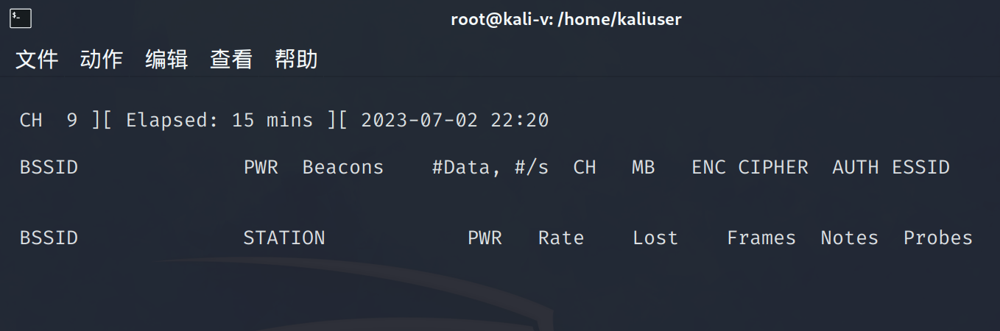

# 拿wifi密码

## 前置条件

1. 一个kali支持的无线网卡，芯片3070/8187/5370都可以。
2. 一个字典，用来跑密码


---

[教程链接](https://tieba.baidu.com/p/7981575504)

这里我使用的是RT3070L芯片的网卡

在虚拟机中启用这个USB设备


终端输入
```
ifconfig
```


发现比之前多了一个 wlan0 网卡

### 

如果你输入ifconfig没有看到 wlan0 网卡
则输入
```
iwconfig
```



如果输入iwconfig能看见 wlan0 网卡，但是输入ifconfig却无法看到，那就是你还没有启用无线网卡

输入【ifconfig -a】.如果看到有wlan0网卡就输入【ifconfig wlan1 up 】然后在输入ifconfig查看网卡是否成功启用。

如果还是不行，尝试重启


如何查看自己的网卡是什么芯片可以使用【lsusb】或者【dmesg -T】


###

使用【airmon-ng start wlan0】开启监听，下面提示找到两个麻烦使用airmon-ng check kill

使用【airmon-ng check kill】之后会整个系统断网，所有不要惊慌。



接下来输入ifconfig查看是否成功开启监听模式。看是否有wlan0mon




###

在root目录下创建wifi_crack文件夹


执行【airodump-ng wlan0mon】



抓不到数据

是否是amd处理器的问题
换inter处理器的电脑试一试


---

EWSA跑包


首先要有RT3070或螃蟹卡8187，网上都有卖，最多30搞定。

虚拟机安装kali，里面有各种破解软件，相关教程也可以到网上找到，比如Aircrack-ng，使用单独网卡可以搞定；如果是使用Fluxion 等社会工程方式破解，则需要两种不同的网卡，即RT3070和螃蟹卡8187各买一张。

网卡找字典，做好长跑还未必跑的出来的准备。一般来说，字典越大，破解的几率越大，但耗时也越长。速度比较快的破解方式是hash码表，8位密码秒破，但现在的密码很少有8位的，并且生成hash码表比较耗时，更让人**的是一个essid只对应一个hash码表，也就是每个wifi信号都需要重新生成一次……。如果你运气比较好，对方有开放pin那最好了，最多半小时搞定。


---


这个得看你的笔记本网卡是否支持监听。一般支持的概率比较低。不过可以先试试。用airmon-ng先设置监听，试试。

vmware是不能使用实体机的内置网卡，只能使用USB接口的网卡。


---


就是做伪AP。很经典的欺骗方式。
luxion可以做到