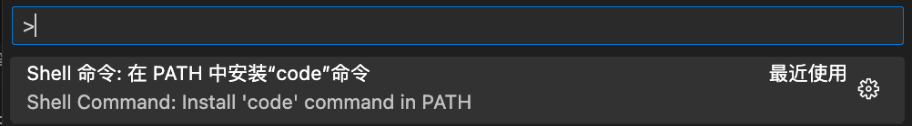
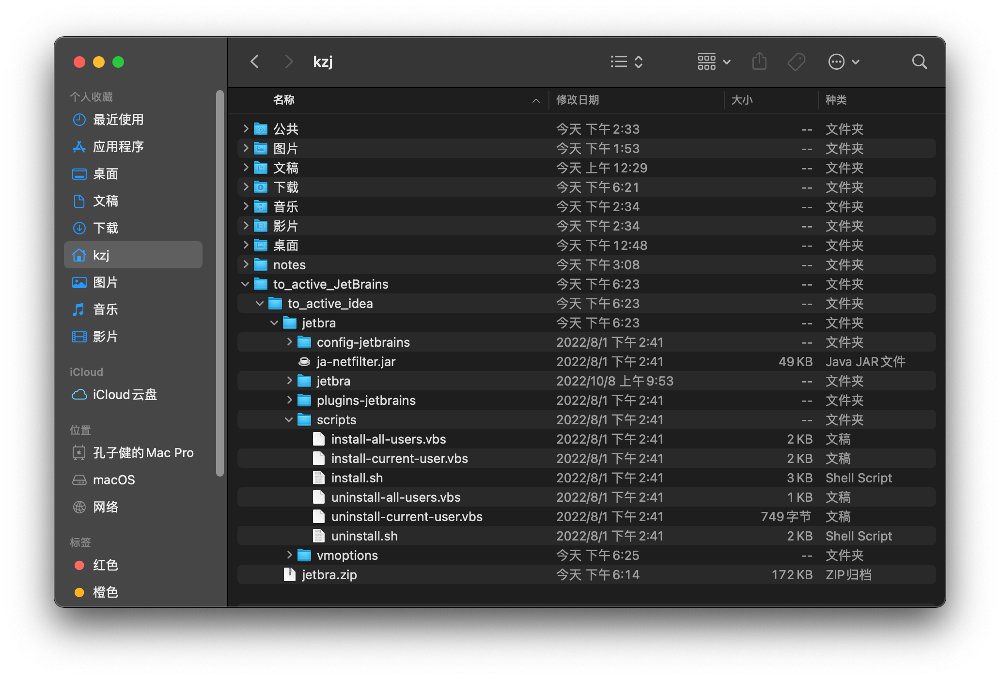

# 黑苹果安装

零刻ser5 5500U
macOS 版本 11.7.7 (Big Sur)

[视频教程](https://www.bilibili.com/video/BV1uk4y1s7He/?spm_id_from=333.337.search-card.all.click&vd_source=fbc0e3c28b30361c540f78c17d710823)

[文字教程](http://t.csdn.cn/t1ZIo)

使用工具：Hackintool

## 开启HiDPI

[教程](https://www.bilibili.com/read/cv9693064)

使用工具：SwitchResX

## 禁止系统自动更新

[教程](https://zhuanlan.zhihu.com/p/368130742)

我这里是修改了hosts文件

## 系统快捷键
| 功能                 | 快捷键                                                              |
| -------------------- | ------------------------------------------------------------------- |
| 退出程序             | <kbd>command</kbd>+<kbd>Q</kbd>                                     |
| 关闭当前标签（程序） | <kbd>command</kbd>+<kbd>W</kbd>                                     |
| 刷新当前标签         | <kbd>command</kbd>+<kbd>R</kbd>                                     |
| 打开新标签           | <kbd>command</kbd>+<kbd>T</kbd>                                     |
| 打开新窗口           | <kbd>command</kbd>+<kbd>N</kbd>                                     |
| 添加书签             | <kbd>command</kbd>+<kbd>D</kbd>                                     |
| 缩小程序             | <kbd>command</kbd>+<kbd>M</kbd>                                     |
| 全屏显示             | <kbd>control</kbd>+<kbd>command</kbd>+<kbd>F</kbd>                  |
| 输入法切换           | <kbd>CapsLock</kbd>                                                 |
| 偏好设置             | <kbd>command</kbd>+<kbd>,</kbd>                                     |
| 切换应用             | <kbd>command</kbd>+<kbd>Tab</kbd>                                   |
| 打开应用菜单         | <kbd>option</kbd>+<kbd>空格</kbd>                                   |
| 调度中心             | <kbd>control</kbd>+<kbd>⬆</kbd>                                     |
| 只显示当前应用       | <kbd>control</kbd>+<kbd>⬇</kbd>                                     |
| 聚焦搜索             | <kbd>command</kbd>+<kbd>空格</kbd>                                  |
| 访达搜索             | <kbd>option</kbd>+<kbd>command</kbd>+<kbd>空格</kbd>                |
| 全屏截图为文件       | <kbd>command</kbd>+<kbd>Shift</kbd>+<kbd>3</kbd>                    |
| 全屏截图到剪贴板     | <kbd>command</kbd>+<kbd>Shift</kbd>+<kbd>3</kbd>+<kbd>control</kbd> |
| 区域截图为文件       | <kbd>command</kbd>+<kbd>Shift</kbd>+<kbd>4</kbd>                    |
| 区域截图到剪贴板     | <kbd>command</kbd>+<kbd>Shift</kbd>+<kbd>4</kbd>+<kbd>control</kbd> |

# 效率工具

## Keka压缩解压缩

把要解压或压缩的文件拖到keka的图标上即可

## Mos鼠标

| 功能           | 快捷键             |
| -------------- | ------------------ |
| 加速滚动键     | <kbd>control</kbd> |
| 竖直转为水平键 | <kbd>option</kbd>  |

## Maccy粘贴板

| 功能   | 快捷键                                           |
| ------ | ------------------------------------------------ |
| 呼出键 | <kbd>control</kbd>+<kbd>Shift</kbd>+<kbd>V</kbd> |
| 粘贴键 | <kbd>command</kbd>+<kbd>数字序号</kbd>           |

## oh my zsh

[官网](https://ohmyz.sh/#install)

安装命令为
```
sh -c "$(wget https://raw.githubusercontent.com/ohmyzsh/ohmyzsh/master/tools/install.sh -O -)"
```

## 腾讯柠檬清理

## iStat Menus for Mac 6.70.1217

[下载网址](https://www.imacso.com/istat-menus.html/comment-page-1#comments)

# 软件

## chrome浏览器

在设置中禁用硬件加速
Safari浏览器的禁用硬件加速选项没有找到，导致有时候会花屏

## VSCode

| 功能       | 快捷键                                           |
| ---------- | ------------------------------------------------ |
| 格式化代码 | <kbd>option</kbd>+<kbd>Shift</kbd>+<kbd>F</kbd>  |
| 命令面板   | <kbd>command</kbd>+<kbd>Shift</kbd>+<kbd>P</kbd> |

### 终端中使用```code .```命令

[教程](https://blog.csdn.net/u011608357/article/details/119980878)


## Xcode

App Store中需要更高版本的系统才能安装
[解决方法](https://blog.csdn.net/qq_40829962/article/details/128038100)

[低版本的下载地址](https://developer.apple.com/download/more/)

Xcode自带git

### git

git配置好config和ssh密钥就可以用了

## brew包管理

[官网](https://brew.sh/index_zh-cn)

因为官网里的下载地址被墙了，使用这个[教程](https://blog.csdn.net/MrWangisgoodboy/article/details/127609389)

安装命令为
```
/bin/bash -c "$(curl -fsSL https://gitee.com/ineo6/homebrew-install/raw/master/install.sh)"
 ```

### 常用命令

```
brew search 软件名
brew install 软件名
brew uninstall 软件名
brew list
which 软件名
 ```

## postman

## charles

## Navicat_Premium_16.1.10

[下载地址](https://www.imacso.com/navicat-premium.html)

## Sourcetree

[官网](https://www.sourcetreeapp.com/)

# JetBrains全家桶

## IDEA 2022.2.5

[破解教程](https://baijiahao.baidu.com/s?id=1743957406665861124&wfr=spider&for=pc)

用于破解的文件路径不允许带中文，也不要移动位置、删除文件，否则破解失效


## WebStorm 2022.2.5

## PyCharm 2022.2.5

## PhpStorm 2022.2.5

## DataGrip 2022.2.5

## RubyMine 2022.2.5

## GoLand 2022.2.6

## Rider 2022.2.4

## CLion 2022.2.5

## AppCode 2022.2.6

激活方法同上


