# Mermaid

Mermaid 是一个基于 Javascript 的图表绘制工具，通过解析类 Markdown 的文本语法来实现图表的创建和动态修改。Mermaid 诞生的主要目的是让文档的更新能够及时跟上开发进度。

[Mermaid中文网](https://mermaid.nodejs.cn/intro/)

## 图表类型

### 流程图

最简实践：

进阶：
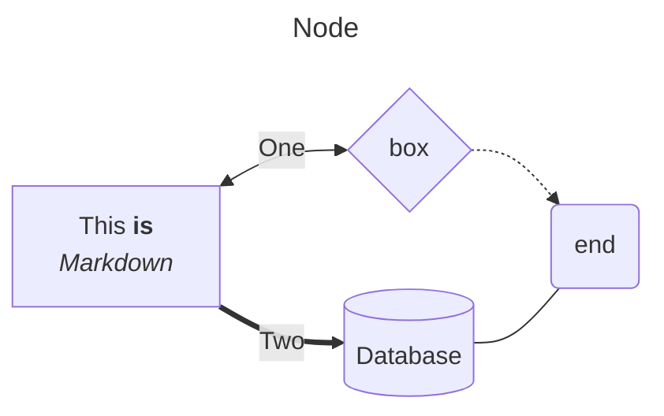

### 时序图

最简实践：
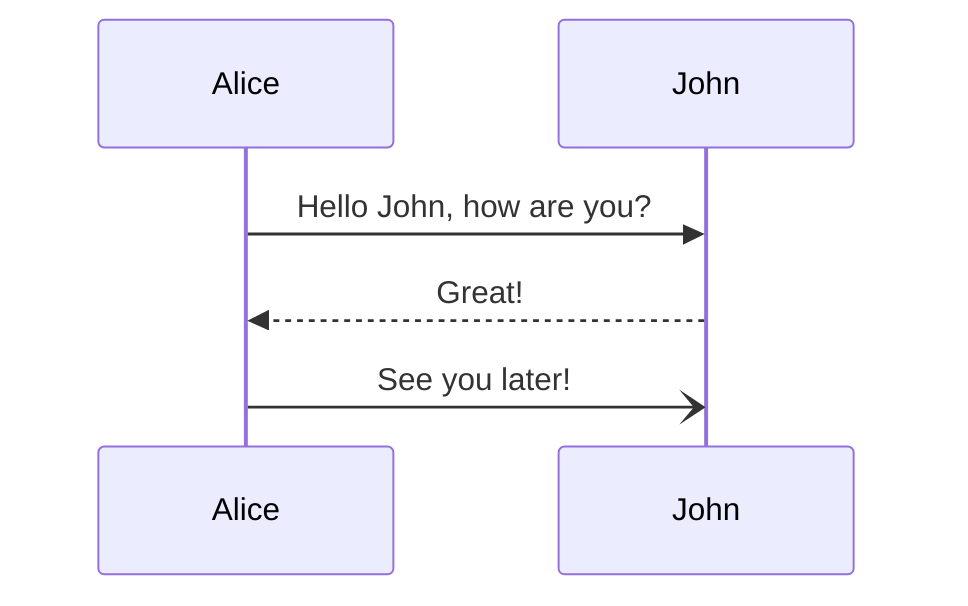

进阶：
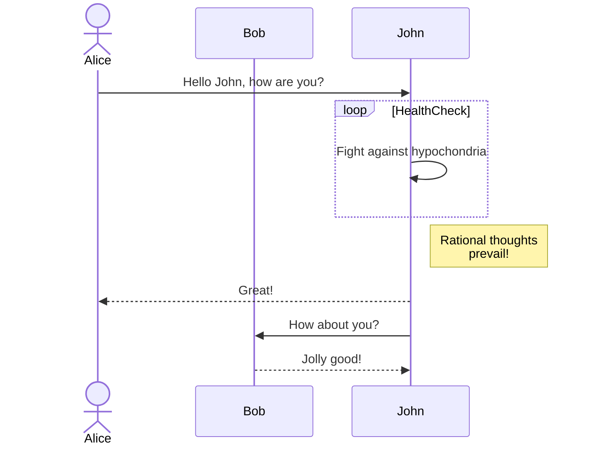

### 甘特图

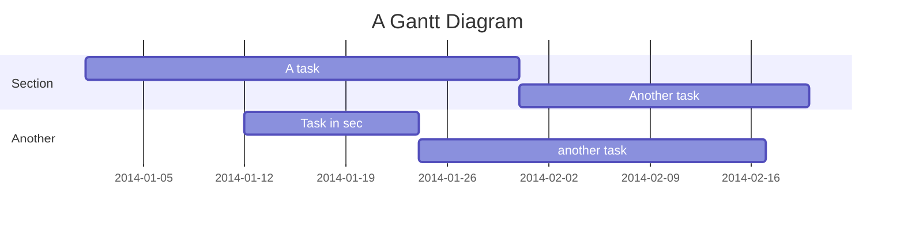

### 类图（UML）

最简实践：
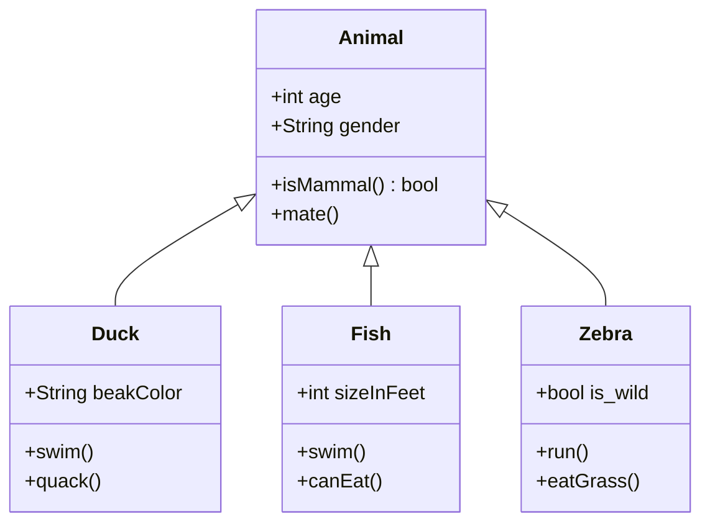

进阶：
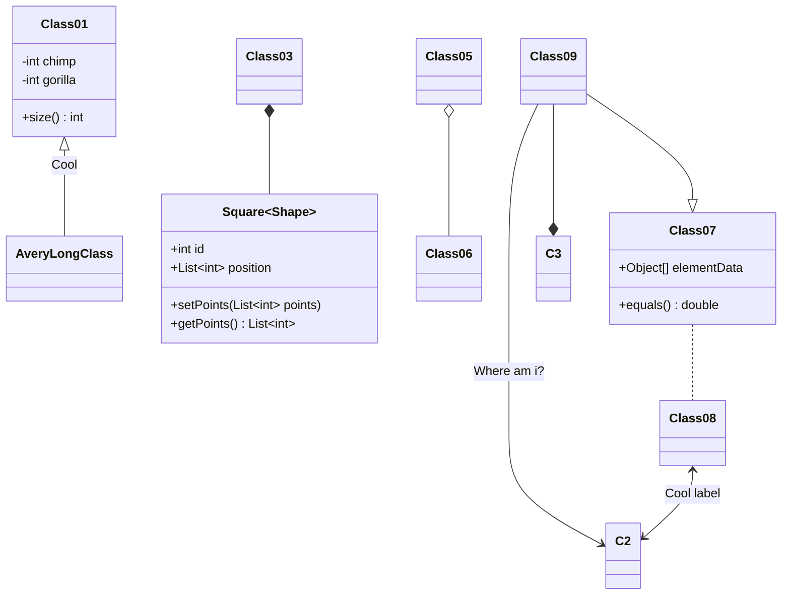

### Git图

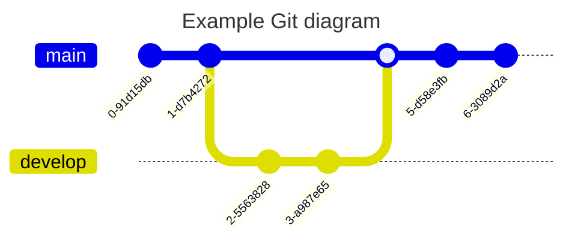

### 状态图

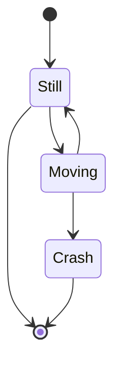

### 实体关系图（ER图）

最简实践：
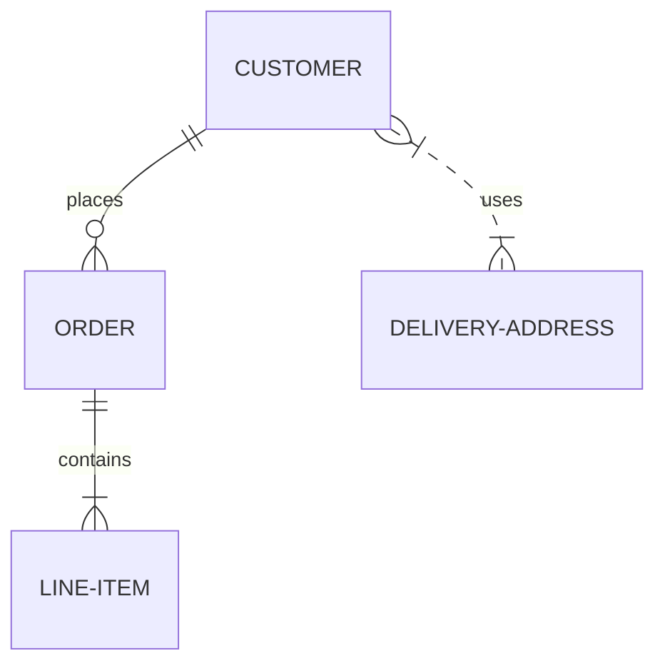

进阶：
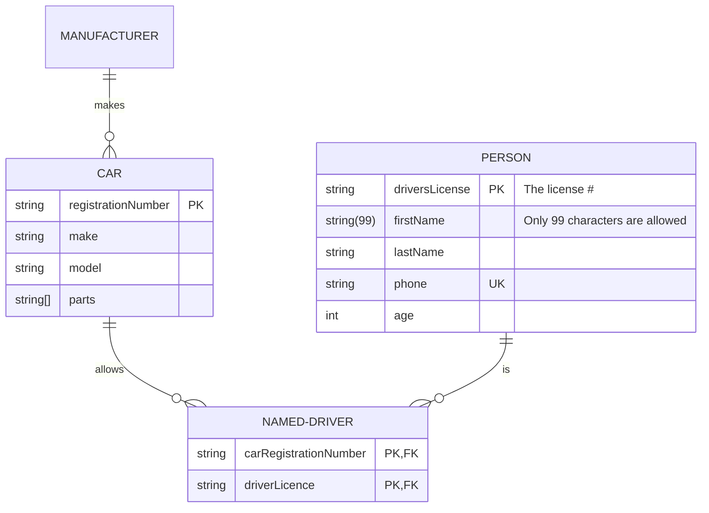

### 饼图

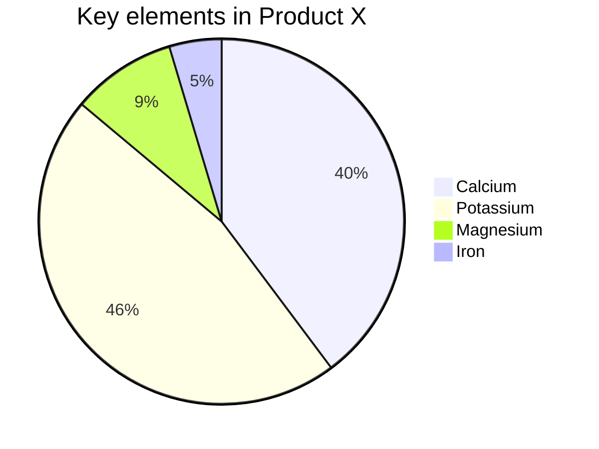

### 象限图

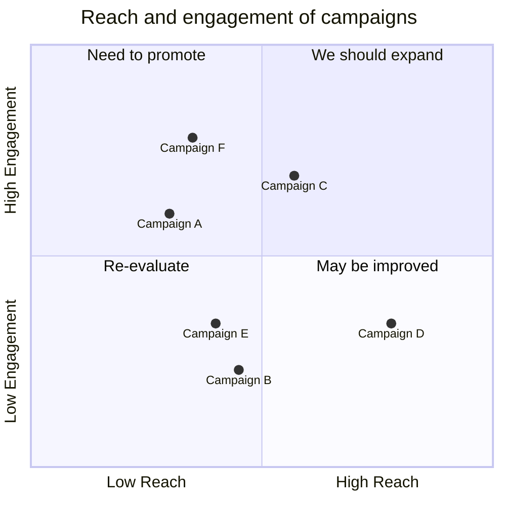

### XY图表

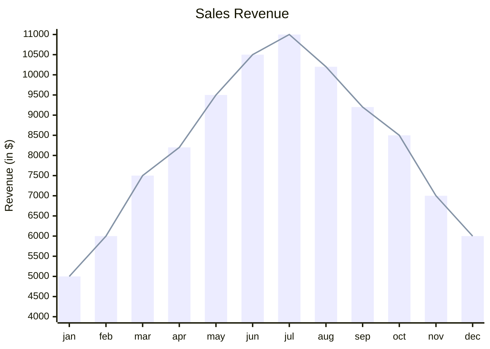

### 用户旅程图

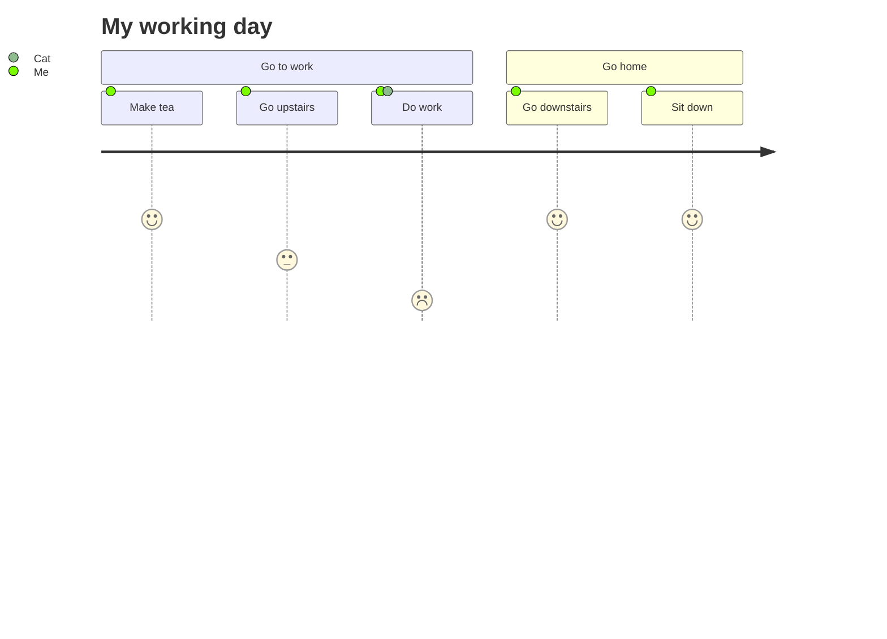

