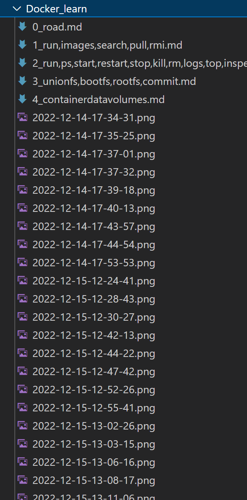
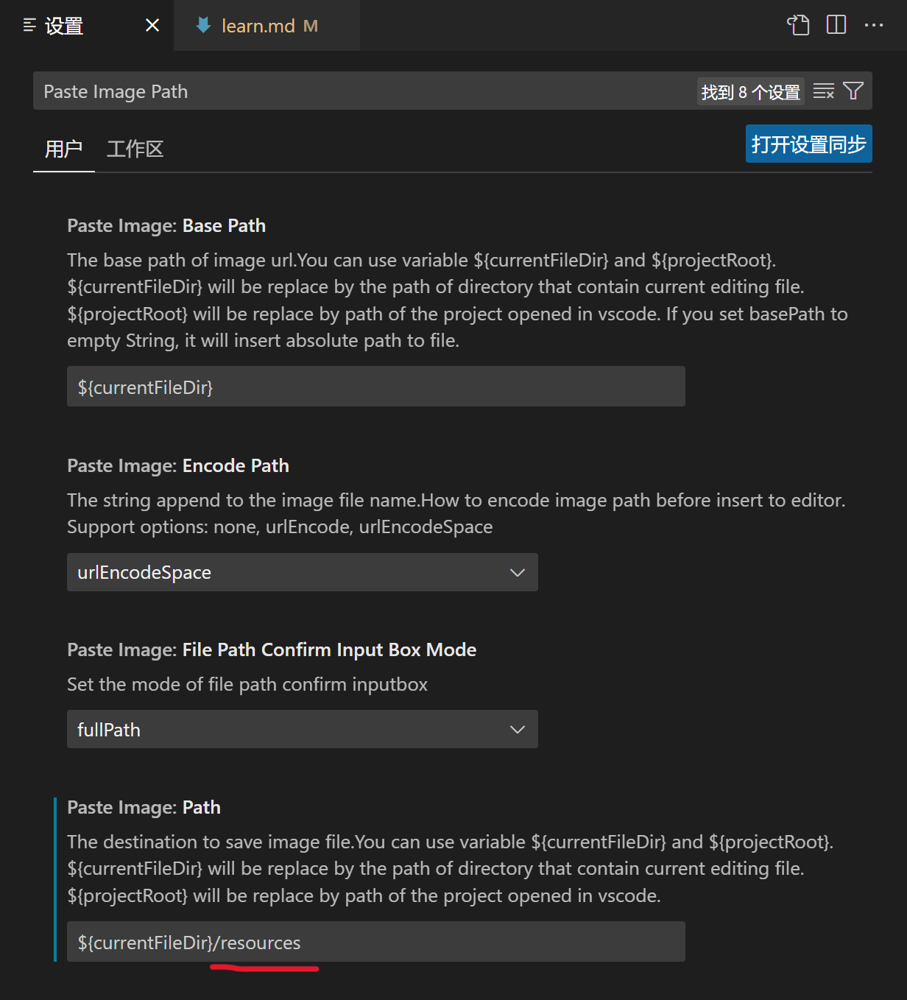
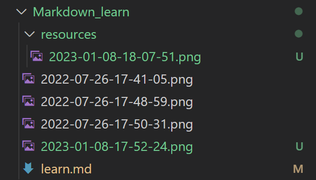
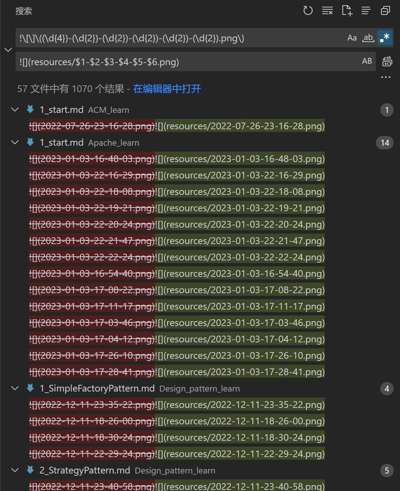
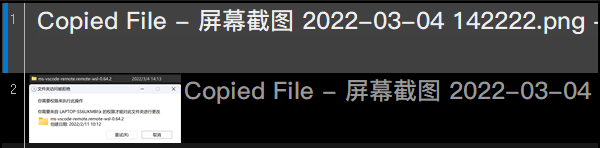
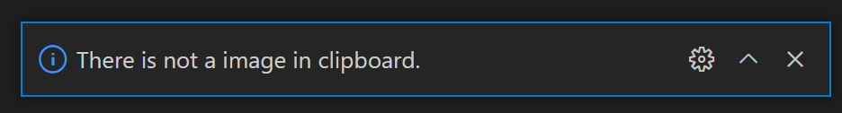

# Markdown

## 用VSCode编辑

### 需要的插件


#### 修改```Paste Image```插件的图片保存位置

默认保存在**与文件同级的文件夹**，看起来比较混乱


修改为保存到**与文件同级的文件夹下的resources文件夹**


现在新加入的图片被保存到了resources文件夹，但是老图片还在与文件同级的文件夹


##### 正则表达式在替换中的使用

用正则表达式将所有``````变为``````

[正则表达式在线测试网站](https://c.runoob.com/front-end/854/)

- ```!\[\]\((\d{4})-(\d{2})-(\d{2})-(\d{2})-(\d{2})-(\d{2}).png\)```可以匹配``````

- 在查找的时候用括号括起来的代表一部分，在替换的时候可以用```$1,$2…```引用（使用```$```引用查找到的内容）

- 应被替换为``````，可以匹配``````

在VSCode中使用替换功能


把图片文件从**与文件同级的文件夹**移动到**与文件同级的文件夹下的resources文件夹**

### 外部资源

选中文字，<kbd>Ctrl</kbd> + <kbd>V</kbd>

[速查表](https://markdown.com.cn/cheat-sheet.html#%E6%80%BB%E8%A7%88)
[官方教程](https://markdown.com.cn/basic-syntax/)
[runoob教程](https://www.runoob.com/markdown/md-tutorial.html)

### 文件后缀

*.md

### 标题

1-6个#后跟一个空格

### 段落

one line

the other line（两段之间要空一行）

### 代码块

三个`（<kbd>Tab</kbd>上方的按键）围住，可指定语言

```python
print('1')
```

```javascript
var s = "dssfnljs";
alert(s);
```

### 键盘按键

```
<kbd>Ctrl</kbd>
```

表示 <kbd>Ctrl</kbd>  

### 粗体

选中文字，<kbd>Ctrl</kbd> + <kbd>B</kbd>

**粗体**

### 斜体

选中文字，<kbd>Ctrl</kbd> + <kbd>I</kbd>

*斜体*

### 引用

> 引用 

### 列表

1. 第一项
2. 第二项
   1. 小一
   2. 小二
   
- 没有标号
  - 内部的
- 下一个

### 分隔线

---

### 添加图片

<kbd>Ctrl</kbd> + <kbd>Alt</kbd> + <kbd>V</kbd>



如果想粘贴上图中1形式的图片，会报错如下图



### 转义字符

要显示原本用于格式化 Markdown 文档的字符，请在字符前面添加反斜杠字符 \

\*\#

### 数学公式

<kbd>Ctrl</kbd> + <kbd>M</kbd>，按两次

$$
\lim_{x \to \infin}\frac{sin(t)}{x}=1
$$

### 表格

| 孔  | 子  | 健  |
| --- | --- | --- |
| 1.3 | 2.4 | 4.1 |

<kbd>Shift</kbd> + <kbd>Alt</kbd> + <kbd>F</kbd>，表格格式化（也是代码格式化的快捷键）

 ### 专注模式

 <kbd>Ctrl</kbd> + <kbd>K</kbd> 然后按 <kbd>Z</kbd>


