# 目前掌握的技术


## 存在的问题


# Maven是什么

项目构建工具


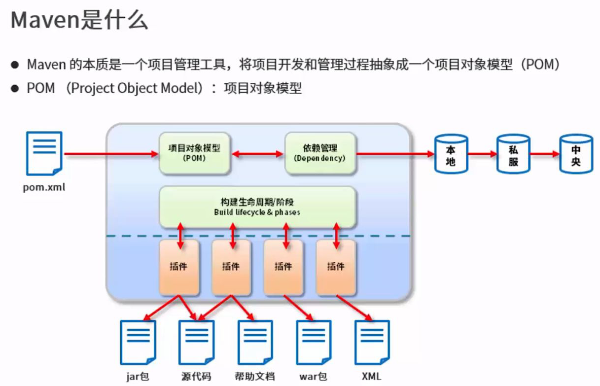
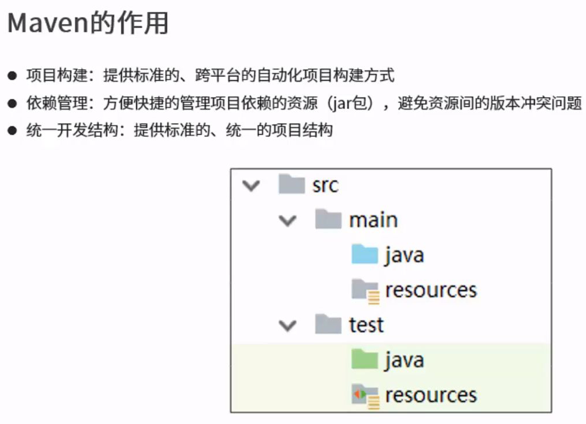

## 仓库

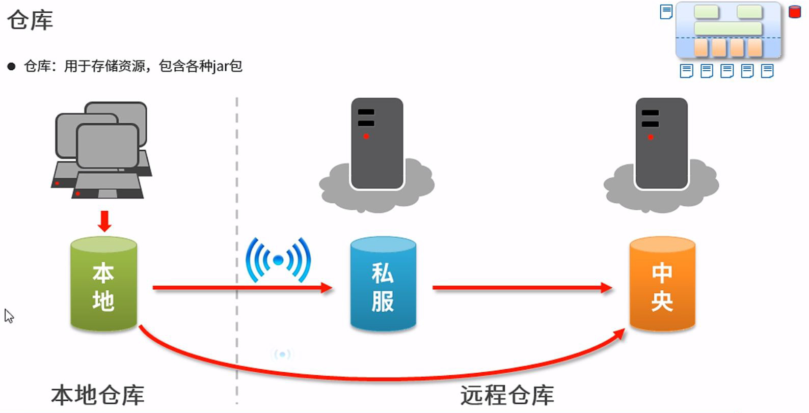
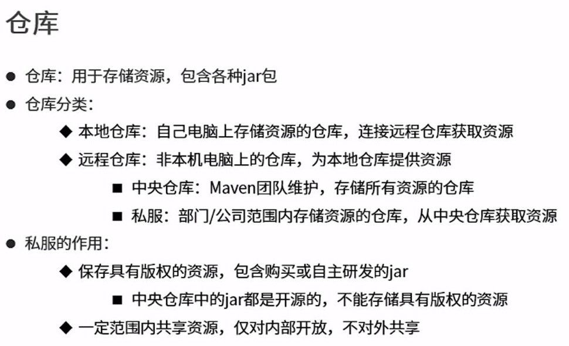

## 坐标

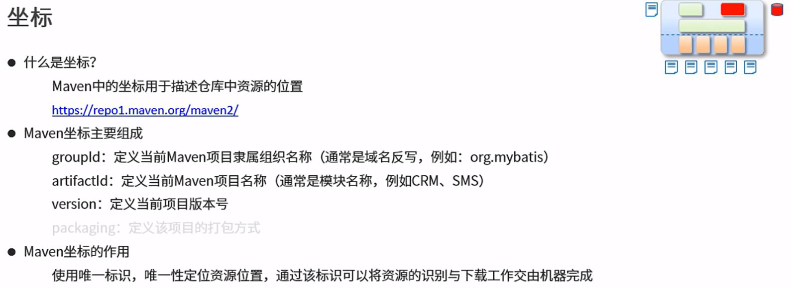

[中央仓库网址](https://mvnrepository.com/)

举例：
找到JUnit
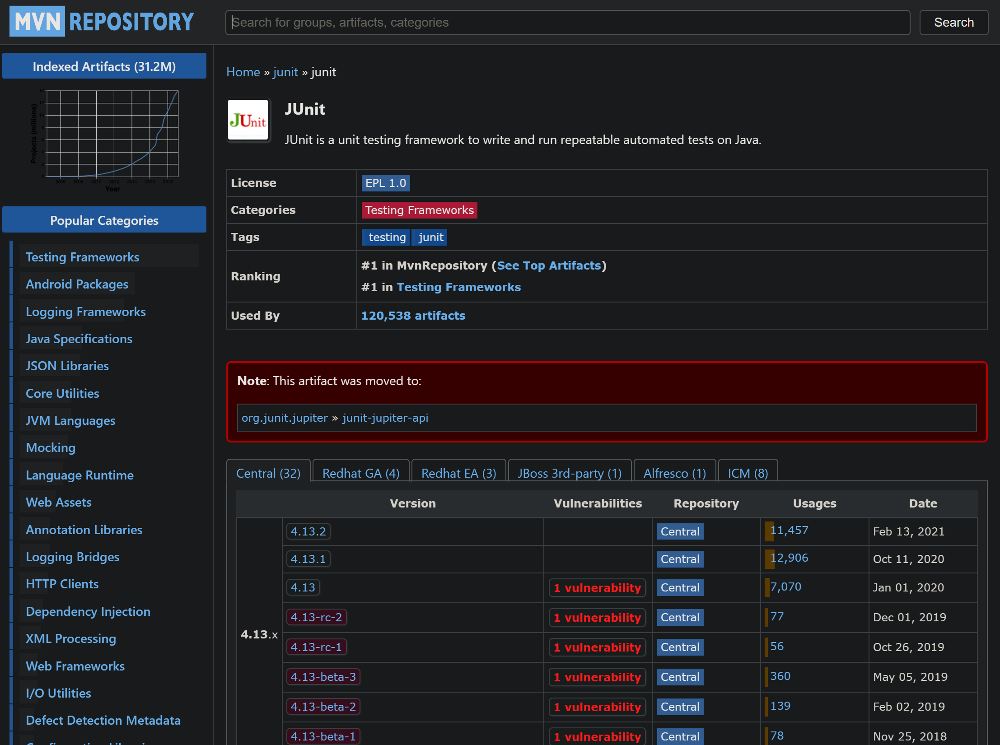
点击4.12版本
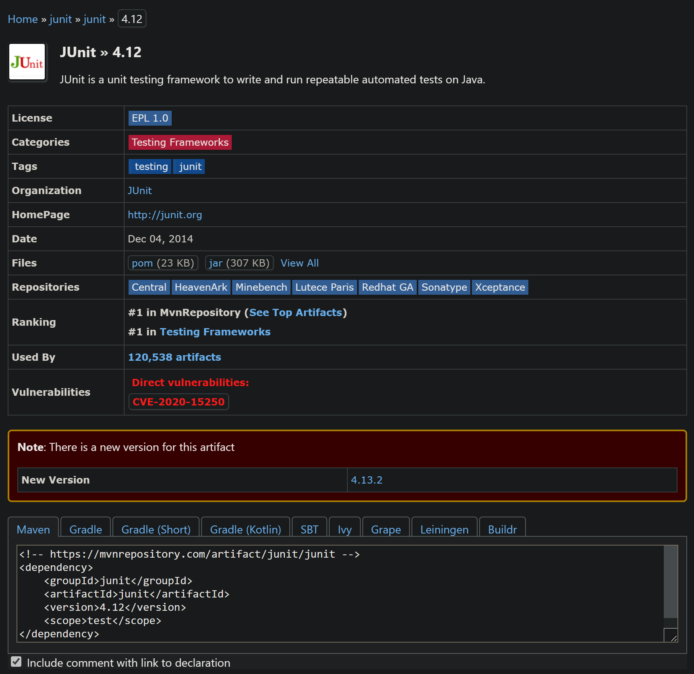
其中
```
<!-- https://mvnrepository.com/artifact/junit/junit -->
<dependency>
    <groupId>junit</groupId>
    <artifactId>junit</artifactId>
    <version>4.12</version>
    <scope>test</scope>
</dependency>
```
就是他的坐标

# 安装Maven

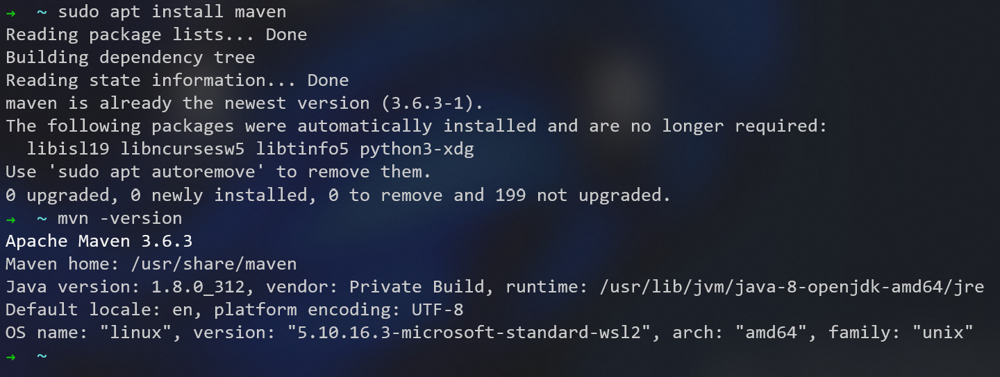

## 配置Maven

找到Maven的配置文件
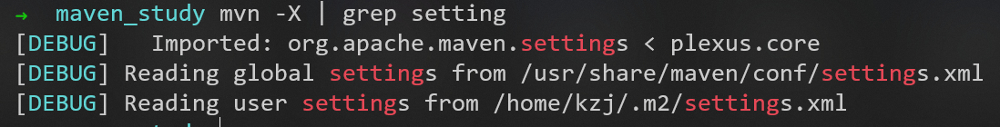
可以看到:
1. Maven的```.m2```本地仓库的位置为```/home/kzj/.m2/repository```
2. Maven的配置文件的位置为```/usr/share/maven/conf/settings.xml```

# 构建Java项目

在Vscode中
使用快捷键：Ctrl+Shift+P，输入create Java project
选择用Maven创建


目录结构如下
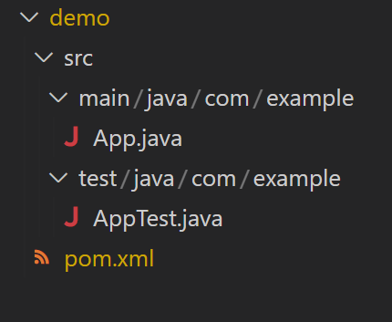
其中```pom.xml```就是Maven的配置文件，用以描述项目的各种信息

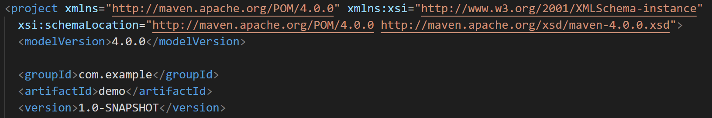
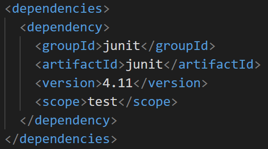
可以看出一个坐标由以下三部分组成：
1. groupId
2. artifactId
3. version
   


