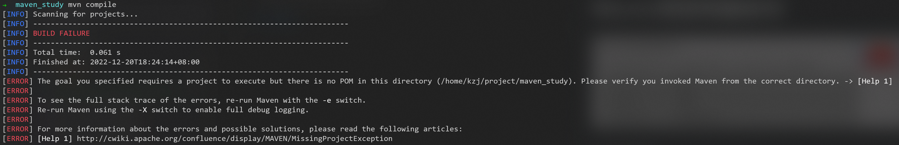
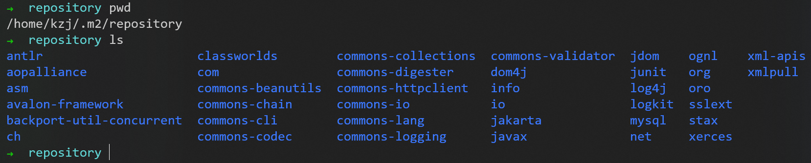
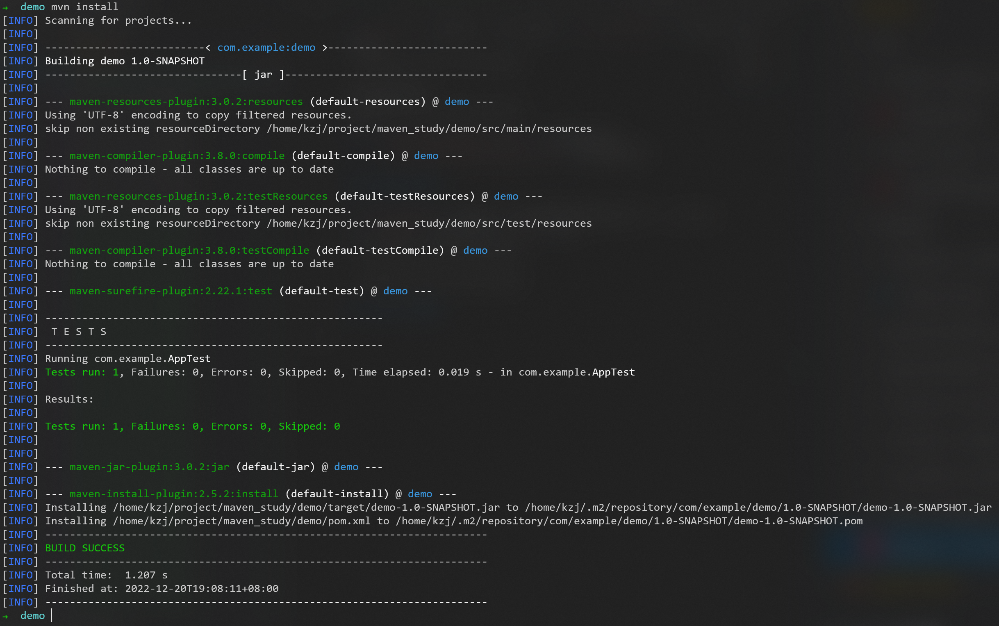

# Maven项目构建命令


## compile 编译

要在maven构建的项目目录中执行，如果在当前目录找不到```pom.xml```文件就会报错


```mvn compile```编译命令，Maven就会自动帮我们下载依赖jar，为代码生成字节码文件```.class```


下载的东西会放到这里


发现与编译之前相比，多了```target```目录


## clean 清理

```mvn clean```清理命令，效果就是删掉```target```文件夹


## test 测试

```mvn test```测试命令，Maven会执行```src/test/java```下的单元测试类


会输出测试报告

其中：
1. ```com.example.AppTest.txt```是简略的报告
2. ```TEST-com.example.AppTest.xml```是详细的报告

## package 打包

```mvn package```打包命令（包含前面的编译和测试工作），Maven会在```target```目录下生成```.jar```文件


## install 安装

```mvn install```安装命令，把现在打包的东西，放到本地仓库里



其中的目录```/home/kzj/.m2/repository/com/example/demo/1.0-SNAPSHOT```中的：
1. ```com/example/```（groupId）
2. ```demo/```（artifactId）
3. ```1.0-SNAPSHOT/```（version）
决定了在本地仓库中的一层层目录


