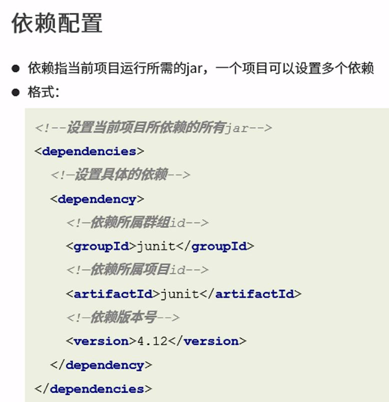
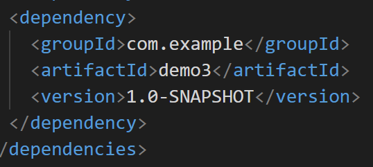
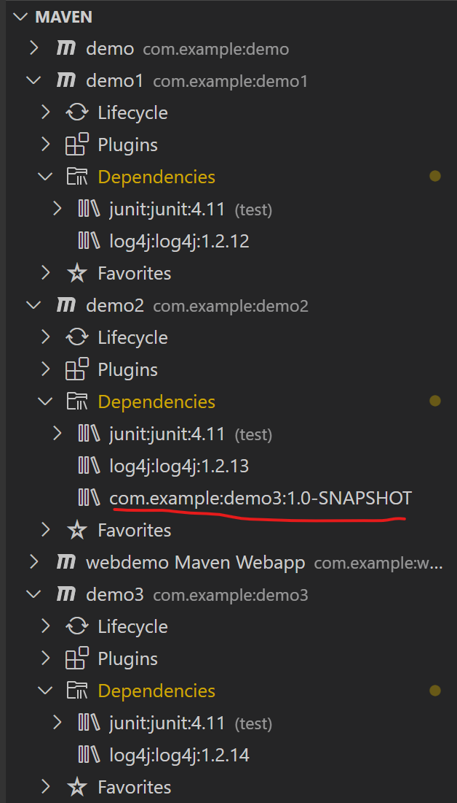
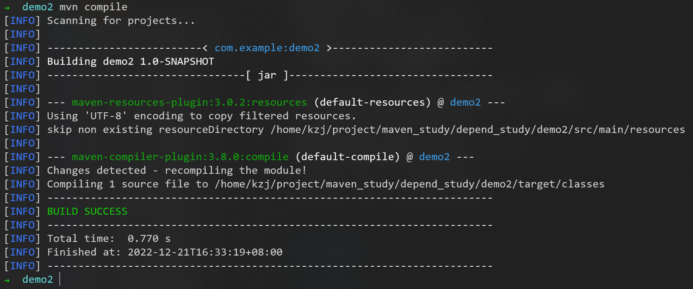
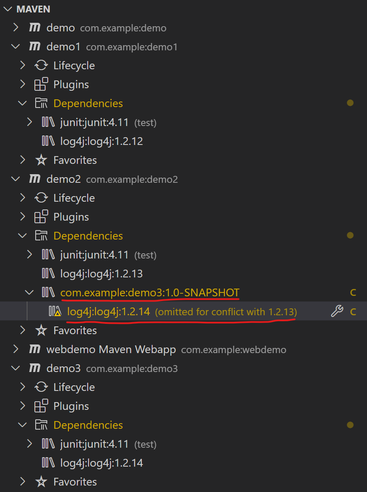
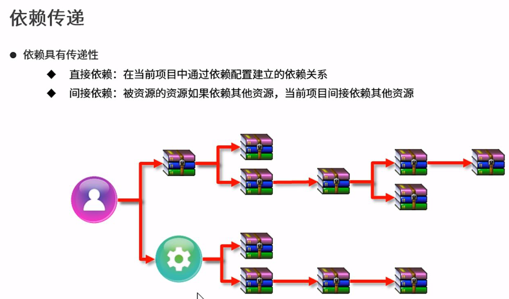
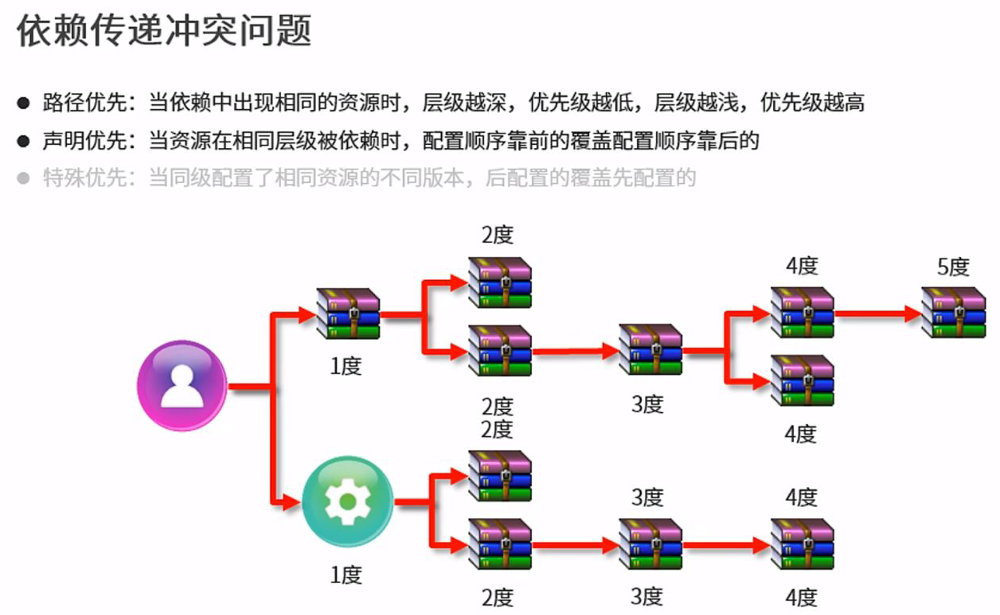
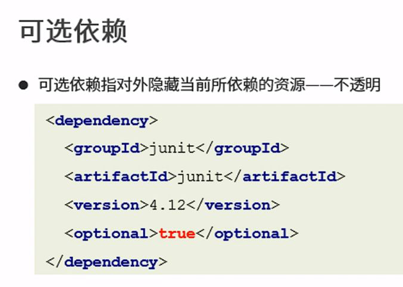
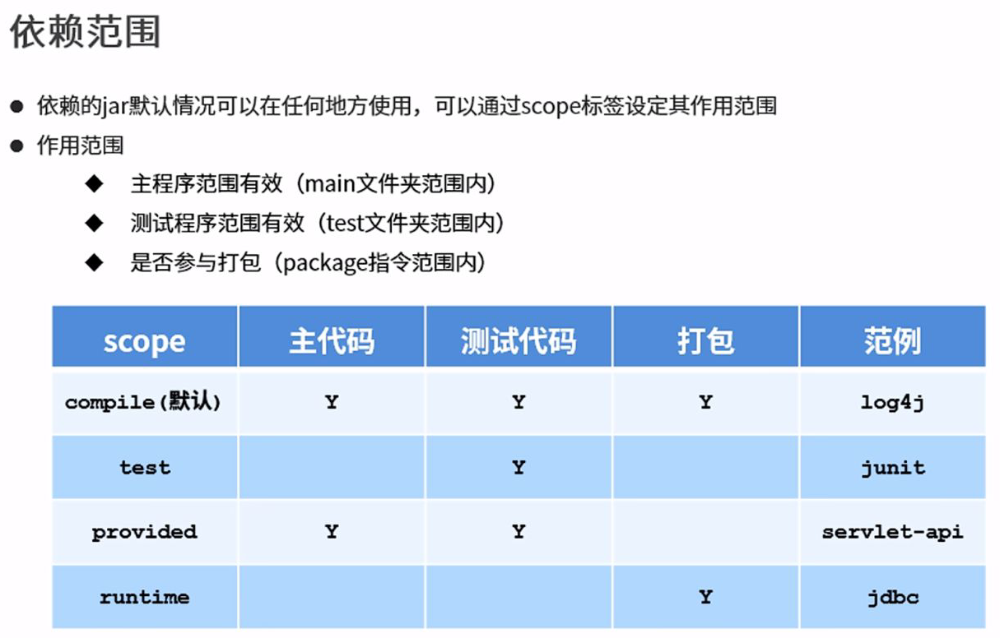

# 依赖管理

## 依赖配置


有了依赖，项目就可以使用别人的资源，不用自己拷贝jar包


创建3个Maven项目，并分别在demo1，demo2，demo3的pom.xml中增加1.2.12版本，1.2.13版本，1.2.14版本的log4j


其中```junit```用到了```hamcrest-core```，这就是依赖


当demo2要用到demo3，要把demo3作为一个资源配置到demo2中
方法：把demo3的坐标复制到demo2的```dependency```标签中

下图是demo2的pom.xml文件中新增的内容


依赖发生了如下变化

可见：
1. 你被别人使用了，你无法感知到
2. 你用别人了，你能感知到

此时```compile```demo2，找不到依赖demo3，会报错


要解决上述问题，需要```install```demo3


此时再```compile```demo2，成功


此时出现了依赖传递


## 依赖传递



### 依赖传递的冲突问题



## 可选依赖（隐藏自己的）（不透明）

不想让别人知道自己用了什么依赖，可以隐藏起来


## 排除依赖（排除别人的）（不需要）

想要依赖别人，但不想要别人传递过来的依赖


## 依赖范围



### 依赖范围的传递性


