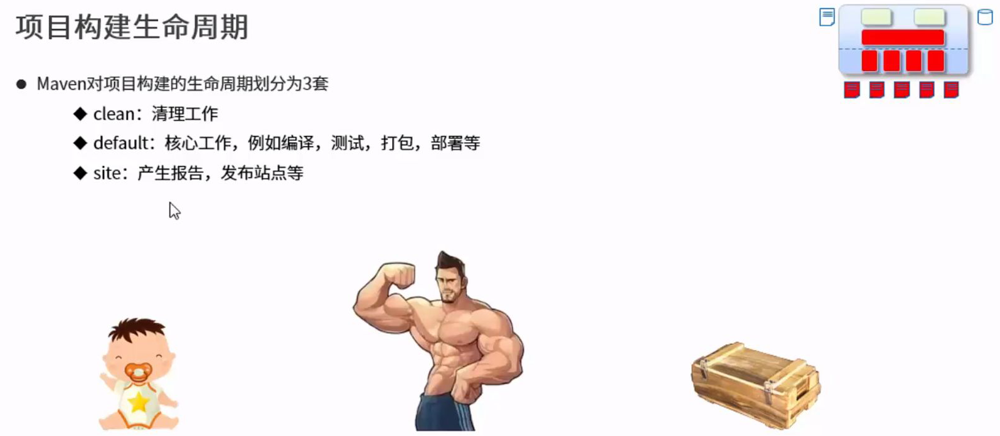

# 生命周期与插件

## 项目构建生命周期




### clean 生命周期


### default 生命周期


比如执行```test```，那就从上到下执行到```test```为止

### site 生命周期


## 插件


在[Maven官网](https://maven.apache.org/)中，可以看到Maven所有的插件，叫做Maven Plugins


### 举例 Apache Maven Source Plugin

其中：
1. 红笔圈出的是插件的坐标
2. 绿笔圈出的是执行到哪一阶段（default生命周期的```generate-test-resources```阶段），执行插件
3. 蓝笔圈出的是执行什么（官网给出了解释，见下图）


到了HM的P15 高级篇  先不学