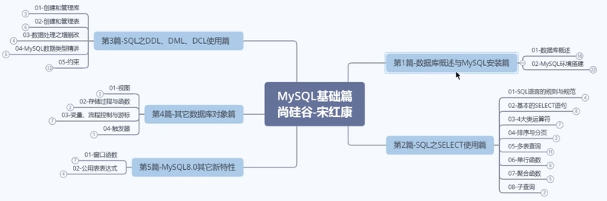
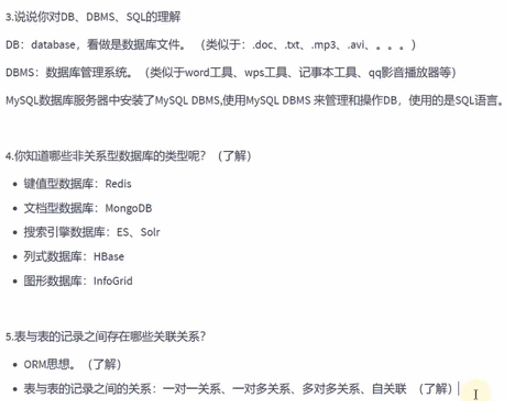
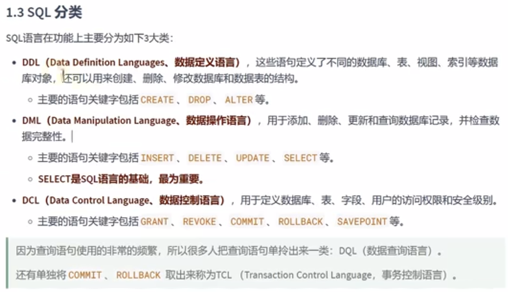

# MySQL

### 基础篇大纲



### 外部资源

[官方文档](https://dev.mysql.com/doc/refman/8.0/en/)
[数据结构可视化](https://www.cs.usfca.edu/~galles/visualization/about.html)

### 书


### 数据库分类

#### RDBMS与非RDBMS

##### RDBMS


##### 非RDBMS


### 表（RDBMS中）


#### 表的四种关联关系


### 总结



### MySQL启动

这里passwd是```1```

访问本机的MySQL时，有些参数可以省略

还可以加更多的参数


### 启下



