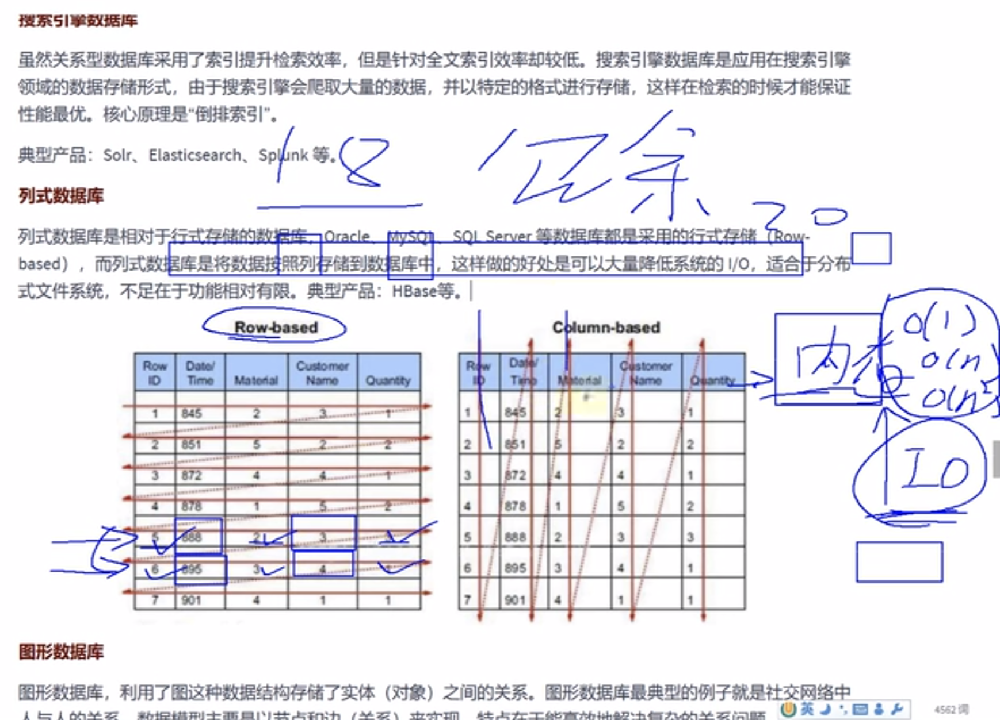

# MySQL

### 基础篇大纲


### 外部资源

[官方文档](https://dev.mysql.com/doc/refman/8.0/en/)
[数据结构可视化](https://www.cs.usfca.edu/~galles/visualization/about.html)

### 书


### 数据库分类

#### RDBMS与非RDBMS

##### RDBMS


##### 非RDBMS




### 表（RDBMS中）


#### 表的四种关联关系


### 总结


## MySQL启动

这里passwd是```1```

访问本机的MySQL时，有些参数可以省略

还可以加更多的参数


### 把wsl中的mysql端口映射到外部的windows中（使用Navicat连接）

首先需要改变MySQL的配置,执行```sudo vim /etc/mysql/mysql.conf.d/mysqld.cnf```

找到 ```bind-address = 127.0.0.1``` 并注释掉 → ```# bind-address = 127.0.0.1```

```127.0.0.1```被称为[本地环回地址](https://blog.csdn.net/weixin_42204641/article/details/83548922)(loopback)

执行```sudo service mysql restart```重启 MySQL 服务

当你的帐号不允许从远程登陆，只能在localhost连接时。这个时候只要在mysql服务器上，更改 mysql 数据库里的 user 表里的 host 项，从localhost"改成%即可实现用户远程登录

在安装mysql的机器上运行：

1. mysql -u root -p  
2. use mysql;
3. select host,user from user where user='root';
4. update user set host = '%' where user='root' and host='localhost';  
5. select host, user from user where user='root';


在WSL中使用```ifconfig```命令


在windows的Navicat中添加连接，这里的ip地址使用ifconfig后查找的ip地址

即成功连接

### 启下


