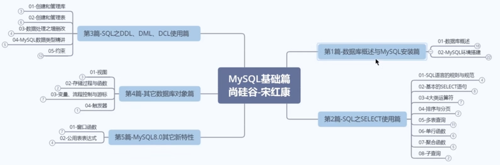
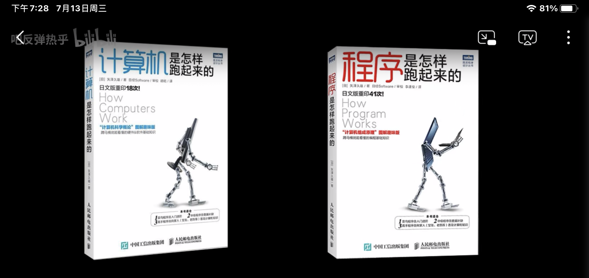
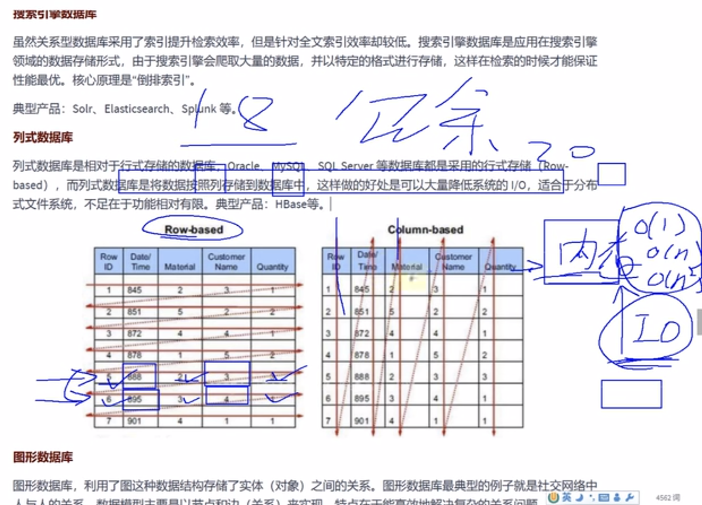
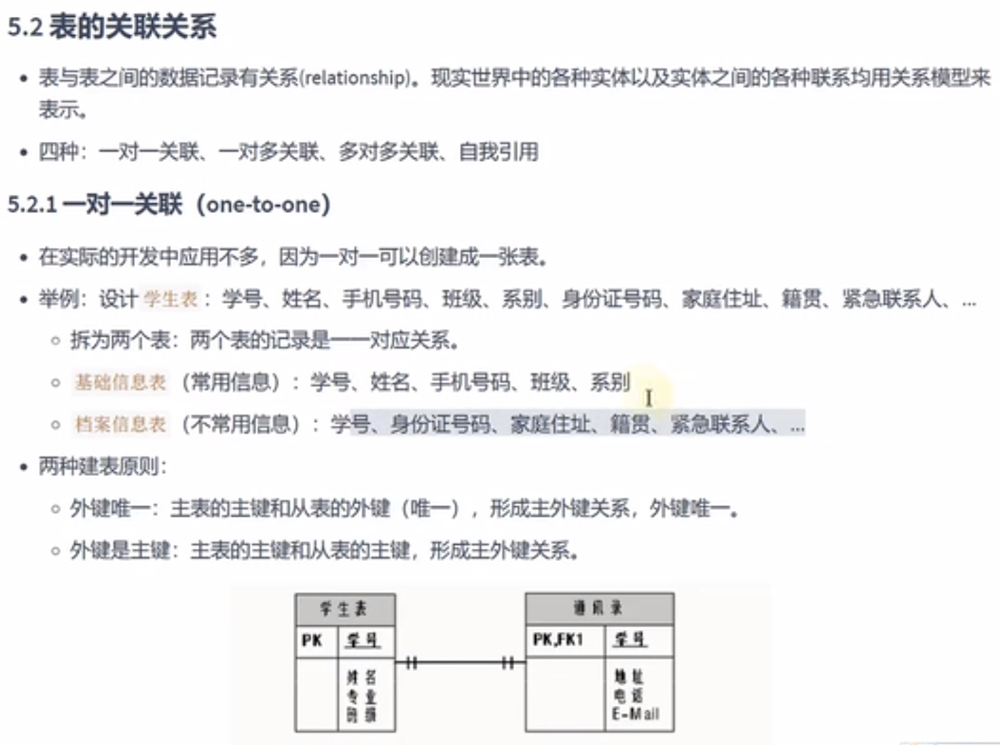
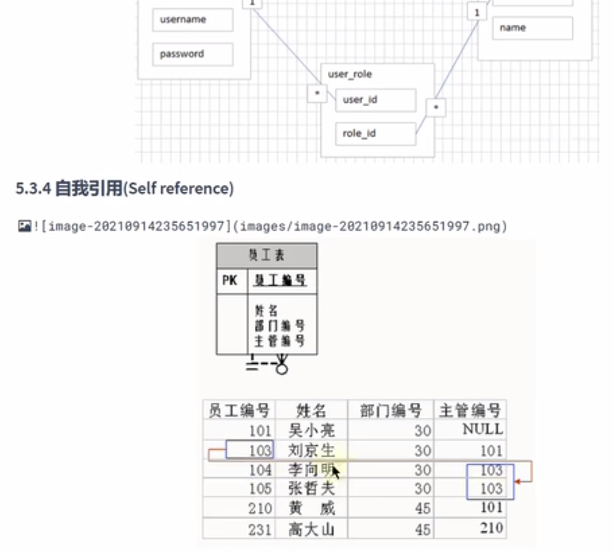
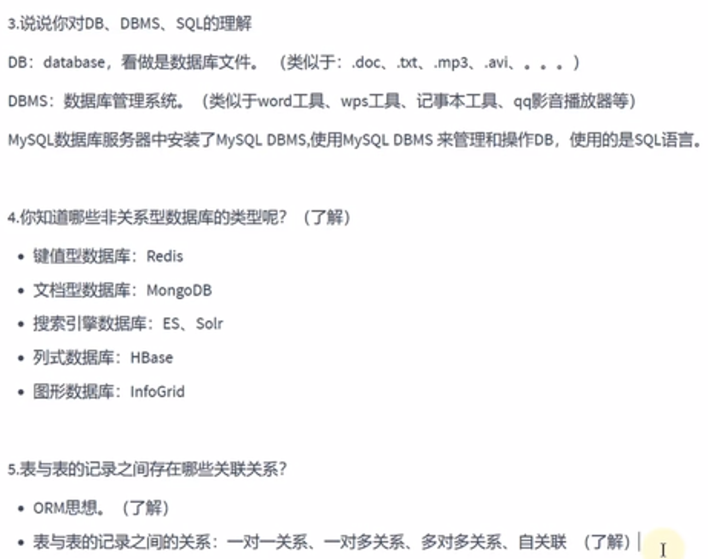
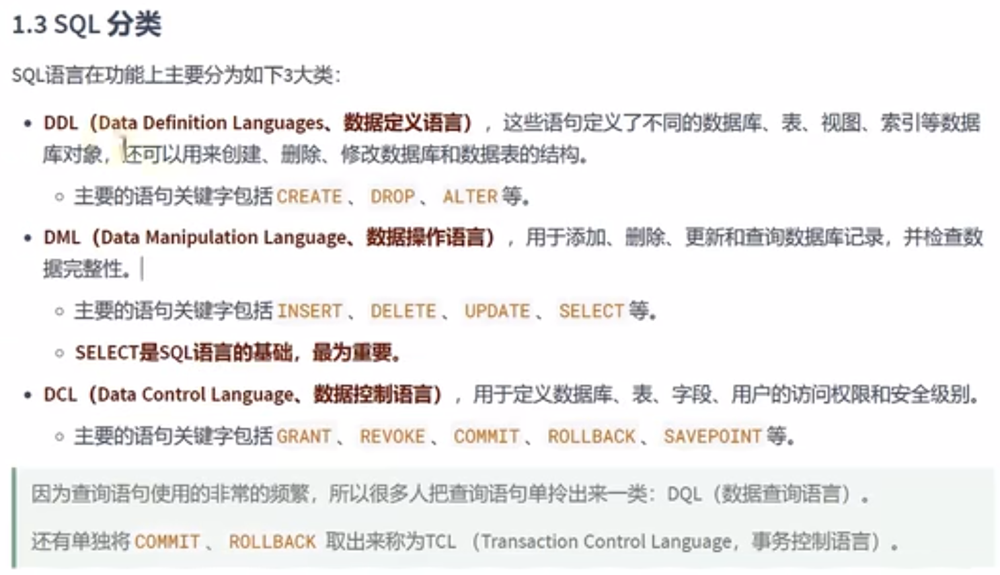

# MySQL

### 基础篇大纲

### 外部资源

[官方文档](https://dev.mysql.com/doc/refman/8.0/en/)
[数据结构可视化](https://www.cs.usfca.edu/~galles/visualization/about.html)

### 书

### 数据库分类

### 表的四种关系

### 总结

### 启下

