# 初步SELECT（query）

## select ... from ...

`select [字段1,字段2, ... ] from [表名];`查询某个表的某些列的数据：
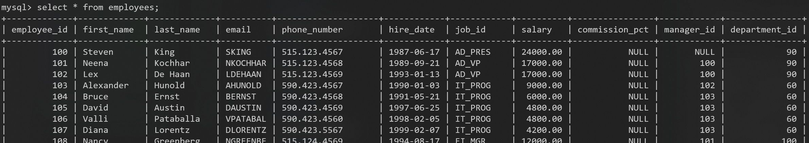

## as 列的别名（alias）

`select [全称] as [别名] from [表名];`
其中关键字as可省略
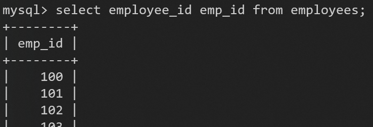
如果别名中有空格，要用双引号包起来，不要用单引号

## distinct 去除重复行

必须放在所有列名的最前面
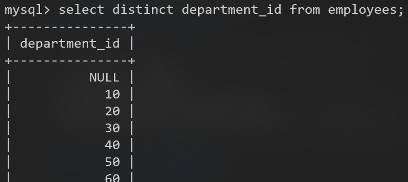

### 正确用法

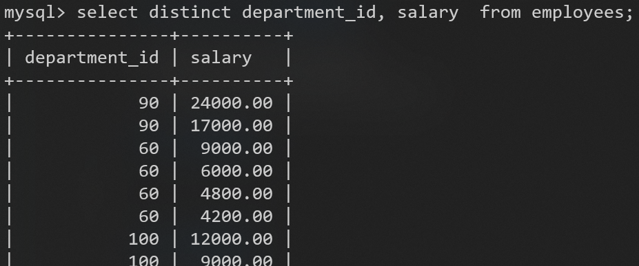

### 错误用法

不能部分使用
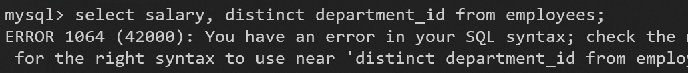

## 空值null参与运算

null不等同于0

计算结果为null，因为null参与了计算
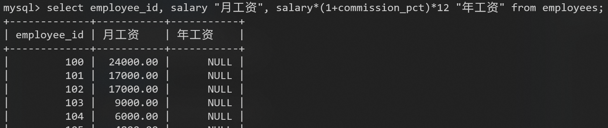

### ifnull

如果想把null当作0参与运算
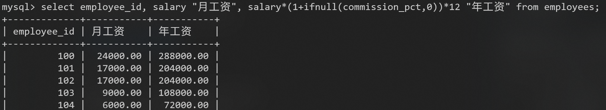

## where 过滤数据

`select [字段] from [表名] where [过滤条件];`
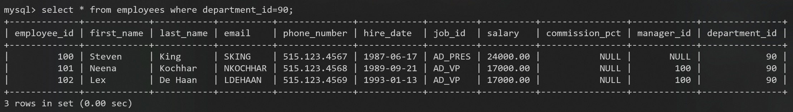

### 运算符

#### 算术运算符

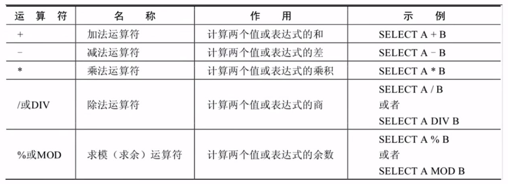

注意，加法在MySQL中没有连接的作用
这里字符串隐式转换成数值
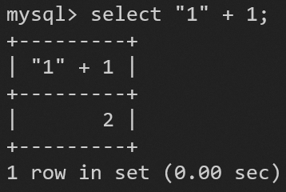

字符串不能转换成数值，就按0处理
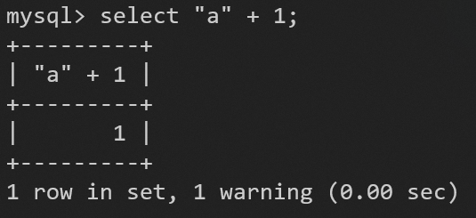

#### 比较运算符

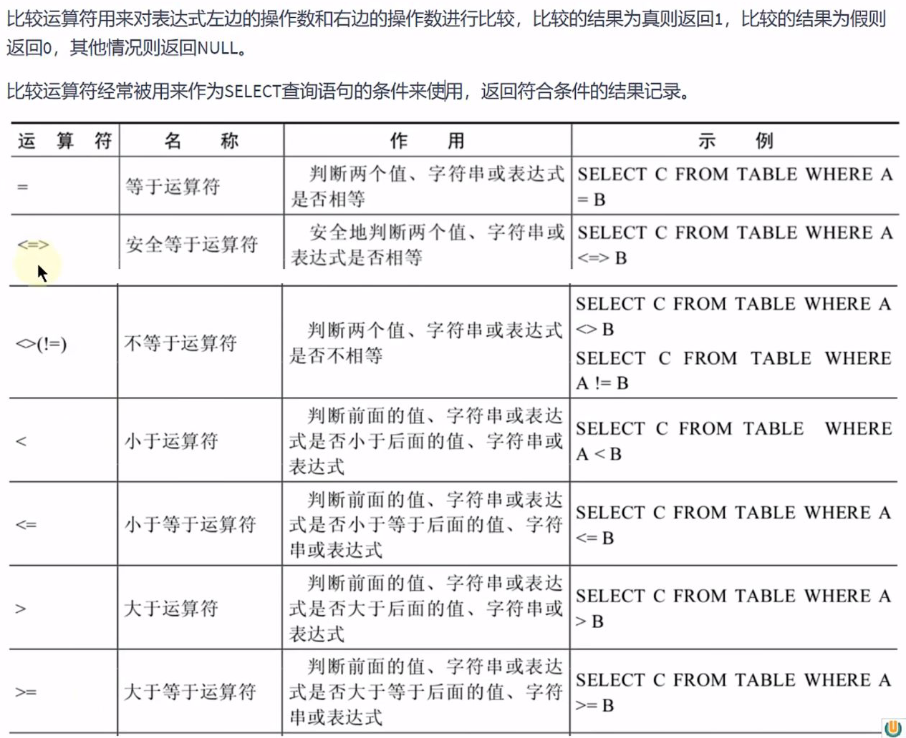

##### = 等于号

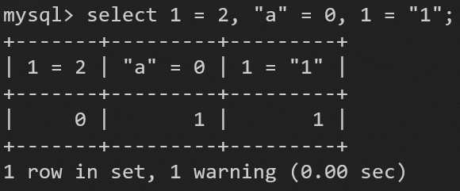

两个字符串之间比较，就不会隐式转换成数值
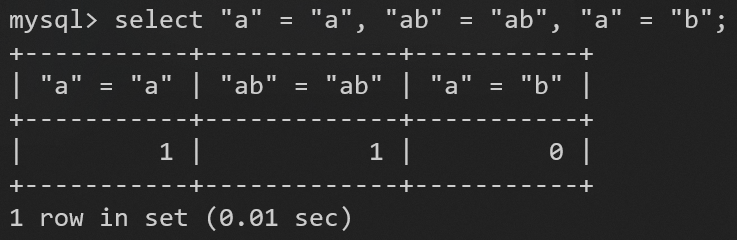

只要有NULL参与，结果就是NULL
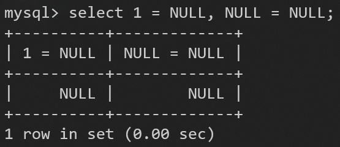

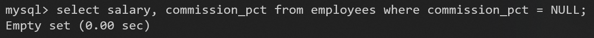
没有达到预期效果，引出 <=> 安全等与号

##### <=> 安全等于号

为NULL而生
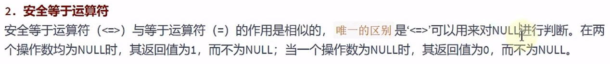

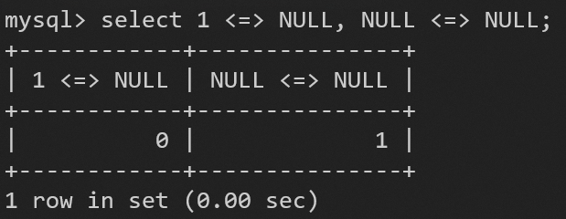

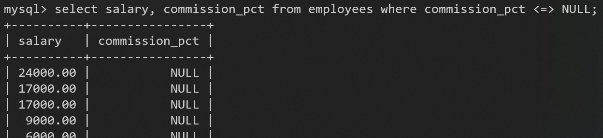
达到预期效果

也可以用关键字ISNULL判断
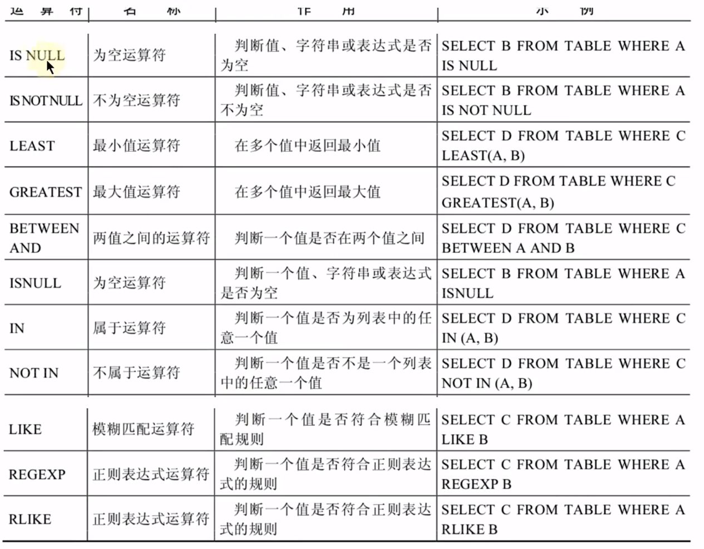

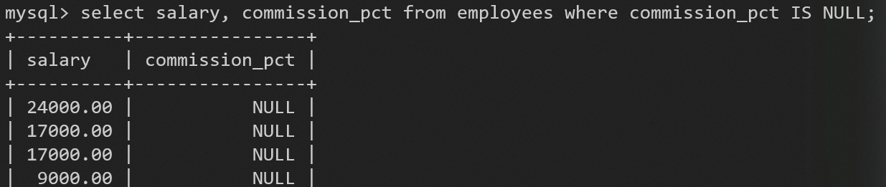
效果相同

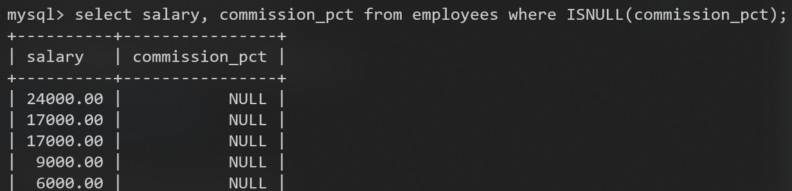
还是效果相同

查找不是NULL的四种方法

##### like 模糊查询

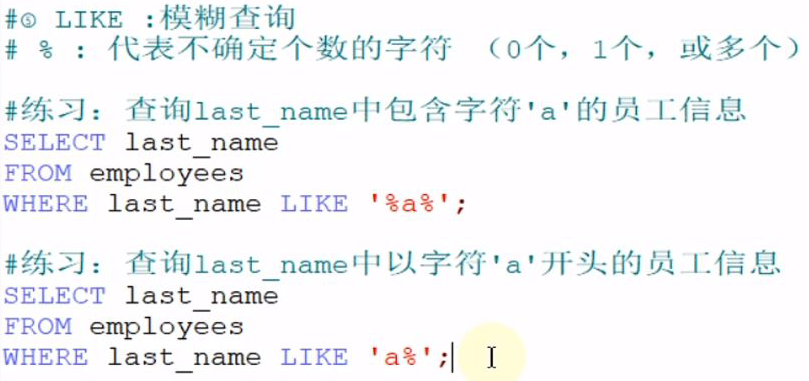

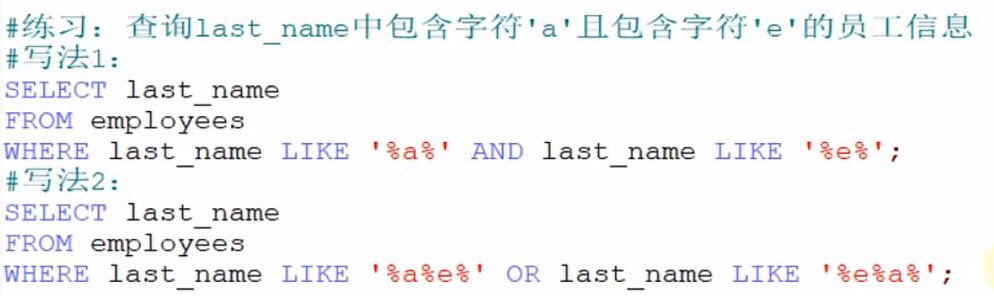

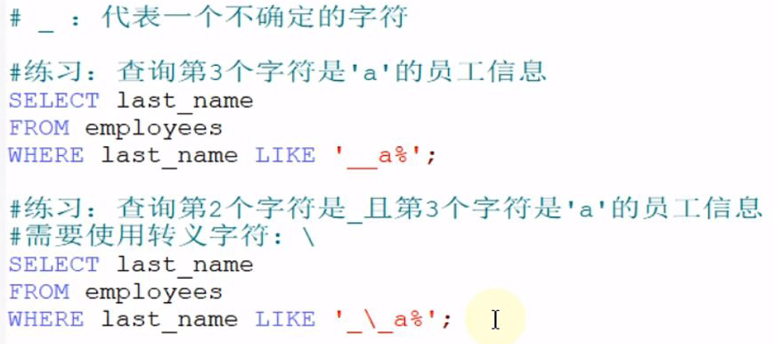

使用关键字ESCAPE可以指定某字符为转义字符

##### REGEXP / RLIKE 正则表达式

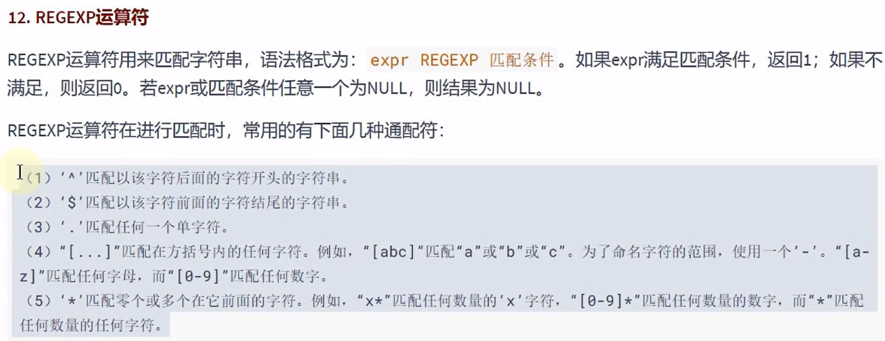

#### 逻辑运算符

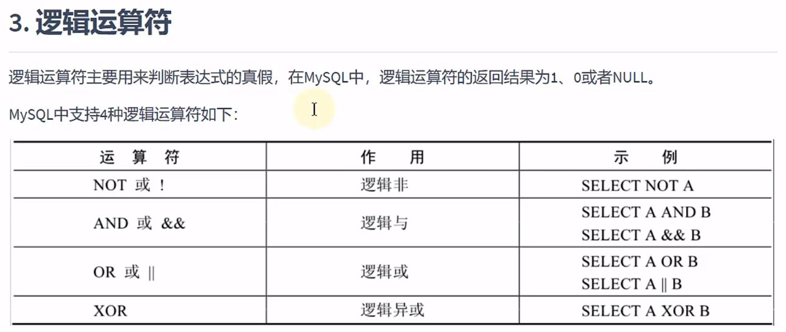

#### 位运算符

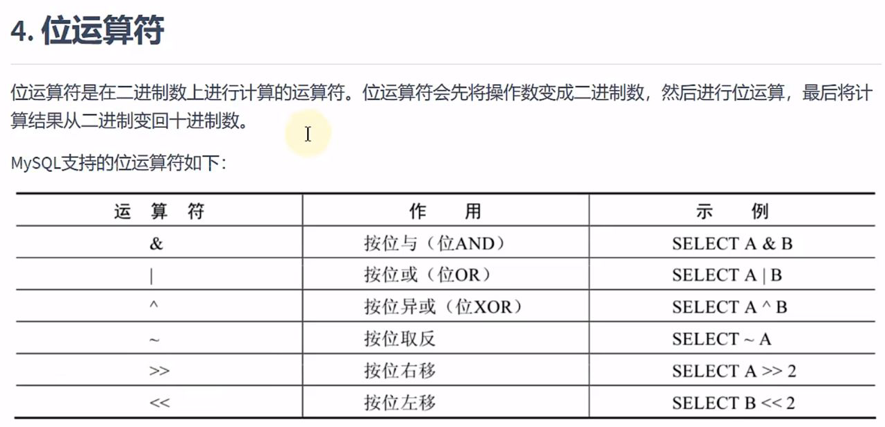

## order by 排序数据

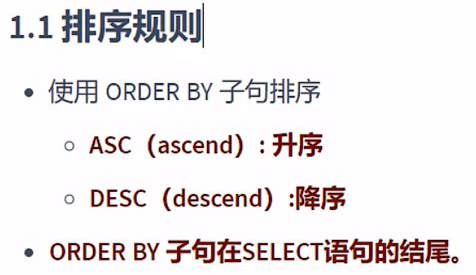
ASC:ascend
DESC:descend

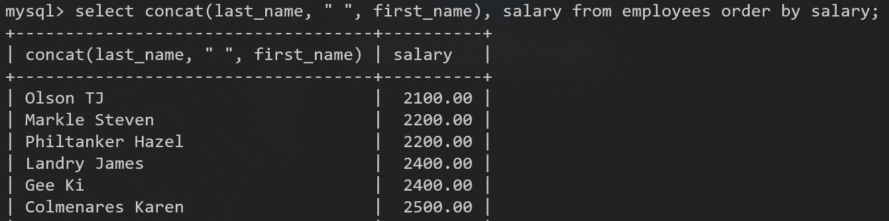

### 用列的别名排序

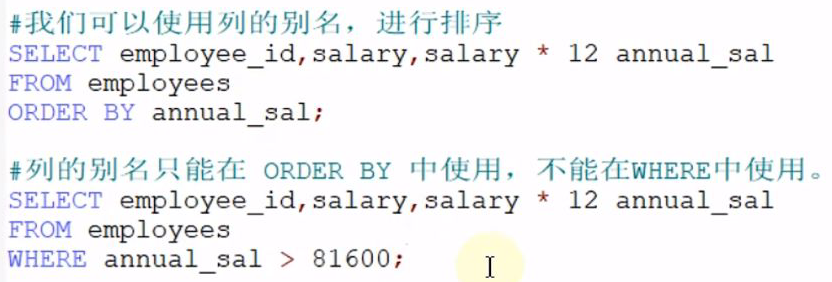

#### 因为涉及到语句执行顺序问题：
1. 先执行 **FROM**、**WHERE** 选出符合条件的行
2. 在从这些行中 **SELECT** 相应的列数据
3. 最后再用 **ORDER BY** 排序

别名只能在SELECT之后的语句（ORDER BY）中才能使用，之前的语句（WHERE）执行时还没有这个别名

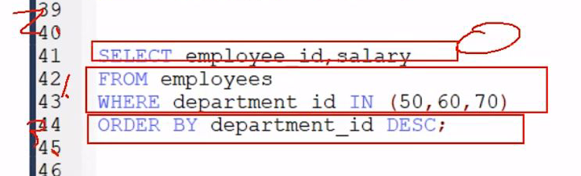

WHERE要声明在FROM之后，ORDER BY之前

### 二级排序

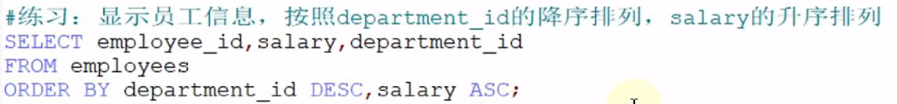

## limit 分页

类似切片
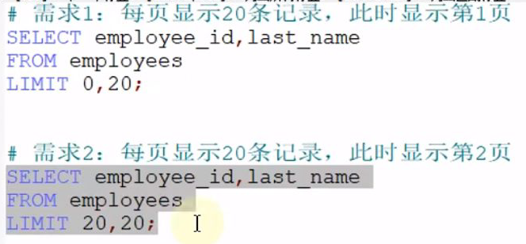

limit的位置
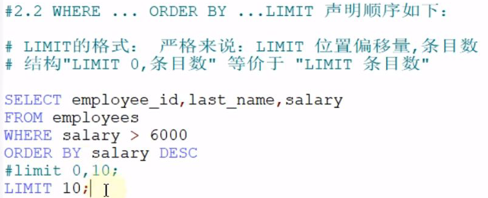

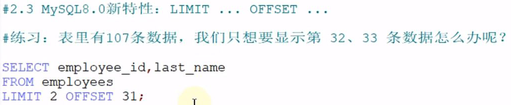

总结：
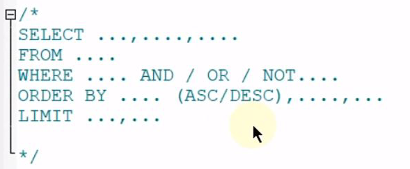
