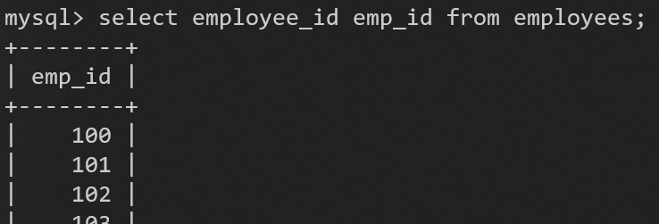

# 初步使用

## 导入现有数据

***.sql文件
```source [文件的全路径名];```

## show 

```show databases;```显示所有数据库

```show tables;```显示某个数据库中的所有表：


```show create database [数据库名];```显示某个数据库的创建信息：


```show create table [表名];```显示某个表的创建信息：


```show columns from [表名];```显示某个表的结构：

上面的语句可简写成```desc jobs;```

如果表名和MySQL保留的关键字冲突，要用着重号（``）括起来


## create

创建数据库或创建表

## use

选择数据库

## drop

删除数据库或删除表

# 初步SELECT

## select ... from ...

```select [字段1,字段2, ... ] from [表名];```查询某个表的某些列的数据：


## as 列的别名（alias）

```select [全称] as [别名] from [表名];```
其中关键字as可省略

如果别名中有空格，要用双引号包起来，不要用单引号

## distinct 去除重复行

必须放在所有列名的最前面


### 正确用法


### 错误用法

不能部分使用


## 空值null参与运算

null不等同于0

计算结果为null，因为null参与了计算


### ifnull

如果想把null当作0参与运算


## where 过滤数据

```select [字段] from [表名] where [过滤条件];```


到P19
