# 多表查询（关联查询）


## 案例

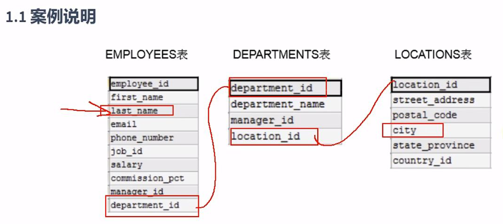

## 出现笛卡尔积的错误

错误的实现方式：

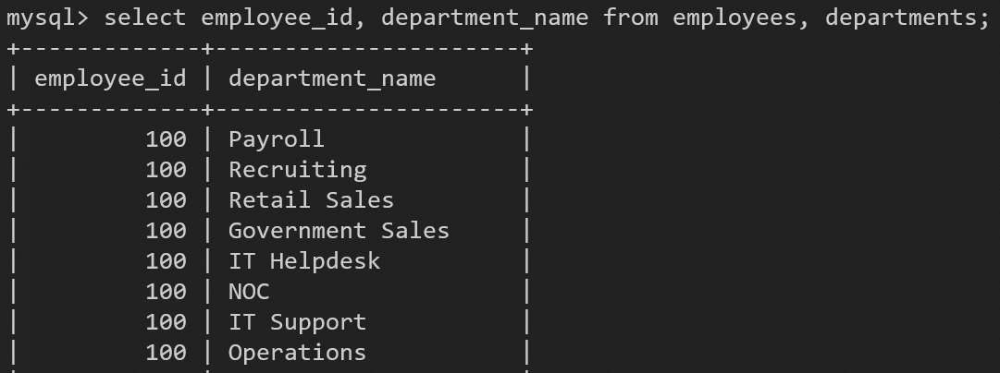
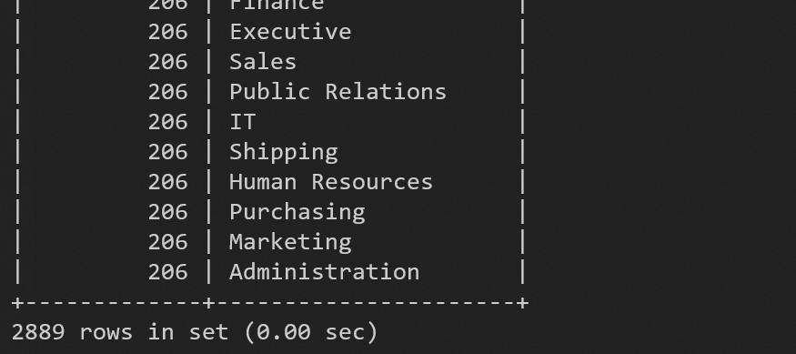
显示的结果是每个员工在每个部门都干过
错误的原因：缺少了多表的连接条件

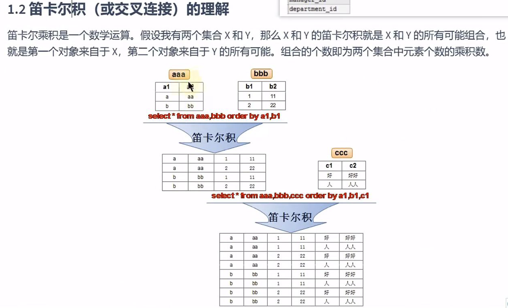

## 多表查询的正确方式

需要有连接条件

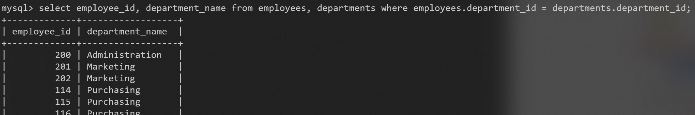
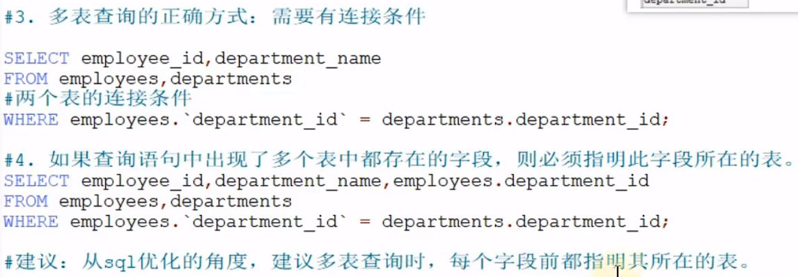

表的别名
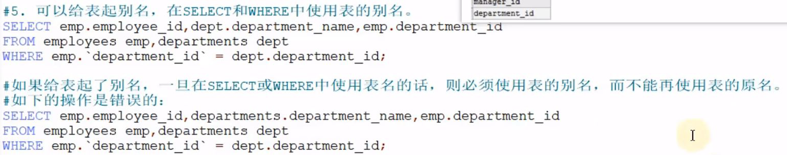

n个表至少要有n-1个连接条件
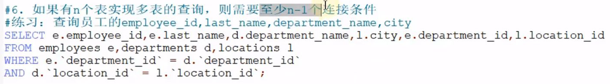

## 多表查询的分类


### 非等值连接

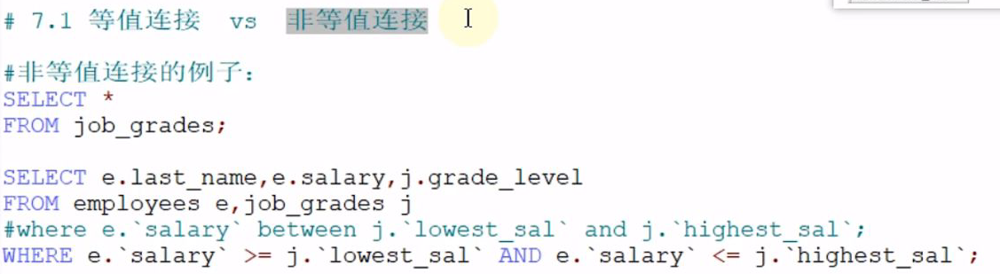

### 自连接

之前的例子都是非自连接

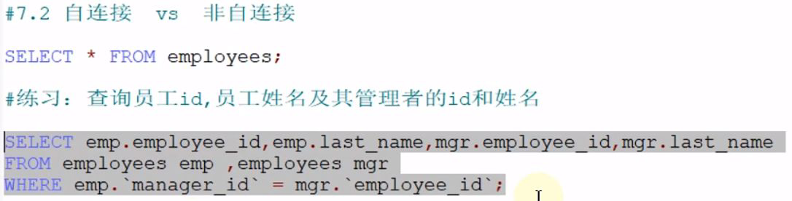
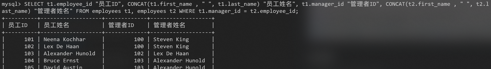

### 内连接 vs 外连接

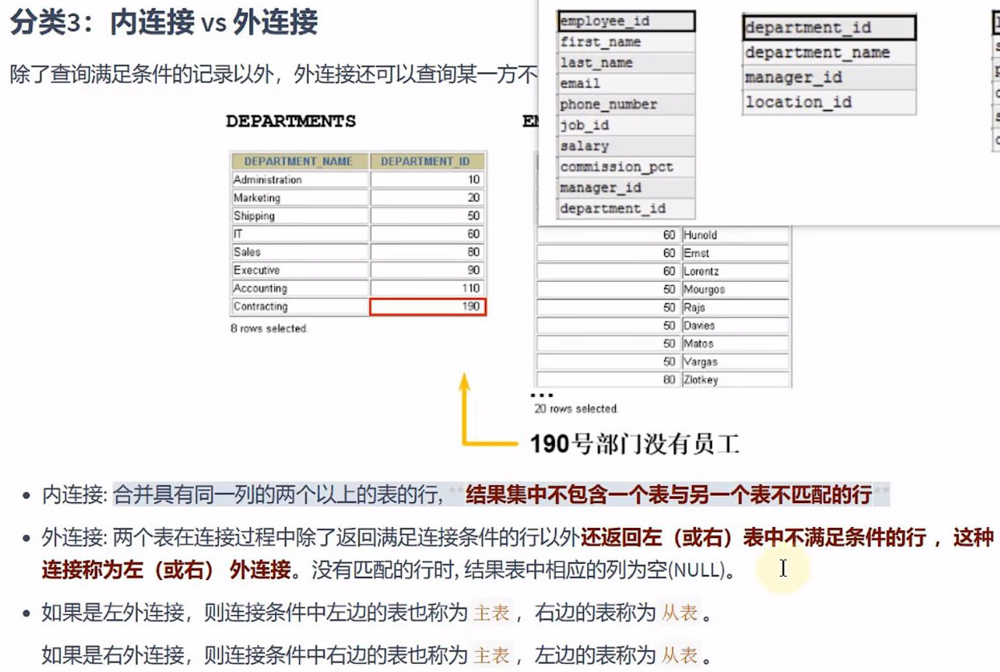

#### 内连接


员工的数据不全
解决方法：外连接

#### 外连接

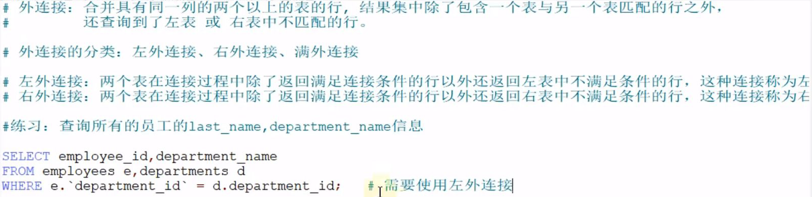

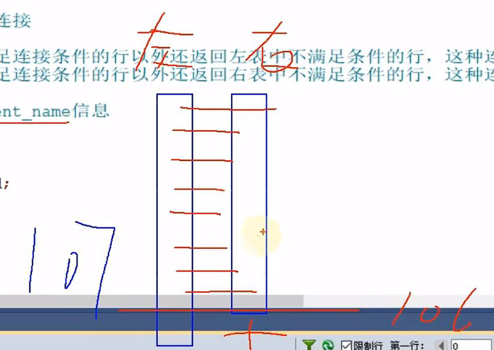


JOIN ON 的方式实现多表查询


INNER JOIN 的方式实现内连接，INNER关键字可省略
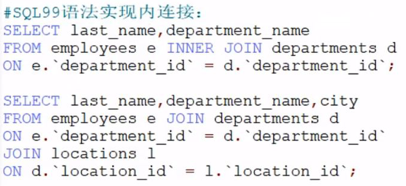

OUTER JOIN 的方式实现外连接
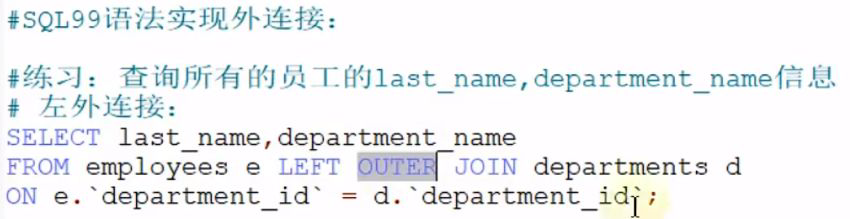

OUTER 关键字可省略
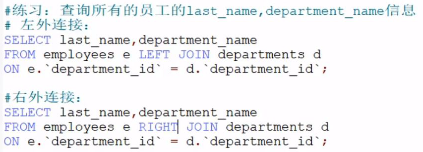

##### 除了左外连接、右外连接，还有满外连接

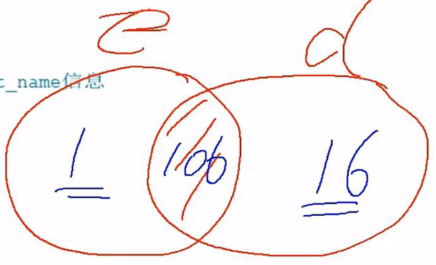

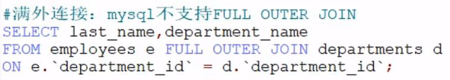

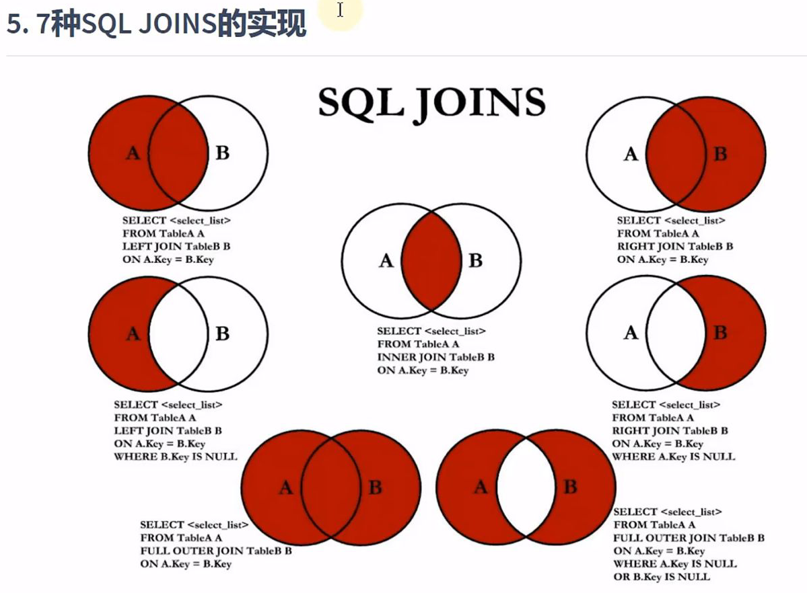
后面会重点实现这七种JOIN操作

### 使用 USING 关键字替换连接条件

```sql
SELECT employee_id, last_name, department_name
FROM employees e JOIN departments d
ON e.`department_id` = d.`department_id`;
```

当两个表中的字段名一致的时候，可替换为
```sql
SELECT employee_id, last_name, department_name
FROM employees e JOIN departments d
USING (`department_id`);
```

不适用于自连接

### 自然连接

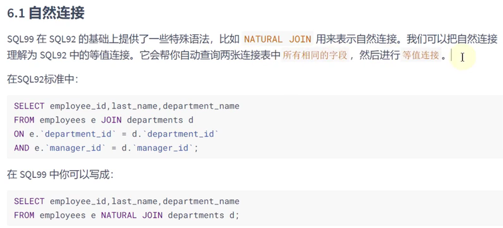

## 总结


# UNION 组合查询

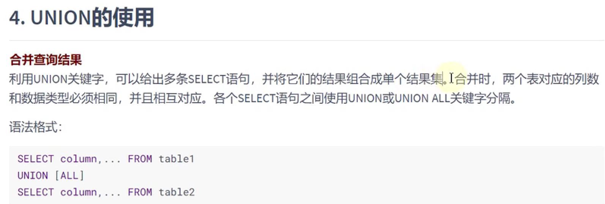

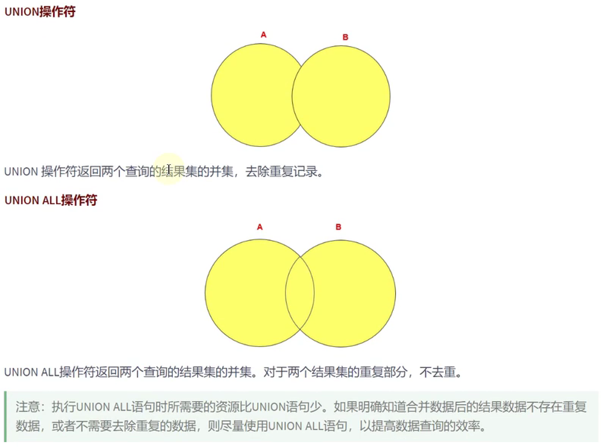

## 七种图的实现


### 中图：内连接

```sql
SELECT employee_id, department_name
FROM employees e JOIN departments d
ON e.`department_id` = d.`department_id`;
```

### 左上图：左外连接

```sql
SELECT employee_id, department_name
FROM employees e LEFT JOIN departments d
ON e.`department_id` = d.`department_id`;
```

### 右上图：右外连接

```sql
SELECT employee_id, department_name
FROM employees e RIGHT JOIN departments d
ON e.`department_id` = d.`department_id`;
```

### 左中图：

```sql
SELECT employee_id, department_name
FROM employees e LEFT JOIN departments d
ON e.`department_id` = d.`department_id`
WHERE d.`department_id` IS NULL;
```

### 右中图：

```sql
SELECT employee_id, department_name
FROM employees e RIGHT JOIN departments d
ON e.`department_id` = d.`department_id`
WHERE e.`department_id` IS NULL;
```

### 左下图：满外连接

#### 方式1：左上图 UNION ALL 右中图

```sql
SELECT employee_id, department_name
FROM employees e LEFT JOIN departments d
ON e.`department_id` = d.`department_id`
UNION ALL
SELECT employee_id, department_name
FROM employees e RIGHT JOIN departments d
ON e.`department_id` = d.`department_id`
WHERE e.`department_id` IS NULL;
```

#### 方式2：左中图 UNION ALL 右上图

```sql
SELECT employee_id, department_name
FROM employees e LEFT JOIN departments d
ON e.`department_id` = d.`department_id`
WHERE d.`department_id` IS NULL
UNION ALL
SELECT employee_id, department_name
FROM employees e RIGHT JOIN departments d
ON e.`department_id` = d.`department_id`;
```

### 右下图：

#### 左中图 UNION ALL 右中图

```sql
SELECT employee_id, department_name
FROM employees e LEFT JOIN departments d
ON e.`department_id` = d.`department_id`
WHERE d.`department_id` IS NULL
UNION ALL
SELECT employee_id, department_name
FROM employees e RIGHT JOIN departments d
ON e.`department_id` = d.`department_id`
WHERE e.`department_id` IS NULL;
```

