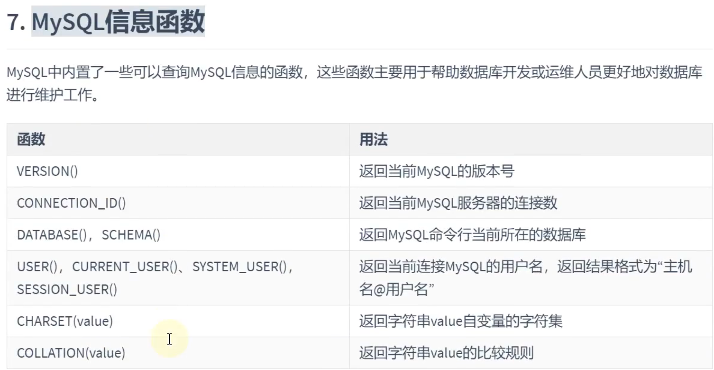

# 函数

# 单行函数

## 数值函数

### 基本函数

### 角度与弧度互换函数

### 三角函数

### 指数与对数

### 进制间的转换

## 字符串函数

注意：MySQL中，字符串的位置是从1开始的，而不是0

## 日期和时间函数

### 获取日期、时间

### 日期与时间戳的转换

### 获取月份、星期、星期数、天数

### 日期的操作函数

### 时间和秒钟转换的函数

### 计算日期和时间的函数

### 日期的格式化与解析

## 流程控制函数

## 加密与解密函数

## MySQL信息函数

## 其他函数

# 聚合函数（多行函数）

单行函数可以嵌套，但是**聚合函数不能嵌套**（MySQL中）

## 常见的聚合函数

AVG()
SUM()
MAX()
MIN()
COUNT()

注意：计算指定字段出现的次数时，是不包含NULL值的

## GROUP BY 的使用

### 使用 WITH ROLLUP

## HAVING 的使用

注意：WHERE 是分组前的过滤，HAVING 是对分组后的结果的过滤

### WHERE 和 HAVING 的对比

## SQL底层执行原理

### SELECT 语句结构

### SELECT 执行顺序

