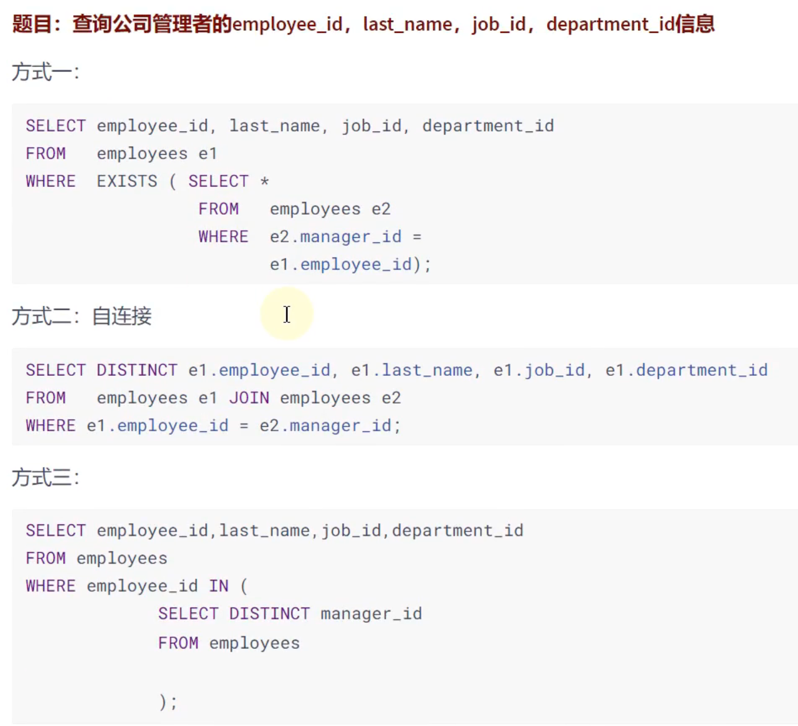

# 子查询（subquery）

## 简介

## 分类

## 单行子查询

### 子查询可以出现的位置

### WHERE 中的子查询

### HAVING 中的子查询

### CASE 中的子查询

### FROM 中的子查询

### ORDER BY 中的子查询

## 多行子查询（集合比较子查询）

### IN 操作符

### ANY 操作符

### ALL 操作符

## 相关子查询（关联子查询）

前面的案例，基本都是不相关子查询，但不是说单行子查询和多行子查询都是不相关的，只是从不同的角度来分类

### 执行流程

### EXISTS 与 NOT EXISTS 关键字

### 相关更新

### 相关删除

### 效率问题

